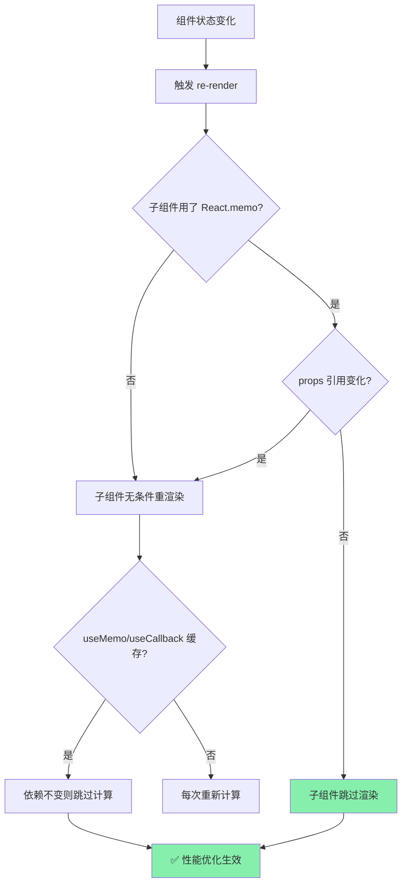
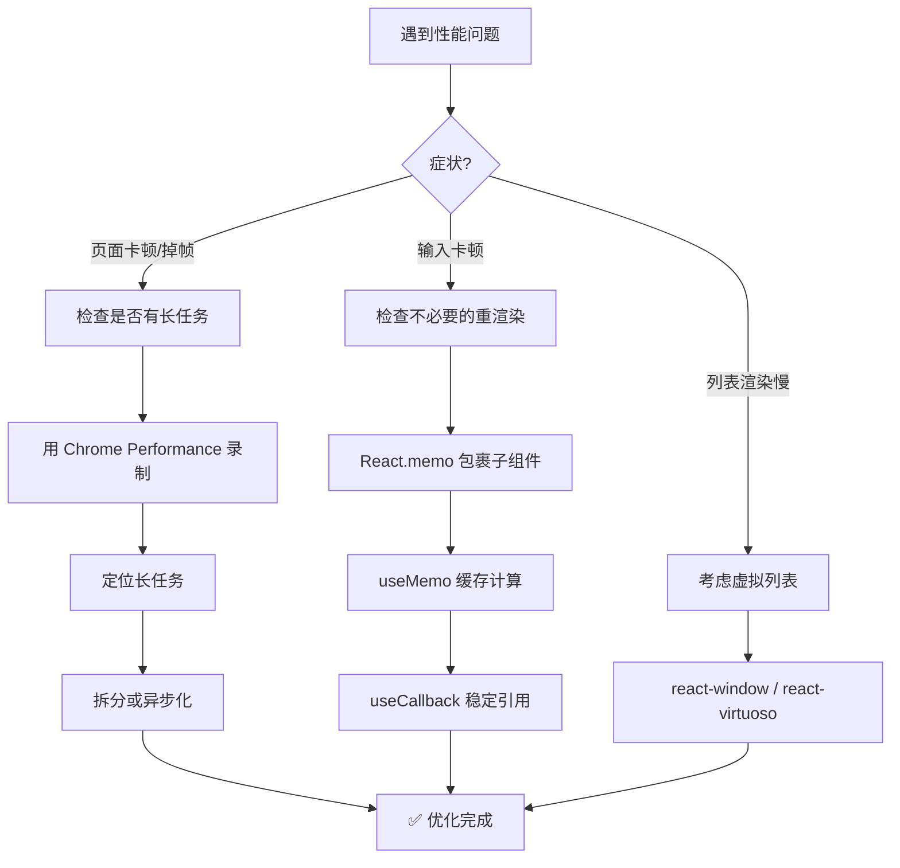

<DifficultyBadge level="intermediate" />

# React 渲染优化

## 一句话解释

React 渲染优化的核心是**避免不必要的重渲染**——当父组件更新时，子组件如果 props 和 state 没变，就不应该重新渲染。

## 核心流程



## 深入理解

### 1. React 的渲染机制

React 的渲染从触发源开始，**默认会递归渲染所有子组件**：

```javascript
function Parent() {
  const [count, setCount] = useState(0)
  
  return (
    <div>
      <ExpensiveComponent />      {/* 每次 Parent 更新都会重渲染 */}
      <button onClick={() => setCount(c => c + 1)}>+</button>
    </div>
  )
}
```

> **关键理解**：父组件 re-render → 子组件必然 re-render（除非显式优化）

### 2. React.memo — 阻止子组件重渲染

```javascript
import { memo } from 'react'

// 包裹后：props 没变就不重渲染
const ExpensiveComponent = memo(function Expensive({ data, onClick }) {
  console.log('渲染了！')
  return <div>{/* 复杂渲染 */}</div>
})
```

**React.memo 的工作原理：**
```javascript
// 简化版：memo 对 props 做浅比较
function memo(Component, areEqual) {
  return function Memoized(props) {
    const prevProps = useRef(null)
    
    if (prevProps.current && (areEqual || shallowEqual)(prevProps.current, props)) {
      // props 没变 → 跳过渲染
      return skipRender()
    }
    
    prevProps.current = props
    return render(Component, props)
  }
}
```

**什么时候用：**
- 组件渲染开销大（大量 DOM / 复杂计算）
- 组件在父组件更新频繁时被连带重渲染
- 组件的 props 大多数时候不变

**什么时候不用：**
- 组件的 props 每次都在变化（memo 比较本身也有开销）
- 组件很简单（几行 JSX），不值得 memo

### 3. useMemo — 缓存计算结果

```javascript
import { useMemo } from 'react'

function ExpensiveList({ items, filter }) {
  // 只有 items 或 filter 变化时才重新计算
  const filteredList = useMemo(() => {
    return items
      .filter(item => item.name.includes(filter))
      .sort((a, b) => a.name.localeCompare(b.name))
  }, [items, filter])
  
  return filteredList.map(item => <li key={item.id}>{item.name}</li>)
}
```

**useMemo vs 无缓存：**
```javascript
// ❌ 每次渲染都重新计算（即使 items 没变）
const sorted = items.sort((a, b) => a.id - b.id)

// ✅ 依赖不变时跳过计算
const sorted = useMemo(() => items.sort((a, b) => a.id - b.id), [items])
```

**⚠️ 常见误区：**

```javascript
// ❌ 滥用：基本类型计算不必缓存
const double = useMemo(() => count * 2, [count])
// ✅ 直接计算就行
const double = count * 2

// ✅ 需要缓存：保持引用稳定性（传给子组件时）
const config = useMemo(() => ({
  theme: 'dark',
  size: 'large'
}), [])  // 确保每次渲染 config 是同一个引用
```

### 4. useCallback — 缓存函数引用

```javascript
import { useCallback } from 'react'

function Parent() {
  const [count, setCount] = useState(0)
  
  // ❌ 每次渲染创建新函数 → 子组件的 memo 失效
  const handleClick = () => setCount(c => c + 1)
  
  // ✅ 依赖不变时保持引用稳定 → memo 生效
  const handleClick = useCallback(
    () => setCount(c => c + 1),
    []  // 函数不依赖任何外部变量
  )
  
  return <MemoButton onClick={handleClick} />
}

const MemoButton = memo(function Button({ onClick }) {
  return <button onClick={onClick}>点击</button>
})
```

**useMemo vs useCallback：**

| 特性 | useMemo | useCallback |
|------|---------|-------------|
| 缓存内容 | 计算结果 | 函数引用 |
| 等价 | `useMemo(() => fn, deps)` | `useCallback(fn, deps)` |
| 典型场景 | 避免重复计算 | 配合 React.memo 避免子组件重渲染 |
| 返回值 | 任意值 | 函数 |

### 5. Bailout — React 自身的跳过机制

即使没有 React.memo，React 在某些情况下也会自动跳过子组件渲染：

```javascript
// 条件一：state 没有变化
const [count, setCount] = useState(0)
setCount(0)  // 触发 setState 但值没变 → React 跳过渲染

// 条件二：返回相同值（useReducer）
const [state, dispatch] = useReducer(reducer, initialState)
dispatch({ type: 'SET', value: state.sameField })
// 如果 reducer 返回 === 旧 state，React 跳过
```

```javascript
// Reducer 中的 bailout：
function reducer(state, action) {
  switch (action.type) {
    case 'SET_NAME':
      if (action.payload === state.name) {
        return state  // 返回同一个引用 → React 跳过渲染
      }
      return { ...state, name: action.payload }
  }
}
```

### 6. Batch Update — 批量更新

React 18 默认启用**批量更新**（之前只在事件处理中批量）：

```javascript
function handleClick() {
  // React 18：以下三次 setState 只触发一次渲染
  setCount(c => c + 1)
  setFlag(f => !f)
  setUser(u => ({ ...u, name: 'Alice' }))
}

// 异步代码中也批量了（React 18 新特性）
fetch('/api/data').then(() => {
  setCount(c => c + 1)
  setFlag(f => !f)
  // 只触发一次渲染
})
```

如果需要跳出批量更新（通过 `flushSync`）：

```javascript
import { flushSync } from 'react-dom'

function handleClick() {
  flushSync(() => setCount(c => c + 1))
  // 这时的 DOM 已经更新了
  flushSync(() => setFlag(f => !f))
  // DOM 再次更新
}
// 通常不需要 flushSync，只在特殊场景（如测量 DOM）使用
```

### 7. 优化策略总结



**优化优先级：**

| 优先级 | 手段 | 预期收益 |
|--------|------|---------|
| 🔴 高 | 虚拟列表（大量数据） | 减少 90%+ DOM 节点 |
| 🔴 高 | 避免不必要的 setState | 减少整个渲染树 |
| 🟡 中 | React.memo | 减少子组件重渲染 |
| 🟡 中 | useMemo 缓存计算 | 减少重复计算 |
| 🟢 低 | useCallback | 配合 memo 使用 |
| 🟢 低 | 图片懒加载 | 减少首屏加载 |

## 面试问法

- 🔥 **React.memo 是做什么的？什么场景用？**
  - 对 props 做浅比较，没有变化就跳过子组件渲染
  - 场景：子组件渲染代价大、父组件频繁更新、props 多数时候不变

- 🔥 **useMemo 和 useCallback 的区别？**
  - useMemo 缓存计算结果，useCallback 缓存函数引用
  - 两者可以互转：`useCallback(fn, deps)` = `useMemo(() => fn, deps)`
  - 都不应该过早使用，只在有性能问题时优化

- ⭐ **为什么父组件更新会导致子组件重新渲染？**
  - React 默认递归渲染——父组件 re-render 时会重新执行子组件函数
  - 如果子组件没被 memo 包裹，即使 props 没变也会重新渲染

- ⭐ **React 18 的自动批处理是什么？**
  - 多个 setState 合并为一次渲染
  - setTimeout/Promise 回调中也会批量（React 18 新特性）

## 💡 AI 辅助学习

> 用这个 Prompt 练习渲染优化：
> "给我一段有 3 个性能问题的 React 代码（无意义的重渲染、重复计算、缺少 key），我作为开发者来做性能优化。每修复一个解释为什么这个改动提升了性能。"

## 关联知识

- [React 核心概念](./react-core) — VDOM、Diff 算法
- [React Fiber 架构](./react-fiber) — 调度机制
- [React 并发模式](./react-concurrent) — Transition、Suspense
