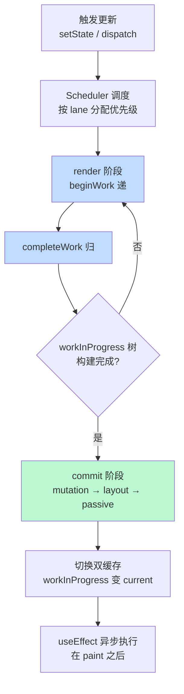
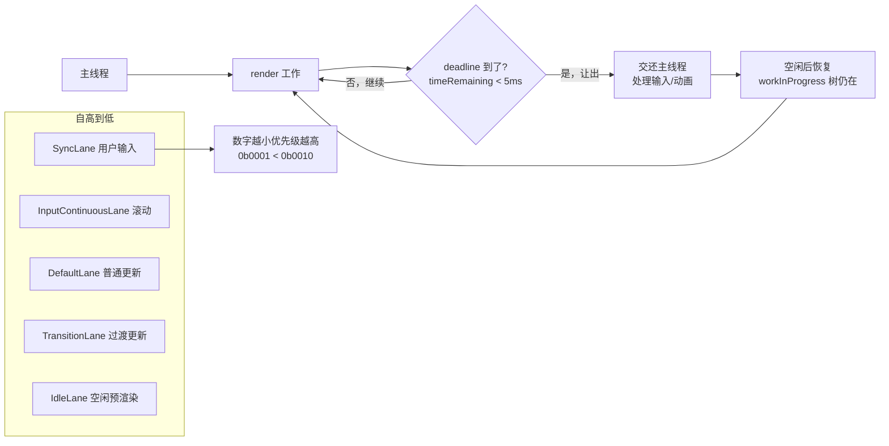

<DifficultyBadge level="advanced" />

# React 源码解读

## 一句话解释

React 源码的核心是**"两阶段（render/commit）+ 双缓存树（current/workInProgress）+ 优先级调度（lane）"**的增量渲染引擎——render 阶段可中断地找出"差异"，commit 阶段一口气把差异写到 DOM，Hooks 则靠 Fiber 上的链表完成状态存储与依赖追踪。

## 渲染整体流程



## 深入理解

### 1. Fiber 节点结构（回忆）

React 把组件树转成**链表化的 Fiber 树**，每个 Fiber 节点携带两套字段：**工作字段**（协调用）与**双缓存指针**：

| 字段 | 含义 |
|------|------|
| `tag` | 节点类型（FunctionComponent / HostComponent / HostText 等） |
| `pendingProps / memoizedProps` | 待处理的 props / 上次渲染的 props |
| `memoizedState` | 上次渲染的 state（**Hooks 链表头**就存在这里） |
| `flags` | 副作用标记（Placement / Update / Deletion / Passive） |
| `subtreeFlags` | 子树副作用汇总（用于批量跳过） |
| `alternate` | 指向另一棵树上对应的 Fiber（双缓存纽带） |
| `child / sibling / return` | 链表指针：第一个子节点 / 兄弟节点 / 父节点 |
| `lanes` | 该节点待处理的优先级车道 |

### 2. render 阶段：beginWork / completeWork

render 阶段从根节点**深度优先遍历** workInProgress 树，整个过程**可中断、可放弃、可重来**。

```javascript
// 伪代码：beginWork（自顶向下"递"）
function beginWork(current, workInProgress) {
  // 1. 复用判断：props 未变、优先级不匹配 → 直接 bailout，跳过整棵子树
  if (current !== null && current.memoizedProps === workInProgress.pendingProps
      && !hasSomePendingLane(lanes)) {
    return bailoutOnAlreadyFinishedWork(workInProgress)  // 复用，不新建
  }
  // 2. 根据 tag 走不同分支：函数组件执行、类组件实例化、宿主元素处理
  switch (workInProgress.tag) {
    case FunctionComponent:
      return updateFunctionComponent(current, workInProgress)
    case HostComponent:
      return updateHostComponent(current, workInProgress)
    // ...
  }
}
```

```javascript
// 伪代码：completeWork（自底向上"归"，生成真实 DOM 或实例）
function completeWork(current, workInProgress) {
  // 宿主元素：createElement / updateProperties / appendChildren
  if (workInProgress.tag === HostComponent) {
    const instance = createInstance(
      workInProgress.type,
      newProps,
      workInProgress.key
    )
    // 给当前节点打上 Placement / Update 等 flags
    appendAllChildren(instance, workInProgress)
    workInProgress.stateNode = instance
  }
  // 关键：bubbleProperties —— 把子树 flags 汇总到 subtreeFlags
  // 这样 commit 时只需看根节点的 subtreeFlags，等于零的整棵子树直接跳过
  bubbleProperties(workInProgress)
}
```

> 面试要点：**beginWork 回答"这个节点要不要变"，completeWork 回答"怎么变"**。函数组件体在 beginWork 里执行，DOM 创建与属性更新在 completeWork 里完成。

### 3. 协调 diff：key 的作用

Reconciler 对同层级的 children 做 diff，采用**双端 + key 匹配**策略。diff 的核心收益来自对最常见的"插入/删除/移动"场景做针对性优化：

- 单节点 diff：key + type 都相同才复用，否则整棵子树重建
- 多节点 diff 三步走：
  1. **先处理前序相同的部分**（两棵树头对齐的 key 一致就直接复用）
  2. **处理尾部相同的部分**（从后往前对齐）
  3. **中间部分用 Map 按 key 查找可复用节点**，剩余新节点插入、旧节点删除

```javascript
// 伪代码：多节点 diff 的核心思想
function reconcileChildrenArray(returnFiber, currentChildren, newChildren) {
  const oldFiberMap = new Map()
  for (let fiber of currentChildren) {
    oldFiberMap.set(fiber.key, fiber)   // 用 key 建索引
  }
  // 第一轮：从头开始比较，key 相同则复用
  let oldFiber = currentChildren[0]
  for (let i = 0; i < newChildren.length; i++) {
    if (oldFiber === null || oldFiber.key !== newChildren[i].key) break
    reuse(oldFiber, newChildren[i])
    oldFiber = oldFiber.sibling
  }
  // 第三轮：剩下的 newChild 去 oldFiberMap 里找
  // 找到 → 标记移动 (Placement)；找不到 → 标记新建 (Placement)
  // 最后遍历 oldFiberMap，没被复用的打 Deletion
}
```

**key 的三条铁律：**
- 用**稳定且唯一**的 id，不要用数组 index（删除头元素时 index 会集体错位，引发脏复用 + 状态错乱）
- key 变化意味着 React 认为这是一个**全新的节点**（卸载 + 重挂载）
- key 只在兄弟节点之间比较，不跨层级

### 4. commit 阶段：mutation / layout / passive

commit 阶段**不可中断**，分三个子阶段，分别在三个时机执行不同类型的 effect：

| 子阶段 | 执行的副作用 | 执行时机 |
|--------|-------------|---------|
| **Before mutation** | 调用 `getSnapshotBeforeUpdate` | DOM 变更前 |
| **Mutation** | 增删改 DOM（Placement/Update/Deletion） | DOM 变更时 |
| **Layout** | `useLayoutEffect`、`componentDidMount/Update`、`commitMutationEffects` 之后的 ref 赋值 | DOM 变更后、**浏览器 paint 前**（同步） |
| **Passive** | `useEffect`、`useInsertionEffect` | **浏览器 paint 之后**（异步，不阻塞渲染） |

```javascript
// 伪代码：commit 三个阶段
function commitRootImpl(root) {
  // 1. Before mutation：getSnapshotBeforeUpdate
  // 2. Mutation：遍历 effect 链，按 flags 增删改 DOM
  commitMutationEffects(root)
  // 3. Layout：同步执行 useLayoutEffect，阻塞浏览器绘制
  commitLayoutEffects(root)
  // 4. 提交完成，切换双缓存
  root.current = finishedWork
  // 5. Passive：调度 useEffect，交给 Scheduler 在空闲时执行
  schedulePassiveEffects(finishedWork)
}
```

> 高频考点：**`useLayoutEffect` 在 paint 前同步执行，会阻塞浏览器绘制；`useEffect` 在 paint 后异步执行**。所以 `useLayoutEffect` 适合读 DOM 布局、避免闪烁；`useEffect` 适合请求、订阅等不影响布局的操作。

### 5. Hooks 实现原理：链表 + dispatch

Hooks 之所以"调用顺序不能变"，是因为 React 用**单向链表**把所有 Hook 的状态存在 Fiber 的 `memoizedState` 上，靠**调用次序**（而非名字）定位。重渲染时 React 按顺序走一遍链表，所以条件渲染里调用 Hook 会让链表错位。

```javascript
// 简化：useState 的实现骨架
let currentHook = null   // 当前正在处理的 Hook（挂到全局）

function useState(initialState) {
  return updateState(initialState)
}

function updateState(initialState) {
  // 1. 从链表中取当前 Hook 节点
  const hook = currentHook
  if (hook === null) {
    // mount 时创建节点并初始化
    hook = { memoizedState: typeof initialState === 'function'
      ? initialState() : initialState, queue: [], next: null }
  }
  // 2. 取出 queue 里积压的 dispatch action，依次计算新 state
  hook.queue.forEach(action => { hook.memoizedState = action(hook.memoizedState) })
  // 3. dispatch 函数：调用时把 action 推入 queue 并触发一次调度
  const dispatch = action => {
    hook.queue.push(action)
    scheduleUpdateOnFiber(...)   // 触发新一轮 render
  }
  return [hook.memoizedState, dispatch]
}
```

`useReducer` 与 `useState` **共用同一套实现**——`useState(initial)` 本质就是 `useReducer` 的语法糖：

```javascript
// 源码里 useState 就是 useReducer 的简写
function useState(initialState) {
  return updateReducer(basicStateReducer, initialState)
  // basicStateReducer 处理函数式更新：prev => (typeof action === 'function' ? action(prev) : action)
}
```

`useEffect` 的依赖追踪也是链表字段：每次渲染把 `[effect, deps]` 追加到链表；commit 的 passive 阶段比较**前后两次 deps 数组**（浅比较 `Object.is`），不同才执行/清理。

```javascript
// 简化：useEffect 的依赖比较
function hasEffectChanged(prevDeps, nextDeps) {
  if (prevDeps === null || nextDeps === null) return true
  if (prevDeps.length !== nextDeps.length) return true
  return prevDeps.some((dep, i) => !Object.is(dep, nextDeps[i]))
}
```

| 问题 | 答案要点 |
|------|---------|
| 为什么 Hook 不能写在条件/循环里？ | 链表靠调用次序定位，错位即错乱 |
| 为什么 `useEffect` 里 `state` 是"旧值"？ | effect 闭包捕获的是**本次渲染**的快照 |
| `useState` 的 `setState` 为什么是异步的？ | dispatch 不立即改值，只是入队 + 触发调度，下一轮 render 才生效 |
| 依赖数组为空为什么只执行一次？ | deps 恒为 `[]`，`hasEffectChanged` 返回 false，passive 阶段跳过 |
| `useRef` 本质是什么？ | 一个 `{ current }` 对象，`memoizedState` 里存的就是它，且不参与依赖比较 |

### 6. Concurrent 模式：时间切片与 lane 调度

Concurrent 的核心是把 render 拆成多个**可让出（yield）的时间片**，用 **lane（位掩码）模型**表达 31 种优先级。



**lane 模型要点：**
- 用二进制位表示优先级，支持**一次携带多个 lane**（一票更新可有多个并发来源）
- 高优先级 lane 可以**中断**低优先级 lane 的 render 工作，甚至**丢弃低优先级结果**
- `startTransition` / `useDeferredValue` 都走 TransitionLane；被打断的低优更新如果被"饿死"，Scheduler 会在超时后强制以 SyncLane 补跑

```javascript
// 伪代码：Scheduler 的 workLoop —— 时间切片的精髓
function workLoop(hasTimeRemaining) {
  while (workInProgress !== null && !shouldYield()) {
    workInProgress = performUnitOfWork(workInProgress)
  }
}
function shouldYield() {
  // 对比当前时刻与开始的 deadline，超时就交还主线程
  return getCurrentTime() >= deadline
}
```

### 7. React 19 新特性

| 特性 | 说明 | 面试价值 |
|------|------|---------|
| **React Compiler** | 编译期自动 memo 化（自动生成 `useMemo`/`useCallback`），无需手写 memo | 理解"记忆化是编译器的事" |
| **Actions** | 表单异步动作：`useActionState`、`useFormStatus`、`useOptimistic`，异步函数内联进 `<form action>` | 服务端优先 + 乐观更新 |
| `use()` | 在 render 中读取 Promise/Context，配合 Suspense | 并发特性新心智模型 |
| Server Components | 服务端组件 vs 客户端组件（`'use client'`） | 全栈框架趋势 |
| ref as a prop | 函数组件可直接接收 `ref`，不再强制 `forwardRef` | 简化 API |

```jsx
// React 19：Actions + 表单
function CommentForm() {
  const [state, submitAction, isPending] = useActionState(async (prev, formData) => {
    const res = await saveComment(formData)
    return res
  }, null)

  return (
    <form action={submitAction}>
      <textarea name="content" />
      <button type="submit" disabled={isPending}>
        {isPending ? '提交中...' : '提交'}
      </button>
    </form>
  )
}
```

## 面试问法

- 🔥 **React 的 render 和 commit 阶段各自做了什么？为什么 commit 不能中断？**
  - render：beginWork（判断要不要变）+ completeWork（构建 DOM/汇总 flags），构建 workInProgress 树，可中断
  - commit：Before mutation → Mutation（改 DOM）→ Layout → Passive，必须一次性执行完
  - commit 不能中断是因为：DOM 变更一旦开始，中断会导致页面处于"半更新"的脏状态，且双缓存切换需要原子完成

- 🔥 **Hooks 为什么不能在条件语句里调用？useState 是怎么保存状态的？**
  - 所有 Hook 按调用顺序挂成一个单向链表存在 Fiber 的 `memoizedState` 上
  - React 重渲染时按**次序**遍历链表定位每个 Hook，条件调用会让链表错位、取错状态
  - 所以 React 要求 Hook 调用顺序每次渲染必须完全一致（ESLint 规则 `react-hooks/rules-of-hooks`）

- 🔥 **key 为什么不能使用数组 index？**
  - index 随增删移位：删除头元素后，剩余元素 key 集体错位，React 会误判为"更新"而非"复用"，导致 DOM 复用 + 组件状态（如输入框内容）错乱
  - 应使用稳定唯一 id；key 变化 = 卸载重挂载

- ⭐ **useEffect 和 useLayoutEffect 的区别？**
  - useEffect：commit passive 阶段，paint 后异步执行，不阻塞绘制
  - useLayoutEffect：commit layout 阶段，paint 前同步执行，阻塞绘制
  - 读 DOM 布局 / 避免闪烁用 useLayoutEffect；其他统一用 useEffect

- ⭐ **React 18 的 Concurrent 是怎么实现"渲染不卡顿"的？**
  - 时间切片：workLoop 检查 deadline，超时让出主线程
  - lane 模型：31 种优先级位掩码，高优先级可打断低优先级，低优结果可被丢弃
  - 中断后通过 alternate 双缓存恢复，用户永远看不到半渲染状态

- ⭐ **React 19 的 Compiler 解决了什么问题？**
  - 以前 memo 化是手工工程（React.memo/useMemo/useCallback），容易漏 memo 导致重渲染
  - Compiler 在编译期自动分析 props/state 的引用是否变化，自动注入 memo 化逻辑，**运行时零开销**

## 💡 AI 辅助学习

> 用这个 Prompt 深挖源码：
> "你是一位 React 核心贡献者。请带我逐行理解 React 一次 setState 的完整生命周期：从 dispatch 触发 → lane 调度 → beginWork/completeWork → commitMutationEffects → 双缓存切换 → useEffect 调度。每个阶段用一个 5 行内的可运行伪代码说明，并指出每个阶段源码里对应的文件名（如 ReactFiberWorkLoop.js）。最后出一道考察这个流程的思考题。"

## 关联知识

- [React Fiber 架构](./react-fiber) — 双缓存树、任务调度入门
- [React 并发模式](./react-concurrent) — Transition、Suspense、useDeferredValue 使用层
- [React Hooks 大全](./react-hooks) — Hooks 的使用与实现原理
- [React 渲染优化](./react-optimization) — 从使用层避免重渲染
- [Vue 3 源码解读](./vue-source) — 对比两大框架的渲染模型
