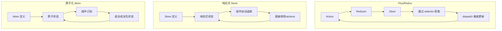
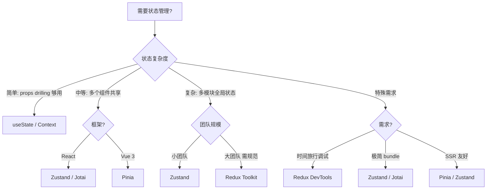

<DifficultyBadge level="beginner" />

# 状态管理方案对比

## 一句话解释

状态管理解决的是**"多个组件怎么共享和同步数据"**的问题——从单向数据流（Redux）到原子化（Jotai/Recoil），再到响应式 store（Pinia/Zustand），不同方案对应不同复杂度。

## 核心流程



## 主流方案对比

| 方案 | 框架 | 模式 | 核心概念 | Bundle | 学习曲线 | 适用场景 |
|------|------|------|---------|--------|---------|---------|
| **Redux Toolkit** | React | Flux / 单向 | store / slice / reducer / middleware | ~12KB | 🔴 中高 | 大型复杂状态 |
| **Zustand** | React | 响应式 store | create / set / subscribe | ~2KB | 🟢 低 | 中大型通用 |
| **Pinia** | Vue 3 | 响应式 store | defineStore / state / actions | ~3KB | 🟢 低 | Vue 3 默认推荐 |
| **Jotai** | React | 原子化 | atom / useAtom | ~4KB | 🟢 低 | 中等复杂度 |
| **Recoil** | React | 原子化 | atom / selector / useRecoilValue | ~20KB | 🟡 中 | Meta 内部使用(已渐趋边缘) |
| **Context** | React 原生 | 上下文注入 | Provider / useContext | 0KB | 🟢 低 | 简单全局状态 |

## 深入理解

### 1. Redux Toolkit — 最成熟的方案

```javascript
// store/counterSlice.ts
import { createSlice, configureStore } from '@reduxjs/toolkit'

const counterSlice = createSlice({
  name: 'counter',
  initialState: { value: 0 },
  reducers: {
    increment: (state) => { state.value += 1 },
    incrementByAmount: (state, action) => { state.value += action.payload }
  }
})

export const { increment, incrementByAmount } = counterSlice.actions

const store = configureStore({
  reducer: { counter: counterSlice.reducer }
})

// 组件中使用
function Counter() {
  const count = useSelector(state => state.counter.value)
  const dispatch = useDispatch()
  
  return <button onClick={() => dispatch(increment())}>{count}</button>
}
```

**Redux Toolkit 的改进：**
- 内置 immer：reducer 可以直接修改 state（自动生成不可变更新）
- 自动生成 action creators：不用手写 action 类型
- 内置 thunk 支持：异步逻辑用 `createAsyncThunk`

**什么时候用 Redux：**
- 多个模块需要共享的复杂全局状态
- 需要中间件处理副作用（日志/分析/异步）
- 团队熟悉 Redux 模式
- 需要 devtools 追踪状态变化历史

### 2. Zustand — 最轻量的响应式 Store

```javascript
import { create } from 'zustand'

const useStore = create((set) => ({
  count: 0,
  increment: () => set(state => ({ count: state.count + 1 })),
  incrementBy: (amount) => set(state => ({ count: state.count + amount })),
}))

function Counter() {
  const count = useStore(state => state.count)
  const increment = useStore(state => state.increment)
  
  return <button onClick={increment}>{count}</button>
}
```

**Zustand vs Redux：**

| 对比 | Redux Toolkit | Zustand |
|------|--------------|---------|
| 样板代码 | 较多（slice/store/类型） | 极少（一个 create） |
| 学习曲线 | 中等（需要懂 reducer/immutable） | 低（类似 useState） |
| 中间件 | 官方 middleware 链 | 简单中间件、subscribe |
| 性能 | 需要 selector 优化 | 自动精确订阅 |
| 最佳场景 | 复杂、大型、需要规范 | 中小型、快速开发 |

### 3. Pinia — Vue 3 官方推荐

```javascript
// stores/counter.ts
import { defineStore } from 'pinia'

export const useCounterStore = defineStore('counter', () => {
  const count = ref(0)
  
  function increment() {
    count.value++
  }
  
  return { count, increment }
})

// 组件中使用
import { useCounterStore } from '@/stores/counter'

const store = useCounterStore()
store.count        // 直接访问
store.increment()  // 直接调用 action
```

**Pinia 的优势：**
- 完整的 TypeScript 类型推导
- 支持 Options API 和 Composition API 两种写法
- Vue Devtools 集成
- 支持 SSR、模块热替换
- 没有 mutations，只有 state + actions

### 4. 原子化方案 — Jotai

```javascript
import { atom, useAtom } from 'jotai'

// 定义原子
const countAtom = atom(0)
const doubledAtom = atom((get) => get(countAtom) * 2)  // 派生

function Counter() {
  const [count, setCount] = useAtom(countAtom)
  const [doubled] = useAtom(doubledAtom)
  
  return (
    <div>
      <span>{count} × 2 = {doubled}</span>
      <button onClick={() => setCount(c => c + 1)}>+</button>
    </div>
  )
}
```

**原子化模式的核心思想：**
- 每个状态是一个独立的"原子"
- 原子可以组合成派生状态
- 组件按需订阅，不订阅的原子变化不会触发重渲染
- 不需要 Provider 包裹（Jotai）

### 5. 选型建议



**经验法则：**
- **不需要状态管理**：状态只在父→子传 → Props 足够
- **简单共享**：lifting state up + Context → 够用
- **中等复杂度**：Zustand（React）/ Pinia（Vue）→ 最佳平衡
- **大型项目**：Redux Toolkit → 规范约束 + 生态成熟
- **极致性能**：Jotai → 精确订阅，避免不必要的重渲染

## 面试问法

- 🔥 **Redux 和 Zustand 有什么区别？怎么选？**
  - Redux：规范多、样板多、适合大型团队统一状态管理
  - Zustand：零样板、灵活、适合快速迭代
  - 选型看项目复杂度和团队规模

- 🔥 **Vue 3 为什么推荐 Pinia 而不是 Vuex？**
  - Pinia 完全支持 Composition API + 更好的 TS 推导 + 没有 mutations
  - Vuex 4 基本是 Vuex 3 移植，没有充分利用 Vue 3 的特性

- ⭐ **Context 和状态管理库的本质区别？**
  - Context 是依赖注入机制，不是状态管理
  - Context 值变化会重渲染所有消费者（不能选择性订阅）
  - 状态管理库（Zustand/Redux）能做选择性订阅，避免不必要的重渲染

- ⭐ **原子化状态管理（Jotai/Recoil）的优势？**
  - 没有 Provider 嵌套，按需订阅，天然支持代码分割
  - 适合需要将状态拆分到不同模块的中大型应用

## 💡 AI 辅助学习

> 用这个 Prompt 练习状态管理选型：
> "你是一个前端架构师。我给你描述一个项目的状态管理需求，你评估应该用什么方案并说明理由。
> 项目 A：团队 15 人，中台系统，50+ 页面，需要记录操作日志
> 项目 B：3 人小团队，SaaS 着陆页，5 个共享状态
> 项目 C：Vue 3 全栈项目，SSR，中等复杂度"

## 关联知识

- [React 核心概念](./react-core) — React 数据流基础
- [Vue 3 核心概念](./vue-core) — Vue 响应式基础
- [框架对比与选型](./framework-comparison) — 框架生态对比
