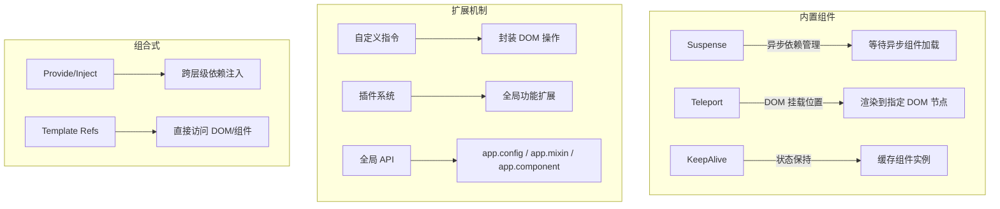

<DifficultyBadge level="beginner" />

# Vue 3 进阶特性

## 一句话解释

Vue 3 不仅改了响应式系统，还引入了几个**解决特定场景问题的内置组件和机制**——Suspense 管理异步、Teleport 处理模态框、自定义指令封装 DOM 操作。

## 核心特性一览



## 深入理解

### 1. Suspense — 异步内容管理

```vue
<template>
  <!-- Suspense 包裹异步组件 -->
  <Suspense>
    <!-- 默认插槽：异步内容 -->
    <AsyncDashboard />
    
    <!-- fallback：加载态 -->
    <template #fallback>
      <LoadingSpinner />
    </template>
  </Suspense>
</template>

<script setup>
// 异步组件 = 返回 Promise 的组件
const AsyncDashboard = defineAsyncComponent(() =>
  import('./Dashboard.vue')
)
</script>
```

**Suspense 的作用：**
- 等待内部所有异步依赖（`async setup()` / 异步组件）加载完毕
- 加载完成前显示 fallback
- 可以嵌套，粒度控制加载态

```vue
<script setup>
// 组件内部也可以用 async setup()
const data = await fetch('/api/dashboard')  // Suspense 会等待
</script>
```

### 2. Teleport — 传送门

```vue
<template>
  <!-- 模态框渲染到 body 下，避免 z-index / overflow 问题 -->
  <Teleport to="body">
    <div class="modal-overlay" v-if="showModal">
      <div class="modal-content">
        <slot />
      </div>
    </div>
  </Teleport>
</template>
```

| 场景 | 为什么用 Teleport | to 目标 |
|------|------------------|--------|
| 模态框 | 避免父组件 overflow: hidden 裁剪 | `body` |
| 悬浮提示 | 确保 Tooltip 不被容器裁剪 | `body` 或 `#app` |
| 全局通知 | 渲染在固定位置，不干扰页面布局 | `#notification-root` |
| 弹窗菜单 | 避免父组件的 z-index 上下文限制 | `body` |

**⚠️ 注意：** Teleport 到目标节点后，逻辑上仍然属于当前组件——事件冒泡仍然遵循组件树，而非 DOM 树。

### 3. 自定义指令

```javascript
// directives/v-focus.ts
import { Directive } from 'vue'

export const vFocus: Directive = {
  mounted(el) {
    el.focus()
  }
}
```

```vue
<template>
  <input v-focus />
</template>

<script setup>
// 局部指令：以 v 开头的驼峰命名
const vFocus = {
  mounted: (el: HTMLElement) => el.focus()
}
</script>
```

**自定义指令的生命周期钩子：**

| 钩子 | 调用时机 |
|------|---------|
| `created` | 绑定到元素时（属性/事件前） |
| `mounted` | 元素挂载到 DOM 后 |
| `updated` | 元素所在 VNode 更新后 |
| `beforeUnmount` | 元素卸载前 |
| `unmounted` | 元素卸载后 |

**实用自定义指令示例：**

```javascript
// v-click-outside — 点击外部关闭
const vClickOutside = {
  mounted(el, binding) {
    el.__clickOutside = (event) => {
      if (!el.contains(event.target)) {
        binding.value(event)
      }
    }
    document.addEventListener('click', el.__clickOutside)
  },
  unmounted(el) {
    document.removeEventListener('click', el.__clickOutside)
  }
}

// v-lazy — 图片懒加载
const vLazy = {
  mounted(el, binding) {
    const observer = new IntersectionObserver((entries) => {
      if (entries[0].isIntersecting) {
        el.src = binding.value
        observer.unobserve(el)
      }
    })
    observer.observe(el)
  }
}
```

### 4. 插件系统

插件是向 Vue 应用添加全局功能的方式：

```javascript
// plugins/toast.ts
import { App } from 'vue'

export default {
  install(app: App, options?: { duration?: number }) {
    // 注册全局组件
    app.component('ToastContainer', ToastContainer)
    
    // 注册全局指令
    app.directive('toast', vToast)
    
    // 注入全局属性
    app.config.globalProperties.$toast = {
      show(message: string) { /* ... */ },
      success(message: string) { /* ... */ },
      error(message: string) { /* ... */ }
    }
    
    // 提供依赖注入
    app.provide('toastOptions', options)
  }
}
```

```javascript
// main.ts
import { createApp } from 'vue'
import ToastPlugin from './plugins/toast'

const app = createApp(App)
app.use(ToastPlugin, { duration: 3000 })
app.mount('#app')
```

**Vue 3 全局 API 变化：**

| Vue 2 | Vue 3 |
|-------|-------|
| `Vue.use()` | `app.use()` |
| `Vue.component()` | `app.component()` |
| `Vue.directive()` | `app.directive()` |
| `Vue.mixin()` | `app.mixin()` |
| `Vue.prototype` | `app.config.globalProperties` |

## 面试问法

- ⭐ **Suspense 解决了什么问题？什么场景用它？**
  - 统一管理异步依赖的加载态，避免手动写 v-if loading 的逻辑
  - 场景：异步组件加载、async setup()、嵌套异步内容

- ⭐ **Teleport 是什么？为什么模态框要用 Teleport？**
  - 把组件渲染到指定 DOM 节点下（逻辑仍在当前组件）
  - 模态框用 Teleport 到 body 避免了 z-index/overflow 的层级问题

- ⭐ **Vue 3 的自定义指令怎么用？适合什么场景？**
  - 通过 `mounted/updated/unmounted` 钩子操作 DOM
  - 场景：自动聚焦、点击外部关闭、懒加载、权限控制

- 📌 **Vue 3 插件和 Vue 2 有什么区别？**
  - Vue 2: `Vue.use()` 全局注册；Vue 3: `app.use()` 应用实例注册
  - 避免了全局状态污染，支持多个 Vue 实例共存

## 💡 AI 辅助学习

> 用这个 Prompt 让 AI 帮你巩固 Vue 3 进阶特性：
> "你是一个 Vue 3 专家。请给我出一道结合 Suspense + Teleport + 自定义指令的综合练习题，比如实现一个带懒加载的全局弹窗通知系统。给出需求描述，我来实现，你再 review。"

## 关联知识

- [Vue 3 核心概念](./vue-core) — Composition API、ref/reactive
- [Vue 3 编译优化](./vue-compile-optimize) — PatchFlag、静态提升
- [Vue 3 源码解读](./vue-source) — 响应式系统原理
