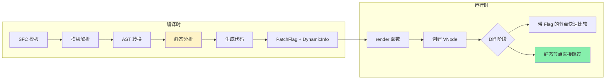
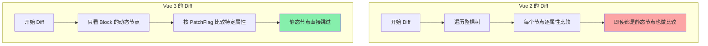

<DifficultyBadge level="intermediate" />

# Vue 3 编译优化

## 一句话解释

Vue 3 比 Vue 2 更快的关键不只在 Proxy 响应式，还在于**编译器做了大量预分析**——在编译阶段就标记出哪些节点是静态的、哪些是动态的，运行时只关注动态部分。

## 核心流程



## 深入理解

### 1. PatchFlag — 靶向更新

Vue 3 在编译时会给每个 VNode 打上 PatchFlag，标记**这个节点动态的部分是什么**：

```vue
<template>
  <div>
    <span>静态文字</span>
    <span :class="dynamicClass">{{ message }}</span>
  </div>
</template>
```

编译后：

```javascript
import { createElementVNode as _createElementVNode, toDisplayString as _toDisplayString, normalizeClass as _normalizeClass, openBlock as _openBlock, createElementBlock as _createElementBlock } from "vue"

export function render(_ctx, _cache) {
  return (_openBlock(), _createElementBlock("div", null, [
    _createElementVNode("span", null, "静态文字"),  // 无 PatchFlag
    
    _createElementVNode("span", {
      class: _normalizeClass(_ctx.dynamicClass)
    }, _toDisplayString(_ctx.message), 3 /* TEXT + CLASS */)
    // ↑ PatchFlag = 3，表示这个节点的 text 和 class 都可能变化
  ]))
}
```

**PatchFlag 的值：**

| Flag | 值 | 含义 |
|------|-----|------|
| `TEXT` | 1 | 文本内容是动态的 |
| `CLASS` | 2 | class 是动态的 |
| `STYLE` | 4 | style 是动态的 |
| `PROPS` | 8 | 非 class/style 的属性是动态的 |
| `FULL_PROPS` | 16 | 所有属性都可能变化（含动态 key） |
| `HYDRATE_EVENTS` | 32 | 需要事件监听 |
| `STABLE_FRAGMENT` | 64 | 子节点顺序稳定 |
| `KEYED_FRAGMENT` | 128 | 子节点有 key |
| `UNKEYED_FRAGMENT` | 256 | 子节点无 key |
| `NEED_PATCH` | 512 | 需要完整 diff |
| `DYNAMIC_SLOTS` | 1024 | 插槽是动态的 |

**PatchFlag 的优势：**
- Vue 2：无论节点变化大小，每次都做完整 Diff
- Vue 3：**通过 PatchFlag 知道"只检查 class"**，跳过其他属性的比较

```javascript
// Vue 3 运行时的 Diff（简化）：
function patchElement(n1, n2) {
  const el = n2.el = n1.el
  const { patchFlag } = n2
  
  if (patchFlag & PatchFlags.CLASS) {
    // 只需要比较 class
    patchClass(el, n2.class)
  }
  if (patchFlag & PatchFlags.TEXT) {
    // 只需要比较文本
    patchText(el, n2.children)
  }
  // 不需要比较的属性跳过
}
```

### 2. 静态提升 — 避免重复创建

Vue 3 会将**没有动态绑定的节点提升到 render 函数之外**，避免每次渲染都重新创建：

```vue
<template>
  <div>
    <span>我不会变</span>
    <span :class="dynamicClass">我会变</span>
  </div>
</template>
```

编译后（未提升）：

```javascript
function render(_ctx, _cache) {
  return [
    createVNode("span", null, "我不会变"),  // 每次渲染都重新创建！
    createVNode("span", { class: _ctx.dynamicClass }, "我会变", 2)
  ]
}
```

编译后（静态提升）：

```javascript
// 静态节点被提升到 render 函数外面！只创建一次
const _hoisted_1 = createVNode("span", null, "我不会变", -1 /* HOISTED */)

function render(_ctx, _cache) {
  return [
    _hoisted_1,  // 复用同一 VNode，不再重复创建
    createVNode("span", { class: _ctx.dynamicClass }, "我会变", 2)
  ]
}
```

**静态提升的效果：**

| 静态内容量 | 每次创建 | 提升后 |
|-----------|---------|-------|
| 10 个静态节点 | 创建 10 次 | **创建 1 次，复用** |
| 100 个静态节点 | 创建 100 次 | **创建 1 次，复用** |
| 只有 1% 动态内容 | 100% 创建 | **只创建 1%，99% 复用** |

### 3. Tree Shaking — 按需引入

Vue 3 的核心运行时被拆分为独立的 API，**不用到的功能不会出现在打包结果中**：

```javascript
// Vue 2：Vue 对象包含所有功能
import Vue from 'vue'
// 即使你只用了模板，Transition/KeepAlive 等也会被打包进去

// Vue 3：按需引入
import { ref, computed } from 'vue'
import { Transition } from 'vue'
// 只有 import 的功能才打包
```

| 功能 | 未使用时 |
|------|---------|
| Transition | 不打包 |
| KeepAlive | 不打包 |
| Teleport | 不打包 |
| v-model 指令 | 不打包 |
| TransitionGroup | 不打包 |
| `<style scoped>` | 不打包 |

> Vue 3 的基础运行时约 **33KB**（压缩后），而 Vue 2 约 **23KB**。但 Tree Shaking 后，实际项目中 Vue 3 的运行时增量可能比 Vue 2 更小。

### 4. Block Tree — 树结构优化

Vue 3 将模板编译为**扁平的 Block Tree**，跳过静态分支的比较：

```vue
<template>
  <div>                         <!-- Block 根 -->
    <header>                    <!-- 静态 -->
      <nav>...</nav>
    </header>
    <main>                      <!-- Block -->
      <section v-if="show">     <!-- 动态 -->
        <p>{{ text }}</p>
      </section>
      <section v-else>          <!-- 动态 -->
        <span>empty</span>
      </section>
    </main>
    <footer>                    <!-- 静态 -->
      <p>copyright</p>
    </footer>
  </div>
</template>
```

**Vue 3 的 Block Tree：**
```
div (Block Root)
  ├── header (静态 → 完全跳过)
  ├── main (Block)
  │   └── v-if 条件分支 (动态 → 只检查这个)
  └── footer (静态 → 完全跳过)
```

**Vue 2 的 Diff：**
```
div → header → nav → ... → main → section → p → ... → footer → p
（遍历整棵树，逐层对比）
```

**Vue 3 的 Diff：**
```
div → main → v-if
（跳过所有静态分支，只检查动态节点）
```

### 5. 对比总结

| 优化手段 | 解决的问题 | 效果 |
|---------|-----------|------|
| **PatchFlag** | 不知道节点哪些部分动态，只能全量 Diff | Diff 范围精确到属性级 |
| **静态提升** | 静态 VNode 每次渲染都重新创建 | 只创建一次，后续复用 |
| **Tree Shaking** | 打包包含未使用的功能 | 按需引入，减少包体积 |
| **Block Tree** | Diff 遍历整棵树 | 跳过静态分支，只检查动态节点 |



**性能数据（粗略参考）：**
- 同规模组件，Vue 3 的更新速度约为 Vue 2 的 **1.5~3 倍**
- 静态内容占比越高，Vue 3 的优势越大
- 大量动态列表场景，两者差距较小

## 面试问法

- 🔥 **Vue 3 的编译优化主要有哪些？**
  - PatchFlag：标记动态属性，精确 Diff
  - 静态提升：静态 VNode 只创建一次
  - Tree Shaking：按需引入，减少包体积
  - Block Tree：跳过静态分支，只检查动态节点

- ⭐ **PatchFlag 怎么工作的？**
  - 编译时分析模板，标记每个节点的动态部分（text/class/style/props）
  - 运行时根据 Flag 只比较有标记的属性
  - 没有 Flag 的节点在 Diff 中完全跳过

- ⭐ **Vue 3 比 Vue 2 快多少？为什么？**
  - 综合约 1.5~3 倍，主要在更新阶段
  - 原因：响应式 + 编译优化（PatchFlag + 静态提升 + Block Tree）

- 📌 **静态提升有什么限制？**
  - 只有"完全静态"的节点才能提升
  - 一旦有动态绑定（v-bind/v-if/v-for），该节点不提升
  - 静态提升依赖编译分析，JSX 动态场景可能无法充分利用

## 💡 AI 辅助学习

> 用这个 Prompt 理解编译优化：
> "你是 Vue 3 编译器作者。请帮我分析以下模板编译后的 render 函数会做什么优化：
> ```vue
> <template>
>   <div class="container">
>     <h1>标题</h1>
>     <p :class="activeClass">{{ message }}</p>
>     <footer>底部信息</footer>
>   </div>
> </template>
> ```
> 请分析：哪些节点会被静态提升？PatchFlag 会标记什么？Block Tree 怎么组织的？"

## 关联知识

- [Vue 3 核心概念](./vue-core) — Composition API、ref/reactive
- [Vue 3 进阶特性](./vue-advanced) — Suspense、Teleport
- [Vue 3 源码解读](./vue-source) — 响应式系统源码
