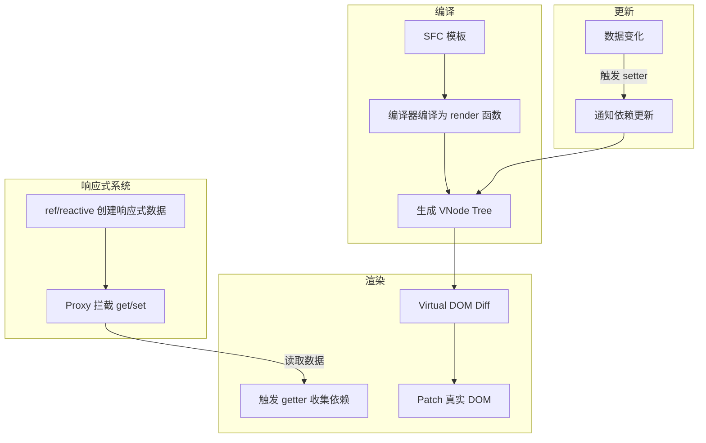

<DifficultyBadge level="beginner" />

# Vue 3 核心概念

## 一句话解释

Vue 3 是一个**渐进式前端框架**——你可以在现有项目中逐步引入它的功能，也可以用它完整构建一个应用。核心卖点是**响应式数据驱动 UI**。

## 核心流程



## 深入理解

### 1. Composition API vs Options API

```vue
<script>
// Options API：按选项组织代码
export default {
  data() {
    return { count: 0 }
  },
  methods: {
    increment() { this.count++ }
  },
  mounted() { console.log('mounted') }
}
</script>

<script setup>
// Composition API：按逻辑组织代码
import { ref, onMounted } from 'vue'

const count = ref(0)
function increment() { count.value++ }

onMounted(() => console.log('mounted'))
</script>
```

| 对比维度 | Options API | Composition API (`<script setup>`) |
|---------|-------------|-----------------------------------|
| 组织方式 | 按类型分组（data/methods/computed） | 按功能分组 |
| 代码复用 | mixins（命名冲突、来源不明） | composables（清晰的依赖关系） |
| TypeScript | 声明 `this` 上的类型较麻烦 | 天然类型推导 |
| 学习曲线 | 更低，新手友好 | 稍高，但更灵活 |
| 推荐场景 | 简单组件 | 复杂组件 / 可复用逻辑 / 大型项目 |

> Vue 3 **不推荐**用 Options API 写新代码，`<script setup>` 是默认选择。

### 2. ref vs reactive

```vue
<script setup>
import { ref, reactive } from 'vue'

// ref：基本类型 + 对象都行
const count = ref(0)           // { value: 0 }
const user = ref({ name: 'Alice' })

console.log(count.value)       // 通过 .value 访问
user.value.name = 'Bob'        // 对象也是 .value

// reactive：只能传对象
const state = reactive({ count: 0, user: { name: 'Alice' } })

console.log(state.count)       // 直接访问，不需要 .value
state.user.name = 'Bob'
</script>
```

| 特性 | `ref()` | `reactive()` |
|------|---------|-------------|
| 数据类型 | 任意类型（基本类型 + 对象） | 仅对象（不能用于 string/number） |
| 访问方式 | `.value` | 直接访问 |
| 解构 | 安全（`.value` 保持引用） | **解构会丢失响应性**（用 `toRefs` 解决） |
| 重新赋值 | 直接 `ref.value = newVal` | **不能直接替换整个对象**（用 Object.assign 或新 reactive） |
| TS 推导 | `Ref<T>` | `UnwrapNestedRefs<T>` |

```vue
<script setup>
// reactive 的解构陷阱
const state = reactive({ count: 0, name: 'Alice' })

// ❌ 解构后 count 和 name 不再是响应式的
const { count, name } = state

// ✅ 用 toRefs 保持响应性
const { count, name } = toRefs(state)
// 现在 count 是 Ref，count.value 访问
</script>
```

### 3. 生命周期

| Options API | Composition API | 执行时机 |
|-------------|----------------|---------|
| `beforeCreate` | —（在 `<script setup>` 中就是 setup） | 实例初始化前 |
| `created` | —（同上） | 实例初始化后 |
| `beforeMount` | `onBeforeMount` | 挂载前 |
| `mounted` | `onMounted` | 挂载后 |
| `beforeUpdate` | `onBeforeUpdate` | 数据变化，DOM 更新前 |
| `updated` | `onUpdated` | DOM 更新后 |
| `beforeUnmount` | `onBeforeUnmount` | 卸载前 |
| `unmounted` | `onUnmounted` | 卸载后 |

```vue
<script setup>
import { onMounted, onUnmounted, onBeforeUnmount } from 'vue'

onMounted(() => {
  console.log('组件已挂载')
})

onBeforeUnmount(() => {
  console.log('组件即将卸载')
})
</script>
```

### 4. 模板语法与指令

```vue
<template>
  <!-- 文本插值 -->
  <p>{{ message }}</p>

  <!-- 绑定属性 -->
  

  <!-- 事件绑定 -->
  <button @click="handleClick">点击</button>
  <button @click.prevent="onSubmit">阻止默认行为</button>

  <!-- 双向绑定 -->
  <input v-model="searchText" />

  <!-- 条件渲染 -->
  <div v-if="status === 'loading'">加载中...</div>
  <div v-else-if="status === 'error'">出错了</div>
  <div v-else>内容</div>

  <!-- 列表渲染 -->
  <li v-for="(item, index) in items" :key="item.id">
    {{ index }}: {{ item.name }}
  </li>
</template>

<script setup>
import { ref } from 'vue'

const message = ref('Hello Vue 3')
const imageUrl = ref('/logo.png')
const searchText = ref('')
const status = ref('loading')

function handleClick() { /* ... */ }
function onSubmit() { /* ... */ }
</script>
```

**常用修饰符：**

| 修饰符 | 示例 | 说明 |
|--------|------|------|
| `.prevent` | `@click.prevent` | 调用 `event.preventDefault()` |
| `.stop` | `@click.stop` | 调用 `event.stopPropagation()` |
| `.once` | `@click.once` | 只触发一次 |
| `.lazy` | `v-model.lazy` | change 事件后同步（而非 input） |
| `.trim` | `v-model.trim` | 自动去除首尾空格 |
| `.number` | `v-model.number` | 自动转为数字类型 |

## 面试问法

- 🔥 **Composition API 和 Options API 有什么区别？**
  - 组织方式：按功能 vs 按类型；复用能力：composables vs mixins；TS 支持：天然推导 vs 需声明
  - 推荐用 `<script setup>` + Composition API

- 🔥 **ref 和 reactive 的区别？什么时候用哪个？**
  - ref：全能，任意类型；reactive：仅对象，解构丢失响应性
  - 团队建议：**默认用 ref**，一致性更好；只有在明确需要 reactive 的性能优势或深层对象时才用它

- ⭐ **Vue 3 的生命周期有哪些变化？**
  - 去掉了 `beforeCreate` / `created`（直接在 setup 中做）
  - `beforeDestroy` → `onBeforeUnmount`，`destroyed` → `onUnmounted`
  - Composition API 版都需要手动 import

- ⭐ **v-if 和 v-for 哪个优先级高？**
  - Vue 3 中 `v-if` 优先级高于 `v-for`（Vue 2 中相反）
  - 不推荐同时用——用 `computed` 先过滤再遍历

## 💡 AI 辅助学习

> 用这个 Prompt 让 AI 帮你巩固 Vue 3 知识：
> "你是一个 Vue 3 导师。我准备面试，请给我 3 道关于 Composition API 和响应式系统的代码题目，覆盖 ref/reactive 区别、响应式丢失陷阱、生命周期使用场景。每道题先让我做，再给详细解析。"

## 关联知识

- [Vue 3 进阶特性](./vue-advanced) — Suspense、Teleport、自定义指令
- [Vue 3 编译优化](./vue-compile-optimize) — PatchFlag、静态提升
- [Vue 3 源码解读](./vue-source) — 响应式系统原理
