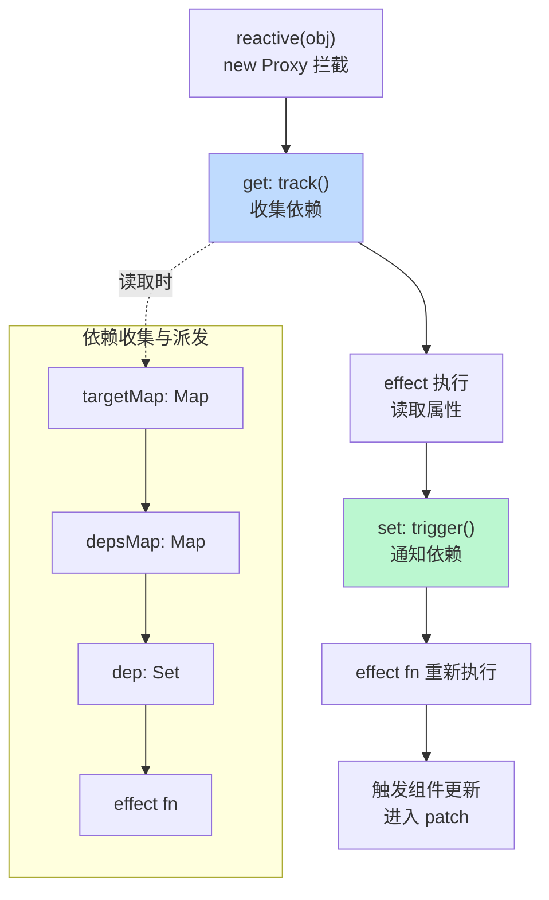
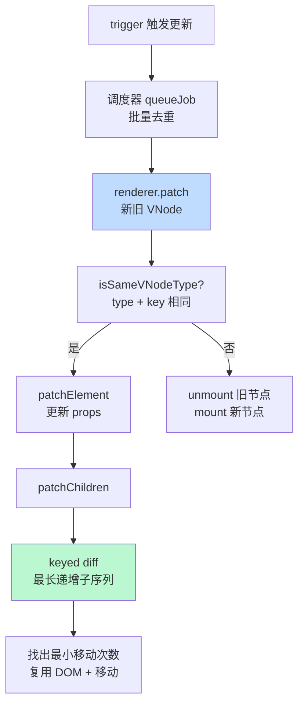

<DifficultyBadge level="advanced" />

# Vue 3 源码解读

## 一句话解释

Vue 3 的核心是**"Proxy 响应式系统 + 编译期静态分析 + 双端 Diff"**三层引擎：数据变化时 setter 精确通知依赖（组件级，而非整个应用），编译器提前标记静态节点（patchFlag），渲染器用最长递增子序列做最少 DOM 操作，实现"编译时尽量做优化、运行时尽量少干活"。

## 响应式系统工作流



## 深入理解

### 1. Proxy 响应式系统：track / trigger

Vue 3 用 `Proxy` 包装对象，在 `get` 时**收集依赖（track）**，在 `set` 时**派发更新（trigger）**。依赖存放在三层结构 `targetMap → depsMap → dep` 中：

| 层级 | 结构 | 作用 |
|------|------|------|
| `targetMap` | `WeakMap<target, depsMap>` | 对象 → 其属性依赖表 |
| `depsMap` | `Map<key, dep>` | 属性 → 依赖集合 |
| `dep` | `Set<effect>` | 该属性的所有订阅 effect |

```typescript
// 简化：reactive 实现
function reactive(target) {
  return new Proxy(target, {
    get(target, key, receiver) {
      const res = Reflect.get(target, key, receiver)
      track(target, key)              // 收集依赖
      return res
    },
    set(target, key, value, receiver) {
      const result = Reflect.set(target, key, value, receiver)
      trigger(target, key)            // 派发更新
      return result
    }
  })
}

// 收集依赖：当前正在运行的 effect 订阅该属性
function track(target, key) {
  if (!activeEffect) return
  let depsMap = targetMap.get(target)
  if (!depsMap) targetMap.set(target, (depsMap = new Map()))
  let dep = depsMap.get(key)
  if (!dep) depsMap.set(key, (dep = new Set()))
  dep.add(activeEffect)
  activeEffect.deps.push(dep)
}

// 派发更新：把订阅该属性的 effect 加入调度队列
function trigger(target, key) {
  const depsMap = targetMap.get(target)
  if (!depsMap) return
  const dep = depsMap.get(key)
  if (!dep) return
  const effects = [...dep]
  effects.forEach(effect => {
    if (effect.scheduler) effect.scheduler(effect)  // 组件渲染走 scheduler（异步批量）
    else effect.run()
  })
}
```

**ref 与 reactive 的区别本质：**
- `ref` 内部就是 `reactive({ value })` 的封装，`.value` 就是访问 `{ value }` 的 `value` 属性 → 所以基本类型也能被追踪
- 为什么 `ref` 的深层对象也是响应式？因为 `ref` 内部对 value 又包了一层 `reactive`（`toReactive`）
- 直接给 `reactive` 对象解构会**丢失响应性**：解构拿到的就是 `get` 的返回值（一个普通值），不再经过 Proxy

### 2. computed 与 watch 的实现差异

| API | 本质 | 惰性 | 缓存 | 应用场景 |
|-----|------|------|------|---------|
| `computed` | 一个有缓存的 effect（`ComputedRefImpl`） | 是（不读不执行） | 是（依赖不变返回缓存值） | 派生状态 |
| `watch` | 监听 source 变化，变化时执行 callback | 否 | 否 | 副作用（请求、IO） |
| `watchEffect` | 自动收集依赖，立即执行一次 | 否 | 否 | 自动追踪副作用 |

```typescript
// 简化：computed 的缓存机制 —— dirty 标志位
class ComputedRefImpl {
  _dirty = true
  _value
  constructor(getter) {
    this.effect = new ReactiveEffect(getter, () => {
      if (!this._dirty) this._dirty = true   // 依赖变化 → 标记脏，但不立即重算
      trigger(this, 'value')                  // 通知读取方重新读取
    })
  }
  get value() {
    if (this._dirty) {
      this._value = this.effect.run()         // 懒计算：读取时才重算
      this._dirty = false
    }
    track(this, 'value')                      // computed 本身也参与依赖追踪（可链式）
    return this._value
  }
}
```

```javascript
// watch 的两大参数：source（可传函数/ref/数组）与 callback
watch(
  () => props.id,              // source：函数返回响应式依赖
  async (newId, oldId) => {    // callback：新值、旧值
    const data = await fetch(`/api/${newId}`)
    state.data = data
  },
  { immediate: true }          // 选项：立即执行 / deep 深监听
)
```

### 3. 编译优化：静态提升 + patchFlag + Block Tree

Vue 3 的模板编译器在**编译期**做静态分析，把优化结果编码进 VNode 的属性里，运行时渲染器据此跳过大量无效工作：

| 优化手段 | 原理 | 效果 |
|----------|------|------|
| **静态提升** | 静态子树只创建一次 VNode，渲染时复用 | 减少创建开销 |
| **patchFlag** | 标记动态节点类型（TEXT/CLASS/STYLE/PROPS 等），只 patch 对应部分 | 跳过无谓 diff |
| **Block Tree** | 把动态节点收集进数组，只遍历动态节点 | diff 由 O(n) 变 O(动态节点数) |
| **cacheHandlers** | 内联事件函数缓存，`onClick` 引用不变 | 配合静态节点让子组件免重渲染 |

```vue
<template>
  <!-- 编译器视角：编译产物中的 patchFlag -->
  <div>
    <p class="static">静态文本，被静态提升</p>            <!-- 只创建一次 -->
    <p :class="cls">动态 class</p>                        <!-- 带 patchFlag=CLASS -->
    <p>{{ msg }}</p>                                      <!-- 带 patchFlag=TEXT -->
  </div>
</template>
```

```javascript
// 编译后的 render 函数（示意）
const _hoisted_1 = createElementVNode('p', { class: 'static' }, '静态文本', -1) // -1: 静态提升，只执行一次

export function render(_ctx, _cache) {
  return openBlock(), createElementBlock('div', null, [
    _hoisted_1,
    createElementVNode('p', { class: _ctx.cls }, null, 2 /* patchFlag: CLASS */),
    createElementVNode('p', null, toDisplayString(_ctx.msg), 1 /* patchFlag: TEXT */)
  ])
}
```

**patchFlag 常见取值（二进制位可组合）：**

| Flag | 值 | 含义 |
|------|-----|------|
| `TEXT` | 1 | 只有文本变化 |
| `CLASS` | 2 | class 变化 |
| `STYLE` | 4 | style 变化 |
| `PROPS` | 8 | 除 class/style 外的 props 变化 |
| `FULL_PROPS` | 16 | 全量对比（动态 key 场景） |
| `NEED_PATCH` | 32 | 需要 patch |
| `KEYED_FRAGMENT` | 128 | 带 key 的 fragment |
| `DYNAMIC_SLOTS` | 512 | 动态插槽 |

### 4. 组件更新流程与双端 Diff



**keyed diff 的核心算法（`patchKeyedChildren`）：**

Vue 3 的双端比较 + 最长递增子序列：

1. **头对头**：从头开始，`key` 相同则复用，直到不同
2. **尾对尾**：从尾开始，`key` 相同则复用，直到不同
3. **剩余部分**：用 `Map<key, newIndex>` 建立索引，找出**最长递增子序列（LIS）**，LIS 里的节点不用动，其余节点移动

```javascript
// 简化：最长递增子序列 —— 求"哪些旧节点保持原序即可"
function getSequence(nums) {
  const result = [], index = []
  for (let i = 0; i < nums.length; i++) {
    if (nums[i] < result[result.length - 1]) {
      // 二分查找替换，保证 result 是"最长"递增子序列
      // ...（完整实现见 packages/runtime-core/src/renderer.ts）
    } else {
      result.push(nums[i])
    }
  }
  return result  // 返回值指示：这些索引对应的节点无需移动
}
```

> 面试要点：**为什么用最长递增子序列而不是简单对比？** 因为 DOM 移动是最昂贵的操作，LIS 算法能求出"保持相对顺序不变的最长节点序列"，这些节点**完全不用移动**，只移动剩余节点，保证**移动次数最小**。

### 5. 运行时 vs 编译时：Vue 的取舍

Vue 同时有**运行时（renderer）**和**编译时（compiler）**：

- **编译时**：把 SFC 模板编译成 render 函数 + 优化信息（patchFlag、静态提升、Block）
- **运行时**：执行 render 函数，通过 patch 更新真实 DOM
- 模板 → 编译优化 → 运行时受益；渲染器是编译产物的"解释执行器"

### 6. Vue 2 vs Vue 3 响应式对比

| 维度 | Vue 2（defineProperty） | Vue 3（Proxy） |
|------|------------------------|----------------|
| 劫持方式 | 递归遍历对象每个属性 `Object.defineProperty` | 代理整个对象 `new Proxy` |
| 新增/删除属性 | **检测不到**（需 `Vue.set`/`$set`） | 天然支持 |
| 数组变化 | 只拦截 7 个变异方法，`arr[i]=x` 检测不到 | 天然支持（索引赋值、length 变化） |
| 初始化性能 | 递归 defineProperty，对象越大越慢 | 惰性代理，访问时才深层代理 |
| 深层对象 | 一次性递归劫持 | get 时按需 `reactive`（lazy） |
| 嵌套对象解构 | 响应式丢失 | 响应式丢失（仍需 toRefs） |

```javascript
// Vue 2 的致命局限
this.obj.newProp = 1          // ❌ 新增属性不响应（defineProperty 只监听已存在的 key）
this.arr[0] = 99              // ❌ 索引赋值不响应
this.arr.length = 0           // ❌ 修改 length 不响应
delete this.obj.prop          // ❌ 删除不响应

// Vue 3（Proxy）全部天然支持
state.newProp = 1             // ✅
arr[0] = 99                   // ✅
delete state.prop             // ✅
```

> **Proxy 的局限也要能答**：不支持完全透明的对象（`Object.isFrozen` 等内部槽访问除外）；不能代理 `Map/Set/WeakMap` 的方法调用结果（需额外包装）；IE11 不支持 Proxy（Vue 3 因此放弃 IE 兼容）。

## 面试问法

- 🔥 **Vue 3 的响应式是怎么实现的？和 Vue 2 有什么区别？**
  - Vue 3 用 Proxy 代理整个对象，get 收集依赖（track）、set 派发更新（trigger）
  - Vue 2 用 defineProperty 逐个属性劫持，无法监听新增/删除属性、数组索引赋值
  - Proxy 惰性深层代理性能更好，但需 `Reflect` 保证 `this` 指向正确

- 🔥 **computed 和 watch 的区别？computed 是怎么实现缓存的？**
  - computed 有缓存 + 惰性，只有读取才重算，依赖不变直接返回缓存值（dirty 标志位）
  - watch 无缓存，依赖变化即执行回调，用于副作用
  - computed 依赖变化时只标记 dirty，不立即重算，等被读取时才重算——这就是"缓存"

- 🔥 **Vue 3 的 diff 和 React 的 diff 有什么不同？**
  - Vue：编译期 patchFlag 标记动态节点 + Block Tree，diff 只在动态节点间进行，O(动态数)
  - React：无编译期优化，靠 key 全量协调，依赖用户 memo 化
  - Vue 的双端 diff + LIS 求最小移动次数，React 的 diff 是单端 + 标记移动

- ⭐ **为什么 Vue 3 用 Proxy 而不用 defineProperty？**
  - defineProperty 只能监听已有属性，新增/删除/数组索引都不行
  - Proxy 代理整个对象，所有属性操作都被拦截
  - 深度监听从"递归一次性"变为"访问时惰性"，初始化更快

- ⭐ **patchFlag 是什么？为什么能提升性能？**
  - 编译器在编译期标记"哪个节点的哪部分会变"（TEXT/CLASS/STYLE/PROPS）
  - 运行时渲染器根据 flag 只 patch 对应部分，跳过无谓的 props 全量对比
  - 静态节点直接复用（静态提升），整个子树不参与 diff

- ⭐ **Vue 的 nextTick 是怎么实现的？**
  - 触发更新走 scheduler → `queueJob` 批量入队，用 `Promise.resolve().then`（降级 `MutationObserver`/`setImmediate`）把 flush 放到微任务
  - 所以"改完数据立即读 DOM"拿到的是旧值，需 `await nextTick()`
  - 同一轮多个数据变更只会 flush 一次，天然合并渲染

## 💡 AI 辅助学习

> 用这个 Prompt 深挖 Vue 源码：
> "你是 Vue 核心团队成员。请手把手带我读 Vue 3 的 packages/reactivity/src/effect.ts：用 200 字讲清 track/trigger 的数据结构设计，用 5 行伪代码解释为什么 computed 依赖变化时只是标记 dirty 而不是立即重算，并指出 effect 的 scheduler 和 run 在组件渲染场景下分别什么时候被调用。最后出 2 道源码级判断题。"

## 关联知识

- [Vue 3 核心概念](./vue-core) — ref/reactive、Composition API 使用层
- [Vue 3 编译优化](./vue-compile-optimize) — patchFlag、静态提升、Block Tree 细节
- [React 源码解读](./react-source) — 对比 React 的 fiber/diff 模型
- [框架对比与选型](./framework-comparison) — Vue 与 React 设计哲学差异
