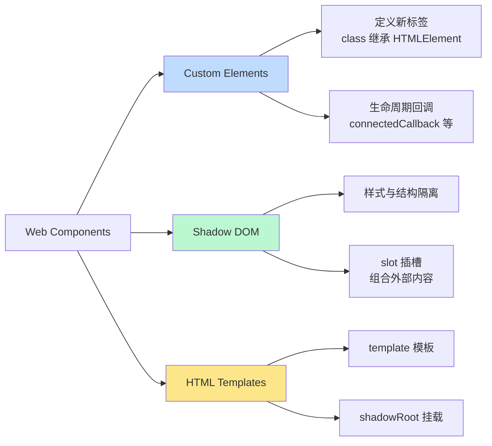
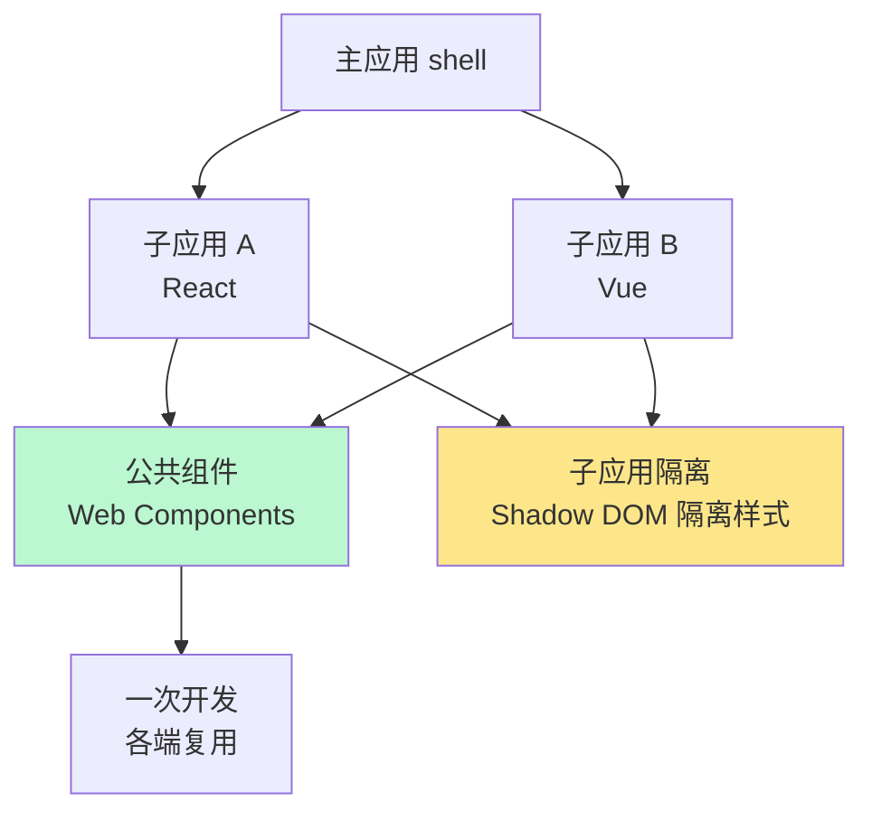

<DifficultyBadge level="advanced" />

# Web Components

## 一句话解释

Web Components 是浏览器**原生**的组件标准，由 **Custom Elements（自定义元素）+ Shadow DOM（样式/结构隔离）+ HTML Templates（模板）** 三件套组成——无需任何框架就能封装可复用组件，缺点是"原生模板能力弱 + 无响应式状态系统"，因此没有取代 React/Vue，却成为设计系统与微前端的底层基石。

## 三件套全景



## 深入理解

### 1. Custom Elements：自定义元素

自定义元素分两类：**自主自定义元素**（继承 `HTMLElement`，如 `<my-card>`）和**继承内建元素**（如 `extends HTMLButtonElement`，配合 `is` 属性）。

```javascript
// 定义自定义元素
class MyCard extends HTMLElement {
  static observedAttributes = ['title']   // 监听哪些属性变化

  constructor() {
    super()
    // 注意：constructor 里不能访问属性/子元素，应在 connectedCallback 初始化
  }

  connectedCallback() { /* 元素挂载到 DOM 时 */ }
  disconnectedCallback() { /* 元素从 DOM 移除时 */ }
  attributeChangedCallback(name, oldVal, newVal) { /* 属性变化时 */ }
  adoptedCallback() { /* 跨文档移动时 */ }
}

customElements.define('my-card', MyCard)
```

**命名规范与使用要求：**
- 自定义元素名**必须包含短横线 `-`**（如 `my-card`），避免与 HTML 内建标签冲突
- 先 `define` 再使用；未定义时浏览器按未知元素处理，`define` 后自动升级
- 一个 `document` 里同名只能 `define` 一次，重复定义抛错

### 2. Shadow DOM：样式与结构隔离

Shadow DOM 把一个"影子根"附加到宿主元素上，影子内部的样式和 DOM **不泄漏到外部**，外部样式**也影响不到内部**——这就是组件样式隔离的终极形态。

```javascript
// 创建 shadow root 并挂载模板
class MyCard extends HTMLElement {
  constructor() {
    super()
    // mode: open 可从外部访问 shadowRoot；closed 则无法
    const shadow = this.attachShadow({ mode: 'open' })

    const style = document.createElement('style')
    style.textContent = `
      .card { border: 1px solid #ddd; border-radius: 8px; padding: 16px; }
      h3 { margin: 0 0 8px; }
    `

    const template = document.getElementById('my-card-tpl')
    shadow.appendChild(style)
    shadow.appendChild(template.content.cloneNode(true))  // 深拷贝模板
  }
}
```

```html
<!-- 外部样式无法穿透 shadow 边界 -->
<my-card></my-card>
```

**关键概念：**

| 概念 | 说明 |
|------|------|
| **shadow root** | 附加到宿主元素上的影子根节点，`mode: open` 可被外部访问 |
| **shadow tree** | 影子根内部的 DOM 树，外部选择器/样式无法触及 |
| **slot 插槽** | 影子树内的"占位符"，接收宿主元素的子内容 |
| **::slotted** | 样式影子外传入的 slot 内容的选择器 |
| **:host** | 匹配宿主元素本身（可配合 `:host(.active)`） |

```html
<!-- slot 用法：宿主传入内容，填入影子内的插槽 -->
<template id="my-card-tpl">
  <div class="card">
    <h3><slot name="title">默认标题</slot></h3>
    <div class="body"><slot>默认内容</slot></div>
  </div>
</template>

<my-card>
  <span slot="title">自定义标题</span>
  <p>正文内容（走默认插槽）</p>
</my-card>
```

**样式隔离的坑（面试易考点）：**
- 影子内样式默认隔离，但**继承属性**（如 `color`、`font-family`）仍会穿透进 shadow
- 事件会**重定向**：影子内冒泡的事件其 `target` 会被重定向为宿主元素，需 `event.composedPath()` 取真实来源
- `:host` 优先级低于外部选择器，容易出"外部样式干不掉内部"的错觉

### 3. 生命周期总览

| 回调 | 触发时机 | 使用场景 |
|------|---------|---------|
| `connectedCallback` | 元素插入 DOM 时 | 初始化 DOM、绑定事件、发请求 |
| `disconnectedCallback` | 元素从 DOM 移除时 | 清理定时器/事件监听，防泄漏 |
| `attributeChangedCallback` | `observedAttributes` 中属性变化时 | 响应属性变化更新内部状态 |
| `adoptedCallback` | 元素被 `adoptNode` 移到新文档时 | 罕见，重新绑定 |
| `constructor` | 实例创建时（很早就执行） | 仅做初始化赋值，勿访问属性/子元素 |

> **高频细节**：`connectedCallback` 每次插入 DOM 都会触发（可能多次）；`attributeChangedCallback` 首次解析到 `observedAttributes` 里的属性也会触发一次（初始同步）。

### 4. 与框架的对比：为什么没有取代 React/Vue？

| 维度 | Web Components | React / Vue |
|------|---------------|-------------|
| 状态响应式 | **无内置**，需手写 getter/setter + 属性回调 | 内置响应式状态系统 |
| 数据流 | 属性 + 事件，偏命令式 | 声明式 + 单向/双向数据流 |
| 模板能力 | 原生模板弱，逻辑少（无循环/条件） | 模板编译 + JSX |
| 渲染调度 | 无 diff/批量更新，DOM 操作自己管 | 虚拟 DOM / patch 批量优化 |
| 生态工具 | 少（需配 Lit 等） | 成熟工具链 |
| 样式隔离 | Shadow DOM 原生隔离（强项） | CSS Modules / scoped（运行时方案） |
| 跨框架复用 | 任何框架都能用（强项） | 不能跨框架直接复用 |
| 适用场景 | 设计系统、原生可复用组件、微前端 | 应用级业务开发 |

**为什么没替代框架（面试关键句）：**
- 没有**响应式状态系统**和**声明式模板**，复杂 UI 开发效率远低于框架
- 没有**渲染优化**（虚拟 DOM / 批量更新），大数据量场景性能弱
- 生态薄弱，表单校验、动画、路由等都要自己造
- 框架胜在"应用开发效率"，WC 胜在"跨框架复用与原生隔离"

### 5. Lit：Web Components 的最佳实践库

Lit 补上了 WC 缺的两块：**响应式属性（reactive properties）**和**声明式模板（lit-html）**。

```typescript
// Lit 示例：响应式属性 + 模板
import { LitElement, html, css } from 'lit'

class MyButton extends LitElement {
  static styles = css`
    :host { display: inline-block; }
    button { padding: 8px 16px; border-radius: 6px; border: none; cursor: pointer; }
  `

  static properties = {
    variant: { type: String },
    disabled: { type: Boolean, reflect: true }   // reflect: 同步回属性
  }

  constructor() {
    super()
    this.variant = 'primary'
    this.disabled = false
  }

  // 属性变化 → 响应式 → 自动重新渲染
  _handleClick() {
    this.dispatchEvent(new CustomEvent('my-click', { detail: { id: this.id }, bubbles: true, composed: true }))
  }

  render() {
    return html`<button ?disabled=${this.disabled} @click=${this._handleClick}>
      <slot></slot>
    </button>`
  }
}
customElements.define('my-button', MyButton)
```

**Lit 的价值：**
- 属性变化驱动渲染（类似框架的响应式），但运行时只有几 KB
- 模板基于标签模板字符串，仅更新变化部分（精细到 DOM 节点）
- 产物即标准 Custom Element，任何框架都能用

### 6. 实际应用场景

| 场景 | 为什么用 WC | 典型例子 |
|------|------------|---------|
| **设计系统** | 一份组件库跨 React/Vue/原生项目使用 | Ionic、Vaadin、Salesforce LWC |
| **微前端** | 各子应用框架不同，WC 是"公共语言" | 影子组件、公共 header/footer |
| **跨团队共享组件** | 团队 A 用 React，团队 B 用 Vue，组件互通 | 地图、视频、图表组件 |
| **平台原生组件** | 浏览器原生 API，零依赖、零构建 | `<input type="date">` 式扩展 |

**微前端中的"影子"角色：**



> **面试加分句**：在微前端里，WC 是**"跨框架的公共层"**——React/Vue 应用之间无法直接共享组件，但都能消费原生自定义元素；加上 Shadow DOM 的样式隔离，还能防止子应用间样式串扰（配合 scoped 样式形成双保险）。

## 面试问法

- 🔥 **Web Components 由哪三部分组成？各自的作用？**
  - Custom Elements：定义新标签 + 生命周期；Shadow DOM：样式/结构隔离 + slot；HTML Templates：可复用的模板片段
  - 三者配合实现"原生、无框架、可复用组件"

- 🔥 **为什么 Web Components 没有取代 React/Vue？**
  - 无内置响应式状态系统与声明式模板，复杂 UI 开发效率低
  - 无渲染调度/diff，大数据量性能弱；生态薄弱
  - 强项是跨框架复用 + 原生样式隔离，适合设计系统/微前端而非应用开发

- ⭐ **Shadow DOM 的样式隔离原理？有哪些坑？**
  - 影子树内外样式互不穿透；继承属性（color/font）仍会穿透
  - 事件 target 被重定向为宿主，需 composedPath() 取真实来源
  - :host 优先级低于外部选择器

- ⭐ **自定义元素的使用规范和生命周期有哪些？**
  - 名称必须含短横线；先 define 再使用；constructor 不能访问属性/子元素
  - connectedCallback / disconnectedCallback / attributeChangedCallback / adoptedCallback

- ⭐ **slot 是什么？命名插槽和默认插槽区别？**
  - slot 是影子树内的占位符，接收宿主元素子内容
  - `<slot name="x">` 命名插槽按 name 匹配；无 name 的是默认插槽，接收未指定的内容
  - `::slotted()` 选择器样式化 slot 传入内容

- ⭐ **Lit 解决了 Web Components 的什么问题？**
  - 响应式属性（属性变化自动渲染）+ 声明式模板（lit-html 细粒度更新）
  - 产物仍是标准 Custom Element，跨框架可用，运行时仅几 KB

## 💡 AI 辅助学习

> 用这个 Prompt 巩固 WC 知识：
> "你是一个 Web Platform 专家。请模拟一次微前端架构面试追问：假设我们的主应用是 React，两个子应用分别是 Vue 和 Angular，需要一个跨端共享的 '用户头像组件'（含样式隔离和图片懒加载）。请：① 用 Web Components 给出完整实现（含 Shadow DOM、slot、生命周期、事件重定向处理）；② 说明在这个场景下用 WC 相比'在每个框架里各写一份'的优劣；③ 追问：React 里怎么消费这个自定义元素并做属性同步。"

## 关联知识

- [框架对比与选型](./framework-comparison) — Web Components 与主流框架的关系
- [React 源码解读](./react-source) — React 组件模型的实现对比
- [Vue 3 源码解读](./vue-source) — Vue 渲染模型与原生组件的关系
- [浏览器渲染原理](/fundamentals/v8-engine) — 理解原生 DOM API 与引擎底层
