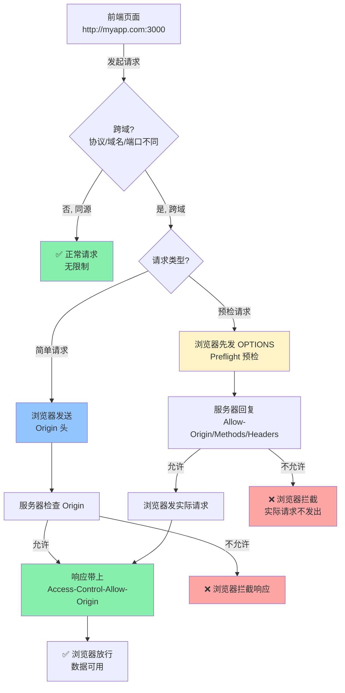
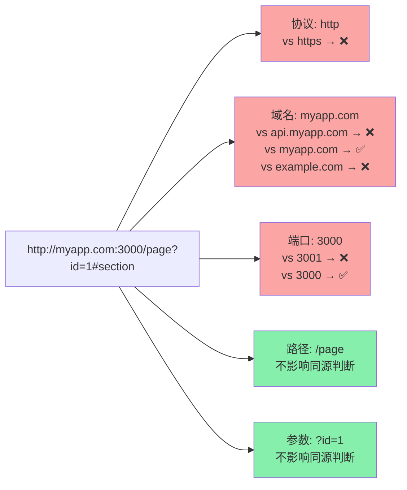
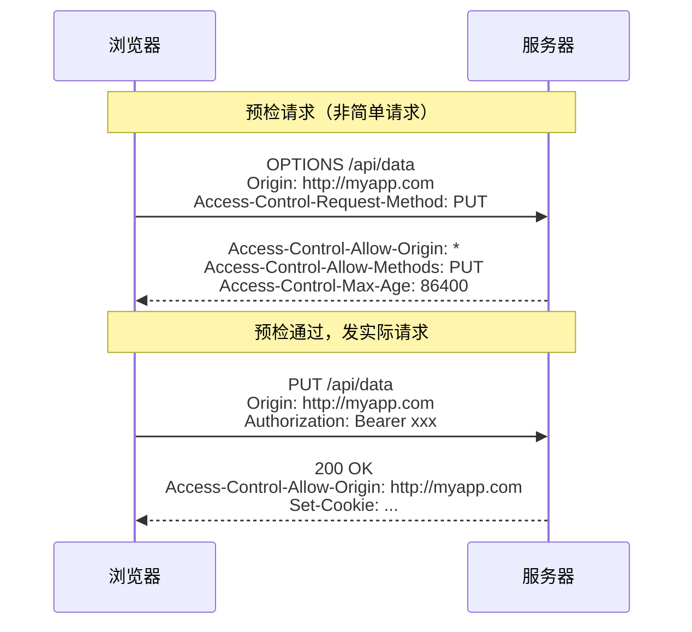
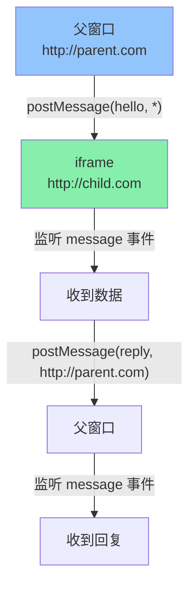
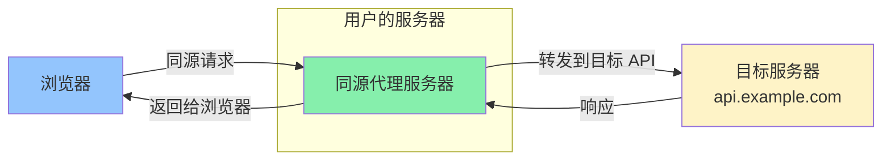

<DifficultyBadge level="intermediate" />

# 跨域全解

## 一句话解释

**同源策略**是浏览器最核心的安全机制——它阻止一个源的网页读取或操作另一个源的资源；**跨域**就是绕过这个限制进行合法的跨源通信，常见方案包括 **CORS（官方标准）、JSONP（古老 Hack）、PostMessage（窗口通信）、代理转发（开发/生产级方案）**。

## 核心流程



## 深入理解

### 1. 同源策略（Same-Origin Policy）

**同源的定义：协议（protocol）、域名（host）、端口（port）三者完全一致。**

```javascript
// 以 http://myapp.com:3000/page 为基准
const sameOrigin = [
  'http://myapp.com:3000/other-page',  // ✅ 同源：路径不同不影响
  'http://myapp.com:3000/api/data',    // ✅ 同源
]

const crossOrigin = [
  'https://myapp.com:3000/api',        // ❌ 协议不同 (http vs https)
  'http://api.myapp.com:3000/data',    // ❌ 域名不同 (子域名)
  'http://myapp.com:8080/api',         // ❌ 端口不同
  'http://example.com:3000/api',       // ❌ 域名不同
  'http://myapp.com:3000'              // ✅ 等等，这个是的
]
```



> **面试高频：** `file://` 协议下没有同源策略——这是为什么用 `file://` 打开的 HTML 无法正常发 AJAX 的原因之一。也解释了为什么开发时需要本地服务器。

---

### 2. CORS（跨域资源共享）— 现代标准方案

CORS 是 W3C 标准，通过在 HTTP 头部中协商来实现跨域控制。分为两类请求：

#### 简单请求（Simple Request）

满足以下**所有条件**的请求就是简单请求：

```
1. 方法: GET / HEAD / POST 之一
2. 请求头: 只包含安全首部字段
   - Accept
   - Accept-Language
   - Content-Language
   - Content-Type: application/x-www-form-urlencoded | multipart/form-data | text/plain
3. 没有 ReadableStream 或事件监听器
```

**交互过程：**

```
浏览器 → 服务器：
  GET /api/data
  Origin: http://myapp.com:3000          ← 浏览器自动加

服务器 → 浏览器：
  Access-Control-Allow-Origin: http://myapp.com:3000   ← 服务器必须返回
  Access-Control-Allow-Credentials: true               ← 如果需要带 cookie
```

#### 预检请求（Preflight Request）

**不满足简单条件**的请求（如 PUT、自定义头、`Content-Type: application/json`）会先发一个 OPTIONS 请求：

```
# 预检请求（浏览器自动发）
浏览器 → 服务器：
  OPTIONS /api/data
  Origin: http://myapp.com:3000
  Access-Control-Request-Method: PUT
  Access-Control-Request-Headers: X-Custom-Header, Authorization

# 预检响应
服务器 → 浏览器：
  Access-Control-Allow-Origin: http://myapp.com:3000
  Access-Control-Allow-Methods: GET, POST, PUT, DELETE
  Access-Control-Allow-Headers: X-Custom-Header, Authorization
  Access-Control-Max-Age: 86400                      ← 预检结果缓存秒数

# 如果允许 → 浏览器发实际请求
```



#### CORS 常见响应头速查

| 响应头 | 作用 | 示例 |
|-------|------|------|
| `Access-Control-Allow-Origin` | 允许的源 | `*` 或 `https://myapp.com` |
| `Access-Control-Allow-Methods` | 允许的方法 | `GET, POST, PUT, DELETE` |
| `Access-Control-Allow-Headers` | 允许的请求头 | `Content-Type, Authorization` |
| `Access-Control-Expose-Headers` | 暴露给 JS 的响应头 | `X-Total-Count, X-RateLimit` |
| `Access-Control-Allow-Credentials` | 是否允许带凭证 | `true` |
| `Access-Control-Max-Age` | 预检缓存时间(秒) | `86400` |

#### 带凭证的跨域请求（Cookie / Authorization）

```javascript
// 前端：需要显式开启 credentials
fetch('https://api.example.com/user', {
  credentials: 'include',  // 发送 cookies
  // 或
  credentials: 'same-origin',  // 仅同源发送
})

// 服务器：必须明确指定 origin（不能用 *）且设置 Allow-Credentials
// Access-Control-Allow-Origin: https://myapp.com    ← 不能是 *
// Access-Control-Allow-Credentials: true
```

---

### 3. JSONP — 古老但仍有用的 Hack

**原理：** `<script>` 标签不受同源策略限制 → 通过动态创建 script 标签请求 → 服务器返回函数调用。

```javascript
// 📦 JSONP 实现
function jsonp(url, params, callbackName) {
  return new Promise((resolve, reject) => {
    // 创建唯一的回调函数名
    const callback = `jsonp_${Date.now()}_${Math.random().toString(36).slice(2)}`
    
    // 注册全局回调
    window[callback] = (data) => {
      resolve(data)
      // 清理
      delete window[callback]
      script.remove()
    }
    
    // 构造 URL
    const query = new URLSearchParams({
      ...params,
      callback  // 告诉服务器回调函数名
    })
    
    // 动态创建 script 标签
    const script = document.createElement('script')
    script.src = `${url}?${query}`
    
    // 错误处理
    script.onerror = (e) => {
      reject(new Error('JSONP request failed'))
      delete window[callback]
      script.remove()
    }
    
    document.head.appendChild(script)
  })
}

// 使用
jsonp('https://api.example.com/user', { id: 1 }, 'callback')
  .then(data => console.log(data))
```

**JSONP 的优缺点：**

| 优点 | 缺点 |
|-----|------|
| ✅ 兼容性极好（IE6+） | ❌ 只支持 GET 请求 |
| ✅ 实现简单 | ❌ 只有成功/失败两种状态，没有超时 |
| ✅ 不需要服务器配置 CORS | ❌ 有安全风险（回调注入） |
| | ❌ 无法获取 HTTP 状态码 |
| | ❌ 服务端需要特殊支持（返回 JS 而非 JSON） |

---

### 4. PostMessage — 跨窗口通信

适用于 **iframe、弹窗、不同域名下的窗口间通信**：



```javascript
// === 发送方（父页面） ===
const iframe = document.getElementById('child-iframe')

// 发送消息到 iframe
iframe.contentWindow.postMessage(
  { type: 'USER_INFO', data: { id: 1, name: 'Alice' } },
  'https://child.com'  // 目标源（* 表示任意，但安全考虑应指定）
)

// === 接收方（iframe 页面） ===
window.addEventListener('message', (event) => {
  // ⚠️ 重要：始终验证 event.origin！
  if (event.origin !== 'https://parent.com') return
  
  console.log('收到数据:', event.data)
  
  // 回复父窗口
  event.source.postMessage(
    { type: 'ACK', received: true },
    event.origin  // 回复给来源
  )
})

// === 父窗口接收回复 ===
window.addEventListener('message', (event) => {
  if (event.origin !== 'https://child.com') return
  console.log('收到子窗口回复:', event.data)
})
```

**安全最佳实践：**

```javascript
// ✅ 始终验证 origin
window.addEventListener('message', (event) => {
  if (event.origin !== 'https://trusted-site.com') return  // 白名单验证
  // 处理数据...
})

// ❌ 不要这样做
window.addEventListener('message', (event) => {
  eval(event.data)       // 危险！可能执行恶意代码
  event.source.postMessage('ok', '*')  // 向任意源发送数据
})
```

---

### 5. 代理转发（最推荐的工程方案）

**原理：** 同源策略只存在于浏览器端 → 服务器之间没有跨域问题 → 通过同源代理转发跨域请求。



#### 开发环境代理（Vite）

```javascript
// vite.config.js
export default defineConfig({
  server: {
    proxy: {
      '/api': {
        target: 'https://api.example.com',
        changeOrigin: true,          // 修改请求 Origin 为目标地址
        rewrite: path => path.replace(/^\/api/, ''),
        // 可选：添加自定义头
        headers: {
          'X-Proxy-By': 'Vite-Dev-Server'
        }
      }
    }
  }
})

// 在代码中直接写 /api 即可（同源请求）
fetch('/api/users')  // → 代理到 https://api.example.com/users
```

#### 开发环境代理（Webpack）

```javascript
// webpack.config.js
module.exports = {
  devServer: {
    proxy: {
      '/api': {
        target: 'https://api.example.com',
        changeOrigin: true,
        pathRewrite: { '^/api': '' }
      }
    }
  }
}
```

#### 生产环境代理（Nginx）

```nginx
# nginx.conf
server {
    listen 80;
    server_name myapp.com;

    # 前端静态文件
    location / {
        root /usr/share/nginx/html;
        try_files $uri $uri/ /index.html;
    }

    # API 代理转发
    location /api/ {
        proxy_pass https://api.example.com/;
        proxy_set_header Host api.example.com;
        proxy_set_header X-Real-IP $remote_addr;
        proxy_set_header X-Forwarded-For $proxy_add_x_forwarded_for;
        proxy_set_header X-Forwarded-Proto $scheme;
    }
}
```

---

### 6. 其他跨域方案

| 方案 | 适用场景 | 限制 |
|-----|---------|------|
| **WebSocket** | 双向实时通信 | 需要服务器支持 WS 协议，协议本身不限同源但建立时有 Origin 检查 |
| **document.domain** | 同一主域的不同子域 | 已废弃，被 `postMessage` 替代 |
| **window.name** | 跨域数据传递 | Hack 方案，最大 2MB，复杂 |
| **location.hash** | iframe 间数据传递 | Hack 方案，URL 长度限制，不推荐 |
| **CORS + withCredentials** | 带 Cookie 的跨域请求 | 需要服务器明确配合 |

```javascript
// WebSocket — 不受同源策略限制
const ws = new WebSocket('wss://api.example.com/socket')
ws.onopen = () => ws.send(JSON.stringify({ type: 'ping' }))
ws.onmessage = (event) => console.log('收到:', event.data)

// document.domain（已废弃，仅供参考）
document.domain = 'example.com'  // 两个子域都设置即可通信
```

---

## 常见 CORS 报错与排查

| 报错信息 | 原因 | 解决 |
|---------|------|------|
| `No 'Access-Control-Allow-Origin' header is present` | 服务器没返回该头 | 服务端配置 CORS |
| `Response to preflight request doesn't pass access control check` | 预检不通过 | 检查 Allow-Methods/Headers |
| `Credentials flag is 'true', but the 'Access-Control-Allow-Origin' is '*'` | 带凭证时 Origin 不能是 `*` | 明确指定 Origin |
| `Request header field X-Custom is not allowed by Access-Control-Allow-Headers` | 自定义头不在允许列表 | 服务端加上该头 |
| `The value of the 'Access-Control-Allow-Origin' header contains multiple values` | 配置了多个 Origin | 改为单个或动态判断 |

## 面试问法

- 🔥 **什么是同源策略？跨域有哪些方案？**
  - 同源 = 协议 + 域名 + 端口一致
  - 方案：CORS（标准）、JSONP（GET 兼容）、PostMessage（窗口）、代理转发（工程常用）、WebSocket

- 🔥 **简单请求和预检请求的区别？**
  - 简单请求：GET/HEAD/POST + 安全头部 → 直接发请求带 Origin
  - 预检请求：非简单请求（PUT/DELETE/自定义头/JSON Content-Type）→ 先 OPTIONS 预检

- 🔥 **CORS 中 Cookie 怎么处理？**
  - 前端：`credentials: 'include'`
  - 服务端：`Access-Control-Allow-Origin` 不能是 `*`，必须设 `Access-Control-Allow-Credentials: true`

- 🔥 **JSONP 的原理和限制？**
  - 利用 `<script>` 不受同源限制
  - 只支持 GET、需要服务端配合返回函数调用、有安全风险

- ⭐ **代理转发的原理？**
  - 浏览器同源请求 → 同源服务器 → 转发到跨域目标
  - 因为服务器之间没有同源限制
  - Vite/Webpack 开发代理、Nginx 生产代理

- ⭐ **PostMessage 的安全注意事项？**
  - 必须验证 `event.origin`（白名单模式）
  - 必须验证 `event.source`（可信来源）
  - 不要去 `eval` 接收到的数据

- 📌 **CORS 和 CSRF 的关系？**
  - CORS 是跨域控制机制，CSRF 是攻击方式
  - CORS 配置不当（如 `Origin: *` + `Credentials: true`）会增大 CSRF 风险
  - CORS 本身不防止 CSRF，CSRF 需额外防护（SameSite Cookie / Token）

## 💡 AI 辅助学习

> 用这个 Prompt 深入理解跨域：
>
> "我是一个前端开发者，正在准备高级面试。请帮我做以下练习：
> 1. 给出一个实际场景：前端在 http://localhost:3000，后端 API 在 https://api.example.com，需要 POST JSON 数据并携带 Cookie
> 2. 画出完整的 CORS 请求-响应流程（包括预检请求）
> 3. 给出前端 fetch 代码和后端 Node.js (Express) CORS 配置代码
> 4. 列出可能出现的 5 个常见错误和对应的排查方法
> 5. 如果不能用 CORS，分别给出开发环境（Vite）和生产环境（Nginx）的代理配置

## 关联知识

- [Web 安全](./browser-security) — XSS/CSRF/CSP 与同源策略的关系
- [浏览器存储](./browser-storage) — Cookie 的 SameSite 属性对跨域的影响
- [浏览器渲染流水线](./browser-rendering) — 请求资源时的跨域限制
- [工程架构 - 性能优化](../engineering/performance-overview) — 资源加载与 CDN 跨域
