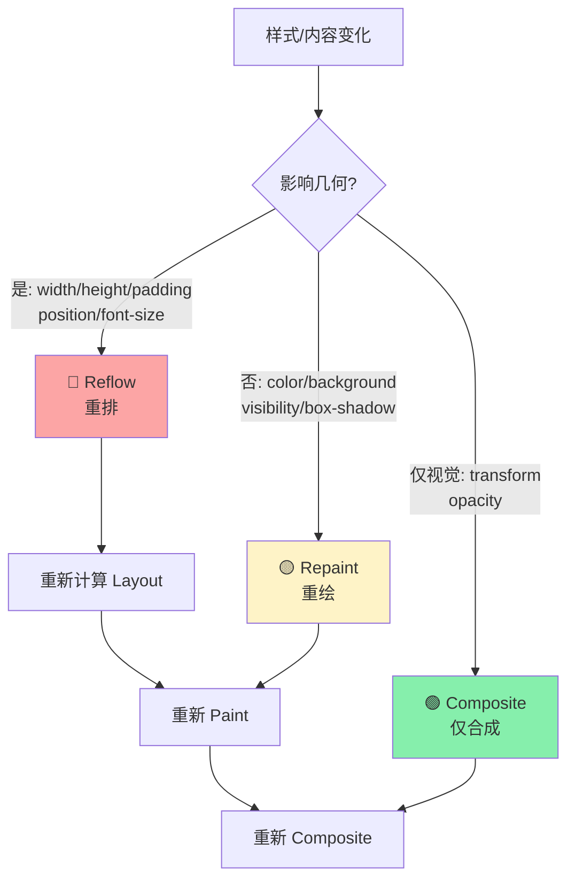
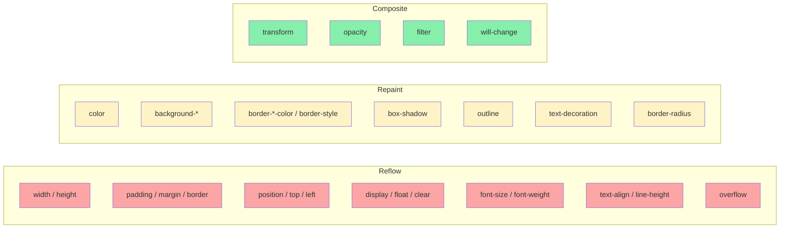
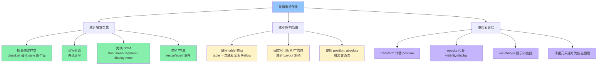

<DifficultyBadge level="intermediate" />

# 重排/重绘优化

## 一句话解释

**重排（Reflow）**是重新计算页面元素几何位置的流水线重走（开销最大），**重绘（Repaint）**是重新绘制元素外观但位置不变（开销中等），**合成（Composite）**只移动/变化已绘制好的图层（开销最小）——优化的本质就是**尽量把操作控制在 Composite 层面**。

## 核心流程



**三者的性能开销对比：**

| 操作 | 触发流水线步骤 | 相对开销 |
|-----|--------------|---------|
| 🟢 Composite Only | 仅 Composite | **1x**（最快） |
| 🟡 Repaint + Composite | Paint → Composite | **~10x** |
| 🔴 Reflow + Repaint + Composite | Layout → Paint → Composite | **~100x+**（最慢） |

## 深入理解

### 1. 哪些属性触发哪个阶段？

一个完整的属性分类表，面试常考：



---

### 2. Reflow 的蝴蝶效应

**一个元素的 Reflow 可能引发连锁反应。** 浏览器会 Reflow 受影响的整个子树，甚至整个文档：

```html
<!DOCTYPE html>
<html>
<body>
  <div id="container">           <!-- ⚡ 这个元素也受影响 -->
    <div id="target"             <!-- ⚡ 改变这个元素的 width -->
      style="width: 50%">
    </div>
    <div id="sibling">           <!-- ⚡ 兄弟元素也受影响（因为父容器宽度变了） -->
    </div>
  </div>
</body>
</html>
```

```javascript
// 影响范围取决于元素类型：
// - body 下的元素 width: 50% → 改变 parent 宽度会级联影响同层所有百分比宽度元素
// - position: absolute → 只影响自身和子元素
// - transform → 完全不影响其他元素（这也是 transform 性能好的原因之一）
```

**Reflow 影响范围对比：**

| 元素类型 | 影响范围 | 原因 |
|---------|---------|------|
| 普通流元素 | 整个子树（子元素 + 后续兄弟） | 父容器尺寸变化 → 级联 |
| `position: absolute/fixed` | 自身 + 子元素 | 脱离普通流，不影响兄弟 |
| `transform` 元素 | **仅自身** | 独立合成层，不影响 Layout |

---

### 3. 强制同步布局（Forced Synchronous Layout）

这是面试最高频考点之一。**当你用 JS 读取"需要计算的布局属性"时，如果前面有未应用的样式变更，浏览器会强制立即执行 Reflow：**

```javascript
// ⚠️ 理解强制同步布局的机制

// 1. 首先设置样式（排队等待批量处理）
element.style.width = '200px'
element.style.height = '100px'
// 此时浏览器还没做 Layout，只是标记为 dirty

// 2. 读取布局属性（触发强制同步布局！）
const height = element.offsetHeight
// ↑ 浏览器被迫立即执行 Layout 来给你准确的 offsetHeight
```

**哪些属性读取会触发强制同步布局：**

| 类别 | 属性 |
|------|------|
| 盒模型尺寸 | `offsetTop` / `offsetLeft` / `offsetWidth` / `offsetHeight` |
| 视口位置 | `scrollTop` / `scrollLeft` / `scrollWidth` / `scrollHeight` |
| 客户端尺寸 | `clientTop` / `clientLeft` / `clientWidth` / `clientHeight` |
| 计算样式 | `getComputedStyle()` |
| 范围信息 | `getBoundingClientRect()` / `getClientRects()` |
| 滚动 | `window.scrollY` / `window.scrollX` / `window.pageYOffset` |

**经典的反面教材与修复：**

```javascript
// ❌ 极度糟糕：每次循环都强制回流
function badResize() {
  for (let i = 0; i < elements.length; i++) {
    const el = elements[i]
    el.style.width = el.offsetWidth + 10 + 'px'  // 读 → 写 → 读 → 写...
  }
  // N 个元素 → N 次 Reflow！
}

// ✅ 批量读，再批量写（读写分离）
function goodResize() {
  const widths = []
  for (let i = 0; i < elements.length; i++) {
    widths.push(elements[i].offsetWidth)  // 1 次 Reflow（批量读取）
  }
  for (let i = 0; i < elements.length; i++) {
    elements[i].style.width = widths[i] + 10 + 'px'  // 1 次 Reflow（批量写入）
  }
  // 不管 N 多大，都只有 2 次 Reflow！
}

// ✅ 更推荐：使用 requestAnimationFrame 分离读写
function animBatchResize() {
  // 读操作：在 rAF 回调之前
  const widths = elements.map(el => el.offsetWidth)
  
  // 写操作：在下一帧执行
  requestAnimationFrame(() => {
    elements.forEach((el, i) => {
      el.style.width = widths[i] + 10 + 'px'
    })
  })
}
```

---

### 4. 性能优化实战策略



#### 策略一：批量修改样式

```javascript
// ❌ 触发 3 次 Reflow（每次 style 修改都可能触发）
element.style.width = '100px'
element.style.height = '100px'
element.style.position = 'absolute'

// ✅ 触发 1 次 Reflow（一次 class 切换，浏览器批量应用）
element.classList.add('box-active')

// ✅ 或使用 cssText 一次赋值
element.style.cssText = 'width: 100px; height: 100px; position: absolute;'
```

#### 策略二：离线 DOM 操作

```javascript
// ❌ 直接操作 DOM 树上的元素 → 每次修改都可能触发 Reflow
const list = document.getElementById('list')
for (let i = 0; i < 1000; i++) {
  const li = document.createElement('li')
  li.textContent = `Item ${i}`
  list.appendChild(li)  // 每次 append 都可能触发 Layout
}

// ✅ 使用 DocumentFragment → 只触发一次 Reflow
const fragment = document.createDocumentFragment()
for (let i = 0; i < 1000; i++) {
  const li = document.createElement('li')
  li.textContent = `Item ${i}`
  fragment.appendChild(li)
}
list.appendChild(fragment)  // 只有这一次触发 Reflow

// ✅ 或者先 display:none 隐藏，修改后再显示
function batchUpdate(element) {
  element.style.display = 'none'   // 触发一次 Reflow（从树上移除）
  
  // 此时修改元素的样式/内容 → 不触发 Reflow（不在 Render Tree 中）
  element.innerHTML = '...'        // 不触发
  element.style.width = '500px'    // 不触发
  element.style.height = '300px'   // 不触发
  
  element.style.display = 'block'  // 触发一次 Reflow（加回树上）
  // 总共 2 次 Reflow，远比每步一次好
}
```

#### 策略三：transform / opacity 代替传统属性

```javascript
// ❌ 触发 Reflow（修改位置属性）
element.style.top = '100px'
element.style.left = '100px'

// ✅ 只触发 Composite（使用 transform）
element.style.transform = 'translate(100px, 100px)'

// ❌ 触发 Repaint（修改颜色用 display 控制显隐）
element.style.display = 'none'

// ✅ 只触发 Composite（使用 opacity 控制显隐）
element.style.opacity = '0'  // 元素还在 Render Tree 中，但透明
```

#### 策略四：will-change 提示

```css
/* 提前告诉浏览器这个元素要变化 → 浏览器提前创建合成层 */
.animated-element {
  will-change: transform, opacity;
  /* 但不要滥用！每个 will-change 都会创建独立图层 */
}
```

```javascript
// 合理的 will-change 使用：在动画开始前添加，结束后移除
const el = document.getElementById('anim-target')

// 动画即将开始时
el.style.willChange = 'transform'

// 动画完成后移除（节省 GPU 内存）
el.addEventListener('transitionend', () => {
  el.style.willChange = 'auto'
})
```

---

### 5. 实测：不同属性动画的性能差异

```html
<!-- 对比测试：position vs transform 移动 -->
<div class="box box-position"></div>
<div class="box box-transform"></div>

<style>
.box {
  width: 100px;
  height: 100px;
  position: absolute;
}
.box-position { left: 0; /* 动画改变 left */ }
.box-transform { /* 动画改变 transform */ }

/* position 动画 → 每一帧都会触发 Reflow + Paint + Composite */
@keyframes move-position {
  from { left: 0; }
  to { left: 500px; }
}

/* transform 动画 → 每一帧只触发 Composite */
@keyframes move-transform {
  from { transform: translateX(0); }
  to { transform: translateX(500px); }
}
</style>
```

**Chrome DevTools Performance 面板的关键信号：**

| 信号 | 含义 | 应对 |
|-----|------|------|
| 🔴 紫色 Layout event | 发生了 Reflow | 检查是否触发了几何属性 |
| 🟢 绿色 Paint event | 发生了 Repaint | 是否可以用 composite-only 属性代替 |
| 🟡 黄色 Composite event | 正常合成 | 良好，检查图层数量是否过多 |
| ⚠️ 帧率 < 60fps | 主线程超载 | 批量读写、用 transform、减少图层 |

---

## 面试问法

- 🔥 **Reflow 和 Repaint 的区别？性能开销对比？**
  - Reflow = 重新计算几何（Layout + Paint + Composite），开销最大
  - Repaint = 只重新绘制（Paint + Composite），开销中等
  - Composite Only = 仅合成，开销最小
  - 遵循：transform → opacity → 颜色 → 几何属性的开销顺序

- 🔥 **什么操作会触发强制同步布局？怎么避免？**
  - 在样式变更未提交时读取布局属性（offsetHeight / getBoundingClientRect 等）
  - 避免方案：读写分离（先批量读再批量写）、requestAnimationFrame 分帧

- 🔥 **如何减少 Reflow 次数？**
  - 批量修改 class 而非逐个 style
  - DocumentFragment / display:none 离线操作
  - 避免 table 布局
  - 读写分离
  - resize/scroll 事件防抖

- ⭐ **transform 为什么比 left 性能好？**
  - `left` 是几何属性 → 触发 Reflow → 影响其他元素
  - `transform` 在合成层处理 → 不触发 Layout → 不影响其他元素 → GPU 加速
  - 每一帧只走 Composite，不走 Layout 和 Paint

- ⭐ **will-change 的作用和注意事项？**
  - 提前告知浏览器哪些属性会变化，让浏览器提前优化
  - 创建独立合成层 → 增加 GPU 内存消耗
  - **不要滥用**：只在动画即将开始时设置，结束后移除
  - 不要对太多元素使用（移动端尤其注意）

- 📌 **display:none 和 visibility:hidden 在渲染上的区别？**
  - `display:none` → 从 Render Tree 移除 → 不占空间 → 触发 Reflow
  - `visibility:hidden` → 在 Render Tree 中 → 占位不可见 → 触发 Repaint
  - `opacity:0` → 在 Render Tree 中 → 占位透明 → Composite only（如果独立图层）

## 💡 AI 辅助学习

> 用这个 Prompt 深入理解重排重绘：
>
> "我是一个前端开发者，正在准备面试。请帮我做以下事情：
> 1. 给出 5 个常见的性能不好的代码片段（涉及 DOM 操作、动画、样式修改）
> 2. 逐一分析每段代码触发了多少次 Reflow / Repaint / Composite
> 3. 重构每段代码为性能最优版本
> 4. 用 Chrome Performance 面板的角度解释为什么重构版本更好
> 5. 最终总结一份"Reflow/Repaint 避免清单"

## 关联知识

- [浏览器渲染流水线](./browser-rendering) — 渲染完整流程
- [CSS 布局完全指南](./css-layout) — 不同布局方式对 Reflow 的影响
- [CSS 响应式与动画](./css-responsive) — Composite-only 动画
- [性能优化全景](../engineering/performance-overview) — 综合性能优化
- [渲染优化](../engineering/rendering-optimization) — 更深入的渲染策略
