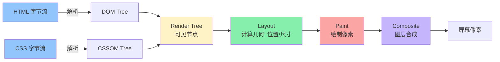
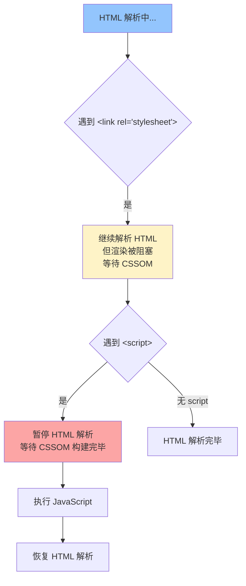
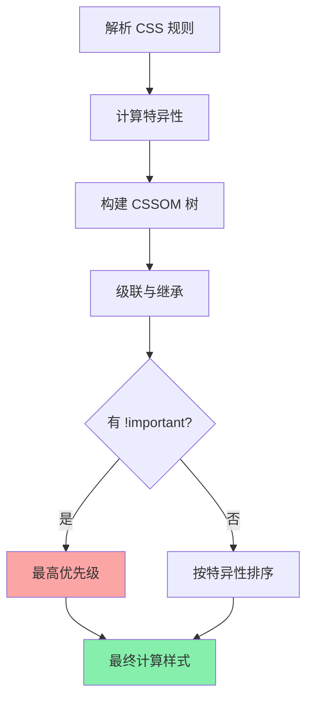
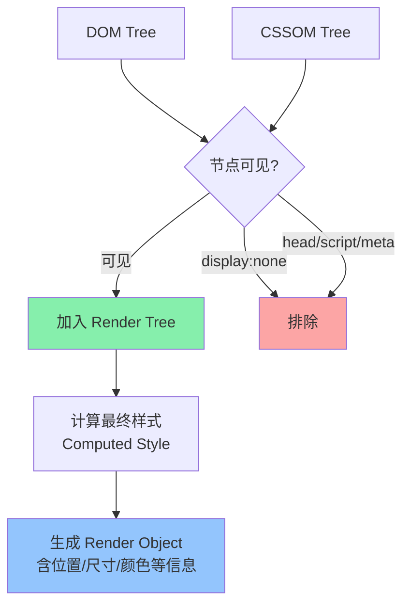
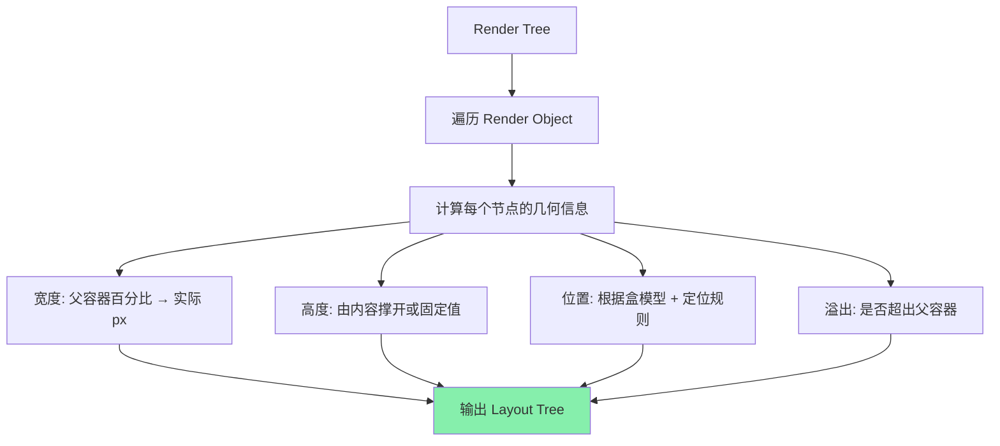
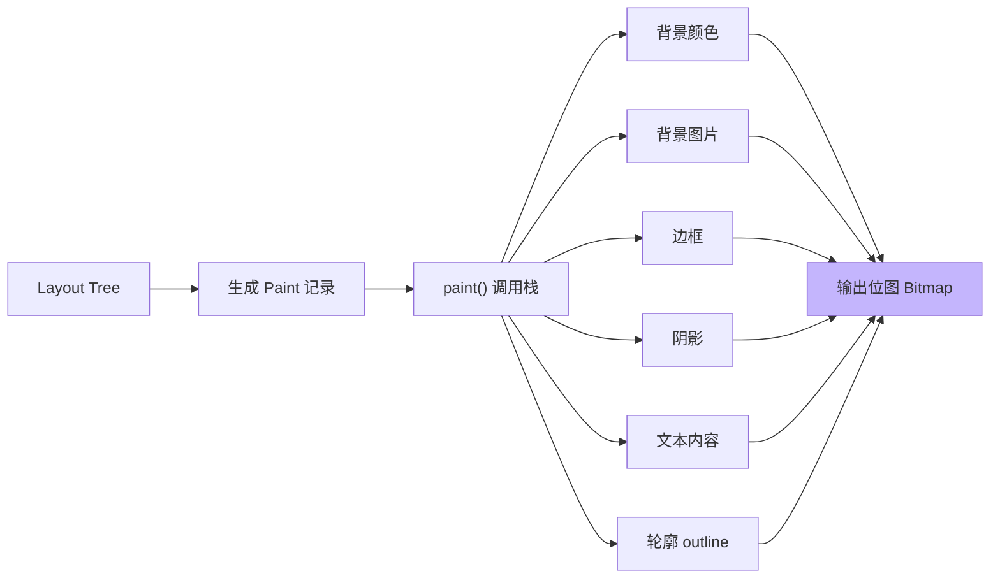
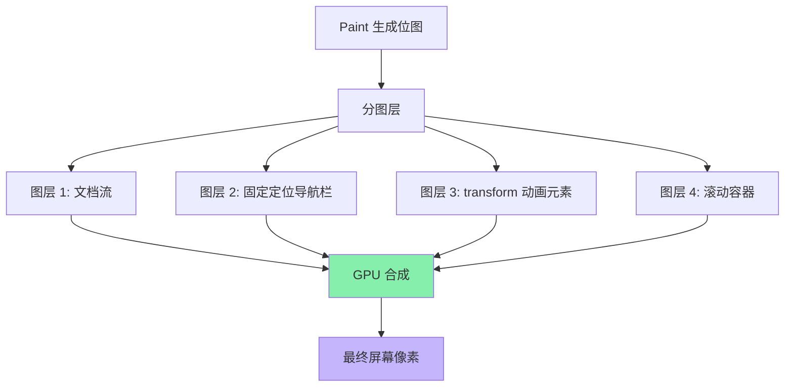
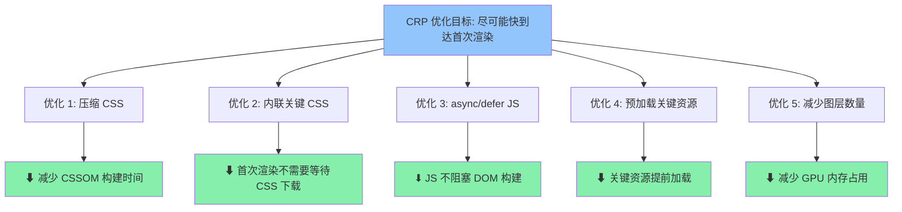

<DifficultyBadge level="intermediate" />

# 浏览器渲染流水线

## 一句话解释

从 URL 输入到页面像素显示，浏览器经历**解析 HTML → 构建 DOM 树 → 解析 CSS → 构建 CSSOM 树 → 合并为 Render Tree → Layout 计算几何 → Paint 绘制 → Composite 合成图层**八个步骤——其中任何一步阻塞都会延迟"首次渲染"的时间。

## 核心流程



**从请求到像素的总耗时 ≈ 网络 + 解析 + 样式计算 + Layout + Paint + Composite。**

## 深入理解

### 1. 关键渲染路径（Critical Rendering Path）

浏览器从 HTML 到像素显示所经过的**最小必要步骤**，称为关键渲染路径（CRP）：

```
DOM ──┐
      ├── Render Tree ──→ Layout ──→ Paint ──→ Composite
CSSOM ┘
```

**不同渲染方式的路径长度：**

| 渲染方式 | 触发路径 | 开销 |
|---------|---------|------|
| 🟢 **Composite Only** | `transform` / `opacity` 变化 | 最小 — 仅合成 |
| 🟡 **Paint + Composite** | `color` / `background` / `box-shadow` 变化 | 中等 — 重绘 + 合成 |
| 🔴 **Layout + Paint + Composite** | `width` / `height` / `position` / `padding` 变化 | 最大 — 完整流水线 |

> **面试高频：** 触发 Layout 的属性开销最大（如 `width`、`height`、`padding`），触发 Composite 的属性开销最小（如 `transform`、`opacity`）。优化关键渲染路径的核心就是**尽量只触发 Composite**。

---

### 2. DOM 树的构建

浏览器接收 HTML 字节流后，经过一系列转换：

```
字节(Byte) → 字符(Char) → 令牌(Token) → 节点(Node) → DOM 树
```

```javascript
// 浏览器解析 HTML 的大致过程（简化）
const html = `<html>
  <body>
    <div>Hello</div>
  </body>
</html>`

// 1. 词法分析 → 生成 Token 流
// ['<html>', '<body>', '<div>', 'Hello', '</div>', '</body>', '</html>']

// 2. 构建 DOM 树
// document
//  └── <html>
//       └── <body>
//            └── <div>
//                 └── "Hello"
```

**阻塞特性：**

| 资源类型 | 是否阻塞 DOM 构建 | 是否阻塞渲染 |
|---------|-----------------|------------|
| CSS（外部） | ❌ 不阻塞 DOM | ✅ 阻塞渲染（CSSOM 未就绪） |
| JS（无 async/defer） | ✅ 阻塞 DOM 构建 | ✅ 阻塞渲染 |
| JS（async） | ❌ 不阻塞 | 下载完即执行，可能阻塞 |
| JS（defer） | ❌ 不阻塞 | ❌ DOM 构建完才执行 |
| 图片/字体 | ❌ 不阻塞 | ❌ 但影响 Load 事件 |



---

### 3. CSSOM 树的构建

CSS 解析是**自下而上**的——**子选择器从右向左匹配**（因为子元素数量远大于父元素，从右向左可以更快地筛掉不匹配的节点）：

```css
/* 浏览器匹配这个选择器的过程 */
div .content p.highlight {
  color: red;
}

/* 实际匹配顺序（从右向左）：
   1. 找到所有 class="highlight" 的 <p>
   2. 检查上级是否有 class="content"
   3. 再检查上上级是否有 <div>
*/
```

**样式计算的优先级权重：**

| 选择器 | 权重 | 示例 |
|-------|------|------|
| `!important` | ∞ | `color: red !important` |
| 行内样式 | 1,0,0,0 | `style="color: red"` |
| ID | 0,1,0,0 | `#header` |
| 类/伪类/属性 | 0,0,1,0 | `.active` / `:hover` / `[type]` |
| 元素/伪元素 | 0,0,0,1 | `div` / `::before` |



---

### 4. Render Tree 构建

**Render Tree ≠ DOM Tree + CSSOM Tree 的简单合并。** Render Tree 只包含**可见节点**：

```javascript
// Render Tree 会排除的内容
const excluded = [
  display: 'none'     // ✅ 排除（整个元素不可见）
  head, script, link  // ✅ 排除（不可见元素）
  ::before / ::after  // ✅ 包含（生成内容虽然不可见但渲染）
  
  // ❗ 注意：
  visibility: 'hidden' // 仍然在 Render Tree 中（占据空间，只是透明）
  opacity: 0           // 仍然在 Render Tree 中（占据空间）
]
```



**关键差异：**

```html
<div style="display: none">不可见</div>        <!-- ❌ Render Tree 中不存在 -->
<div style="visibility: hidden">不可见但占位</div> <!-- ✅ Render Tree 中存在 -->
<div style="opacity: 0">透明但占位</div>          <!-- ✅ Render Tree 中存在 -->
<div>文本</div>                                   <!-- ✅ Render Tree 中存在 -->
```

---

### 5. Layout（回流/Reflow）

Layout 阶段计算每个 Render Object 的**确切位置和尺寸**（单位：像素）。这是整个渲染流水线中**计算量最大的一步**。



**Layout 的核心计算逻辑（以块级元素为例）：**

```javascript
// 简化：块级元素的宽度计算
function calculateBlockWidth(element, containingBlockWidth) {
  // width 优先，然后考虑 margin/border/padding
  const computedStyle = getComputedStyle(element)
  const width = computedStyle.width         // 可能是百分比或 auto
  const marginLeft = computedStyle.marginLeft
  const marginRight = computedStyle.marginRight
  const borderLeft = computedStyle.borderLeftWidth
  const borderRight = computedStyle.borderRightWidth
  const paddingLeft = computedStyle.paddingLeft
  const paddingRight = computedStyle.paddingRight
  
  // 公式: margin + border + padding + content = containingBlockWidth
  // 如果 width: auto，content 会自适应填充剩余空间
}
```

**哪些情况触发 Layout（回流）：**

| 操作 | 示例 |
|------|------|
| 修改几何属性 | `width`、`height`、`padding`、`margin`、`border` |
| 修改定位 | `position`、`top`、`left`、`float` |
| 修改内容 | 文本变化、图片加载完成、输入框输入 |
| 字体变化 | `font-size`、`font-weight`、`font-family` |
| 窗口缩放 | `resize` 事件 |
| 读取布局属性 | `offsetHeight`、`getBoundingClientRect()`、`scrollTop`（**强制同步布局**） |

> **🔥 面试高频考点："强制同步布局"（Forced Synchronous Layout）**——当你用 JS 读取布局属性（如 `el.offsetHeight`）时，如果前面有未生效的样式修改，浏览器会**强制立即执行 Layout**，造成性能问题。

```javascript
// ❌ 坏写法：每次循环都强制回流
for (let i = 0; i < items.length; i++) {
  items[i].style.height = items[i].offsetHeight + 10 + 'px'
  // 每次读取 offsetHeight 都会强制 Layout
}

// ✅ 好写法：先批量读取，再批量写入
const heights = []
for (let i = 0; i < items.length; i++) {
  heights.push(items[i].offsetHeight)  // 一次 Layout
}
for (let i = 0; i < items.length; i++) {
  items[i].style.height = heights[i] + 10 + 'px'  // 一次 Layout
}
```

---

### 6. Paint（绘制）

Paint 阶段将 Layout 计算好的节点**绘制成像素**——填充颜色、绘制边框、渲染文字、绘制图片等。



**Paint 的顺序（类似 CSS `z-index` 的绘制顺序，但更底层）：**

```
1. 背景颜色（background-color）
2. 背景图片（background-image）
3. 边框（border）
4. 子元素（按树顺序）
5. 轮廓（outline）
```

---

### 7. Composite（合成）

现代浏览器使用 **GPU 加速合成**——将页面拆分为多个**图层（Layer）**，每个图层单独绘制，然后由 GPU 合成最终画面。



**哪些属性会创建新图层（提升合成层）：**

```css
/* 自动创建独立图层的常见属性 */
will-change: transform;      /* ✅ 明确告知浏览器 */
transform: translateZ(0);    /* ✅ 3D 变换强制 GPU 加速 */
opacity;                     /* ✅ 动画时提升为合成层 */
position: fixed;             /* ✅ 固定定位 */
video 元素;                   /* ✅ 视频单独一层 */
canvas 元素;                  /* ✅ Canvas 单独一层 */
backface-visibility: hidden; /* ✅ 3D backface 隐藏 */
```

```javascript
// 浏览器图层决策简化逻辑
function shouldCreateLayer(element) {
  if (element.has3DTransform()) return true
  if (element.style.willChange) return true
  if (element.hasPositionFixed()) return true
  if (element.tagName === 'VIDEO' || element.tagName === 'CANVAS') return true
  if (element.hasOpacityAnimation()) return true
  if (element.hasScrollableOverflow()) return true
  return false
}
```

> **但是图层不是越多越好！** 每个图层占用 GPU 内存，过多图层反而会导致性能下降（尤其在移动端）。在 DevTools → Layers 面板可以查看图层的数量和内存占用。

---

### 8. 渲染阻塞与优化策略



**关键性能指标与对应优化：**

| 指标 | 含义 | 主要优化方向 |
|-----|------|------------|
| **FP** (First Paint) | 首次绘制任何像素 | 内联关键 CSS，移除阻塞 JS |
| **FCP** (First Contentful Paint) | 首次绘制文本/图片/Canvas | 优化最大内容的样式计算 |
| **LCP** (Largest Contentful Paint) | 最大内容绘制完成 | 图片预加载、减少 Layout Shift |
| **CLS** (Cumulative Layout Shift) | 累计布局偏移 | 显式设置图片/广告位尺寸，避免动态插入 |
| **TBT** (Total Blocking Time) | 总阻塞时间 | 长任务拆分、setTimeout 或 requestIdleCallback |

---

## 面试问法

- 🔥 **从输入 URL 到页面显示，浏览器做了什么？**
  - DNS 查询 → TCP 连接 → TLS 握手（HTTPS）→ HTTP 请求 → 解析 HTML → 构建 DOM → 解析 CSS → 构建 CSSOM → Render Tree → Layout → Paint → Composite

- 🔥 **Render Tree 和 DOM Tree 有什么区别？**
  - Render Tree 只包含可见节点（排除 `display:none`、`head`/`script` 等）
  - Render Tree 每个节点都有计算后的样式
  - `visibility:hidden` 在 Render Tree 中，`display:none` 不在

- 🔥 **什么是强制同步布局（Forced Synchronous Layout）？怎么避免？**
  - 读取布局属性时如果前面有未生效的样式修改，浏览器会强制立即执行 Layout
  - 避免：使用 `requestAnimationFrame`、批量读写分离（先读后写）、使用 `transform` 代替位置属性

- 🔥 **合成层（Composite Layer）是什么？哪些属性触发？**
  - 将页面拆分成独立图层，由 GPU 合成
  - `transform`、`opacity`、`will-change`、`position:fixed`、`video`/`canvas`
  - 注意：图层过多会消耗 GPU 内存

- ⭐ **CSS 选择器的匹配方向？为什么？**
  - 从右向左匹配
  - 因为子元素数量远多于父元素，从右向左可以更快过滤

- ⭐ **CSSOM 为什么阻塞渲染但不阻塞 DOM 解析？**
  - DOM 解析可以继续（JS 除外），但渲染需要完整的 CSSOM
  - 目的是避免"闪屏"（FOUC — Flash of Unstyled Content）

- ⭐ **Layout、Paint、Composite 各自的开销？**
  - Layout：计算几何，开销最大
  - Paint：绘制像素，开销中等（尤其是大面积绘制）
  - Composite：GPU 合成，开销最小

- 📌 **浏览器如何优化重复 Layout？**
  - 脏位标记（Dirty Bit）——只重新布局真正变化的子树
  - 异步布局队列——合并批量修改
  - 使用 `transform` 动画不会触发 Layout

## 💡 AI 辅助学习

> 用这个 Prompt 深入理解渲染流水线：
>
> "我是一名前端开发者，正在准备高级面试。请帮我通过一个具体的 HTML+CSS 页面例子，完整模拟浏览器的渲染过程：
> 1. 给出一个包含 div、p、img、span（分别有不同样式）的 HTML 页面
> 2. 逐步走完 DOM 构建 → CSSOM 构建 → Render Tree → Layout → Paint → Composite
> 3. 标注每个步骤中哪些是阻塞的，哪些可以优化
> 4. 指出至少 2 个可以优化的点，并展示优化后的代码
> 5. 如果一个元素用了 `transform: translateX(100px)`，渲染路径会减少哪几步？"

## 关联知识

- [重排/重绘优化](./browser-reflow) — Layout/Paint 的触发条件和优化策略
- [CSS 布局完全指南](./css-layout) — Layout 阶段的输入：盒模型与定位
- [CSS 响应式与动画](./css-responsive) — Composite-only 动画优化
- [浏览器存储](./browser-storage) — 缓存策略对加载速度的影响
- [性能优化全景](../engineering/performance-overview) — 综合性能优化
