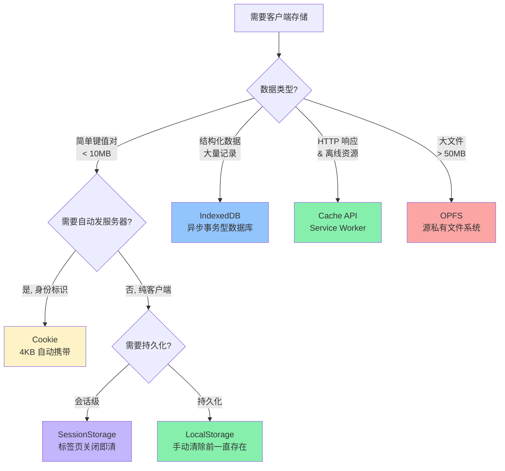
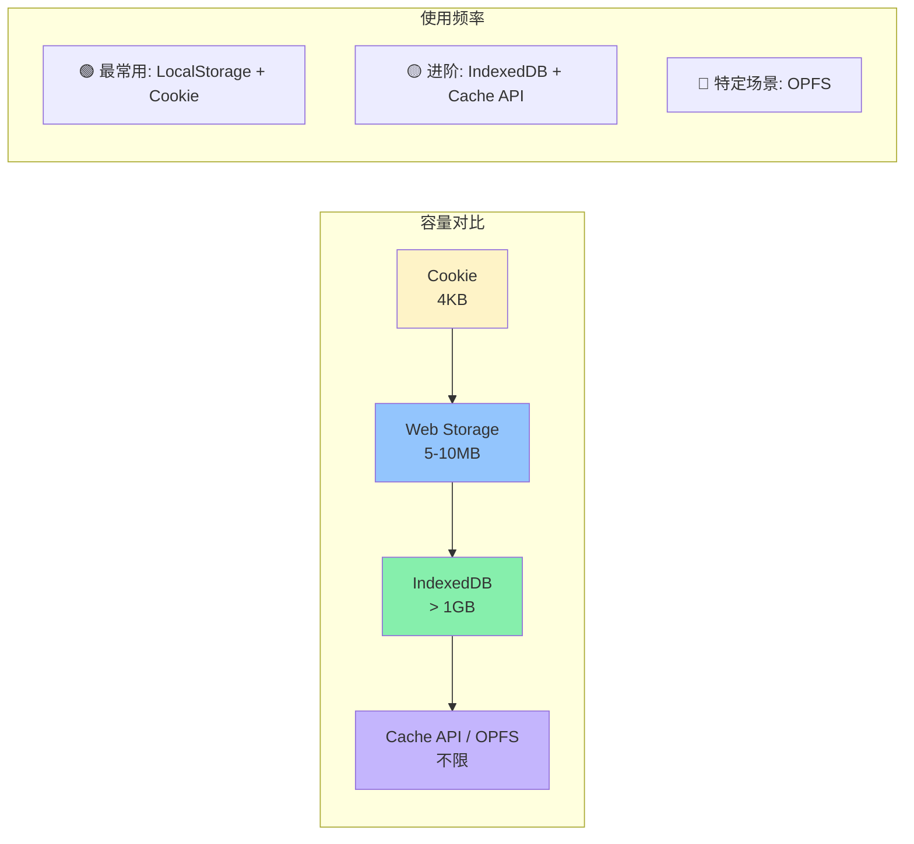
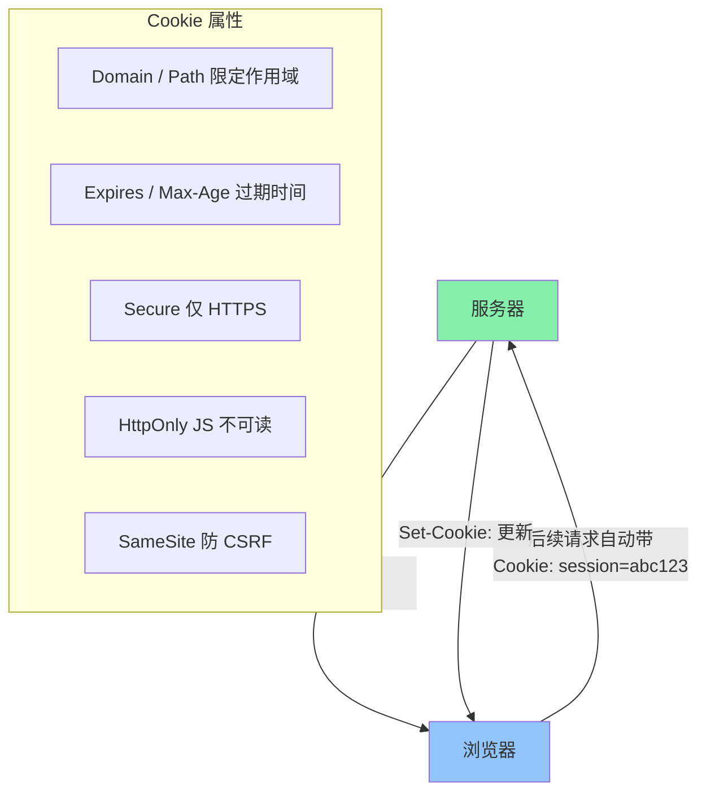
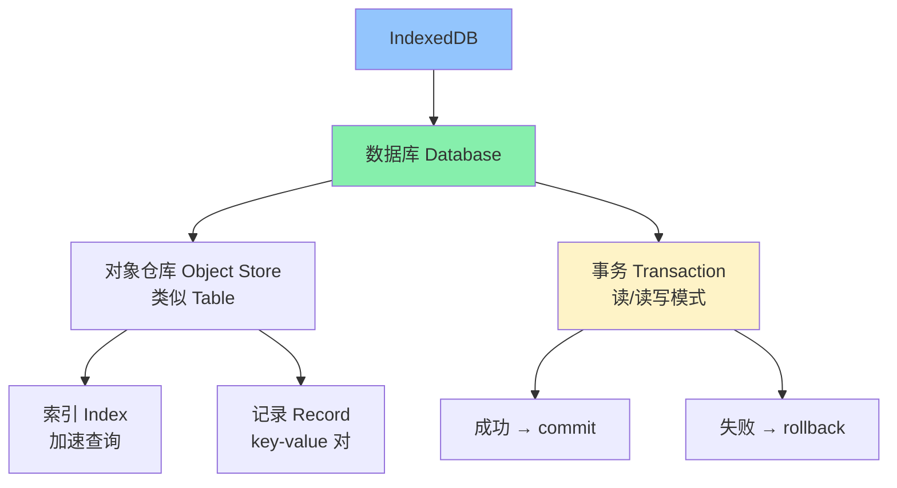
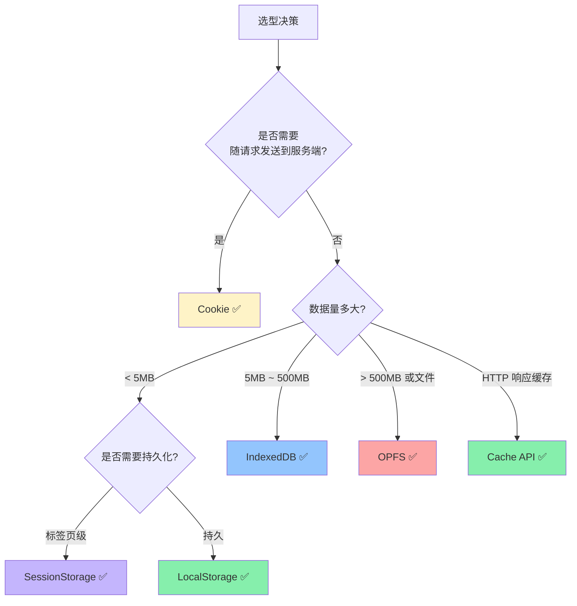

<DifficultyBadge level="intermediate" />

# 浏览器存储

## 一句话解释

浏览器提供五类客户端存储方案：**Cookie**（4KB，自动携带，适合身份标识）、**Web Storage**（5-10MB，同步 API，适合简单键值对）、**IndexedDB**（不限大小，异步 API，适合结构化大数据）、**Cache API**（HTTP 请求缓存，适合离线资源）、**OPFS**（新兴文件系统，适合 WASM/大文件）——选型的核心是**数据量 + 同步/异步 + 是否需服务端交互**。

## 核心流程



## 深入理解

### 1. 五大存储方案总览

| 特性 | Cookie | LocalStorage | SessionStorage | IndexedDB | Cache API |
|------|--------|-------------|---------------|-----------|-----------|
| **容量** | ~4KB | 5-10MB | 5-10MB | 不限（通常 > 1GB） | 不限 |
| **存储类型** | 字符串 | 字符串 | 字符串 | 结构化（任何 JS 类型） | HTTP Request/Response |
| **API 类型** | 同步 | 同步 | 同步 | **异步**（Promise） | **异步**（Promise） |
| **是否自动发请求** | ✅ 每次请求自动带 | ❌ | ❌ | ❌ | ❌（Service Worker 中可用） |
| **作用域** | 指定路径/域名 | 协议+域名+端口 | 协议+域名+端口+标签页 | 协议+域名+端口 | 协议+域名+端口 |
| **持久性** | 可设过期时间 | 手动删除 | **标签页关闭即清** | 手动删除 | 手动删除 |
| **主线程阻塞** | 同步读写 | 同步读写 | 同步读写 | ✅ 异步不阻塞 | ✅ 异步不阻塞 |



---

### 2. Cookie — 4KB 的身份令牌

Cookie 最初设计用于**服务端识别客户端**，每次 HTTP 请求**自动携带**符合路径/域名的 Cookie。



#### Cookie 安全属性详解

```javascript
// 服务端设置 Cookie 时的推荐配置
Set-Cookie: session=eyJhbGciOiJIUzI1NiJ9...; 
           Domain=.example.com;    // 作用于 example.com 及其子域
           Path=/;                  // 全路径生效
           Expires=Wed, 21 Oct 2025 07:28:00 GMT; // 过期时间
           HttpOnly;                // JS 不能读取，防 XSS
           Secure;                  // 仅 HTTPS 传输
           SameSite=Lax;            // 防 CSRF，Lax 是安全默认值
           Priority=High;           // 高优先级 Cookie

// 前端不能读取 HttpOnly Cookie，但可以设置非 HttpOnly 的 Cookie
document.cookie = 'theme=dark; path=/; max-age=86400'
document.cookie = 'locale=zh-CN; path=/; max-age=2592000'

// 读取所有非 HttpOnly Cookie
console.log(document.cookie)  // "theme=dark; locale=zh-CN"
```

> **🔥 面试高频：** Cookie 的 HttpOnly 属性防 XSS——如果 Cookie 设置了 HttpOnly，即使页面有 XSS 漏洞，攻击者的 `document.cookie` 也拿不到这个 Cookie。

#### Cookie 的 SameSite 演进

| 年份 | Chrome 版本 | 变化 |
|------|------------|------|
| 2016 | Chrome 51 | 引入 SameSite 属性 |
| 2020 | Chrome 80 | **SameSite=Lax 成为默认值** |
| 2025+ | 所有现代浏览器 | SameSite 已是标准，`None` 需配合 Secure |

---

### 3. Web Storage — 5MB 的简单键值存储

```javascript
// === LocalStorage（持久化，跨标签页共享） ===

// 存取
localStorage.setItem('theme', 'dark')
localStorage.setItem('user', JSON.stringify({ id: 1, name: 'Alice' }))
const theme = localStorage.getItem('theme')            // 'dark'
const user = JSON.parse(localStorage.getItem('user'))  // { id: 1, name: 'Alice' }

// 删除
localStorage.removeItem('theme')
localStorage.clear()  // 清空所有

// 遍历
for (let i = 0; i < localStorage.length; i++) {
  const key = localStorage.key(i)
  console.log(key, localStorage.getItem(key))
}

// === SessionStorage（会话级，标签页隔离） ===
sessionStorage.setItem('temp', 'value')  // 关闭标签页即消失
```

**Web Storage 的限制与注意事项：**

```javascript
// ⚠️ 限制 1：只能存字符串
localStorage.setItem('count', 0)
console.log(typeof localStorage.getItem('count'))  // 'string'，不是 number!
// 所以存对象必须 JSON.stringify / JSON.parse

// ⚠️ 限制 2：同步阻塞
// 大数据的 JSON.stringify 会阻塞主线程
// 超过 5-10MB 会抛出 QuotaExceededError
try {
  localStorage.setItem('big-data', hugeString)
} catch (e) {
  if (e.name === 'QuotaExceededError') {
    console.error('存储空间已满')
  }
}

// ✅ 限制 3：Storage 事件——同源其他标签页监听变化
window.addEventListener('storage', (event) => {
  console.log(`${event.key} 从 ${event.oldValue} 变为 ${event.newValue}`)
  console.log('来源:', event.url)
})
// 注意：只有其他标签页修改才会触发，当前页面不触发
```

---

### 4. IndexedDB — 浏览器端的 NoSQL 数据库

**何时使用：** 需要存储大量结构化数据、需要索引和搜索、需要事务支持。



```javascript
// IndexedDB 使用示例

// 1. 打开数据库
function openDB() {
  return new Promise((resolve, reject) => {
    const request = indexedDB.open('MyAppDB', 1)  // 数据库名 + 版本号
    
    request.onupgradeneeded = (event) => {
      // 数据库版本升级时触发（首次创建也会）
      const db = event.target.result
      
      // 创建对象仓库（类似创建表）
      if (!db.objectStoreNames.contains('users')) {
        const store = db.createObjectStore('users', {
          keyPath: 'id',           // 主键字段
          autoIncrement: false     // 是否自增
        })
        
        // 创建索引（加速查询）
        store.createIndex('email', 'email', { unique: true })
        store.createIndex('name', 'name', { unique: false })
        store.createIndex('age', 'age', { unique: false })
      }
    }
    
    request.onsuccess = (event) => resolve(event.target.result)
    request.onerror = (event) => reject(event.target.error)
  })
}

// 2. CRUD 操作
async function dbOperations() {
  const db = await openDB()

  // ----- 增 -----
  async function addUser(user) {
    const tx = db.transaction('users', 'readwrite')  // 开启事务
    const store = tx.objectStore('users')
    store.add(user)  // 添加（主键冲突会失败）
    // 或 store.put(user)  // 添加或更新
    
    return new Promise((resolve, reject) => {
      tx.oncomplete = () => resolve()
      tx.onerror = (e) => reject(e.target.error)
    })
  }
  
  await addUser({ id: 1, name: 'Alice', email: 'alice@example.com', age: 28 })

  // ----- 查 -----
  async function getUser(id) {
    const tx = db.transaction('users', 'readonly')
    const store = tx.objectStore('users')
    const request = store.get(id)  // 按主键查询
    
    return new Promise((resolve, reject) => {
      request.onsuccess = () => resolve(request.result)
      request.onerror = (e) => reject(e.target.error)
    })
  }
  
  async function getUsersByAge(minAge) {
    const tx = db.transaction('users', 'readonly')
    const store = tx.objectStore('users')
    const index = store.index('age')  // 使用 age 索引
    const request = index.getAll(IDBKeyRange.lowerBound(minAge))
    
    return new Promise((resolve, reject) => {
      request.onsuccess = () => resolve(request.result)
      request.onerror = (e) => reject(e.target.error)
    })
  }

  // ----- 改 -----
  async function updateUser(user) {
    const tx = db.transaction('users', 'readwrite')
    const store = tx.objectStore('users')
    store.put(user)  // put = upsert
    
    return new Promise((resolve, reject) => {
      tx.oncomplete = () => resolve()
      tx.onerror = (e) => reject(e.target.error)
    })
  }

  // ----- 删 -----
  async function deleteUser(id) {
    const tx = db.transaction('users', 'readwrite')
    const store = tx.objectStore('users')
    store.delete(id)
    
    return new Promise((resolve, reject) => {
      tx.oncomplete = () => resolve()
      tx.onerror = (e) => reject(e.target.error)
    })
  }
}
```

#### 使用 IndexedDB 的封装库（推荐）

```javascript
// 直接用原生 IndexedDB 太繁琐，生产环境建议用封装库

// idb — 轻量级 IndexedDB 封装（仅 1.5KB）
import { openDB } from 'idb'

const db = await openDB('MyAppDB', 1, {
  upgrade(db) {
    const store = db.createObjectStore('users', { keyPath: 'id' })
    store.createIndex('email', 'email', { unique: true })
  }
})

// CRUD 变得非常简洁
await db.add('users', { id: 1, name: 'Alice' })
const user = await db.get('users', 1)
await db.put('users', { id: 1, name: 'Alice Updated' })
await db.delete('users', 1)
const users = await db.getAllFromIndex('users', 'email')  // 索引查询

// Dexie.js — 更完整的 IndexedDB 封装（类似 MongoDB 语法）
import Dexie from 'dexie'

const db = new Dexie('MyAppDB')
db.version(1).stores({
  users: '++id, name, email, age',  // ++id = 自增主键
  posts: '++id, userId, title'
})

await db.users.add({ name: 'Alice', email: 'alice@example.com' })
const users = await db.users.where('age').above(18).toArray()
```

---

### 5. Cache API — Service Worker 的离线方案

配合 Service Worker 使用，提供对 HTTP 请求/响应的缓存控制：

```javascript
// 在 Service Worker 中
self.addEventListener('fetch', (event) => {
  event.respondWith(
    caches.match(event.request).then((cached) => {
      // 缓存优先，网络回退
      return cached || fetch(event.request).then((response) => {
        // 将新请求缓存
        return caches.open('api-v1').then((cache) => {
          cache.put(event.request, response.clone())
          return response
        })
      })
    })
  )
})

// 在主线程中操作 Cache API
async function cacheResources() {
  const cache = await caches.open('static-v1')
  
  // 添加资源到缓存
  await cache.addAll([
    '/',
    '/index.js',
    '/style.css',
    '/logo.png'
  ])
  
  // 检查缓存
  const response = await cache.match('/index.js')
  
  // 删除旧缓存
  await caches.delete('static-v1')
}
```

**缓存策略对比：**

| 策略 | 说明 | 适用场景 |
|------|------|---------|
| **Cache First** | 缓存优先 → 无缓存则网络 | 静态资源（JS/CSS/图片） |
| **Network First** | 网络优先 → 失败则用缓存 | API 数据、动态内容 |
| **Stale While Revalidate** | 返回缓存 + 后台更新 | 非关键数据（头像、天气） |
| **Network Only** | 只走网络 | 支付、表单提交 |
| **Cache Only** | 只走缓存 | 离线必备资源 |

---

### 6. OPFS（源私有文件系统）— 新一代大文件存储

OPFS（Origin Private File System）是 File System Access API 的一部分，为浏览器提供**高性能文件读写能力**：

```javascript
// OPFS 在 Web Worker 中的极致性能
// 主线程
const root = await navigator.storage.getDirectory()

// 创建文件
const fileHandle = await root.getFileHandle('data.bin', { create: true })
const writable = await fileHandle.createWritable()
await writable.write(new Uint8Array([1, 2, 3, 4]))
await writable.close()

// 读取文件
const file = await fileHandle.getFile()
const buffer = await file.arrayBuffer()
```

| 特性 | IndexedDB | OPFS | Cache API |
|------|-----------|------|-----------|
| 设计用途 | 结构化数据 | 大文件/WASM | HTTP 请求 |
| 最大容量 | ~1GB+ | 不限（硬盘空间） | 不限 |
| 写入性能 | 中等 | **接近原生文件系统** | 中等 |
| Worker 支持 | 可以 | **✅ 极致优化** | 可以 |
| 使用难度 | 中（需学习） | 低（类似 fs） | 低 |

---

### 7. 选型决策矩阵

| 场景 | 推荐方案 | 原因 |
|------|---------|------|
| **用户登录态 / Session** | Cookie（HttpOnly + Secure + SameSite） | 自动携带，安全 |
| **用户偏好（主题/语言）** | LocalStorage | 持久化，简单，不同步 |
| **表单草稿 / 临时数据** | SessionStorage | 标签页关闭即清 |
| **离线优先 PWA** | Cache API + IndexedDB | 响应缓存 + 数据持久化 |
| **大量表格数据（千人）** | IndexedDB | 支持索引与范围查询 |
| **大文件/二进制数据** | OPFS | 高性能文件写入 |
| **购物车（未登录）** | LocalStorage 或 IndexedDB | 持久化，不需要服务端 |
| **实时协作（CRDT/OT）** | IndexedDB + OPFS | 大量操作记录需要本地持久 |



---

## 面试问法

- 🔥 **Cookie、LocalStorage、SessionStorage 的区别？**
  - Cookie：4KB，每次请求自动携带，可设 HttpOnly/SameSite
  - LocalStorage：5-10MB，持久化，不自动发送
  - SessionStorage：同 LocalStorage 但标签页关闭即清

- 🔥 **LocalStorage 和 SessionStorage 能不能存对象？**
  - 只能存字符串，存对象需要 JSON.stringify/JSON.parse
  - 大数据量的 JSON.parse 会阻塞主线程

- 🔥 **IndexedDB 的特点和适用场景？**
  - 异步 API 不阻塞主线程，不限存储空间
  - 支持索引、事务、游标查询
  - 适用：大量结构化数据（聊天记录、离线数据、表格数据）
  - 原生的 API 较啰嗦，推荐用 idb 或 Dexie.js

- ⭐ **HttpOnly Cookie 的作用？**
  - 禁止 JS 读取 Cookie（`document.cookie` 拿不到）
  - 防御 XSS 攻击窃取登录态
  - 但防不了 CSRF（浏览器还是会自动携带）

- ⭐ **IndexedDB 和 LocalStorage 在性能上的区别？**
  - LocalStorage：同步，大数据量 JSON 序列化/反序列化阻塞主线程
  - IndexedDB：异步，不阻塞主线程，适合大数据量
  - 读取 10MB 数据：LocalStorage 可能卡顿 100ms+，IndexedDB 不影响交互

- ⭐ **Cache API 和 HTTP 缓存有什么区别？**
  - HTTP 缓存由浏览器自动管理，不可编程
  - Cache API 由 JS 手动控制，可细粒度管理
  - Cache API 在 Service Worker 中可拦截请求，实现离线策略

- 📌 **如何检测存储空间？存储满了怎么办？**
  ```javascript
  // 检测可用存储空间
  if ('storage' in navigator && 'estimate' in navigator.storage) {
    const { usage, quota } = await navigator.storage.estimate()
    console.log(`已用: ${(usage / 1024 / 1024).toFixed(1)}MB`)
    console.log(`限额: ${(quota / 1024 / 1024).toFixed(1)}MB`)
  }
  // 存储满时捕获 QuotaExceededError → 提示用户清理或删除旧数据
  ```

## 💡 AI 辅助学习

> 用这个 Prompt 深入理解浏览器存储：
>
> "我是一个前端开发者，正在准备面试。请帮我做以下练习：
> 1. 设计一个『在线笔记』应用的离线存储方案：用户创建/编辑/删除笔记，支持搜索，笔记可包含附件图片
> 2. 给出完整的 IndexedDB 数据库设计（表结构、索引、主键）
> 3. 给出 CRUD 操作代码（使用 idb 库）
> 4. 结合 Service Worker + Cache API 实现离线访问
> 5. 如果用户存储超限，怎么优雅处理？

## 关联知识

- [Web 安全](./browser-security) — Cookie 安全属性、XSS/CSRF
- [跨域全解](./browser-cors) — Cookie 的跨域携带策略（SameSite）
- [PWA / Service Worker](../engineering/performance-overview) — Cache API + 离线策略
- [Web Worker](../fundamentals/web-worker) — OPFS 在 Worker 中的高性能读写
