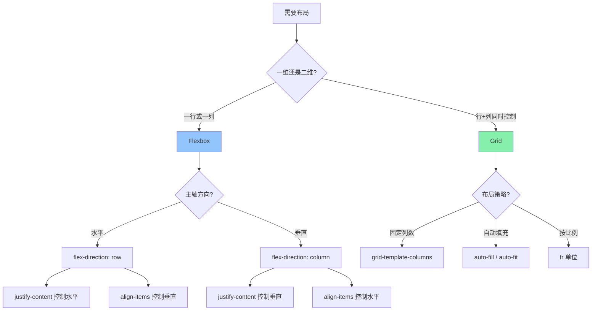
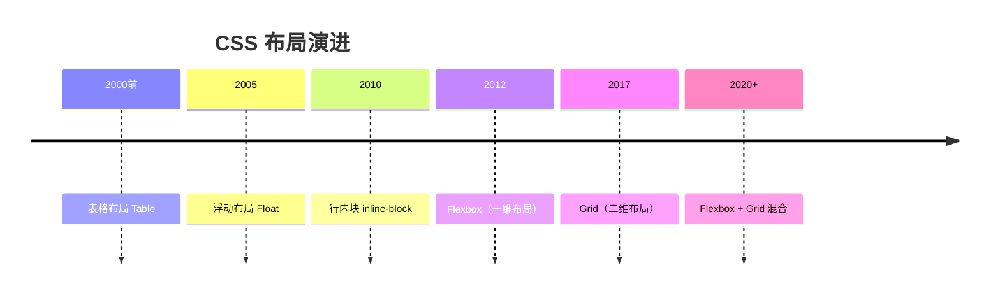
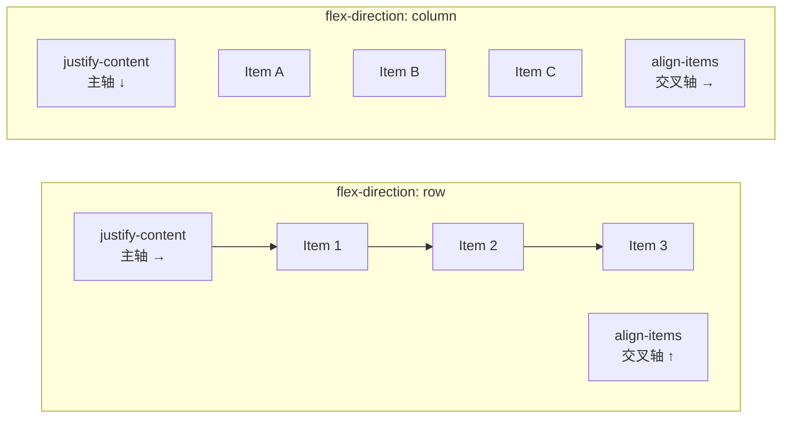
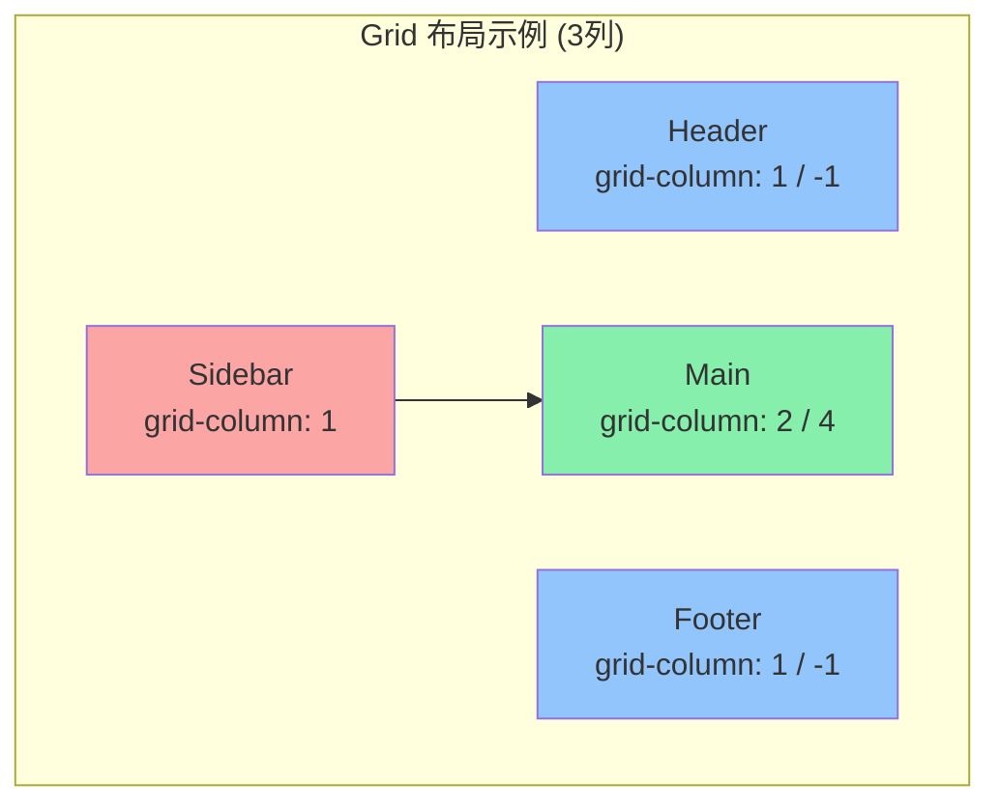

<DifficultyBadge level="beginner" />

# CSS 布局完全指南

## 一句话解释

CSS 布局经历了**表格 → 浮动 → Flexbox → Grid** 的演进，现代布局的核心就两个武器：**Flexbox**（一维布局，适合导航/居中/分布）和 **Grid**（二维布局，适合整体页面/卡片网格），结合它们能解决几乎所有布局需求。

## 核心流程



## 深入理解

### 1. 从历史演进看布局



| 时代 | 方案 | 问题 | 面试频率 |
|------|------|------|---------|
| 2000s | `<table>` 布局 | 语义差、渲染慢、改布局要改 HTML | 📌 了解 |
| 2005+ | `float + clearfix` | 清除浮动 hack、无法垂直居中 | 📌 了解 |
| 2010+ | `inline-block` | 空白间隙问题、对齐困难 | 📌 了解 |
| 2012+ | **Flexbox** | 一维布局完美解决 | 🔥 高频 |
| 2017+ | **Grid** | 二维布局原生支持 | 🔥 高频 |

> **面试关键：Flexbox 和 Grid 不是二选一，是互补。** 页面级布局用 Grid，组件内部排列用 Flexbox。

### 2. Flexbox 核心（必考）

#### 2.1 主轴与交叉轴



**理解主轴/交叉轴是 Flexbox 的核心：**

```
flex-direction: row     → 主轴是水平方向
flex-direction: column  → 主轴是垂直方向

主轴控制：justify-content（水平分布）
交叉轴控制：align-items / align-self（垂直对齐）
```

#### 2.2 容器属性速查

**justify-content（主轴对齐）：**

```css
.container {
  display: flex;
  justify-content: flex-start;   /* 默认：左对齐 */
  justify-content: flex-end;     /* 右对齐 */
  justify-content: center;       /* 居中 */
  justify-content: space-between;/* 两端对齐，中间等距 */
  justify-content: space-around; /* 每个项目两侧间距相等 */
  justify-content: space-evenly; /* 所有间距完全相等 */
}
```

**align-items（交叉轴对齐）：**

```css
.container {
  align-items: stretch;    /* 默认：拉伸填满 */
  align-items: flex-start; /* 顶部对齐 */
  align-items: flex-end;   /* 底部对齐 */
  align-items: center;     /* 垂直居中 */
  align-items: baseline;   /* 基线对齐（文字对齐） */
}
```

**flex-wrap（换行）：**

```css
.container {
  flex-wrap: nowrap;    /* 默认：不换行，压缩项目 */
  flex-wrap: wrap;      /* 换行 */
  flex-wrap: wrap-reverse; /* 反向换行 */
}
```

#### 2.3 项目属性（面试高频）

**flex 属性 = flex-grow + flex-shrink + flex-basis 的缩写：**

```css
.item {
  /* 三合一的缩写 */
  flex: 1;              /* flex: 1 1 0% — 平均分配剩余空间 */
  flex: auto;           /* flex: 1 1 auto — 按内容大小分配 */
  flex: none;           /* flex: 0 0 auto — 不伸缩 */
  
  /* 展开写 */
  flex-grow: 1;         /* 剩余空间的分配比例 */
  flex-shrink: 0;       /* 空间不足时的缩小比例 */
  flex-basis: 200px;    /* 项目的基础大小 */
}
```

**经典面试题：`flex: 1` 和 `flex: auto` 的区别？**

```css
/* flex: 1 — 等分剩余空间 */
flex-grow: 1;
flex-shrink: 1;
flex-basis: 0%;  /* 基础大小为 0，所有项目从同一起跑线开始分 */

/* flex: auto — 按内容分配 */
flex-grow: 1;
flex-shrink: 1;
flex-basis: auto;  /* 基础大小为内容大小，内容多的占更多空间 */
```

**align-self（单个项目覆盖 align-items）：**

```css
.item {
  align-self: center;  /* 这个项目单独垂直居中 */
  /* 可选值同 align-items */
}
```

### 3. Grid 核心（必考）

#### 3.1 基础网格定义

```css
.container {
  display: grid;
  
  /* 三列等宽 */
  grid-template-columns: 1fr 1fr 1fr;
  /* 或 repeat(3, 1fr) */
  
  /* 两行 */
  grid-template-rows: 100px auto 200px;
  
  /* 列间距 20px，行间距 16px */
  gap: 16px 20px;
}
```



#### 3.2 fr 单位（Grid 的灵魂）

`fr` 代表剩余空间的**份额（fraction）**：

```css
/* 2:1 比例 */
grid-template-columns: 2fr 1fr;
/* 第一列占 2/3，第二列占 1/3 */

/* 固定 + 自适应 */
grid-template-columns: 200px 1fr;
/* 第一列固定 200px，剩下的全给第二列 */

/* 三列：固定 + 自适应 + 固定 */
grid-template-columns: 200px 1fr 200px;
/* 圣杯布局的标准写法 */
```

#### 3.3 网格线定位

```css
.item {
  /* 按线条编号 */
  grid-column: 1 / 3;       /* 从第 1 条线到第 3 条线（占 2 列） */
  grid-row: 1 / 3;          /* 从第 1 条线到第 3 条线（占 2 行） */
  
  /* 从开头到结尾 */
  grid-column: 1 / -1;      /* 贯穿所有列（常用于 header/footer） */
  
  /* 简写 */
  grid-area: 1 / 1 / 3 / 3; /* row-start / col-start / row-end / col-end */
}
```

#### 3.4 auto-fill vs auto-fit（高频考点）

```css
/* auto-fill：尽量填满容器，空列保留 */
grid-template-columns: repeat(auto-fill, minmax(200px, 1fr));
/* 容器 1000px → 5 列（如果只有 3 个项目，空出 2 列位置） */

/* auto-fit：尽量适应内容，空列折叠 */
grid-template-columns: repeat(auto-fit, minmax(200px, 1fr));
/* 容器 1000px → 5 列（如果只有 3 个项目，每列自动变宽） */
```

**区别可视化：**

```
auto-fill（容器 1000px，3 个项目，每个最少 200px）：
|项目1|项目2|项目3| 空 | 空 |
  200   200   200  200  200   ← 空列保留

auto-fit（容器 1000px，3 个项目，每个最少 200px）：
|  项目1  |  项目2  |  项目3  |
   333     333     334       ← 空列折叠，项目自动拉宽
```

### 4. 经典布局方案

#### 4.1 圣杯布局（Holy Grail）

```css
/* 使用 Grid — 最简单 */
.holy-grail {
  display: grid;
  grid-template: auto 1fr auto / 200px 1fr 200px;
  min-height: 100vh;
}

.holy-grail header { grid-column: 1 / -1; }    /* 贯穿 */
.holy-grail footer { grid-column: 1 / -1; }    /* 贯穿 */
.holy-grail nav    { grid-column: 1; }          /* 左栏 */
.holy-grail main   { grid-column: 2; }          /* 中间 */
.holy-grail aside  { grid-column: 3; }          /* 右栏 */
```

```html
<div class="holy-grail">
  <header>Header</header>
  <nav>Left</nav>
  <main>Content</main>
  <aside>Right</aside>
  <footer>Footer</footer>
</div>
```

#### 4.2 水平垂直居中（面试必考题）

```css
/* 方案一：Flexbox（推荐） */
.parent {
  display: flex;
  justify-content: center;
  align-items: center;
}

/* 方案二：Grid */
.parent {
  display: grid;
  place-items: center;  /* justify-items + align-items 的缩写 */
}

/* 方案三：position + transform */
.parent { position: relative; }
.child {
  position: absolute;
  top: 50%;
  left: 50%;
  transform: translate(-50%, -50%);
}
```

#### 4.3 两栏自适应布局

```css
/* Flexbox 方案 */
.two-col {
  display: flex;
}
.two-col .sidebar { width: 200px; flex-shrink: 0; }
.two-col .main    { flex: 1; }

/* Grid 方案 */
.two-col {
  display: grid;
  grid-template-columns: 200px 1fr;
}
```

#### 4.4 等高布局

```css
/* Flexbox 默认就是等高（align-items: stretch） */
.equal-height {
  display: flex;
}
.equal-height .item { flex: 1; }
/* 所有 item 高度自动相等 */

/* Grid 默认也是等高 */
.equal-height {
  display: grid;
  grid-template-columns: repeat(3, 1fr);
}
/* 同一行的 item 高度自动相等 */
```

### 5. Flexbox vs Grid 选型表

| 场景 | 推荐方案 | 原因 |
|------|---------|------|
| 导航栏水平排列 | Flexbox | 一维、居中、间距分布 |
| 整体页面布局 | Grid | 二维、header/sidebar/main/footer |
| 卡片网格 | Grid | 行列对齐、auto-fill 自适应 |
| 列表项排列 | Flexbox | 一维、换行简单 |
| 垂直居中 | Flexbox/Grid | 两者都很简单 |
| 表单布局 | Flexbox | 标签+输入框的对齐 |
| 不规则布局 | Grid | 精确控制位置和跨度 |
| 按钮组 | Flexbox | 紧凑排列、间距均匀 |

### 6. 常见坑点

```css
/* ❌ flex 坑：min-width 默认 auto */
.item {
  flex: 1;
  overflow: hidden;      /* 内容超长时不会撑开 */
  /* 或 min-width: 0 */
}

/* ❌ gap 兼容性 */
.container {
  gap: 16px;             /* Flexbox 的 gap 在旧 Safari 不支持 */
  /* 用 margin + 负 margin 兜底 */
}

/* ❌ Grid 溢出 */
.container {
  grid-template-columns: repeat(auto-fill, 300px);
  /* 容器不足 300px 时溢出！ */
  /* ✅ 修复：加 minmax */
  grid-template-columns: repeat(auto-fill, minmax(300px, 1fr));
}
```

## 面试问法

- 🔥 **Flexbox 的 justify-content 和 align-items 分别控制什么？**
  - justify-content：主轴方向的对齐和分布
  - align-items：交叉轴方向的对齐
  - 取决于 flex-direction 的值

- 🔥 **`flex: 1`、`flex: auto`、`flex: none` 的区别？**
  - `flex: 1` = `flex: 1 1 0%` — 等分剩余空间
  - `flex: auto` = `flex: 1 1 auto` — 按内容大小分配
  - `flex: none` = `flex: 0 0 auto` — 不伸缩，固定内容大小

- 🔥 **Grid 的 auto-fill 和 auto-fit 区别？**
  - auto-fill：保留空列轨道，布局稳定
  - auto-fit：折叠空列轨道，项目自动拉宽
  - 面试答出"空列是否保留"就过了

- ⭐ **实现水平垂直居中你有几种方法？**
  - Flexbox：`display: flex; justify-content: center; align-items: center`
  - Grid：`display: grid; place-items: center`
  - Position：`absolute + top:50% left:50% + translate(-50%, -50%)`
  - 表格：`display: table-cell + text-align:center + vertical-align:middle`

- ⭐ **Flexbox 和 Grid 怎么选？**
  - 页面级布局（二维）→ Grid（精确控制区域）
  - 组件内排列（一维）→ Flexbox（灵活分布）
  - 两者可以嵌套使用，不是互斥的

- 📌 **说一说 fr 单位的含义**
  - fraction 的缩写，代表剩余空间的份额
  - `1fr 1fr 1fr` 三等分
  - `200px 1fr` 固定 + 自适应

## 💡 AI 辅助学习

> 用这个 Prompt 练习 CSS 布局：
> "请给我一个包含以下要求的布局挑战：左侧固定 250px 的侧边栏（含导航），右侧自适应主内容区（含 header + 内容 + footer），footer 始终在底部。请先用 Grid 实现，再用 Flexbox 实现，并对比两种方案的优劣。"
>
> "不能只用文字回答，请提供完整可运行的 HTML/CSS 代码，并在关键位置加注释说明为什么这样写。"

## 关联知识

- [CSS 响应式与动画](./css-responsive) — 媒体查询、transition/animation
- [HTML 语义化与 SEO](./html-semantic) — 语义标签与页面结构
- [浏览器渲染流水线](./browser-rendering) — Layout/Paint 流程
- [重排/重绘优化](./browser-reflow) — 布局性能优化
