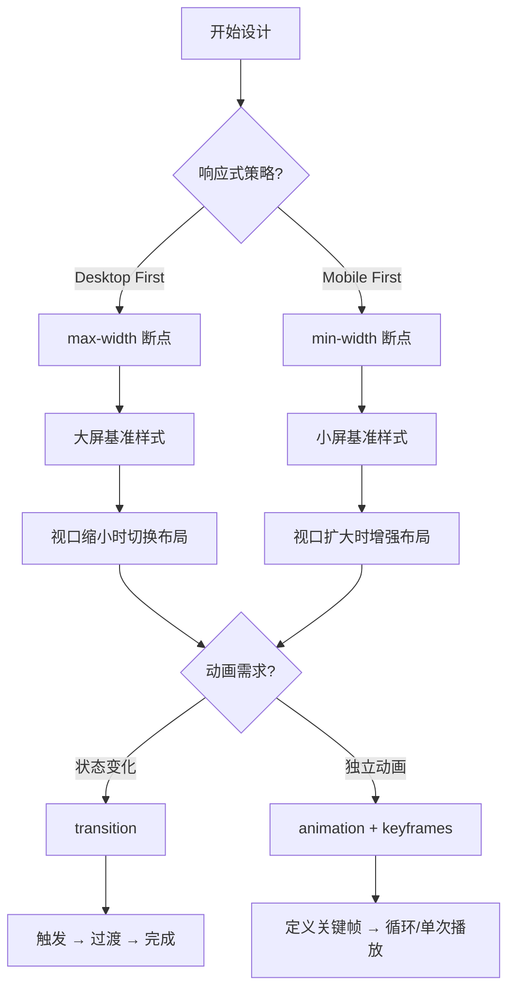
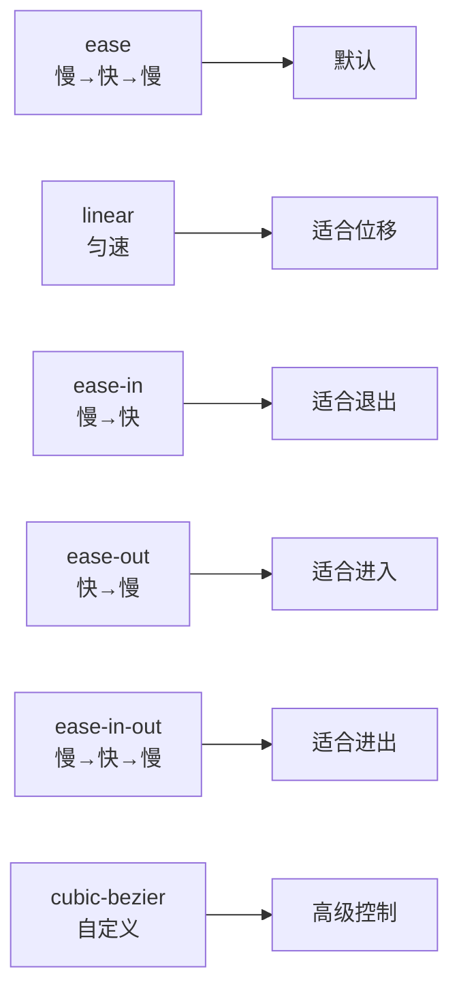
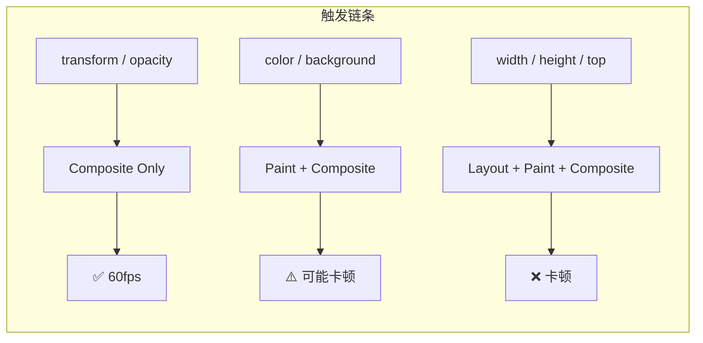

<DifficultyBadge level="beginner" />

# CSS 响应式与动画

## 一句话解释

响应式设计是**一套代码适配所有屏幕**——通过媒体查询判断设备特征来切换样式；CSS 动画是用 **transition**（状态过渡）和 **animation**（关键帧动画）让界面动起来，提升用户体验。

## 核心流程



## 深入理解

### 1. 响应式基础

#### 1.1 视口设置（必加）

```html
<meta name="viewport" content="width=device-width, initial-scale=1.0">
<!-- 没有这行，响应式无效 -->
```

#### 1.2 媒体查询断点

```css
/* Mobile First（推荐）— 从小屏开始增强 */
/* 基础样式：手机（< 640px） */
.container {
  display: flex;
  flex-direction: column;  /* 手机竖排 */
}

/* 平板（≥ 768px） */
@media (min-width: 768px) {
  .container {
    flex-direction: row;   /* 平板横排 */
  }
}

/* 桌面（≥ 1024px） */
@media (min-width: 1024px) {
  .container {
    max-width: 960px;
    margin: 0 auto;
  }
}

/* 大屏（≥ 1440px） */
@media (min-width: 1440px) {
  .container {
    max-width: 1200px;
  }
}
```

**常用断点体系：**

| 断点名称 | 最小宽度 | 目标设备 |
|---------|---------|---------|
| `sm` | 640px | 大屏手机横屏 |
| `md` | 768px | 平板竖屏 |
| `lg` | 1024px | 平板横屏 / 小桌面 |
| `xl` | 1280px | 桌面 |
| `2xl` | 1536px | 大屏桌面 |

#### 1.3 响应式布局策略

```css
/* ① 弹性网格 — 用 fr / % 替代 px */
.grid {
  display: grid;
  grid-template-columns: repeat(auto-fill, minmax(300px, 1fr));
  /* 自动适应：容器越宽，列越多；越窄，列越少 */
}

/* ② 弹性图片 */
img {
  max-width: 100%;    /* 不超出容器宽度 */
  height: auto;       /* 等比缩放 */
}

/* ③ 响应式字号 — clamp 函数 */
h1 {
  font-size: clamp(1.5rem, 4vw, 3rem);
  /* 最小 1.5rem，首选 4vw（视口比例），最大 3rem */
}
```

### 2. 容器查询（Container Queries）

媒体查询的问题是：**组件不知道自己的容器有多大，只知道视口有多大。**

```css
/* 传统媒体查询的问题 */
.card { width: 300px; }
/* 即使容器只有 200px，卡片还是 300px（溢出） */

/* 容器查询（CSS 新特性）— 组件根据自身容器调整 */
.card-container {
  container-type: inline-size;
  container-name: card;
}

@container card (max-width: 400px) {
  .card {
    flex-direction: column;  /* 容器窄时竖排 */
  }
  .card-image {
    width: 100%;            /* 图片占满 */
  }
}

@container card (min-width: 401px) {
  .card {
    flex-direction: row;    /* 容器宽时横排 */
  }
  .card-image {
    width: 40%;             /* 图片占一部分 */
  }
}
```

**媒体查询 vs 容器查询：**

| 对比 | 媒体查询 | 容器查询 |
|------|---------|---------|
| 参照物 | 视口（viewport） | 父容器 |
| 适用场景 | 页面级布局 | 可复用组件 |
| 主流浏览器支持 | ✅ 全支持 | ✅ 2023+ 现代浏览器 |
| 典型用例 | 整体布局切换 | 卡片、侧边栏组件自适应 |

### 3. CSS Transition

Transition 是**状态变化时的平滑过渡**：

```css
.button {
  background: blue;
  color: white;
  
  /* 简写 */
  transition: all 0.3s ease;
  
  /* 展开写 */
  transition-property: background, transform;  /* 要过渡的属性 */
  transition-duration: 0.3s, 0.15s;           /* 过渡时长 */
  transition-timing-function: ease;           /* 缓动函数 */
  transition-delay: 0s;                       /* 延迟 */
}

.button:hover {
  background: darkblue;
  transform: scale(1.05);
}
```

**缓动函数（timing-function）对比：**



```css
/* 自定义贝塞尔曲线 */
.button {
  transition: transform 0.3s cubic-bezier(0.68, -0.55, 0.27, 1.55);
  /* 弹簧效果：超过目标值再弹回来 */
}
```

**transition 的限制（面试考点）：**
- 需要**触发条件**（hover/focus/class 变化），不能自动播放
- 只有**离散值变化**时生效（不能从 "display: none" → "block" 过渡）
- 不能循环播放

### 4. CSS Animation + Keyframes

Animation 是**独立于状态变化的复杂动画**：

```css
/* 定义关键帧 */
@keyframes slideIn {
  from {
    transform: translateX(-100%);
    opacity: 0;
  }
  to {
    transform: translateX(0);
    opacity: 1;
  }
}

@keyframes bounce {
  0%   { transform: scale(1); }
  50%  { transform: scale(1.2); }
  100% { transform: scale(1); }
}

/* 应用动画 */
.element {
  animation: slideIn 0.5s ease-out;
  
  /* 展开写 */
  animation-name: slideIn;           /* 动画名称 */
  animation-duration: 0.5s;          /* 时长 */
  animation-timing-function: ease;   /* 缓动 */
  animation-delay: 0s;              /* 延迟 */
  animation-iteration-count: 1;     /* 播放次数（infinite 无限） */
  animation-direction: normal;      /* 方向（normal/reverse/alternate） */
  animation-fill-mode: forwards;    /* 结束后保持最后状态 */
  animation-play-state: running;    /* 播放状态 */
}
```

**transition vs animation：**

| 对比 | transition | animation |
|------|-----------|-----------|
| 触发方式 | 状态变化触发 | 可自动播放 |
| 循环 | ❌ 不能 | ✅ 可以（infinite） |
| 中间状态 | 只有始末 | ✅ 多关键帧（0%/50%/100%） |
| 控制粒度 | 单一变化 | ✅ 复杂序列 |
| 反向播放 | ❌ 不能 | ✅ alternate |
| 浏览器兼容 | ✅ 全支持 | ✅ 全支持 |

### 5. 动画性能优化（高频考点）

**触发重排的属性 ❌ 慢：**

```css
/* ❌ 触发 Layout → Paint → Composite */
.element {
  animation: badAnimation 0.3s;
}
@keyframes badAnimation {
  from { left: 0; }        /* left 变化 → 触发布局（重排） */
  to   { left: 100px; }
}

/* ✅ 只触发 Composite（合成）— GPU 加速 */
@keyframes goodAnimation {
  from { transform: translateX(0); }     /* transform → 只合成 */
  to   { transform: translateX(100px); }
}
```

**硬件加速优先级：**

```css
/* ✅ 最高效：只触发 Composite */
transform: translate() / scale() / rotate()
opacity

/* ⚠️ 中等：触发 Paint + Composite */
color, background-color, box-shadow

/* ❌ 最差：触发 Layout + Paint + Composite */
width, height, margin, padding, left, top, position
```

**性能对比：**



**最佳实践：**

```css
/* ✅ 好：只用 transform + opacity */
.card {
  transition: transform 0.3s ease, opacity 0.3s ease;
}
.card:hover {
  transform: translateY(-4px);
  opacity: 0.9;
}

/* ✅ 使用 will-change 提示浏览器优化 */
.card {
  will-change: transform, opacity;
  /* ⚠️ 不要滥用，只在即将动画的元素上用 */
  /* 动画结束后移除 */
}
```

### 6. 实用动画模式

```css
/* ① 淡入 */
@keyframes fadeIn {
  from { opacity: 0; }
  to   { opacity: 1; }
}

/* ② 从下滑入 */
@keyframes slideUp {
  from { transform: translateY(20px); opacity: 0; }
  to   { transform: translateY(0); opacity: 1; }
}

/* ③ 缩放进入 */
@keyframes scaleIn {
  from { transform: scale(0.8); opacity: 0; }
  to   { transform: scale(1); opacity: 1; }
}

/* ④ 骨架屏脉冲 */
@keyframes shimmer {
  0%   { background-position: -200% 0; }
  100% { background-position: 200% 0; }
}
.skeleton {
  background: linear-gradient(90deg, #eee 25%, #f5f5f5 50%, #eee 75%);
  background-size: 200% 100%;
  animation: shimmer 1.5s infinite;
}

/* ⑤ 条目依次出现 */
.entry {
  opacity: 0;
  animation: slideUp 0.3s ease forwards;
}
.entry:nth-child(1) { animation-delay: 0s; }
.entry:nth-child(2) { animation-delay: 0.1s; }
.entry:nth-child(3) { animation-delay: 0.2s; }
/* ... 每个条目依次延迟 0.1s 出现 */
```

## 面试问法

- 🔥 **transition 和 animation 的区别？**
  - transition：需要触发条件，只有始末两个状态
  - animation：可自动播放、可循环、可定义多个关键帧
  - 简单状态变化用 transition，复杂独立动画用 animation

- 🔥 **CSS 动画性能优化：什么属性动画最省性能？**
  - `transform` 和 `opacity` 最省（只触发 Composite）
  - `width/height/top/left` 最耗（触发 Layout）
  - 能用 transform 就不用位置属性

- ⭐ **什么是 GPU 加速？怎么触发？**
  - 浏览器将元素提升为合成层，由 GPU 单独处理
  - 触发条件：`transform3d()`、`opacity`、`will-change`、`video/canvas`
  - 好处：不触发 Layout/Paint，60fps 流畅

- ⭐ **容器查询和媒体查询的区别？**
  - 媒体查询根据视口尺寸调整
  - 容器查询根据父容器尺寸调整
  - 组件复用场景用容器查询，页面布局用媒体查询

- ⭐ **Mobile First 和 Desktop First 的区别？**
  - Mobile First：基准样式为手机，用 `min-width` 增强
  - Desktop First：基准样式为桌面，用 `max-width` 降级
  - 推荐 Mobile First：性能更好（手机不加载桌面样式）

- 📌 **clamp() 函数怎么用？**
  - `clamp(MIN, PREFERRED, MAX)`
  - 例：`font-size: clamp(1rem, 3vw, 2rem)` 字号在 1-2rem 之间随视口变化
  - 替代媒体查询实现响应式字号

## 💡 AI 辅助学习

> 用这个 Prompt 练习 CSS 动画：
> "我是一个前端开发者，正在准备高级面试。请给我一个 CSS 动画实现方案：
> 1. 一个卡片列表，页面加载时依次从下方滑入（stagger animation）
> 2. 鼠标悬停时卡片有微妙的浮动效果
> 3. 点击卡片时有一个展开的过渡动画
> 4. 所有动画使用 GPU 加速属性（transform/opacity）
> 请提供完整 HTML/CSS 代码，并说明每个动画的性能表现。"

## 关联知识

- [CSS 布局完全指南](./css-layout) — Flex/Grid 布局
- [HTML 语义化与 SEO](./html-semantic) — 语义标签
- [浏览器渲染流水线](./browser-rendering) — 渲染管线
- [重排/重绘优化](./browser-reflow) — 布局性能
