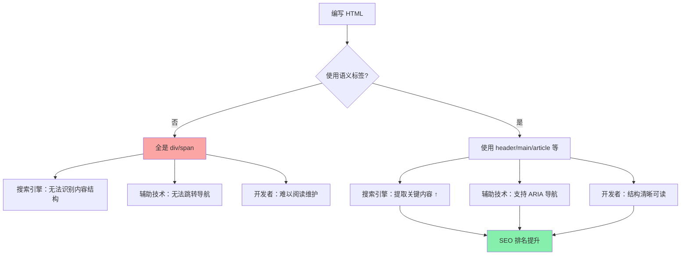
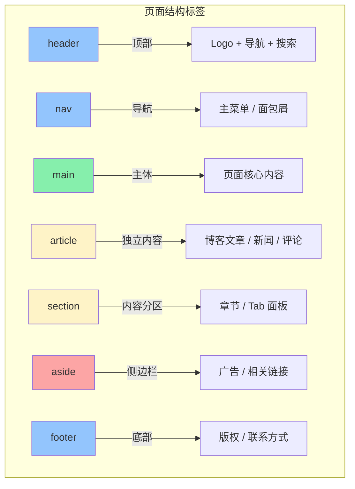

<DifficultyBadge level="beginner" />

# HTML 语义化与 SEO

## 一句话解释

HTML 语义化是用**有意义的标签**（`<header>` / `<nav>` / `<article>`）替代无意义的 `<div>` 来构建页面——让浏览器、搜索引擎、辅助设备都能理解你的内容结构，是前端可访问性和 SEO 的基础。

## 核心流程



## 深入理解

### 1. 语义标签地图

HTML5 引入了一套完整的语义标签体系，按页面区域划分：



**各标签的面试考点：**

| 标签 | 语义含义 | 典型内容 | 常见误区 |
|------|---------|---------|---------|
| `<header>` | 页面或区块的头部 | Logo、导航、搜索框 | ❌ 认为 header 只能出现一次（每个 section/article 都可以有） |
| `<nav>` | 导航链接区块 | 主菜单、面包屑、目录 | ❌ 把所有链接都放 nav（只有主要导航块用 nav） |
| `<main>` | 页面**唯一**主体内容 | 核心内容区 | ❌ 一个页面出现多个 main（必须唯一） |
| `<article>` | **独立**可分发的内容单元 | 博客文章、论坛帖子 | ❌ 把整个页面当 article（article 应该可以独立存在） |
| `<section>` | 有主题的内容分组 | 章节、Tab 内容 | ❌ 为加样式就用 section（先用 div，section 有语义） |
| `<aside>` | 与主内容**间接相关** | 侧边栏、广告、引用 | ❌ 把所有侧边元素都放 aside |
| `<footer>` | 页面或区块的尾部 | 版权、联系信息 | ❌ footer 只能放底部（每个 article/section 都可以有） |

### 2. 为什么语义化对 SEO 重要

搜索引擎（Google、Bing）的爬虫**不关心样式**，它们解析的是 HTML 结构：

```html
<!-- ❌ 非语义化：爬虫看到一堆 div，分不清什么是导航、什么是内容 -->
<div class="header">
  <div class="nav">
    <div class="nav-item">首页</div>
    <div class="nav-item">关于</div>
  </div>
</div>
<div class="content">
  <div class="post-title">文章标题</div>
  <div class="post-body">文章内容...</div>
</div>

<!-- ✅ 语义化：爬虫能清晰识别结构 -->
<header>
  <nav>
    <a href="/">首页</a>
    <a href="/about">关于</a>
  </nav>
</header>
<main>
  <article>
    <h1>文章标题</h1>
    <p>文章内容...</p>
  </article>
</main>
```

**Google 的语义化加分项：**

| 因素 | 说明 | 影响程度 |
|------|------|---------|
| `<title>` + `<meta description>` | 页面标题和描述 | 🔴 核心 |
| `<h1>`~`<h6>` 层级 | 标题层级清晰，不跳级 | 🔴 核心 |
| `<article>` 包裹主要内容 | 爬虫识别核心内容 | 🟡 重要 |
| `<nav>` 包裹导航 | 爬虫区分导航和正文 | 🟡 重要 |
| 结构化数据（JSON-LD） | 生成 Rich Snippets（富摘要） | 🟡 重要 |
| `` 属性 | 图片 SEO | 🟢 加分 |

### 3. 标题层级（Heading Hierarchy）

标题层级是 SEO 最重要的 HTML 语义实践之一：

```html
<!-- ❌ 错误：跳级 + 滥用 h1 -->
<h1>网站名称</h1>
<div class="section">
  <h3>子标题</h3>  <!-- 从 h1 跳到 h3，跳过了 h2 -->
</div>

<!-- ✅ 正确：层级清晰递进 -->
<h1>网站名称</h1>
<main>
  <article>
    <h2>文章大标题</h2>
    <section>
      <h3>章节一</h3>
      <h4>小节</h4>
    </section>
    <section>
      <h3>章节二</h3>
    </section>
  </article>
</main>
```

**最佳实践：**
- 每个页面**只有一个** `<h1>`（通常是页面标题）
- 不要跳级：`h1 → h2 → h3`，不要 `h1 → h3`
- 标题层级应反映内容结构，不是样式大小
- 用 CSS 控制标题的视觉大小，不要为了"看起来像标题"而使用错误层级

### 4. 可访问性（Accessibility / a11y）

语义化是**无障碍的基础**——屏幕阅读器依赖语义标签来导航：

```html
<!-- ❌ 非语义化：屏幕阅读器无法跳转 -->
<div class="nav">
  <span class="nav-item" onclick="goHome()">首页</span>
  <span class="nav-item" onclick="goAbout()">关于</span>
</div>
<!-- 屏幕阅读器听到的：一堆无法聚焦的 "首页 关于" -->

<!-- ✅ 语义化：屏幕阅读器可以快速跳转 -->
<nav aria-label="主导航">
  <a href="/">首页</a>
  <a href="/about">关于</a>
</nav>
<!-- 屏幕阅读器听到的："导航 主导航 链接 首页 链接 关于" -->
```

**常用 ARIA 属性：**

| 属性 | 用途 | 示例 |
|------|------|------|
| `aria-label` | 为元素提供可访问的标签 | `<nav aria-label="面包屑导航">` |
| `aria-labelledby` | 引用另一个元素作为标签 | `<section aria-labelledby="section-title">` |
| `aria-describedby` | 引用描述信息 | `<button aria-describedby="btn-desc">` |
| `aria-expanded` | 展开/折叠状态 | `<button aria-expanded="false">` |
| `role` | 明确元素角色 | `<div role="alert">`（当不能用语义标签时） |

**第一原则：优先使用原生语义标签，ARIA 是补充手段**

```html
<!-- ✅ 用好原生标签就不需要额外 ARIA -->
<button>提交</button>              <!-- 自带 button role -->
<a href="/">首页</a>              <!-- 自带 link role -->
<h1>标题</h1>                     <!-- 自带 heading role -->

<!-- ⚠️ 只有做不到语义标签时才用 ARIA -->
<div role="button" tabindex="0" @click="submit">
  提交
</div>
```

### 5. 结构化数据（Structured Data）

通过 JSON-LD 给搜索引擎提供**机器可读的内容描述**，生成富摘要（Rich Snippets）：

```html
<script type="application/ld+json">
{
  "@context": "https://schema.org",
  "@type": "Article",
  "headline": "HTML 语义化完全指南",
  "description": "从标签语义到 SEO 优化，全面掌握 HTML 语义化",
  "author": {
    "@type": "Person",
    "name": "前端面试知识体系"
  },
  "datePublished": "2026-07-30",
  "image": "https://example.com/og-image.jpg"
}
</script>
```

**常用结构化数据类型：**

| 类型 | 适用场景 | 生成效果 |
|------|---------|---------|
| `Article` | 博客、新闻 | 标题+摘要+发布时间+作者头像 |
| `BreadcrumbList` | 面包屑导航 | 搜索结果显示路径层级 |
| `Product` | 商品页 | 价格、库存、评分星级 |
| `FAQPage` | FAQ 页面 | 展开式问答结果 |
| `LocalBusiness` | 企业网站 | 营业时间、地址、评分 |
| `Review` | 评测/评论 | 评分星级 |

### 6. 语义化自检清单

写完一个页面后，对照检查：

- [ ] `<main>` 是否唯一？是否包裹了核心内容？
- [ ] `<h1>`~`<h6>` 是否层级递增、没有跳级？
- [ ] 导航是否用 `<nav>` 包裹？
- [ ] 独立内容是否用 `<article>` 包裹？
- [ ] 所有 `` 是否有 `alt` 属性？
- [ ] 表单输入是否有对应的 `<label>`？
- [ ] 按钮是否用 `<button>` 而不是 `<div>`？
- [ ] 是否有关键字的 JSON-LD 结构化数据？

## 面试问法

- 🔥 **HTML 语义化是什么？为什么重要？**
  - 用有意义的标签构建页面结构
  - 三方面收益：SEO（爬虫识别）、可访问性（屏幕阅读器）、可维护性（代码清晰）

- ⭐ **`<b>` 和 `<strong>` 的区别？`<i>` 和 `<em>` 的区别？**
  - `<b>` / `<i>`：纯视觉样式（粗体/斜体），无语义
  - `<strong>` / `<em>`：有语义的强调（重要/着重），屏幕阅读器会改变语调
  - SEO 角度：`<strong>` 比 `<b>` 更有价值

- ⭐ **一个页面能有多个 `<header>` 和 `<footer>` 吗？**
  - 可以。`<main>` 必须唯一，但 `<header>` 和 `<footer>` 在每个 `<article>` / `<section>` 里都可以有
  - 每个语义区块都可以有自己的头部和尾部

- ⭐ **ARIA 是什么？应该在什么时候使用？**
  - Accessible Rich Internet Applications 的缩写
  - 第一原则：优先使用原生语义标签
  - ARIA 只在"无法用语义标签表达"时使用（如自定义组件）
  - 规则：不要给原生语义标签加冗余的 ARIA role

- 📌 **什么是 JSON-LD 结构化数据？**
  - 用 `application/ld+json` 格式描述页面内容的元数据
  - 让 Google 能在搜索结果中展示富摘要（评分、价格、时间等）
  - 推荐用 `@type` 匹配 content_type 的标准 Schema

## 💡 AI 辅助学习

> 用这个 Prompt 练习 HTML 语义化：
> "你是一个 HTML 语义化评审专家。请审查我提供的 HTML 代码，指出：
> 1. 哪些可以用语义标签替代的 div/span
> 2. 标题层级是否有跳级
> 3. 可访问性方面的问题
> 4. 结构化数据的改进建议
> 
> 请按严重程度排序并给出修改后的完整 HTML。"

## 关联知识

- [CSS 布局完全指南](./css-layout) — Flex/Grid 布局
- [CSS 响应式与动画](./css-responsive) — 媒体查询与响应式设计
- [浏览器渲染流水线](../fundamentals/browser-rendering) — DOM/CSSOM 构建
- [Web 安全](./browser-security) — XSS、CSP
