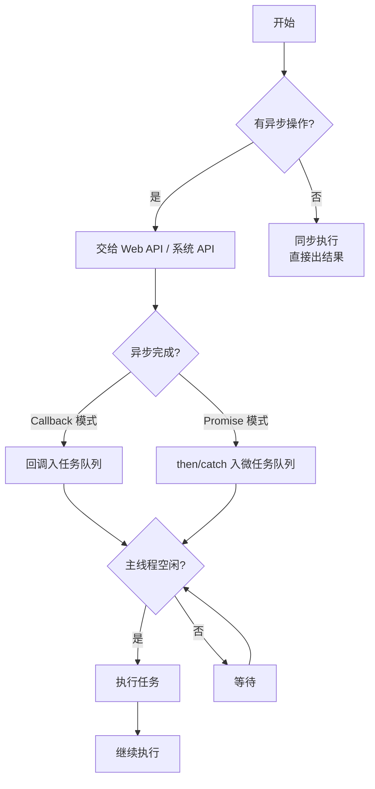
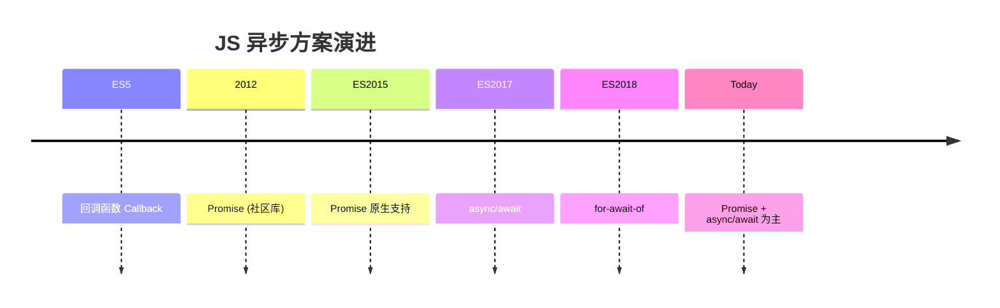
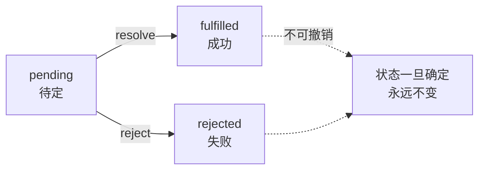

<DifficultyBadge level="beginner" />

# JS 异步编程

## 一句话解释

JavaScript 是**单线程非阻塞**的语言——通过事件循环机制把耗时操作（网络请求、定时器、文件读写）交给浏览器/Node 后台处理，完成后把回调放入任务队列等主线程空闲时执行。从**回调 → Promise → async/await** 的演进史就是"让异步代码写起来像同步"的历史。

## 核心流程



## 深入理解

### 1. 异步编程演进史



| 方案 | 出现 | 问题 | 当前状态 |
|------|------|------|---------|
| 回调 Callback | ES1 | 回调地狱、错误处理困难 | ❌ 尽量避免 |
| Promise | ES2015 | 链式调用仍不如同步代码直观 | ✅ 主力方案 |
| async/await | ES2017 | 需要理解和 Promise 的配合 | ✅ 推荐写法 |
| Generator + co | ES2015/社区 | 复杂，被 async/await 取代 | 📌 了解即可 |

### 2. 回调（Callback）

```javascript
// 回调模式：把后续操作以函数参数形式传入
function fetchData(callback) {
  setTimeout(() => {
    callback('data')
  }, 1000)
}

fetchData((result) => {
  console.log(result)  // 'data'
})
```

**回调地狱（Callback Hell）：**

```javascript
// ❌ 多层嵌套 → 可读性极差
getUser(id, (user) => {
  getPosts(user.id, (posts) => {
    getComments(posts[0].id, (comments) => {
      getLikes(comments[0].id, (likes) => {
        console.log(likes)
      })
    })
  })
})
```

**回调的问题：**
- 嵌套越深，代码越难读（回调地狱）
- 错误处理分散（每个回调都要检查错误）
- 不能 `return` 值，只能传回调
- 多个异步操作的组合非常困难

### 3. Promise — 现代异步基础

#### 3.1 基本用法

```javascript
const promise = new Promise((resolve, reject) => {
  // 异步操作
  setTimeout(() => {
    const success = true
    if (success) {
      resolve('成功的数据')  // 将状态设为 fulfilled
    } else {
      reject(new Error('失败'))  // 将状态设为 rejected
    }
  }, 1000)
})

promise
  .then(data => console.log(data))
  .catch(err => console.error(err))
```

**Promise 的三种状态：**



#### 3.2 Promise 静态方法

```javascript
// Promise.all — 全部成功才成功，一个失败就失败
const promises = [fetch('/api/a'), fetch('/api/b'), fetch('/api/c')]
Promise.all(promises)
  .then(([a, b, c]) => console.log('全部完成', a, b, c))
  .catch(err => console.error('至少一个失败', err))

// Promise.allSettled — 等全部完成，不管成功失败
Promise.allSettled(promises)
  .then(results => {
    results.forEach(r => {
      if (r.status === 'fulfilled') console.log('成功', r.value)
      if (r.status === 'rejected') console.log('失败', r.reason)
    })
  })

// Promise.race — 谁先完成就用谁的结果
Promise.race([
  fetch('/api/data'),
  new Promise((_, reject) => 
    setTimeout(() => reject(new Error('超时')), 5000)
  )
])
// 5 秒内没返回就超时

// Promise.any — 只要有一个成功就返回（ES2021）
Promise.any([
  fetch('/api/mirror-a'),
  fetch('/api/mirror-b'),
  fetch('/api/mirror-c')
]).then(result => console.log('最快的成功响应', result))
```

**面试高频：四种静态方法对比**

| 方法 | 等待策略 | 成功条件 | 失败条件 |
|------|---------|---------|---------|
| `Promise.all` | 等待全部 | 全部成功 → 结果数组 | 一个失败 → 立即 reject |
| `Promise.allSettled` | 等待全部 | 全部完成 → 结果数组（含状态） | 永不 reject |
| `Promise.race` | 等待第一个 | 第一个完成（不论成功失败） | 第一个 reject |
| `Promise.any` | 等待第一个成功 | 第一个成功 → 结果 | 全部失败 → AggregateError |

#### 3.3 Promise 链（Chaining）

```javascript
// Promise 链：每个 then 返回新 Promise
fetch('/api/user')
  .then(res => res.json())
  .then(user => fetch(`/api/posts/${user.id}`))
  .then(res => res.json())
  .then(posts => {
    console.log('用户的帖子', posts)
    return posts
  })
  .catch(err => console.error('任意环节出错', err))
  .finally(() => {
    console.log('无论成功失败都执行')
    hideLoading()
  })
```

### 4. async/await — 推荐的写法

**async/await 的本质是 Promise 的语法糖。**

```javascript
// async 函数返回 Promise
async function fetchUserData(userId) {
  try {
    const response = await fetch(`/api/users/${userId}`)
    // await 会暂停函数执行，等待 Promise 完成
    const user = await response.json()
    
    const postsResponse = await fetch(`/api/users/${user.id}/posts`)
    const posts = await postsResponse.json()
    
    return { user, posts }  // 返回的值被 Promise 包裹
  } catch (error) {
    console.error('获取用户数据失败', error)
    throw error  // async 函数中的 throw 相当于 reject
  }
}

// 调用 async 函数
fetchUserData(123)
  .then(data => console.log(data))
  .catch(err => console.error(err))
```

#### 4.1 模式对比

```javascript
// ❌ 回调地狱
getUser(id, function(user) {
  getPosts(user.id, function(posts) {
    getComments(posts[0].id, function(comments) {
      // ...
    })
  })
})

// ✅ Promise 链 — 扁平化了
getUser(id)
  .then(user => getPosts(user.id))
  .then(posts => getComments(posts[0].id))
  .then(comments => console.log(comments))
  .catch(err => console.error(err))

// ✅ async/await — 像同步一样写异步
async function loadComments() {
  try {
    const user = await getUser(id)
    const posts = await getPosts(user.id)
    const comments = await getComments(posts[0].id)
    console.log(comments)
  } catch (err) {
    console.error(err)
  }
}
```

### 5. 错误处理

```javascript
// Promise 的错误处理
fetch('/api/data')
  .then(res => {
    if (!res.ok) throw new Error(`HTTP ${res.status}`)
    return res.json()
  })
  .then(data => processData(data))
  .catch(err => {
    // 上面的任何一个 then 出错都会被这里捕获
    console.error('请求处理失败', err)
  })

// async/await 的错误处理
async function fetchData() {
  try {
    const res = await fetch('/api/data')
    if (!res.ok) throw new Error(`HTTP ${res.status}`)
    const data = await res.json()
    return processData(data)
  } catch (err) {
    console.error('请求处理失败', err)
    // 可以在这里做降级处理
    return fallbackData
  }
}
```

**错误处理最佳实践：**

```javascript
// ❌ 不要：吞掉错误
const data = await fetch('/api/data').catch(() => {})
// .catch(() => {}) 吞掉错误但没处理，后续代码以为 data 有值

// ✅ 要：明确的错误处理
let data
try {
  data = await fetch('/api/data')
} catch (err) {
  console.error('请求失败', err)
  data = fallbackData  // 明确的降级
}
```

### 6. 并发控制

```javascript
// 串行（适合有依赖的异步操作）
async function serial() {
  const a = await fetchA()
  const b = await fetchB(a.id)  // 依赖 a 的结果
  const c = await fetchC(b.id)  // 依赖 b 的结果
  return c
}

// 并行（适合无依赖的异步操作）
async function parallel() {
  const [user, posts, notifications] = await Promise.all([
    fetch('/api/user'),
    fetch('/api/posts'),
    fetch('/api/notifications')
  ])
  // 三个请求同时发出，全部完成后一起返回
  return { user, posts, notifications }
}

// 控制并发数（适合大量请求的场景）
async function asyncPool(limit, urls, fn) {
  const results = []
  const executing = new Set()
  
  for (const url of urls) {
    const p = Promise.resolve().then(() => fn(url))
    results.push(p)
    executing.add(p)
    
    const clean = () => executing.delete(p)
    p.then(clean, clean)
    
    if (executing.size >= limit) {
      await Promise.race(executing)  // 等一个完成
    }
  }
  
  return Promise.all(results)
}

// 使用：限制同时最多 3 个请求
const data = await asyncPool(3, urls, fetchData)
```

### 7. 常见误区

```javascript
// ❌ 误区 1：forEach 中的 async/await 不生效
async function processItems(items) {
  items.forEach(async (item) => {
    await process(item)  // ❌ 这里的 await 不生效！
    // forEach 不会等待 Promise 完成
  })
  console.log('这里会在异步完成前执行')
}

// ✅ 用 for...of
async function processItems(items) {
  for (const item of items) {
    await process(item)  // ✅ 串行处理
  }
}

// ✅ 或 Promise.all（并行）
async function processItems(items) {
  await Promise.all(items.map(item => process(item)))  // ✅ 并行
}

// ❌ 误区 2：以为 return await 是多余的
async function getData() {
  return await fetch('/api/data')
}
// 实际上 return await 是有意义的：
// 1. 让错误在 try/catch 内被捕获（如果包裹在 try/catch 中）
// 2. 调用栈信息更完整
// 简化写法：return fetch('/api/data') 也可，但丢失了当前 async 函数的栈信息
```

## 面试问法

- 🔥 **Promise 有几种状态？状态变化是单向的吗？**
  - pending → fulfilled / pending → rejected
  - 状态一旦确定就不可以再变
  - 面试易错点：`resolve` 后再 `reject` 无效

- 🔥 **async/await 是什么？和 Promise 的关系？**
  - async/await 是 Promise 的语法糖
  - async 函数返回 Promise
  - await 等待 Promise 完成，暂停函数执行
  - 两者配合使用，不是替代关系

- 🔥 **`Promise.all`、`Promise.allSettled`、`Promise.race`、`Promise.any` 的区别？**
  - all：全部成功 / 一个失败就完
  - allSettled：全部完成，不在意成败
  - race：第一个完成的
  - any：第一个成功的

- ⭐ **怎么控制异步操作的并发数？**
  - 用 `Promise.all` 做并发，用 `for...of` 做串行
  - 用 `Promise.race` + 计数器实现并发池
  - 或直接用 `p-limit` 库

- ⭐ **微任务和宏任务的执行顺序？**
  - 同步代码 → 微任务（Promise.then） → 宏任务（setTimeout）
  - 每个宏任务之后清空微任务队列
  - async/await 也是 Promise，注册微任务

- ⭐ **为什么 forEach 中 await 不生效？**
  - forEach 不等待 async 函数返回的 Promise
  - 用 for...of 或 Promise.all 替代

## 💡 AI 辅助学习

> 用这个 Prompt 练习异步编程：
> "我是一个准备面试的前端开发者。请给我出一道中等难度的异步编程题，包含以下要求：
> 1. 需要同时请求 3 个 API，依赖关系分别是：API-B 需要 API-A 的结果，API-C 独立
> 2. 整体超时 10 秒
> 3. 任何一个 API 失败时需要有降级数据
> 4. 完成后输出所有结果
> 
> 请用 Promise 和 async/await 两种方式实现，并附上详细的错误处理逻辑。"

## 关联知识

- [事件循环 Event Loop](./js-event-loop) — 宏任务/微任务执行顺序
- [JS 执行机制](./js-execution) — 执行上下文、调用栈
- [原型链与继承](./js-prototype) — 原型、class
