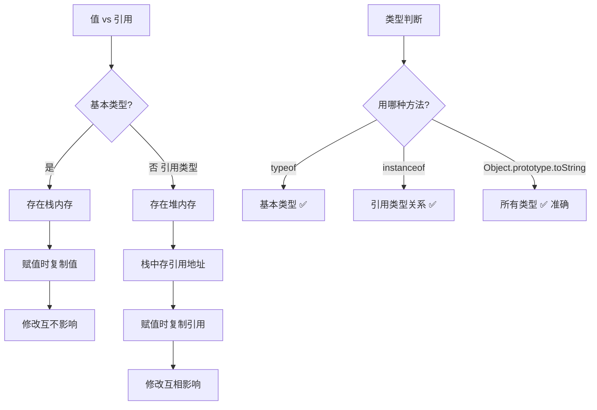
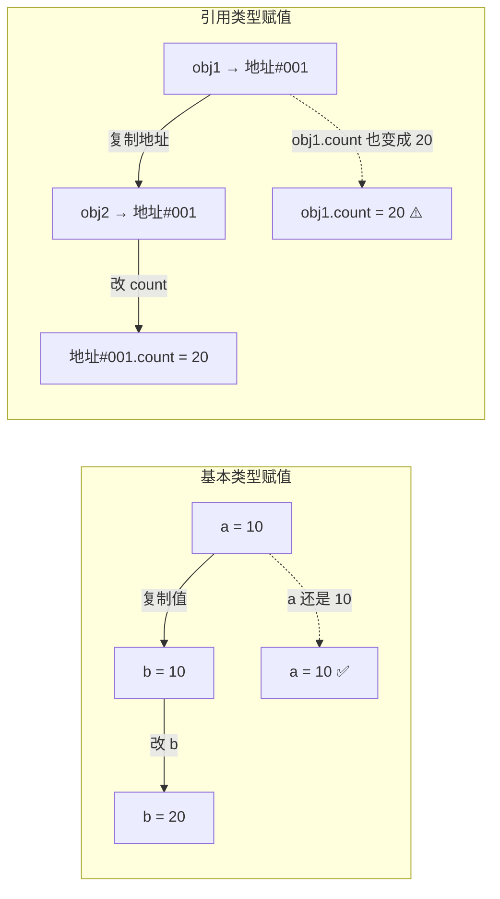
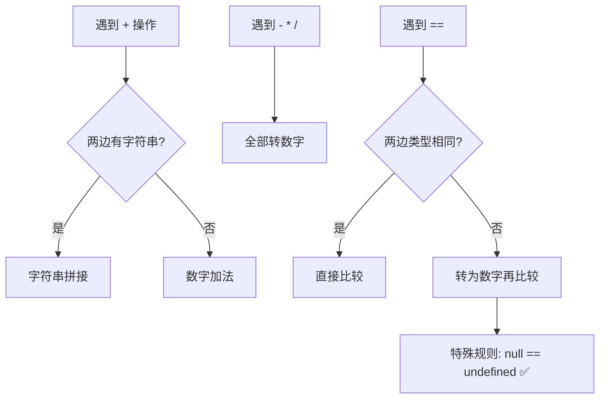

<DifficultyBadge level="beginner" />

# 数据类型与 API

## 一句话解释

JavaScript 有 **7 种基本类型**（string/number/boolean/null/undefined/symbol/bigint）和 **1 种引用类型**（object）——基本类型存值、不可变；引用类型存引用、可变。理解"值 vs 引用"是掌握 JS 数据类型的核心。

## 核心流程



## 深入理解

### 1. 基本类型 vs 引用类型

```javascript
// 基本类型 — 值传递
let a = 10
let b = a
b = 20
console.log(a)  // 10（没变）
console.log(b)  // 20

// 引用类型 — 引用传递
let obj1 = { count: 10 }
let obj2 = obj1
obj2.count = 20
console.log(obj1.count)  // 20（改了！）
console.log(obj2.count)  // 20
```



**两者的关键区别：**

| 对比 | 基本类型 | 引用类型 |
|------|---------|---------|
| 存储 | 栈内存（直接存值） | 堆内存（栈存地址） |
| 赋值 | 复制值 | 复制引用（地址） |
| 比较 | 比较值 | 比较引用（是否同一对象） |
| 可变性 | **不可变**（重新赋值是换新值） | **可变**（可以改属性） |
| 类型 | string/number/boolean/null/undefined/symbol/bigint | object/array/function |

### 2. 类型判断 — `typeof` 的陷阱

```javascript
console.log(typeof 42)             // 'number'
console.log(typeof 'hello')        // 'string'
console.log(typeof true)           // 'boolean'
console.log(typeof undefined)      // 'undefined'
console.log(typeof Symbol())       // 'symbol'
console.log(typeof 42n)            // 'bigint'
console.log(typeof null)           // 'object' ← ❌ 这是 JS 的经典 bug

console.log(typeof {})             // 'object'
console.log(typeof [])             // 'object' ← 数组也是 object
console.log(typeof new Date())     // 'object'
console.log(typeof function(){})   // 'function'
```

**正确的类型判断方案：**

```javascript
// 方案 1：typeof + null 检查
function isNull(value) {
  return value === null
}

// 方案 2：instanceof — 检查原型链
console.log([] instanceof Array)         // true
console.log({} instanceof Object)        // true
console.log(new Date() instanceof Date)  // true

// ⚠️ instanceof 的问题：可以跨 iframe 时失效（不同全局对象）

// 方案 3：Object.prototype.toString.call — 最准确
function getType(value) {
  return Object.prototype.toString.call(value)
}

console.log(getType(42))          // '[object Number]'
console.log(getType('hello'))     // '[object String]'
console.log(getType(null))        // '[object Null]'
console.log(getType([]))          // '[object Array]'
console.log(getType({}))          // '[object Object]'
console.log(getType(new Date()))  // '[object Date]'
console.log(getType(/regex/))     // '[object RegExp]'
console.log(getType(new Map()))   // '[object Map]'
console.log(getType(new Set()))   // '[object Set]'

// 封装一个通用的类型判断工具
function typeOf(value) {
  return Object.prototype.toString.call(value).slice(8, -1).toLowerCase()
}

console.log(typeOf([]))    // 'array'
console.log(typeOf(null))  // 'null'
console.log(typeOf({}))    // 'object'
```

### 3. 深浅拷贝（高频考点）

#### 3.1 浅拷贝

```javascript
const original = { name: 'Alice', hobbies: ['reading', 'swimming'] }

// 方式 1：展开运算符
const copy1 = { ...original }

// 方式 2：Object.assign
const copy2 = Object.assign({}, original)

// 方式 3：数组 slice
const arrCopy = original.hobbies.slice()

// ⚠️ 浅拷贝只复制一层
copy1.name = 'Bob'
console.log(original.name)  // 'Alice' ✅ 基本类型不受影响

copy1.hobbies.push('coding')
console.log(original.hobbies)  // ['reading', 'swimming', 'coding'] ❌ 引用类型受影响
```

#### 3.2 深拷贝

```javascript
// 方式 1：JSON.parse + JSON.stringify（有缺陷）
const deepCopy = JSON.parse(JSON.stringify(original))
// ⚠️ 缺陷：
// - 不能复制函数、undefined、Symbol
// - 循环引用会报错
// - Date 会变成字符串
// - Map/Set/RegExp 会变成空对象

// 方式 2：structuredClone（现代浏览器原生 API，2022+）
const deepCopy2 = structuredClone(original)
// ✅ 支持：循环引用、Date、Map、Set、RegExp、Blob
// ❌ 不支持：函数、DOM 节点、Error

// 方式 3：递归实现
function deepClone(value, map = new WeakMap()) {
  // 处理基本类型和 null
  if (value === null || typeof value !== 'object') return value
  
  // 处理循环引用
  if (map.has(value)) return map.get(value)
  
  // 处理 Date
  if (value instanceof Date) return new Date(value)
  
  // 处理 RegExp
  if (value instanceof RegExp) return new RegExp(value)
  
  // 处理 Map
  if (value instanceof Map) {
    const clone = new Map()
    map.set(value, clone)
    value.forEach((v, k) => clone.set(k, deepClone(v, map)))
    return clone
  }
  
  // 处理 Set
  if (value instanceof Set) {
    const clone = new Set()
    map.set(value, clone)
    value.forEach(v => clone.add(deepClone(v, map)))
    return clone
  }
  
  // 处理数组和对象
  const clone = Array.isArray(value) ? [] : {}
  map.set(value, clone)
  
  for (const key in value) {
    if (value.hasOwnProperty(key)) {
      clone[key] = deepClone(value[key], map)
    }
  }
  
  // 处理 Symbol 键
  for (const sym of Object.getOwnPropertySymbols(value)) {
    clone[sym] = deepClone(value[sym], map)
  }
  
  return clone
}
```

**深浅拷贝对比：**

| 特性 | 浅拷贝 | JSON 深拷贝 | structuredClone | 手写深拷贝 |
|------|-------|------------|----------------|-----------|
| 嵌套对象 | ❌ 共享引用 | ✅ 独立 | ✅ 独立 | ✅ 独立 |
| 函数 | ✅ 共享引用 | ❌ 丢失 | ❌ 不支持 | ✅ 复制引用 |
| undefined | ✅ | ❌ 丢失 | ✅ | ✅ |
| Symbol | ❌ 不复制 | ❌ 丢失 | ✅ | ✅ |
| 循环引用 | ✅ | ❌ 报错 | ✅ | ✅ |
| Date | ❌ 共享引用 | ❌ 变字符串 | ✅ | ✅ |
| 性能 | 最快 | 较快 | 原生（最快） | 较慢 |

### 4. 类型转换

```javascript
// 隐式转换 — 面试易错题
console.log(1 + '2')        // '12'（数字转字符串）
console.log('1' + 2)        // '12'
console.log(1 - '2')        // -1（字符串转数字）
console.log('5' * '2')      // 10（字符串转数字）
console.log(true + 1)       // 2（true 转 1）
console.log(false + 1)      // 1（false 转 0）
console.log(null + 1)       // 1（null 转 0）
console.log(undefined + 1)  // NaN（undefined 转 NaN）
console.log([] + [])        // ""（两个空数组变空字符串）
console.log([] + {})        // "[object Object]"
console.log({} + [])        // 0（这里 {} 被当成代码块，+[] = 0）

// 显式转换
console.log(Number('123'))     // 123
console.log(String(123))      // '123'
console.log(Boolean(0))       // false
console.log(Boolean(''))      // false
console.log(Boolean('false')) // true（非空字符串都是 true！）
```

**隐式转换规则（面试高频）：**



**经典面试题：**

```javascript
// [] == ![] 为什么是 true？
// 计算过程：
// 1. ![] → false（对象转布尔是 true，取反 false）
// 2. [] == false → [] 转数字 → '' 转数字 → 0，false 转数字 → 0
// 3. 0 == 0 → true

console.log([] == ![])  // true

// 日常建议：永远用 === 而不是 ==
// 永远不要依赖隐式转换的逻辑
```

### 5. 数组高阶方法

```javascript
const arr = [1, 2, 3, 4, 5]

// map — 映射（一一对应）
const doubled = arr.map(x => x * 2)    // [2, 4, 6, 8, 10]

// filter — 过滤
const evens = arr.filter(x => x % 2 === 0)  // [2, 4]

// reduce — 归约
const sum = arr.reduce((acc, cur) => acc + cur, 0)  // 15

// find — 找第一个匹配
const first = arr.find(x => x > 3)     // 4

// some — 任意一个满足
const hasEven = arr.some(x => x % 2 === 0)  // true

// every — 所有都满足
const allPositive = arr.every(x => x > 0)  // true

// flat — 扁平化
const nested = [1, [2, [3]]]
nested.flat()         // [1, 2, [3]]
nested.flat(2)        // [1, 2, 3]

// flatMap — 映射后扁平化（等价于 map + flat(1)）
const words = ['hello world', 'foo bar']
words.flatMap(s => s.split(' '))  // ['hello', 'world', 'foo', 'bar']
```

**链式调用（体现函数式编程）：**

```javascript
// 从用户列表中找出活跃用户的名字，排序后转大写
const result = users
  .filter(user => user.active)
  .map(user => user.name.toUpperCase())
  .sort()
// 每次调用返回新数组，不修改原数据
```

### 6. 对象操作方法

```javascript
const obj = { a: 1, b: 2, c: 3 }

// 获取键/值/条目
Object.keys(obj)     // ['a', 'b', 'c']
Object.values(obj)   // [1, 2, 3]
Object.entries(obj)  // [['a', 1], ['b', 2], ['c', 3]]

// 从条目重建对象
Object.fromEntries([['a', 1], ['b', 2]])  // { a: 1, b: 2 }

// 合并对象
const merged = { ...obj, d: 4 }            // { a:1, b:2, c:3, d:4 }
Object.assign({}, obj, { e: 5 })           // { a:1, b:2, c:3, e:5 }

// 冻结（不可修改）
Object.freeze(obj)
obj.a = 99     // 严格模式报错，非严格模式静默失败

// 密封（不可增删，可修改）
Object.seal(obj)
```

### 7. 常见面试题

```javascript
// 题 1：数组去重
const arr = [1, 2, 2, 3, 3, 4]
// ES6
[...new Set(arr)]          // [1, 2, 3, 4]
// 传统
arr.filter((v, i) => arr.indexOf(v) === i)

// 题 2：对象数组去重
const users = [
  { id: 1, name: 'Alice' },
  { id: 2, name: 'Bob' },
  { id: 1, name: 'Alice' }
]
// 用 Map
const unique = [...new Map(users.map(u => [u.id, u])).values()]

// 题 3：深比较两个对象是否相等
function deepEqual(a, b) {
  if (a === b) return true
  if (a === null || b === null) return false
  if (typeof a !== typeof b) return false
  
  const keysA = Object.keys(a)
  const keysB = Object.keys(b)
  if (keysA.length !== keysB.length) return false
  
  return keysA.every(key => 
    b.hasOwnProperty(key) && deepEqual(a[key], b[key])
  )
}

// 题 4：空对象判断
function isEmpty(obj) {
  return Object.keys(obj).length === 0
}
// 注意：Object.keys 只返回可枚举的自有属性
```

## 面试问法

- 🔥 **基本类型和引用类型的区别？**
  - 存值 vs 存引用；不可变 vs 可变；复制值 vs 复制引用
  - 用 `===` 比较时，基本类型比值，引用类型比地址

- 🔥 **怎么判断一个值的准确类型？**
  - `typeof`：基本类型（除 null）
  - `Object.prototype.toString.call()`：所有类型（最准确）
  - `instanceof`：引用类型关系

- 🔥 **深拷贝和浅拷贝的区别？怎么实现深拷贝？**
  - 浅拷贝复制一层，嵌套对象共享引用
  - 深拷贝完全独立，用 `structuredClone` 或递归实现
  - JSON.parse + JSON.stringify 有缺陷（丢失函数/undefined/Symbol）

- ⭐ **`==` 和 `===` 的区别？**
  - `===`：类型不同直接 false，类型相同再比较值
  - `==`：类型不同时做隐式转换
  - 日常永远用 `===`

- ⭐ **数组的 `map`、`filter`、`reduce` 的区别和适用场景？**
  - map：一一映射，长度不变
  - filter：过滤，长度减少或不变
  - reduce：归约为单个值
  - 都返回新数组 / 新值，不修改原数组

- ⭐ **null 和 undefined 的区别？**
  - undefined：声明了但未赋值
  - null：主动赋值为"空"
  - `null == undefined` → true；`null === undefined` → false

## 💡 AI 辅助学习

> 用这个 Prompt 练习类型操作：
> "我是一个准备面试的前端开发者，请给我出 5 道关于 JS 数据类型和数组操作的面试题，难度递进（简单→中等→困难）。每道题包含：
> 1. 题目描述
> 2. 输入输出示例
> 3. 至少两种解题思路（ES6 简洁写法 + 传统写法）
> 4. 考察的知识点
> 
> 题目方向：数组去重、对象深拷贝、类型判断、数组扁平化、数组交集/差集。"

## 关联知识

- [JS 执行机制](./js-execution) — 执行上下文
- [原型链与继承](./js-prototype) — prototype、class
- [JS 异步编程](./js-async) — Promise、async/await
- [事件循环 Event Loop](./js-event-loop) — 宏任务/微任务
