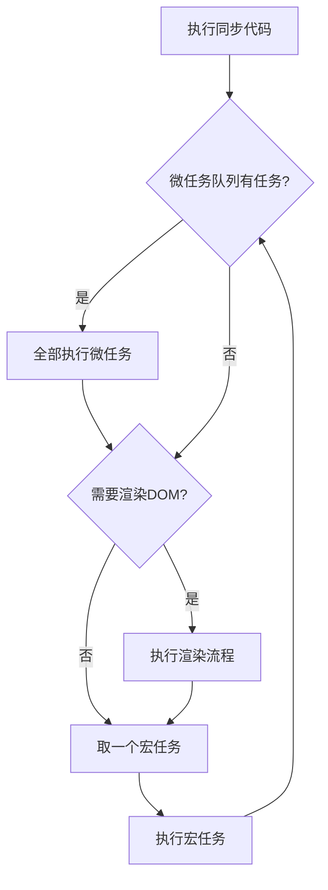
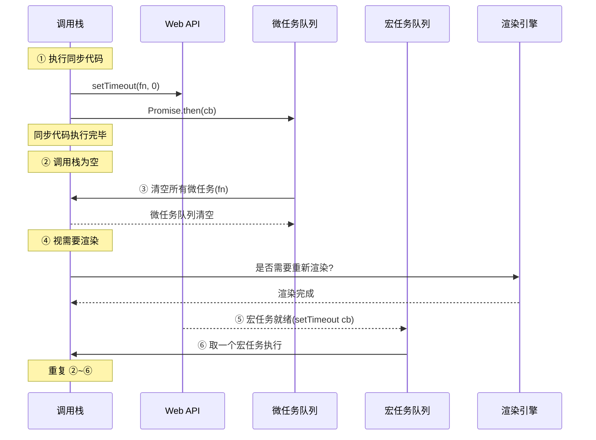
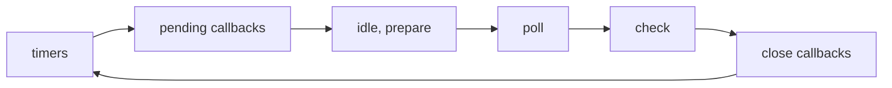

<DifficultyBadge level="beginner" />

# 事件循环 (Event Loop)

## 一句话解释

事件循环是 JS 的"任务调度器"——它决定了代码执行的顺序：**先同步、再微任务、再渲染、再宏任务、不断循环**。

## 核心流程



执行顺序口诀：**同微染宏**（同步 → 微任务 → 渲染 → 宏任务 → 不断循环）

## 深入理解

### 任务分类

| 类型 | 来源 | 示例 |
|------|------|------|
| **同步代码** | 当前执行栈 | `console.log()`、普通函数调用 |
| **微任务** | 在当前任务结束后、下一个任务开始前 | `Promise.then/catch/finally`、`MutationObserver`、`queueMicrotask` |
| **宏任务** | 由宿主环境按序调度 | `setTimeout/setInterval`、`I/O`、`UI 事件回调` |

### 一次完整的事件循环



## 代码示例

### 经典面试题

```javascript
console.log('1: 同步')

setTimeout(() => console.log('2: setTimeout'), 0)

Promise.resolve()
  .then(() => console.log('3: Promise.then'))
  .then(() => console.log('4: Promise.then2'))

queueMicrotask(() => console.log('5: queueMicrotask'))

console.log('6: 同步2')

// 输出顺序: 1 → 6 → 3 → 5 → 4 → 2
//          (同步)  (微任务)      (宏任务)
```

### 含 async/await 的复杂情况

```javascript
async function foo() {
  console.log('0: async 函数开始')
  await bar()
  console.log('4: await 之后')
}

async function bar() {
  console.log('1: 进入 bar')
}

console.log('2: 同步开始')
foo()
console.log('3: 同步结束')

Promise.resolve().then(() => console.log('5: Promise.then'))

// 输出: 2 → 0 → 1 → 3 → 4 → 5
```

> 关键点：`await` 之后的代码相当于被 `Promise.resolve().then()` 包裹，属于微任务。

### Node.js 事件循环（额外）

Node.js 的事件循环分为 6 个阶段：



Node.js 特有阶段：
- **timers**: 执行 `setTimeout` / `setInterval` 的回调
- **poll**: 轮询 I/O 事件，执行 I/O 回调
- **check**: 执行 `setImmediate` 的回调
- **close**: 执行 close 事件的回调

```javascript
setTimeout(() => console.log('setTimeout'), 0)
setImmediate(() => console.log('setImmediate'))
// 在顶层代码中，执行顺序不确定（受性能影响）

// 但在 I/O 回调中，setImmediate 永远先于 setTimeout
fs.readFile('file.txt', () => {
  setTimeout(() => console.log('setTimeout'), 0)
  setImmediate(() => console.log('setImmediate'))
  // 输出: setImmediate → setTimeout
})
```

## 面试问法

- 🔥 **以下代码的输出顺序是什么？**
  - 考察微任务和宏任务的执行顺序
  - 回答框架：同步 → 微任务(Promise/queueMicrotask) → 宏任务(setTimeout)
  
- 🔥 **requestAnimationFrame 是宏任务还是微任务？**
  - 都不是。它在渲染之前执行，属于"动画帧回调"，在微任务之后、渲染之前
  
- ⭐ **浏览器和 Node.js 的事件循环有什么区别？**
  - 浏览器：一个宏任务 → 全部微任务 → 渲染 → 下一个宏任务
  - Node.js：6 个阶段循环，每个阶段有各自的回调队列，阶段间执行微任务
  
- ⭐ **如何实现一个精准的每秒执行？**
  - `setInterval` 不可靠（执行时间会漂移）
  - 推荐用 `setTimeout` 递归 + 时间差补偿

```javascript
function preciseTimer(cb, interval) {
  let expected = Date.now() + interval
  function step() {
    cb()
    const drift = Date.now() - expected
    expected += interval
    setTimeout(step, Math.max(0, interval - drift))
  }
  setTimeout(step, interval)
}
```

## 💡 AI 辅助学习

> 用这个 Prompt 让 AI 帮你出事件循环练习题：
> "你是前端面试官，请出 5 道涉及 setTimeout、Promise、async/await、requestAnimationFrame 混合使用的代码输出题，每道题附带详细执行过程分析，标注每一步属于同步/微任务/宏任务/渲染。"

## 关联知识

- [JS 异步编程](/fundamentals/js-async) — Promise / async/await 详细原理
- [JS 执行机制](/fundamentals/js-execution) — 执行上下文、作用域链、闭包
- [浏览器渲染流水线](/fundamentals/browser-rendering) — 渲染过程与 requestAnimationFrame
