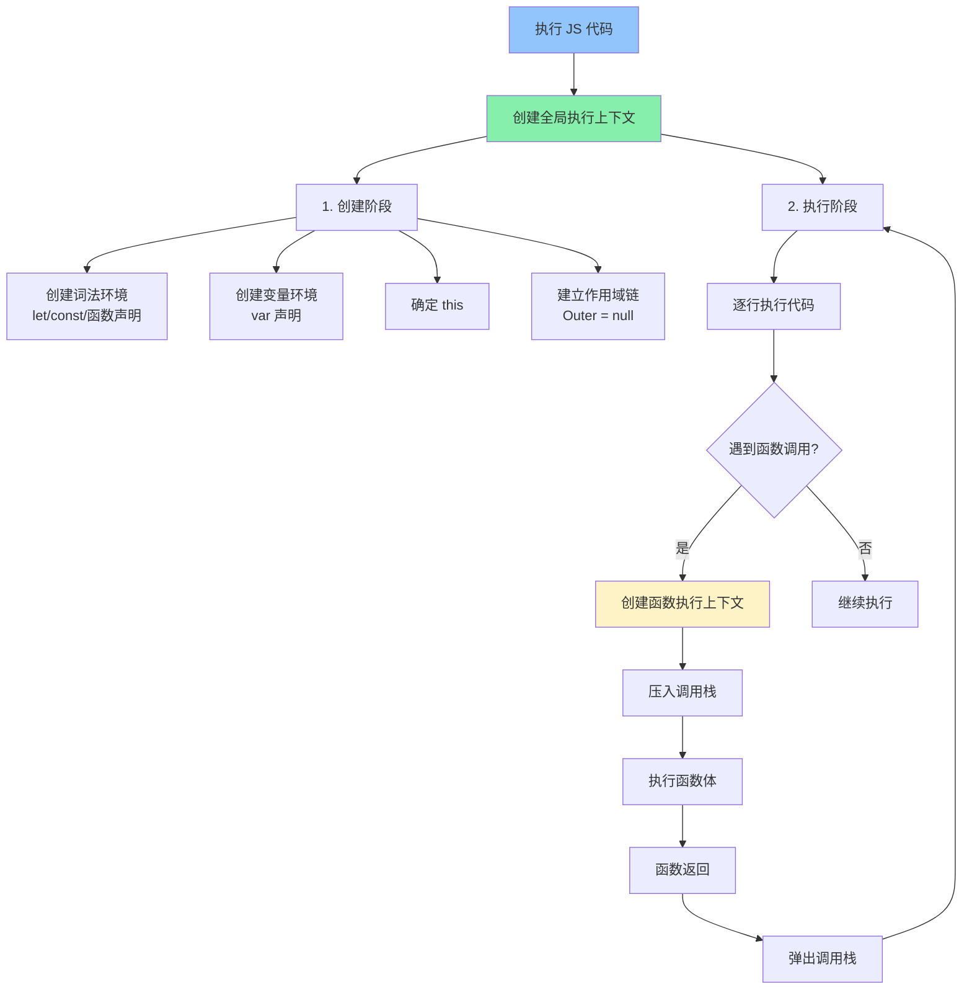
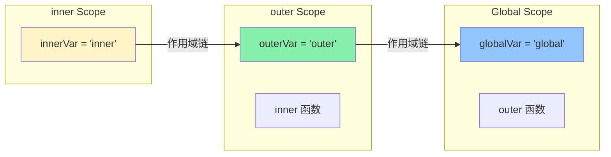
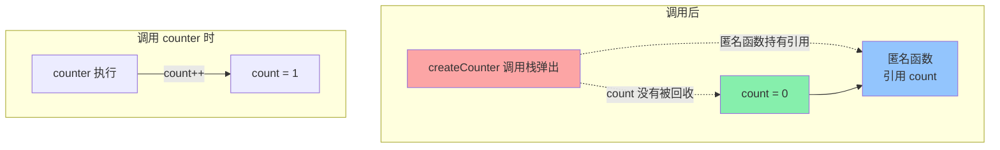

<DifficultyBadge level="beginner" />

# JS 执行机制

## 一句话解释

JavaScript 代码执行前会先**创建执行上下文**（确定 this、声明变量/函数、建立作用域链），然后**逐行解释执行**；函数调用时创建新上下文压入调用栈，执行完弹出——整个过程由 **调用栈 + 作用域链 + this 绑定** 三个机制协同完成。

## 核心流程



## 深入理解

### 1. 执行上下文（Execution Context）

JavaScript 代码每进入一个执行环境都会创建一个执行上下文。有三种类型：

**全局执行上下文：**
- 代码运行时的默认环境（浏览器中的 `window`，Node 中的 `global`）
- **只有一个**，在程序启动时创建

**函数执行上下文：**
- 每次调用函数时创建
- **每个函数调用都有自己的上下文**

**Eval 执行上下文：**
- `eval()` 函数运行时创建（几乎不用）

**面试图：调用栈的变化**

```javascript
function baz() {
  console.log('baz')
}

function bar() {
  baz()
}

function foo() {
  bar()
}

foo()
// 调用栈变化：
// 1. [global] ← 程序开始
// 2. [global, foo] ← 调用 foo()
// 3. [global, foo, bar] ← foo 调用 bar()
// 4. [global, foo, bar, baz] ← bar 调用 baz()
// 5. [global, foo, bar] ← baz 返回
// 6. [global, foo] ← bar 返回
// 7. [global] ← foo 返回
```

### 2. 创建阶段（Hoisting 的真相）

**`var`、`let`、`const`、函数声明在执行上下文创建阶段的行为完全不同：**

```javascript
console.log(a)    // undefined（var 提升但未初始化）
console.log(b)    // ReferenceError: Cannot access 'b' before initialization
console.log(c)    // ReferenceError: Cannot access 'c' before initialization
fn()              // "hello"（函数声明提升且可调用）

var a = 1
let b = 2
const c = 3

function fn() {
  console.log('hello')
}
```

**各声明的变量提升行为：**

| 声明方式 | 提升？ | 初始化？ | 暂时性死区？ | 可重复声明？ |
|---------|-------|---------|------------|------------|
| `var` | ✅ 提升到作用域顶 | `undefined` | ❌ | ✅ |
| `let` | ✅ 提升到作用域顶 | ❌ 未初始化 | ✅ | ❌ |
| `const` | ✅ 提升到作用域顶 | ❌ 未初始化 | ✅ | ❌ |
| 函数声明 | ✅ 提升到作用域顶 | ✅ 函数体 | ❌ | ❌（后覆盖前） |
| 函数表达式 | 同 `var`/`let` | 取决于变量声明方式 | 取决于变量声明方式 | ❌ |

> **面试关键：** 所谓"变量提升"实际是词法环境的创建过程——所有声明都在进入作用域时被注册，但 `let/const` 在初始化前不可访问（暂时性死区）。

### 3. 作用域链（Scope Chain）

**JavaScript 是词法作用域（静态作用域）**——作用域在**写代码的时候**就确定了，不是运行时。

```javascript
const globalVar = 'global'

function outer() {
  const outerVar = 'outer'
  
  function inner() {
    const innerVar = 'inner'
    console.log(innerVar)  // 'inner' — 自己的作用域
    console.log(outerVar)  // 'outer' — 外层作用域
    console.log(globalVar) // 'global' — 全局作用域
  }
  
  inner()
}

outer()
```



**关键理解：**
- `inner()` 可以访问 `outer()` 和全局中的变量
- 但全局**不能**访问 `outerVar` 和 `innerVar`
- 作用域链是**单向的**：内部→外部

### 4. 闭包（Closure）— 高频考点

**闭包 = 函数 + 该函数能访问的外部变量（即使外部函数已返回）。**

```javascript
function createCounter() {
  let count = 0  // 这个变量被"闭包"了
  
  return function() {
    count++       // 即使 createCounter 已返回，仍能访问 count
    return count
  }
}

const counter = createCounter()
console.log(counter()) // 1
console.log(counter()) // 2
console.log(counter()) // 3
// createCounter 的执行上下文早已弹出调用栈
// 但 count 仍然存在，被闭包引用着
```



**闭包的经典应用：**

```javascript
// ① 私有变量
function createPerson(name) {
  let _name = name  // 私有，外部不能直接访问
  
  return {
    getName: () => _name,
    setName: (newName) => { _name = newName }
  }
}

const p = createPerson('Alice')
console.log(p.getName())  // 'Alice'
p.setName('Bob')
console.log(p.getName())  // 'Bob'
console.log(p._name)      // undefined — 不能直接访问

// ② 循环中的闭包陷阱
// ❌ 问题代码
for (var i = 0; i < 3; i++) {
  setTimeout(() => console.log(i), 100)  // 打印 3, 3, 3
}

// ✅ 修复方案 1：用 let（块级作用域）
for (let i = 0; i < 3; i++) {
  setTimeout(() => console.log(i), 100)  // 打印 0, 1, 2
}

// ✅ 修复方案 2：用闭包包裹
for (var i = 0; i < 3; i++) {
  (function(j) {
    setTimeout(() => console.log(j), 100)  // 打印 0, 1, 2
  })(i)
}
```

### 5. this 绑定（核心难点）

**`this` 不是在定义时确定，而是在**调用时**根据调用方式确定。**

```javascript
// 5 条规则（从高到低优先级）：

// 规则 1：new 绑定（最高优先级）
function Person(name) {
  this.name = name  // this → 新创建的对象
}
new Person('Alice')

// 规则 2：显式绑定（call/apply/bind）
function greet() { return `Hello, ${this.name}` }
const user = { name: 'Bob' }
greet.call(user)    // 'Hello, Bob' — this → user
greet.apply(user)   // 'Hello, Bob'
const bound = greet.bind(user)
bound()              // 'Hello, Bob'

// 规则 3：隐式绑定（对象方法调用）
const obj = {
  name: 'Charlie',
  sayHi() { return this.name }
}
obj.sayHi()         // 'Charlie' — this → obj

// 规则 4：默认绑定（严格模式 undefined / 非严格模式 window）
function show() {
  'use strict'
  console.log(this)  // undefined
}

// 规则 5：箭头函数（不绑定自己的 this）
// 箭头函数没有自己的 this，捕获外层作用域的 this
const obj2 = {
  name: 'David',
  sayHi: () => this.name,        // ❌ this 不指向 obj2
  sayHi2() {
    setTimeout(() => {
      console.log(this.name)     // ✅ this 来自 sayHi2 的 this
    }, 100)
  }
}
```

**this 绑定练习：**

```javascript
const obj = {
  name: 'obj',
  fn: function() {
    console.log(this.name)
  }
}

const fn = obj.fn

obj.fn()      // 'obj' — 隐式绑定（对象方法调用）
fn()          // undefined（严格模式）/ 'window'（非严格）— 默认绑定
setTimeout(obj.fn, 100)  // undefined/window — 引用丢掉了
setTimeout(() => obj.fn(), 100)  // 'obj' — 箭头函数保留 this
```

### 6. 调用栈溢出

```javascript
// 递归没有终止条件 → 栈溢出
function infinite() {
  return infinite()
}
infinite()
// RangeError: Maximum call stack size exceeded

// 尾递归优化（仅 Safari 支持）
function factorial(n, acc = 1) {
  if (n <= 1) return acc
  return factorial(n - 1, n * acc)  // 尾调用 → 不增加栈帧
}
```

## 面试问法

- 🔥 **什么是执行上下文？有哪几种？**
  - 代码执行时的环境抽象，包含变量、作用域链、this 指向
  - 全局执行上下文（一个）、函数执行上下文（调用时创建）、eval 上下文

- 🔥 **说说变量提升和暂时性死区？**
  - var 声明提升到作用域顶，初始化为 undefined
  - let/const 提升但不能访问（暂时性死区），直到声明行才初始化
  - 函数声明整个提升

- 🔥 **闭包是什么？有什么应用？**
  - 函数 + 函数能访问的外部变量（即使外部函数已返回）
  - 应用：私有变量、柯里化、防抖节流、模块模式
  - 缺点：闭包引用的变量不会被 GC 回收，可能造成内存泄漏

- 🔥 **this 指向怎么确定？箭头函数的 this 有什么不同？**
  - 看调用方式：new > call/apply/bind > 对象方法 > 默认绑定
  - 箭头函数没有自己的 this，捕获外层作用域的 this
  - 箭头函数的 this 在定义时确定，不能通过 call/apply/bind 改变

- ⭐ **调用栈是什么？栈溢出怎么发生的？**
  - LIFO 结构，记录函数调用顺序
  - 递归没有终止条件 / 递归太深会导致栈溢出
  - 尾递归优化可以解决（但仅 Safari 实现）

- ⭐ **eval 和 with 为什么不好？**
  - 在执行期修改作用域链 → 引擎无法优化 → 性能差
  - eval 可以执行任意代码 → 安全问题
  - 严格模式下禁止使用

## 💡 AI 辅助学习

> 用这个 Prompt 深入理解执行机制：
> "我是一个准备前端面试的开发者，请帮我通过以下代码题来理解 JS 执行机制。对于每一段代码，请：
> 1. 画出调用栈的变化过程（分步骤）
> 2. 标出每个执行上下文的变量和 this 指向
> 3. 解释最终输出结果
> 
> 代码题：
> ```javascript
> var name = 'global'
> function outer() {
>   var name = 'outer'
>   function inner() {
>     console.log(name)
>   }
>   return inner
> }
> var fn = outer()
> fn()
> ```"

## 关联知识

- [事件循环 Event Loop](./js-event-loop) — 宏任务/微任务
- [JS 异步编程](./js-async) — Promise/async/await
- [原型链与继承](./js-prototype) — prototype/class
- [数据类型与 API](./js-data-types) — 深浅拷贝、类型判断
