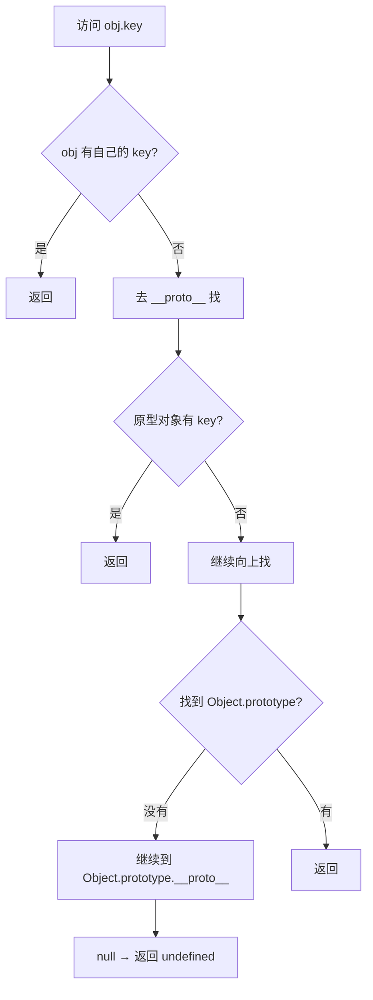
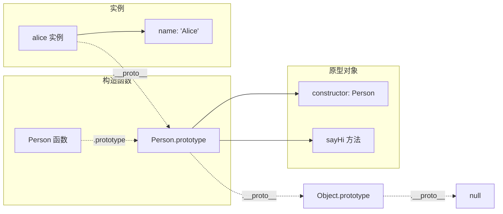

<DifficultyBadge level="beginner" />

# 原型链与继承

## 一句话解释

原型链是 JavaScript 的**对象继承机制**——每个对象内部都有一个 `[[Prototype]]`（`__proto__`）指向其"原型对象"，访问属性时沿着这个链条一路向上查找，直到找到或走到 `null`。ES6 的 `class` 只是原型链的**语法糖**。

## 核心流程



## 深入理解

### 1. 原型的基础

```javascript
// 每个对象都有一个隐藏的 [[Prototype]]（__proto__）
const obj = { name: 'Alice' }
// obj.__proto__ → Object.prototype
// Object.prototype.__proto__ → null

// 原型链的作用：属性查找
console.log(obj.toString())  // '[object Object]'
// obj 自己没有 toString → 去 obj.__proto__（Object.prototype）找 → 找到了
```

**三个关键角色：**

```javascript
// 1. 构造函数（Function）
function Person(name) {
  this.name = name
}

// 2. 原型对象（prototype）
Person.prototype.sayHi = function() {
  console.log(`Hi, I'm ${this.name}`)
}

// 3. 实例（Instance）
const alice = new Person('Alice')
alice.sayHi()  // "Hi, I'm Alice"
```



### 2. `prototype` vs `__proto__` vs `constructor`

**这三个是最容易混淆的概念：**

```javascript
// prototype — 构造函数的属性
function Foo() {}
console.log(Foo.prototype)  // { constructor: Foo } — 只有函数才有

// __proto__ — 每个对象都有的内部属性（指向构造函数的 prototype）
const foo = new Foo()
console.log(foo.__proto__)     // Foo.prototype
console.log(foo.__proto__ === Foo.prototype)  // true

// constructor — 原型上的属性，指回构造函数
console.log(Foo.prototype.constructor === Foo)  // true
console.log(foo.constructor === Foo)            // true（通过原型链找到的）
```

| 名称 | 谁有 | 指向谁 | 作用 |
|------|------|-------|------|
| `prototype` | **函数**都有 | 该函数作为构造函数时创建的原型对象 | 定义共享方法/属性 |
| `__proto__` | **所有对象**都有 | 创建该对象的构造函数的 prototype | 原型链查找 |
| `constructor` | **原型对象**有 | 指回构造函数 | 反向引用 |

> **`__proto__` 是浏览器实现的非标准属性，标准中使用 `Object.getPrototypeOf()` / `Object.setPrototypeOf()`。**

### 3. 继承方式演进

#### 3.1 原型链继承

```javascript
function Parent(name) {
  this.name = name
  this.hobbies = ['reading']
}

Parent.prototype.sayHi = function() {
  console.log(`Hi, ${this.name}`)
}

function Child(name, age) {
  this.age = age
}

// 让 Child 的原型指向 Parent 的实例
Child.prototype = new Parent('parent')

const c1 = new Child('Alice', 10)
const c2 = new Child('Bob', 12)

// ⚠️ 问题：引用类型被所有实例共享
c1.hobbies.push('swimming')
console.log(c2.hobbies)  // ['reading', 'swimming'] — 被改了！
```

**问题：** 父类的引用类型属性（数组/对象）被子类所有实例共享。

#### 3.2 组合继承（经典方式）

```javascript
function Parent(name) {
  this.name = name
  this.hobbies = ['reading']
}

Parent.prototype.sayHi = function() {
  console.log(`Hi, ${this.name}`)
}

function Child(name, age) {
  Parent.call(this, name)  // ✅ 第二次调用 Parent：在实例上创建属性
  this.age = age
}

Child.prototype = new Parent()     // ❌ 第一次调用 Parent：创建原型上的属性
Child.prototype.constructor = Child

const c1 = new Child('Alice', 10)
const c2 = new Child('Bob', 12)

c1.hobbies.push('swimming')
console.log(c1.hobbies)  // ['reading', 'swimming']
console.log(c2.hobbies)  // ['reading'] — ✅ 不共享
```

**问题：** Parent 被调用了两次（一次 `new Parent()`，一次 `Parent.call`）。

#### 3.3 寄生组合继承（最优解）

```javascript
function Parent(name) {
  this.name = name
}

Parent.prototype.sayHi = function() {
  console.log(`Hi, ${this.name}`)
}

function Child(name, age) {
  Parent.call(this, name)  // ✅ 只在这里调用 Parent
  this.age = age
}

// ✅ 核心：用 Object.create 创建原型，避免调用父构造函数
Child.prototype = Object.create(Parent.prototype)
Child.prototype.constructor = Child

const c1 = new Child('Alice', 10)
c1.sayHi()  // "Hi, Alice"
```

**继承方式对比：**

| 方式 | 父构造函数调用次数 | 引用类型共享？ | 能否传参？ |
|------|-------------------|--------------|-----------|
| 原型链继承 | 1 次 | ❌ 共享 | ❌ 不能 |
| 借用构造函数 | 1 次 | ✅ 不共享 | ✅ 能 |
| 组合继承 | 2 次 | ✅ 不共享 | ✅ 能 |
| **寄生组合继承** | **1 次** | ✅ **不共享** | ✅ **能** |

### 4. ES6 class — 语法糖

```javascript
class Parent {
  constructor(name) {
    this.name = name
  }
  
  // 原型上的方法
  sayHi() {
    console.log(`Hi, ${this.name}`)
  }
  
  // 静态方法（构造函数上的方法）
  static create(name) {
    return new Parent(name)
  }
}

class Child extends Parent {
  constructor(name, age) {
    super(name)  // 调用 Parent 的构造函数
    this.age = age
  }
  
  // 覆盖父类方法
  sayHi() {
    super.sayHi()  // 调用父类方法
    console.log(`I'm ${this.age} years old`)
  }
}

const c = new Child('Alice', 10)
c.sayHi()
// "Hi, Alice"
// "I'm 10 years old"
```

**class 的本质（编译后）：**

```javascript
// class 编译后 = 构造函数 + prototype 方法
class Foo { }
console.log(typeof Foo)  // 'function' — 还是函数

// extends 编译后 ≈ 寄生组合继承
class Bar extends Foo { }
// Bar.prototype.__proto__ === Foo.prototype
// Bar.__proto__ === Foo（静态方法继承）
```

**面试考点：class 和构造函数的区别**

| 对比 | 构造函数 | class |
|------|---------|-------|
| 调用方式 | `new Person()` 或 `Person()` | **必须** `new`，否则报错 |
| 方法枚举 | 原型方法可枚举 | 原型方法**不可**枚举 |
| 严格模式 | 非严格模式可用 | **始终**严格模式 |
| 变量提升 | 提升 | 不提升（暂时性死区） |

### 5. `instanceof` 的原理

```javascript
function myInstanceof(instance, constructor) {
  // 检查 constructor.prototype 是否在 instance 的原型链上
  let proto = Object.getPrototypeOf(instance)
  
  while (proto) {
    if (proto === constructor.prototype) return true
    proto = Object.getPrototypeOf(proto)
  }
  
  return false
}

console.log(myInstanceof([], Array))     // true
console.log(myInstanceof([], Object))    // true（数组原型链上也有 Object.prototype）
console.log(myInstanceof([], Function))  // false
```

```mermaid
flowchart TD
    A[[] 空数组] -->|__proto__| B[Array.prototype]
    B -->|__proto__| C[Object.prototype]
    C -->|__proto__| D[null]
    
    E[Array.prototype.constructor = Array]
    F[Object.prototype.constructor = Object]
    
    B -.-> E
    C -.-> F
    
    G["[] instanceof Array"] -->|true| H["沿着原型链找到了 Array.prototype"]
    I["[] instanceof Object"] -->|true| J["沿着原型链找到了 Object.prototype"]
```

### 6. 属性设置与屏蔽

```javascript
const parent = { x: 1 }
const child = Object.create(parent)

console.log(child.x)  // 1（来自原型链）

child.x = 2            // 设置自己的属性（屏蔽原型上的 x）
console.log(child.x)  // 2（自己的属性）
console.log(parent.x)  // 1（没变）

delete child.x
console.log(child.x)  // 1（删掉自己的，原型上的又可见了）
```

**属性的三种操作效果：**
- **读取**：走原型链查找
- **设置**：创建自己的属性（**屏蔽**原型上的同名属性）
- **删除**：只能删自己的属性，不能删原型上的

### 7. 原型方法的 this 指向

```javascript
// 原型方法的 this 指向调用者（不是原型对象）
function Person(name) {
  this.name = name
}

Person.prototype.sayHi = function() {
  console.log(this.name)
}

const p = new Person('Alice')
p.sayHi()  // 'Alice' — this 指向 p

// 注意引用丢失的情况
const fn = p.sayHi  // 方法被赋值给变量
fn()  // undefined — this 指向 window / undefined
```

## 面试问法

- 🔥 **`prototype` 和 `__proto__` 的区别？**
  - `prototype` 是函数的属性，定义共享方法
  - `__proto__` 是对象的内部属性，指向构造函数的 prototype
  - 函数也是对象，所以函数既有 `prototype` 又有 `__proto__`

- 🔥 **原型链是什么？属性查找机制怎么工作的？**
  - 对象访问属性时，先找自己，没有就沿着 `__proto__` 向上找
  - 直到 `Object.prototype.__proto__` 为 null，没找到返回 undefined
  - "原型链"的链就是 `__proto__` 的连接

- 🔥 **ES6 class 是新的面向对象机制吗？**
  - 不是，class 是原型链的语法糖
  - `typeof class` → 'function'
  - class 继承（extends）的本质是寄生组合继承 + 父类静态方法继承

- ⭐ **new 操作符做了什么？**
  - 创建空对象
  - 把空对象的 `__proto__` 指向构造函数的 prototype
  - 把构造函数的 this 指向空对象并执行
  - 如果构造函数返回对象则用它，否则返回新创建的对象

- ⭐ **组合继承和寄生组合继承的区别？**
  - 组合继承：父构造函数调用 2 次（`new Parent()` + `Parent.call()`）
  - 寄生组合继承：父构造函数调用 1 次（`Parent.call()`），用 `Object.create(Parent.prototype)` 继承原型

- ⭐ **instanceof 的原理？**
  - 检查右侧构造函数的 prototype 是否在左侧对象的原型链上
  - 可以用 `Object.getPrototypeOf()` 手动实现

## 💡 AI 辅助学习

> 用这个 Prompt 深入理解原型链：
> "我是一个准备面试的前端开发者。请帮我画一个"原型链全景图"，包含以下所有角色之间的关系：
> 
> ```javascript
> function Foo() {}
> const foo = new Foo()
> ```
> 
> 请用 Mermaid.js 或 ASCII 图展示以下关系：
> 1. foo.__proto__、Foo.prototype、Foo.prototype.constructor、Foo 之间的关系
> 2. Foo.__proto__、Function.prototype、Object.prototype 之间的关系
> 3. foo → Foo.prototype → Object.prototype → null 的整条链条
> 4. 为什么 foo.constructor 能指向 Foo？
> 5. 为什么 foo instanceof Object 是 true？
> 
> 用箭头标注每一条关系，并给出文字解释。"

## 关联知识

- [JS 执行机制](./js-execution) — 执行上下文、this 绑定
- [JS 数据类型与 API](./js-data-types) — 类型判断、深/浅拷贝
- [ES6 class 本质](./js-data-types) — class 语法糖
