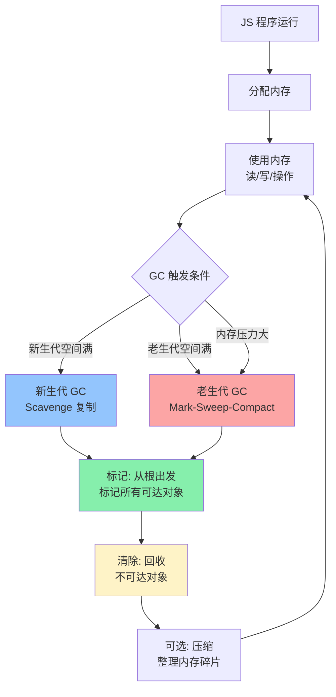
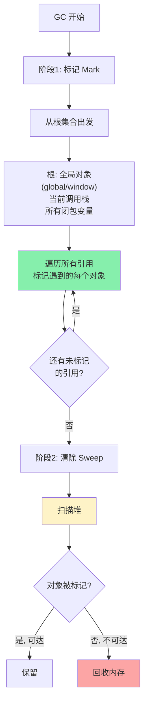
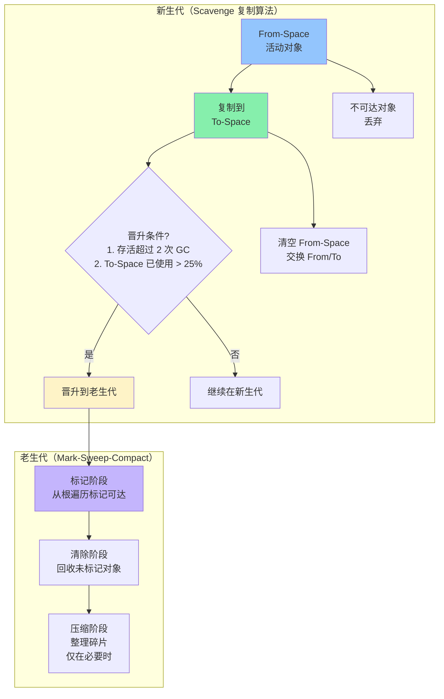
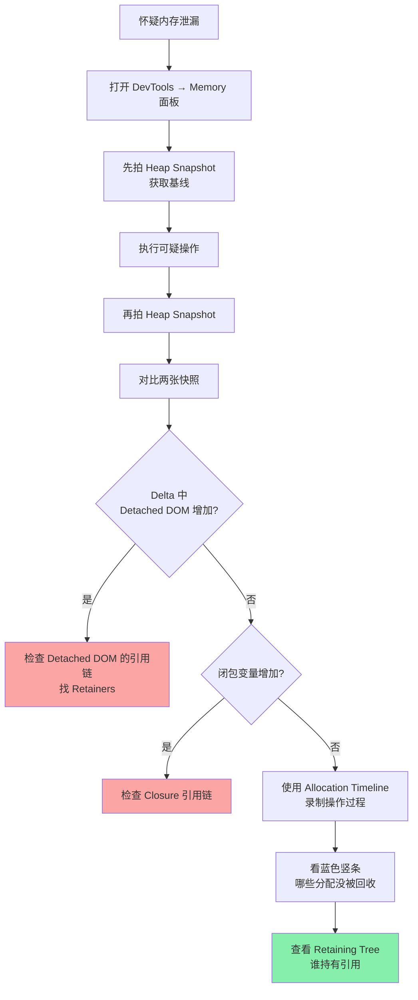

<DifficultyBadge level="advanced" />

# 内存管理与泄漏排查

## 一句话解释

JavaScript 自动管理内存（**GC 垃圾回收**），核心算法是**标记清除（Mark-and-Sweep）**——从根对象（全局对象/闭包/调用栈）出发，标记所有"可达"对象，然后清除不可达对象；**内存泄漏**就是"本应被回收的对象因意外引用而无法回收"，排查工具是 Chrome DevTools Memory 面板中的 **Heap Snapshot** 和 **Allocation Timeline**。

## 核心流程



## 深入理解

### 1. 内存生命周期与栈/堆

```javascript
// JS 内存分两大区域：

// 📦 栈（Stack）— 函数调用 + 基本类型
function foo() {
  const a = 1          // 基本类型 → 栈
  const b = 'hello'    // 字符串 → 栈（小字符串）
  const c = true       // 布尔 → 栈
  const d = null       // → 栈
  return a + 1
}
// ⚡ 栈内存自动管理：函数返回即自动释放

// 🗄️ 堆（Heap）— 对象/数组/函数
function bar() {
  const obj = {        // 对象 → 堆（栈存引用地址）
    id: 1,
    data: new Array(10000)  // 数组 → 堆
  }
  const fn = () => {}  // 函数 → 堆
  return obj
}
// 🐢 堆内存需要 GC 回收：没人引用时才会被回收
```

| 区域 | 存储内容 | 管理方式 | 速度 | 大小 |
|------|---------|---------|------|------|
| **栈** | 基本类型 + 引用地址 + 调用帧 | 自动（函数退出即释放） | ⚡ 极快 | 很小（~1MB） |
| **堆** | 对象/数组/函数/闭包变量 | GC 回收 | 🐢 较慢 | 很大（~GB） |

---

### 2. 引用计数 — 老算法，仍有意义

```javascript
// 引用计数的核心思想：每个对象记录被引用的次数
let a = { data: 'hello' }  // 引用计数 = 1
let b = a                  // 引用计数 = 2
a = null                   // 引用计数 = 1
b = null                   // 引用计数 = 0 ✅ 可回收

// ❌ 循环引用 — 引用计数无法处理
function loopRef() {
  const a = {}
  const b = {}
  a.ref = b   // b 的引用计数: 1
  b.ref = a   // a 的引用计数: 1
  return 'done'
  // 函数返回后，a 和 b 的引用计数都是 1（互相引用）
  // 引用计数法：永远不回收 ❌
  // 标记清除法：从全局根出发，不可达 → 回收 ✅
}
```

> 现代 JS 引擎**不再使用纯粹的引用计数**，但理解它有助于理解 WeakMap/WeakRef 的设计动机。

---

### 3. 标记清除（Mark-and-Sweep）— 现代 GC 核心



```javascript
// 标记清除的运行示例
// 全局根: window / global

const globalObj = {                // ✅ 根可达 → 标记
  data: new Array(1000),          // ✅ 根可达（被 globalObj 引用）
  child: {                        // ✅ 根可达
    nested: { text: 'hello' }     // ✅ 根可达
  }
}

function demo() {
  const local = { temp: 'data' }  // ✅ 调用栈可达 → 标记
  const unused = { waste: true }  // ✅ 当前也标记
  // return
  // 函数返回后，local 和 unused 从栈弹出
  // 下次 GC: 不可达 → 清除
}

demo()

// 👇 这里还有引用
console.log(globalObj.data)
// globalObj 仍在根作用域 → 不回收
```

---

### 4. V8 分代回收详解

| 特性 | 新生代（Young Generation） | 老生代（Old Generation） |
|------|--------------------------|------------------------|
| **空间** | From-Space + To-Space（~16-32MB） | 老生代空间（~1.4GB+） |
| **存什么** | 短期存活的对象 | 长期存活的对象 |
| **GC 频率** | 🔥 频繁（几十 ms 一次） | 🐢 不频繁（秒~分级） |
| **GC 暂停** | < 1ms | 可能 100ms+ |
| **算法** | Scavenge（复制算法） | Mark-Sweep + Mark-Compact |
| **触发条件** | From-Space 满 | 老生代空间不足 / 晋升触发 |



---

### 5. 常见内存泄漏场景（面试必考）

#### 场景 1：全局变量意外泄漏

```javascript
// ❌ 泄漏：未声明的变量变成全局属性
function leak() {
  leaked = 'I am global!'  // 严格模式下报错，非严格模式挂到 window
}
leak()
// window.leaked 永远可达 → 无法回收

// ✅ 修复：严格模式 + 声明变量
function noLeak() {
  'use strict'
  const notLeaked = 'I am safe'
  // 或
  // let notLeaked = 'I am safe'
}
```

#### 场景 2：定时器未清理

```javascript
// ❌ 泄漏：setInterval 引用外部对象
function startTimer() {
  const heavyData = new Array(1000000).fill('x')
  
  setInterval(() => {
    console.log(heavyData.length)  // 闭包引用 heavyData
  }, 1000)
  // 即使定时器不再需要，heavyData 也无法回收
  // 因为 interval 回调持有引用
}

// ✅ 修复：记得 clearInterval
function safeTimer() {
  const heavyData = new Array(1000000).fill('x')
  
  const timerId = setInterval(() => {
    console.log(heavyData.length)
  }, 1000)
  
  // ... 某个时机
  clearInterval(timerId)  // 解除引用 → heavyData 可回收
}
```

#### 场景 3：DOM 引用残留

```javascript
// ❌ 泄漏：JS 引用已删除的 DOM 元素
const elements = []

function createElement() {
  const div = document.createElement('div')
  div.textContent = 'Hello'
  document.body.appendChild(div)
  elements.push(div)  // 保留引用
}

// 即使从 DOM 移除
// document.body.removeChild(div)
// 但 elements 数组还持有引用 → DOM 元素不会被 GC

// ✅ 修复：移除时同时清理引用
function cleanupElement(index) {
  const el = elements[index]
  el.parentNode?.removeChild(el)
  elements[index] = null  // 或 splice
}
```

#### 场景 4：闭包过度引用

```javascript
// ❌ 泄漏：闭包持有大量不用的数据
function createLeakyHandler(id) {
  const largeData = new Array(100000).fill('data')  // 大数组
  
  return function() {
    // 只用了 id，但 largeData 也被闭包引用
    console.log(`Button ${id} clicked`)
    // largeData 无法回收因为闭包持有引用
  }
}

// ✅ 修复：只引用需要的数据
function createSafeHandler(id) {
  const largeData = new Array(100000).fill('data')
  // 用 largeData 做初始化计算
  // ... 得到结果后 largeData 不再需要
  
  return function() {
    console.log(`Button ${id} clicked`)
    // largeData 没有被闭包捕获 ✅
  }
}

// 更明确的方式：用 IIFE 隔离
const createHandler = (function() {
  // 只在初始化时执行一次
  const sharedData = expensiveComputation()
  
  return function(id) {
    return function() {
      console.log(sharedData[id])  // 只引用需要的部分
    }
  }
})()
```

#### 场景 5：事件监听器未移除

```javascript
// ❌ 泄漏：重复添加事件监听
class LeakyComponent {
  constructor(element) {
    this.element = element
    this.count = 0
    
    // 每次实例化都添加监听
    element.addEventListener('click', this.handleClick)
    // 如果组件销毁时没有 removeEventListener → 泄漏
  }
  
  handleClick = () => {
    this.count++
  }
}

// ✅ 修复：销毁时移除监听
class SafeComponent {
  constructor(element) {
    this.element = element
    this.count = 0
    this.boundHandle = this.handleClick.bind(this)
    element.addEventListener('click', this.boundHandle)
  }
  
  handleClick() {
    this.count++
  }
  
  destroy() {
    this.element.removeEventListener('click', this.boundHandle)
    this.element = null
  }
}
```

#### 场景 6：Map/Set 中的泄漏

```javascript
// ❌ 泄漏：Map 强引用 key，key 被删除后无法回收
const cache = new Map()

function process(obj) {
  if (!cache.has(obj)) {
    cache.set(obj, expensiveCompute(obj))
  }
  return cache.get(obj)
}

// 即使 obj 不再使用（其他引用已清除）
// cache 仍然持有 obj 的强引用 → 无法回收

// ✅ 修复：用 WeakMap（key 是弱引用）
const weakCache = new WeakMap()

function processSafe(obj) {
  if (!weakCache.has(obj)) {
    weakCache.set(obj, expensiveCompute(obj))
  }
  return weakCache.get(obj)
}
// 当 obj 的其他引用释放后 → WeakMap 自动清除条目 → 可 GC
```

---

### 6. 内存泄漏排查 — Chrome DevTools



**排查步骤实战：**

```javascript
// 步骤 1：打开 Chrome DevTools → Memory → Heap Snapshot
// 步骤 2：点击"Take Snapshot"获得基线
// 步骤 3：在页面上执行你的操作（打开/关闭弹窗，路由切换等）
// 步骤 4：再次 Take Snapshot，选择 Comparison 视图
// 步骤 5：关注以下指标：

// 🔴 Detached DOM Tree — 被 JS 引用但不在页面上的 DOM
//     → 是内存泄漏的典型标志
//     → 查看 Retainers 链找到谁在引用

// 🟡 Closure — 闭包引用的变量
//     → 展开看 size 和保留的变量

// 🟢 (string) / (array) / (object) — 各种对象
//     → 按 Delta 排序看哪些增加了最多
```

```javascript
// 使用 Performance Monitor 实时观察
// DevTools → More Tools → Performance Monitor
// ✅ JS Heap Size — 不应持续增长
// ✅ DOM Nodes — 不应持续增长
// ✅ Event Listeners — 不应无限增加
```

---

### 7. WeakRef 与 FinalizationRegistry

ES2021 引入的**弱引用**工具：

```javascript
// WeakRef — 不阻止 GC 的引用
// 场景：缓存大对象，不希望阻止回收
function createCachedProcess() {
  let ref = null
  
  return {
    get() {
      const cached = ref?.deref()  // 尝试获取引用
      if (cached) return cached    // 仍存活
      
      const newObj = heavyProcess()
      ref = new WeakRef(newObj)   // 弱引用
      return newObj
    }
  }
}

// FinalizationRegistry — 对象被 GC 后的回调
const registry = new FinalizationRegistry((heldValue) => {
  console.log(`${heldValue} 被回收了`)
})

function monitorLifecycle(obj, name) {
  registry.register(obj, name)  // 注册回调
}

let temp = { data: 'test' }
monitorLifecycle(temp, 'temp 对象')
temp = null
// 下次 GC 后会输出: "temp 对象 被回收了"
```

> ⚠️ **不要依赖 WeakRef 和 FinalizationRegistry 的业务逻辑**——GC 的行为不确定，可能在对象不可达后的任意时刻才回收。

---

## 面试问法

- 🔥 **JS 的垃圾回收是怎么工作的？**
  - 分代回收：新生代（Scavenge 复制算法）→ 老生代（Mark-Sweep-Compact）
  - 标记清除：从根出发标记可达对象 → 清除不可达对象

- 🔥 **哪些情况会导致内存泄漏？**
  - 全局变量未声明
  - 定时器/事件监听未清理
  - DOM 引用残留（Detached DOM）
  - 闭包超额引用
  - Map/Set 中未清除的条目

- 🔥 **怎么排查内存泄漏？**
  - Chrome DevTools → Memory → Heap Snapshot 对比
  - 关注 Detached DOM Tree 和 Closure 的增长
  - Allocation Timeline 录制操作

- ⭐ **WeakMap 和 Map 的区别？**
  - Map：key 是强引用 → key 不会被 GC → 可能内存泄漏
  - WeakMap：key 是弱引用 → key 无其他引用时自动回收 → 自动清理条目
  - WeakMap 不可迭代（没有 keys/values/entries）

- ⭐ **什么情况下"闭包"会导致内存泄漏，什么时候不会？**
  - 泄漏：闭包引用了大量不用的变量（如大数组），导致这些变量无法 GC
  - 不泄漏：闭包只引用了必要的小数据，且闭包本身在合理生命周期内

- ⭐ **WeakRef 有什么用？**
  - 不阻止 GC 的引用，适合做缓存
  - `obj.deref()` 检查对象是否还在
  - FinalizationRegistry 监听回收事件

- 📌 **Chrome DevTools Performance 面板怎么看 GC？**
  - 录制 timeline → 看内存曲线是否**锯齿形**（正常，GC 释放内存）
  - 如果曲线整体**向上走**不回落 → 可能是内存泄漏
  - 频繁的 GC 暂停（紫色长条）→ 内存压力大

## 💡 AI 辅助学习

> 用这个 Prompt 深入理解内存管理：
>
> "我是一名前端开发者，正在准备高级面试。请做以下事情：
>
> 1. 给出一段包含 3 处内存泄漏的代码（全局变量 + DOM 引用 + 定时器）
> 2. 逐一分析每处泄漏的根因（谁引用了什么、为什么不能 GC）
> 3. 用 Chrome DevTools Heap Snapshot 的视角，描述你会看到什么
> 4. 修复每一处泄漏，解释修复原理
> 5. 如果这是一个单页应用（SPA），路由切换时应该怎么清理资源？

## 关联知识

- [V8 引擎与 JIT](./v8-engine) — V8 架构、隐藏类、GC
- [JS 执行机制](./js-execution) — 闭包、作用域链
- [Web Worker 与多线程](./web-worker) — Worker 中的内存隔离
- [性能优化全景](../engineering/performance-overview) — 内存优化策略
- [错误监控与可观测性](../engineering/error-monitoring) — 内存监控
