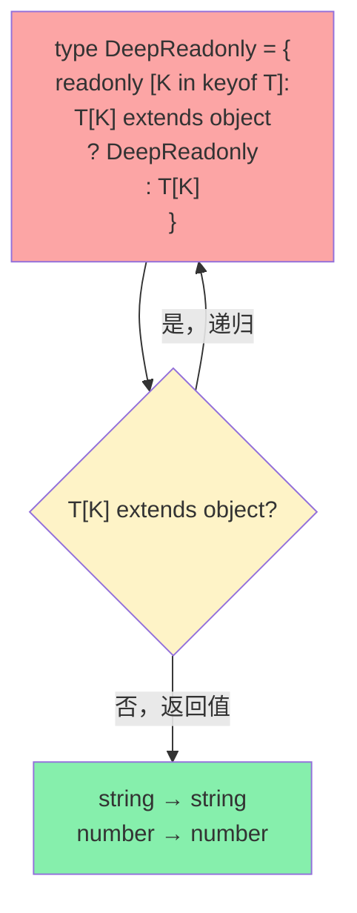

<DifficultyBadge level="advanced" />

# TS 类型体操

## 一句话解释

**类型体操**是在 TypeScript 类型层面进行编程——利用**条件类型**（条件分支）、**映射类型**（循环）、**递归类型**（迭代）、**模板字面量**（字符串操作）、**infer**（模式匹配）这些"类型层面的编程语言特性"，将输入类型转换为你想要的输出类型。

## 核心流程

```mermaid
flowchart TD
    A["输入类型"] --> B{类型体操操作}
    
    B --> C[条件类型<br/>T extends U ? X : Y]
    B --> D[映射类型<br/>{ [K in keyof T]: T[K] }]
    B --> E[递归类型<br/>type DeepX<T> = ...]
    B --> F[模板字面量<br/>`${A}_${B}`]
    B --> G[infer 匹配<br/>T extends infer U ? ...]
    
    C --> H[输出类型]
    D --> H
    E --> H
    F --> H
    G --> H

    style A fill:#93c5fd
    style H fill:#86efac
    style C fill:#fef3c7
    style D fill:#86efac
    style E fill:#fca5a5
    style F fill:#c4b5fd
    style G fill:#93c5fd
```

## 深入理解

### 1. 条件类型的分发机制（Distributive Conditional Types）

这是类型体操的"if/else"——当条件类型作用于**联合类型**时，会自动分发：

```typescript
// 基础条件类型
type IsString<T> = T extends string ? true : false

type R1 = IsString<'hello'>   // true
type R2 = IsString<42>        // false

// 🔑 关键：联合类型会自动分发！
type R3 = IsString<'hello' | 42 | true>
// 等价于: ('hello' extends string ? true : false)
//        | (42 extends string ? true : false)
//        | (true extends string ? true : false)
// = true | false | false
// = boolean 👈 结果！

// 分发的条件：T 是一个裸类型参数（没有被 [] 包裹）
type ToArray<T> = T extends unknown ? T[] : never
type R4 = ToArray<string | number>
// string[] | number[]（分发）

type ToArrayNonDist<T> = [T] extends [unknown] ? T[] : never
type R5 = ToArrayNonDist<string | number>
// (string | number)[]（不分发，作为一个整体）

// 实战：过滤联合类型中的特定成员
type ExtractString<T> = T extends string ? T : never
type R6 = ExtractString<'a' | 1 | 'b' | true | 'c'>
// 'a' | 'b' | 'c'

// 实战：排除 null/undefined
type NoNullable<T> = T extends null | undefined ? never : T
type R7 = NoNullable<string | number | null | undefined>
// string | number
```

---

### 2. infer — 类型层面的模式匹配

`infer` 是类型体操的"解构赋值"——从已知类型中提取出子类型：

```typescript
// 基础模式：提取数组元素类型
type UnpackArray<T> = T extends (infer U)[] ? U : never

type R1 = UnpackArray<string[]>    // string
type R2 = UnpackArray<number[]>    // number
type R3 = UnpackArray<Array<{ id: number }>>  // { id: number }

// 提取函数返回类型（ReturnType 的实现）
type MyReturnType<T> = T extends (...args: any[]) => infer R ? R : never

type R4 = MyReturnType<() => string>          // string
type R5 = MyReturnType<(x: number) => boolean> // boolean

// 提取函数参数类型（Parameters 的实现）
type MyParameters<T> = T extends (...args: infer P) => any ? P : never

type R6 = MyParameters<(name: string, age: number) => void>
// [name: string, age: number]

// 提取 Promise 内部类型
type UnwrapPromise<T> = T extends Promise<infer V> ? V : T

type R7 = UnwrapPromise<Promise<string>>  // string
type R8 = UnwrapPromise<number>            // number（不是 Promise 则原样返回）

// 递归解包嵌套 Promise
type DeepUnwrap<T> = T extends Promise<infer V> ? DeepUnwrap<V> : T

type R9 = DeepUnwrap<Promise<Promise<Promise<string>>>>
// string

// 🔑 高阶 infer：提取构造器参数
type ConstructorParams<T> = T extends { new(...args: infer P): any } ? P : never

class User {
  constructor(public name: string, public age: number) {}
}

type R10 = ConstructorParams<typeof User>
// [name: string, age: number]
```

**infer 面试高频实战：**

```typescript
// 🔥 面试题：提取第一个参数类型
type FirstParam<T> = T extends (arg: infer F, ...args: any[]) => any ? F : never

type R1 = FirstParam<(name: string, age: number) => void>  // string

// 🔥 面试题：提取数组第一个元素类型
type First<T extends any[]> = T extends [infer F, ...any[]] ? F : never

type R2 = First<[1, 2, 3]>   // 1
type R3 = First<[]>           // never

// 🔥 面试题：提取数组最后一个元素类型
type Last<T extends any[]> = T extends [...any[], infer L] ? L : never

type R4 = Last<[1, 2, 3]>    // 3

// 🔥 面试题：提取字符串字面量的某部分
type ExtractName<T extends string> = 
  T extends `${infer Name}@${infer Domain}` ? Name : never

type R5 = ExtractName<'alice@example.com'>  // 'alice'
```

---

### 3. 递归类型 — 类型层面的循环



```typescript
// 递归将对象所有属性变为 readonly（深度）
type DeepReadonly<T> = {
  readonly [K in keyof T]: T[K] extends object
    ? T[K] extends Function  // 函数不递归
      ? T[K]
      : DeepReadonly<T[K]>
    : T[K]
}

interface User {
  name: string
  address: {
    city: string
    zip: string
    geo: { lat: number; lng: number }
  }
}

// 效果：
// {
//   readonly name: string;
//   readonly address: {
//     readonly city: string;
//     readonly zip: string;
//     readonly geo: {
//       readonly lat: number;
//       readonly lng: number;
//     }
//   }
// }

// 递归将所有属性变为可选（深度 Partial）
type DeepPartial<T> = {
  [K in keyof T]?: T[K] extends object
    ? T[K] extends Function
      ? T[K]
      : DeepPartial<T[K]>
    : T[K]
}

// 递归将所有值变为 null（深度 Nullable）
type DeepNullable<T> = {
  [K in keyof T]: T[K] extends object
    ? T[K] extends Function
      ? T[K] | null
      : DeepNullable<T[K]>
    : T[K] | null
}
```

**递归模板字面量类型（TS 4.1+）：**

```typescript
// 将连字符命名转为驼峰
type CamelCase<S extends string> = 
  S extends `${infer First}-${infer Rest}`
    ? `${First}${CamelCase<Capitalize<Rest>>}`
    : S

type R1 = CamelCase<'user-name'>          // 'userName'
type R2 = CamelCase<'get-user-by-id'>     // 'getUserById'

// 移除前缀
type RemovePrefix<S extends string, Prefix extends string> = 
  S extends `${Prefix}${infer Rest}` ? Rest : S

type R3 = RemovePrefix<'onClick', 'on'>   // 'Click'

// 字符串路径 → 点路径 (a/b/c → a.b.c)
type PathToDot<S extends string> =
  S extends `${infer First}/${infer Rest}`
    ? `${First}.${PathToDot<Rest>}`
    : S

type R4 = PathToDot<'user/profile/avatar'>  // 'user.profile.avatar'
```

---

### 4. 映射类型进阶 — 键的重映射（Key Remapping）

TS 4.1+ 支持 `as` 子句对键进行变换：

```typescript
// 🔑 基础：用 as 过滤键
type Getters<T> = {
  [K in keyof T as `get${Capitalize<string & K>}`]: () => T[K]
}

interface Person {
  name: string
  age: number
}

// {
//   getName: () => string
//   getAge: () => number
// }

// 🔑 排除特定键
type ExcludeKeys<T, Excluded> = {
  [K in keyof T as K extends Excluded ? never : K]: T[K]
}

type R1 = ExcludeKeys<{ a: 1; b: 2; c: 3 }, 'a' | 'c'>
// { b: 2 }

// 🔑 只保留符合条件值的键
type PickByValue<T, ValueType> = {
  [K in keyof T as T[K] extends ValueType ? K : never]: T[K]
}

interface Model {
  id: number
  name: string
  createdAt: Date
  updatedAt: Date
}

type DateFields = PickByValue<Model, Date>
// { createdAt: Date; updatedAt: Date }

type StringFields = PickByValue<Model, string>
// { name: string }

// 🔑 提取特定前缀的键
type PrefixedKeys<T, Prefix extends string> = {
  [K in keyof T as K extends `${Prefix}${infer _}` ? K : never]: T[K]
}

interface Settings {
  enableDarkMode: boolean
  enableNotifications: boolean
  theme: string
  language: string
}

type EnableFlags = PrefixedKeys<Settings, 'enable'>
// { enableDarkMode: boolean; enableNotifications: boolean }
```

---

### 5. 实战类型挑战

#### 挑战 1：DeepPick — 深度按路径选取

```typescript
// 实现 DeepPick，支持 'user.address.city' 这样的路径
type DeepPick<T, Path extends string> =
  Path extends `${infer Key}.${infer Rest}`
    ? Key extends keyof T
      ? { [K in Key]: DeepPick<T[Key], Rest> }
      : never
    : Path extends keyof T
      ? { [K in Path]: T[Path] }
      : never

interface Data {
  user: {
    name: string
    address: {
      city: string
      zip: string
    }
  }
  version: number
}

type Picked = DeepPick<Data, 'user.address.city'>
// { user: { address: { city: string } } }
```

#### 挑战 2：UnionToIntersection — 联合转交叉

```typescript
// 经典面试题：联合类型 → 交叉类型
// 'a' | 'b' → 'a' & 'b'
// {a:1} | {b:2} → {a:1} & {b:2}
type UnionToIntersection<U> = 
  (U extends any ? (arg: U) => void : never) extends 
    (arg: infer I) => void ? I : never

// 原理：
// 1. U extends any 触发分发
//    'a' | 'b' → ((arg: 'a') => void) | ((arg: 'b') => void)
// 2. 通过逆变位置 infer 提取交叉类型
//    ((arg: 'a') => void) | ((arg: 'b') => void) extends (arg: infer I) => void
//    → I = 'a' & 'b'

type R1 = UnionToIntersection<{ a: 1 } | { b: 2 }>
// { a: 1 } & { b: 2 }

type R2 = UnionToIntersection<string | number>
// never（string & number 不可能）
```

#### 挑战 3：StringToUnion — 字符串转联合

```typescript
// 'abc' → 'a' | 'b' | 'c'
type StringToUnion<S extends string> =
  S extends `${infer First}${infer Rest}`
    ? First | StringToUnion<Rest>
    : never

type R1 = StringToUnion<'abc'>  // 'a' | 'b' | 'c'
```

#### 挑战 4：ObjectPaths — 获取对象所有路径

```typescript
type ObjectPaths<T, Prefix extends string = ''> = {
  [K in keyof T]: T[K] extends object
    ? T[K] extends Function
      ? `${Prefix & string}${K & string}`
      : `${Prefix & string}${K & string}` | ObjectPaths<T[K], `${Prefix & string}${K & string}.`>
    : `${Prefix & string}${K & string}`
}[keyof T]

interface Config {
  app: {
    name: string
    version: number
    display: {
      theme: string
      lang: string
    }
  }
  debug: boolean
}

type Paths = ObjectPaths<Config>
// 'app' | 'app.name' | 'app.version' | 'app.display' | 'app.display.theme'
// | 'app.display.lang' | 'debug'
```

---

### 6. 类型体操作弊表

| 操作 | 语法 | 用途 |
|------|------|------|
| 条件判断 | `T extends U ? X : Y` | if/else |
| 分发 | `T extends any ? ...` | 遍历联合类型 |
| 禁用分发 | `[T] extends [U] ? ...` | 将联合视为整体 |
| 模式匹配 | `T extends infer U ? ...` | 提取子类型 |
| 映射 | `{ [K in keyof T]: T[K] }` | 遍历对象 |
| 键重映射 | `[K in keyof T as NewK]` | 变换/过滤键 |
| 递归 | `type Foo<T> = T extends ... ? Foo<...>` | 循环/迭代 |
| 模板插值 | `` `${A}${B}` `` | 字符串拼接/匹配 |
| 类型守卫 | `is` / `asserts` | 运行时类型收窄 |
| never | 排除/终止条件 | 联合类型中的"空" |

## 面试问法

- 🔥 **什么是条件类型的分发机制？怎么关闭？**
  - 裸类型参数作用于联合时，每个成员独立计算
  - 用 `[T]` 包裹可关闭分发：`[T] extends [U]`

- 🔥 **infer 的作用？书写 infer 的三个实战场景？**
  - 从已知类型中提取子类型（模式匹配）
  - 场景：提取函数参数/返回值、提取 Promise 内容、提取数组元素类型

- 🔥 **实现 DeepReadonly / DeepPartial？**
  - 映射类型 + 条件递归
  - 注意：函数类型不应递归，否则会破坏 call signature

- 🔥 **UnionToIntersection 的原理？**
  - 利用条件类型分发 + 函数参数逆变位置 + infer 提取

- ⭐ **模板字面量类型能做什么？**
  - 字符串操作：拼接、匹配、变换
  - `${infer First}${infer Rest}` 实现字符串递归
  - 结合键重映射实现类型安全的事件/API 类型

- ⭐ **映射类型的 as 子句有什么用？**
  - 变换键名（加前缀/后缀）
  - 过滤键（never 排除）
  - 条件保留键

- 📌 **什么是 Distributive Conditional Types 和 Never 的交互？**
  - `never` 在分发条件类型中直接返回 `never`（无成员可分发）
  - 所以 `type X<T> = T extends string ? 'yes' : 'no'` 中 X\<never\> = never

## 💡 AI 辅助学习

> 用这个 Prompt 练习类型体操：
>
> "我是一个 TypeScript 资深用户，正在准备高级面试。请帮我逐题解答并讲解原理：
>
> 1. 实现 `DeepMutable<T>`：将 `readonly` 对象的所有层级变为可写
> 2. 实现 `PickByType<T, Type>`：只保留值为指定类型的键
> 3. 实现 `ExcludeByType<T, Type>`：排除值为指定类型的键
> 4. 实现 `FunctionPropertyNames<T>`：提取所有值为函数的键名
> 5. 实现 `OptionalKeys<T>`：提取所有可选键
> 6. 实现 `RequiredKeys<T>`：提取所有必需键
>
> 对每个实现，解释：
> - 用了哪些类型体操技巧
> - 边界情况处理（never、联合、函数）
> - TS 版本要求（如果有限制）"

## 关联知识

- [TypeScript 类型系统](./ts-basics) — 基础类型、联合交叉、类型守卫
- [TypeScript 泛型进阶](./ts-generics) — 泛型约束、条件类型、映射类型基础
- [TS 工具类型实现](./ts-utility-types) — Partial/Pick/Omit 等工具类型手写
- [V8 引擎与 JIT](./v8-engine) — TypeScript 编译后的 JS 执行
