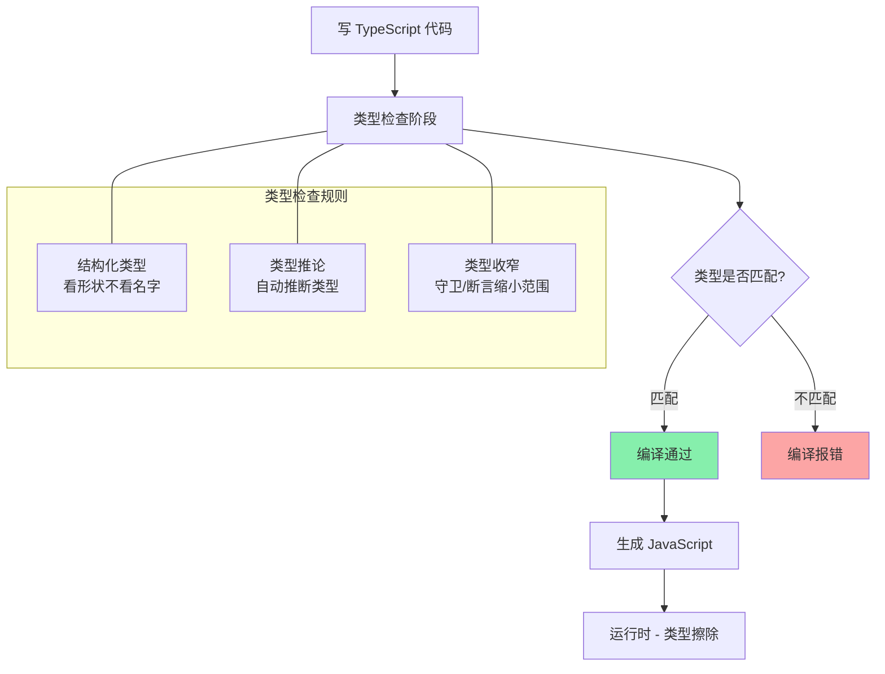
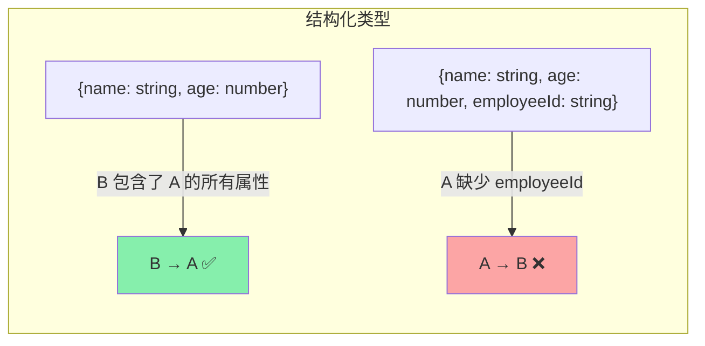

<DifficultyBadge level="intermediate" />

# TypeScript 类型系统

## 一句话解释

TypeScript 的类型系统是**为 JavaScript 添加静态类型检查**——它让你在写代码时就能发现类型错误，而不是运行时崩溃。其核心是**结构化类型**（Structural Typing）：只要结构匹配就算类型匹配，不要求名义上的继承关系。

## 核心流程



## 深入理解

### 1. 基础类型系统

```typescript
// 基本类型注解
const name: string = 'Alice'
const age: number = 30
const isActive: boolean = true
const data: null = null
const notDefined: undefined = undefined

// 数组
const arr1: number[] = [1, 2, 3]
const arr2: Array<number> = [1, 2, 3]  // 泛型写法

// 元组（固定长度、类型已知）
const tuple: [string, number] = ['Alice', 30]
tuple[0]  // string
tuple[1]  // number

// 枚举
enum Direction {
  Up = 'UP',
  Down = 'DOWN',
  Left = 'LEFT',
  Right = 'RIGHT'
}

// any — 逃逸类型（尽量少用）
let loose: any = 42
loose = 'string'  // ✅ 任何类型
loose = {}        // ✅

// unknown — 安全的 any（用之前必须收窄）
let safe: unknown = 42
safe.toFixed()    // ❌ 报错：unknown 不能直接调用方法
if (typeof safe === 'number') {
  safe.toFixed()  // ✅ 类型收窄后可以
}

// never — 永不发生的类型
function throwError(): never {
  throw new Error('Always throws')
}

function infiniteLoop(): never {
  while (true) {}  // 永远不返回
}
```

### 2. 结构化类型（Structural Typing）

这是 TypeScript 类型系统的**核心概念**，也是面试常考的 Duck Typing：

```typescript
interface Person {
  name: string
  age: number
}

interface Employee {
  name: string
  age: number
  employeeId: string
}

let person: Person = { name: 'Alice', age: 30 }
let employee: Employee = { name: 'Bob', age: 25, employeeId: 'E001' }

// ✅ 结构化类型：Employee 包含了 Person 的所有属性
person = employee  // 可以！Employee 的结构兼容 Person

// ❌ 反过来不行：Person 缺少 employeeId
// employee = person  // Error: Property 'employeeId' is missing
```



**对比：名义类型（Java/C#）vs 结构化类型（TypeScript）**

```typescript
// TypeScript：鸭子类型——"如果它走路像鸭子，叫起来像鸭子，那它就是鸭子"
interface Duck { walk(): void; quack(): void }

function handleDuck(duck: Duck) { duck.walk(); duck.quack() }

const realDuck = { walk() {}, quack() {} }  // 不需要声明 implements Duck
handleDuck(realDuck)  // ✅ 结构匹配就行

// 如果需要名义类型行为 → 使用 brand（品牌类型）
type Brand<T, B> = T & { __brand: B }
type USD = Brand<number, 'USD'>
type EUR = Brand<number, 'EUR'>

function pay(amount: USD) { /* ... */ }
pay(100 as USD)  // ✅
pay(100 as EUR)  // ❌ 类型不匹配
```

### 3. 联合类型与交叉类型

```typescript
// 联合类型 — "或"
type Status = 'loading' | 'success' | 'error'
type Result<T> = T | null | undefined

function printStatus(s: Status) {
  console.log(s)
}
printStatus('loading')  // ✅
printStatus('fail')     // ❌ 不在联合类型中

// 交叉类型 — "与"
type Named = { name: string }
type Aged = { age: number }
type Person = Named & Aged  // { name: string; age: number }

// 实际应用：合并多个类型
type RequestState<T> = 
  | { status: 'loading' }
  | { status: 'success'; data: T }
  | { status: 'error'; error: Error }

function handleState(state: RequestState<User>) {
  if (state.status === 'loading') {
    console.log('加载中')
  } else if (state.status === 'success') {
    console.log(state.data.name)  // ✅ 收窄后可以访问 data
  } else {
    console.error(state.error.message)  // ✅ 收窄后可以访问 error
  }
}
```

### 4. 类型守卫（Type Guards）

```typescript
// typeof 守卫
function process(value: string | number) {
  if (typeof value === 'string') {
    return value.toUpperCase()  // string 类型
  }
  return value.toFixed(2)       // number 类型
}

// instanceof 守卫
class Dog { bark() {} }
class Cat { meow() {} }

function makeSound(animal: Dog | Cat) {
  if (animal instanceof Dog) {
    animal.bark()
  } else {
    animal.meow()
  }
}

// in 守卫
type Fish = { swim: () => void }
type Bird = { fly: () => void }

function move(animal: Fish | Bird) {
  if ('swim' in animal) {
    animal.swim()  // Fish
  } else {
    animal.fly()   // Bird
  }
}

// 自定义类型守卫（is）
interface User { name: string; age: number }
interface Admin extends User { role: 'admin'; permissions: string[] }

function isAdmin(user: User): user is Admin {
  return 'role' in user && (user as Admin).role === 'admin'
}

function handleUser(user: User) {
  if (isAdmin(user)) {
    console.log(user.permissions)  // ✅ 类型收窄为 Admin
  }
}
```

### 5. 类型断言

```typescript
// 方式一：as 语法（推荐）
const input = document.getElementById('input') as HTMLInputElement
input.value  // 不断言的话是 HTMLElement，没有 value 属性

// 方式二：尖括号语法（不推荐，在 JSX 中冲突）
const input2 = <HTMLInputElement>document.getElementById('input')

// 非空断言（确定不是 null/undefined）
const element = document.querySelector('.app')!
element.innerHTML  // 不会报可能为 null 的错误

// const 断言
const config = {
  server: 'localhost',
  port: 3000
} as const
// 类型变成：{ readonly server: "localhost"; readonly port: 3000 }
// 所有属性 readonly，字面量类型代替原始类型

// 双断言（谨慎使用）
const value: string = '42'
const num = (value as unknown) as number  // 先用 unknown 过渡
```

**as const 的应用场景：**

```typescript
// 没有 as const
const Colors = {
  Red: '#FF0000',
  Green: '#00FF00'
}
// 类型：{ Red: string; Green: string }

// 有 as const
const Colors = {
  Red: '#FF0000',
  Green: '#00FF00'
} as const
// 类型：{ readonly Red: "#FF0000"; readonly Green: "#00FF00" }

// 配合联合类型使用
type ColorKeys = keyof typeof Colors  // "Red" | "Green"
type ColorValues = typeof Colors[keyof typeof Colors]  // "#FF0000" | "#00FF00"
```

### 6. 类型收窄（Narrowing）

```typescript
// 通过条件判断逐步缩小类型范围
function process(value: unknown) {
  // 第一步：排除 null/undefined
  if (value === null || value === undefined) {
    return 'empty'
  }
  
  // 第二步：基本类型判断
  if (typeof value === 'string') {
    return value.toUpperCase()
  }
  
  if (typeof value === 'number') {
    return value.toFixed(2)
  }
  
  // 第三步：对象类型判断
  if (Array.isArray(value)) {
    return value.length
  }
  
  // 剩余情况
  return 'unknown'
}

// 可辨识联合（Discriminated Union）— 最实用的收窄模式
type Shape =
  | { kind: 'circle'; radius: number }
  | { kind: 'square'; side: number }
  | { kind: 'triangle'; base: number; height: number }

function area(shape: Shape): number {
  switch (shape.kind) {  // kind 是"可辨识标签"
    case 'circle':
      return Math.PI * shape.radius ** 2
    case 'square':
      return shape.side ** 2
    case 'triangle':
      return shape.base * shape.height / 2
  }
}
```

### 7. 常见面试陷阱

```typescript
// 1. interface 和 type 的区别
interface A { x: number }
type B = { x: number }
// 共同点：都可以描述对象
// 区别：interface 可以合并声明，type 可以用联合/交叉/工具类型

// 2. 可选属性与 undefined
interface Config {
  url: string
  timeout?: number  // number | undefined，可以省略
}
const c1: Config = { url: '/api' }          // ✅ timeout 省略
const c2: Config = { url: '/api', timeout: undefined }  // ✅ 显式 undefined

// 3. 多余属性检查
interface Options { title: string; size?: number }
const opts: Options = { title: 'hello', width: 100 }
// ❌ 报错：width 不在 Options 中（多余属性检查）

// ✅ 绕过：赋值给变量后再传
const extra = { title: 'hello', width: 100 }
const opts2: Options = extra  // ✅ 通过结构化类型检查

// 4. readonly 的陷阱
interface Task {
  readonly id: string
  content: string
}
const task: Task = { id: '1', content: 'hello' }
task.id = '2'  // ❌ 报错：readonly
```

## 面试问法

- 🔥 **TypeScript 的类型系统是结构类型还是名义类型？**
  - 结构化类型（Structural Typing）——看形状不看名字
  - 只要结构匹配就可以赋值，不需要显式继承
  - 与 Java/C# 的名义类型不同

- 🔥 **type 和 interface 的区别？什么场景用哪个？**
  - interface：可合并声明、extends 继承、描述对象/类
  - type：联合/交叉、元组、工具类型、基本类型别名
  - 优先用 interface 描述对象，需要联合类型时用 type

- ⭐ **unknown 和 any 的区别？**
  - any：关闭类型检查，可以调用任何方法
  - unknown：安全的 any，必须类型收窄后才能操作
  - 优先用 unknown，避免 any

- ⭐ **可辨识联合（Discriminated Union）是什么？**
  - 多个类型共用一个字面量字段（如 kind）作为"标签"
  - 通过 switch/if 判断标签，自动收窄类型
  - 处理 API 响应状态（loading/success/error）的推荐模式

- ⭐ **as const 的作用？**
  - 把宽泛类型收窄为字面量类型
  - 所有属性变为 readonly
  - 常用于常量配置、枚举替代

- ⭐ **类型守卫有哪几种？**
  - typeof、instanceof、in、自定义 is 守卫
  - 可辨识联合的 switch 收窄

## 💡 AI 辅助学习

> 用这个 Prompt 练习 TypeScript 类型系统：
> "我是准备面试的前端开发者。请给我出以下 TypeScript 类型题目，每题包含输入输出的类型定义：
> 
> 1. 实现一个 DeepReadonly 类型——把对象的所有属性（包括嵌套）变为 readonly
> 2. 实现一个 UnionToIntersection 类型——把联合类型转为交叉类型
> 3. 写一个函数，参数是 'circle' | 'square' | 'triangle'，返回对应形状的面积公式，用可辨识联合实现
> 4. 有一个 API 返回 `{ status: 'success', data: T } | { status: 'error', error: string }`，写类型守卫让用户在调用后自动收窄类型
> 
> 请给出类型定义和实现代码，并附上使用示例。"

## 关联知识

- [TypeScript 泛型进阶](./ts-generics) — 泛型约束、条件类型
- [TS 工具类型实现](./ts-utility-types) — Partial/Pick/ReturnType 手写
- [TS 类型体操](./ts-advanced) — 高级类型挑战
