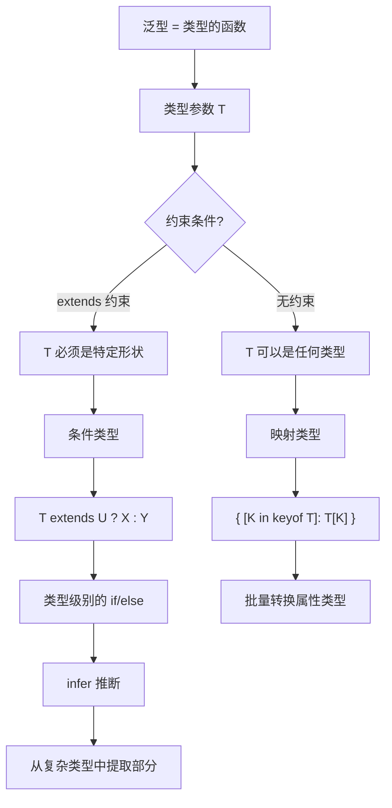

<DifficultyBadge level="intermediate" />

# TypeScript 泛型进阶

## 一句话解释

泛型是给类型写"函数"——它让你把类型也参数化，一套逻辑适配多种类型。**泛型约束**（extends）限制类型参数的范围，**条件类型**（extends ? :）实现类型级别的 if/else，**infer** 从已有类型中提取子类型。

## 核心流程



## 深入理解

### 1. 泛型基础

```typescript
// 函数的泛型 — 参数和返回值的类型关联
function first<T>(arr: T[]): T | undefined {
  return arr[0]
}

const num = first([1, 2, 3])     // T 推断为 number
const str = first(['a', 'b'])    // T 推断为 string

// 显式指定类型参数
const result = first<number>([1, 2, 3])

// 多个类型参数
function pair<A, B>(a: A, b: B): [A, B] {
  return [a, b]
}

const p = pair('hello', 42)  // [string, number]

// 接口泛型
interface Response<T> {
  data: T
  status: number
  message: string
}

type UserResponse = Response<{ id: number; name: string }>
// {
//   data: { id: number; name: string }
//   status: number
//   message: string
// }
```

### 2. 泛型约束（extends）

```typescript
// 约束 T 必须有 length 属性
function logLength<T extends { length: number }>(arg: T): number {
  console.log(arg.length)
  return arg.length
}

logLength('hello')     // ✅ string 有 length
logLength([1, 2, 3])   // ✅ array 有 length
logLength({ length: 5 }) // ✅ 对象也有 length
// logLength(42)       // ❌ number 没有 length

// keyof 约束
function getProperty<T, K extends keyof T>(obj: T, key: K): T[K] {
  return obj[key]
}

const user = { name: 'Alice', age: 30, email: 'alice@example.com' }
getProperty(user, 'name')   // ✅ string
getProperty(user, 'age')    // ✅ number
// getProperty(user, 'phone')  // ❌ 'phone' 不在 keyof T 中

// 约束类型的"最小结构"
interface HasId {
  id: number
}

function processEntity<T extends HasId>(entity: T): number {
  return entity.id  // ✅ 安全的，因为有约束
}
```

### 3. 条件类型（Conditional Types）

条件类型是类型系统的**三目运算符**：`T extends U ? X : Y`

```typescript
// 基础条件类型
type IsString<T> = T extends string ? 'yes' : 'no'

type A = IsString<string>  // 'yes'
type B = IsString<number>  // 'no'
type C = IsString<'hello'> // 'yes'（字面量 'hello' extends string）

// 实际应用：从函数类型提取返回类型
type ReturnOf<T> = T extends (...args: any[]) => infer R ? R : never

type Fn = (x: number) => string
type R = ReturnOf<Fn>  // string

// 分布式条件类型（联合类型会逐个分发）
type ToArray<T> = T extends any ? T[] : never

type Result = ToArray<string | number>
// 等价于：string[] | number[]（不是 (string | number)[]）

// 禁用分发：用 [] 包裹
type ToArrayNonDist<T> = [T] extends [any] ? T[] : never
type Result2 = ToArrayNonDist<string | number>
// (string | number)[] — 不分发
```

**分布式条件类型的面试陷阱：**

```typescript
// 联合类型分发
type Exclude<T, U> = T extends U ? never : T

type T1 = Exclude<'a' | 'b' | 'c', 'a' | 'b'>
// 分发过程：
// 'a' extends 'a' | 'b' → never
// 'b' extends 'a' | 'b' → never
// 'c' extends 'a' | 'b' → 'c'
// 结果：'c'

// 对比：`Exclude<string | (() => void), Function>`
// string 不 extends Function → string
// () => void extends Function → never
// 结果：string
```

### 4. infer — 类型推断

`infer` 在条件类型的 `extends` 子句中**声明一个待推断的类型变量**：

```typescript
// 提取数组元素类型
type ElementOf<T> = T extends (infer E)[] ? E : never

type NumArr = ElementOf<number[]>     // number
type StrArr = ElementOf<string[]>     // string
type Mixed = ElementOf<[string, number]>  // string | number（元组也是数组）

// 提取 Promise 返回值类型
type Unwrap<T> = T extends Promise<infer V> ? V : T

type A = Unwrap<Promise<string>>  // string
type B = Unwrap<Promise<Promise<number>>>  // Promise<number>（只解一层）

// 递归解包
type DeepUnwrap<T> = T extends Promise<infer V> ? DeepUnwrap<V> : T
type C = DeepUnwrap<Promise<Promise<number>>>  // number ✅

// 提取函数参数类型
type Params<T> = T extends (...args: infer P) => any ? P : never

type FnParams = Params<(name: string, age: number) => void>
// [string, number]

// 提取函数返回值类型（内置 ReturnType）
type MyReturnType<T> = T extends (...args: any[]) => infer R ? R : never

// 提取构造函数实例类型
type Instance<T> = T extends new (...args: any[]) => infer R ? R : never
```

### 5. 映射类型（Mapped Types）

映射类型让你**批量转换对象的所有属性**：

```typescript
// 基础映射：把所有属性变为 readonly
type MyReadonly<T> = {
  readonly [K in keyof T]: T[K]
}

interface User { name: string; age: number; email: string }
type ReadonlyUser = MyReadonly<User>
// { readonly name: string; readonly age: number; readonly email: string }

// 可选映射
type MyPartial<T> = {
  [K in keyof T]?: T[K]
}

type PartialUser = MyPartial<User>
// { name?: string; age?: number; email?: string }

// 通过 as 子句重映射键（TS 4.1+）
type Getters<T> = {
  [K in keyof T as `get${Capitalize<string & K>}`]: () => T[K]
}

type UserGetters = Getters<User>
// { getName: () => string; getAge: () => number; getEmail: () => string }

// 根据值过滤键
type KeysOfType<T, V> = {
  [K in keyof T]: T[K] extends V ? K : never
}[keyof T]

type StringKeys = KeysOfType<User, string>  // 'name' | 'email'
```

**映射类型修饰符：**

```typescript
interface Config {
  endpoint: string
  apiKey: string
  timeout: number
}

// + 添加修饰符（默认）
type ReadonlyConfig = { +readonly [K in keyof Config]: Config[K] }

// - 移除修饰符
type Mutable<T> = { -readonly [K in keyof T]: T[K] }
type MutableConfig = Mutable<ReadonlyConfig>  // 去掉 readonly

// ? 可选
type Optional<T> = { [K in keyof T]?: T[K] }

// -? 移除可选（必选）
type Required<T> = { [K in keyof T]-?: T[K] }
```

### 6. 模板字面量类型（TS 4.1+）

```typescript
// 模板字面量类型
type EventName<T extends string> = `on${Capitalize<T>}`
type ClickEvent = EventName<'click'>  // 'onClick'
type FocusEvent = EventName<'focus'>  // 'onFocus'

// 联合类型的模板
type Direction = 'left' | 'right' | 'up' | 'down'
type Position = `${Direction}-${number}`
// 'left-0' | 'left-1' | ... | 'right-0' | ... （无限联合）

// 实际应用：CSS 属性映射
type CSSProperty = 'margin' | 'padding' | 'border'
type CSSDirection = 'top' | 'right' | 'bottom' | 'left'
type CSSKey = `${CSSProperty}-${CSSDirection}`
// 'margin-top' | 'margin-right' | ... | 'border-left'

// 内置字符串操作类型
type Greeting = 'hello, world'
type Shout = Uppercase<Greeting>    // 'HELLO, WORLD'
type Whisper = Lowercase<Greeting>  // 'hello, world'
type Title = Capitalize<Greeting>   // 'Hello, world'
type Uncap = Uncapitalize<Greeting> // 'hello, world'
```

### 7. 实战：完备的 API 类型

```typescript
// 定义一个完整 API Client 的类型系统

// 可辨识联合的 API 状态
interface ApiState<T> {
  data: T
  loading: boolean
  error: Error | null
}

// 自动生成 mutations
type ApiMutations<T, K extends keyof T> = {
  [P in K as `set${Capitalize<string & P>}`]: (value: T[P]) => void
} & {
  reset: () => void
}

// 类型安全的事件系统
type EventMap = {
  click: { x: number; y: number }
  focus: { element: HTMLElement }
  input: { value: string }
}

type EventHandler<E extends keyof EventMap> = 
  (payload: EventMap[E]) => void

type EventSystem = {
  [E in keyof EventMap as `on${Capitalize<string & E>}`]: EventHandler<E>
} & {
  emit<E extends keyof EventMap>(event: E, payload: EventMap[E]): void
}
```

### 8. 条件类型实战：深度递归

```typescript
// 深度可选
type DeepPartial<T> = T extends object
  ? { [K in keyof T]?: DeepPartial<T[K]> }
  : T

interface Deep {
  user: { profile: { name: string; avatar: string } }
  settings: { theme: { color: string; mode: 'light' | 'dark' } }
}

type PartialDeep = DeepPartial<Deep>
// 所有嵌套属性都变成可选

// 深度 readonly
type DeepReadonly<T> = T extends object
  ? { readonly [K in keyof T]: DeepReadonly<T[K]> }
  : T

// 非空对象
type NonNullObject<T> = {
  [K in keyof T]-?: T[K] extends null | undefined ? never : T[K]
}
```

## 面试问法

- 🔥 **泛型约束 extends 的作用？**
  - 限制类型参数的范围，确保类型参数满足特定形状
  - 后面可以使用被约束类型的属性和方法
  - 配合 keyof 实现类型安全的属性访问

- 🔥 **条件类型的分布式行为是什么？**
  - 当条件类型作用于裸类型参数时，联合类型会逐个分发
  - `T extends U ? X : Y` 中 T 是联合类型，每个成员独立判断
  - 用 `[T]` 包裹可以禁用分发

- 🔥 **infer 关键字的作用？**
  - 在条件类型的 extends 中声明待推断的类型变量
  - 从已有类型中提取子类型（如提取 Promise 的返回值）
  - 只能用在条件类型的 extends 子句中

- ⭐ **映射类型是什么？怎么重映射 key？**
  - `[K in keyof T]: T[K]` 遍历对象所有属性
  - TS 4.1+ 可以用 `as` 子句重命名 key
  - 配合模板字面量类型可以做字符串变换

- ⭐ **模板字面量类型能做什么？**
  - 在类型层面做字符串拼接和变换
  - 配合映射类型生成事件名、CSS 属性等
  - 内置 Uppercase/Lowercase/Capitalize 操作

- ⭐ **内置工具类型中哪些用到了 infer？**
  - ReturnType：提取函数返回值
  - Parameters：提取函数参数类型
  - ConstructorParameters：提取构造函数参数
  - InstanceType：提取实例类型

## 💡 AI 辅助学习

> 用这个 Prompt 练习泛型：
> "我是准备面试的前端开发者。请给我出 4 道 TypeScript 泛型进阶题目，按难度递进：
> 
> 1. 实现一个类型安全的 EventEmitter（使用泛型约束 + 映射类型）
> 2. 实现 DeepPick — 支持 'user.profile.name' 这种路径字符串的 Pick
> 3. 实现 UnionToIntersection — 把 'a' | 'b' 转为 'a' & 'b'
> 4. 实现一个类型安全的 Builder 模式（使用泛型 + 映射类型，每一步都类型安全）
> 
> 请提供完整的类型定义和实现。"

## 关联知识

- [TypeScript 类型系统](./ts-basics) — 基础类型、结构化类型
- [TS 工具类型实现](./ts-utility-types) — 手写内置工具类型
- [TS 类型体操](./ts-advanced) — 高级类型挑战
