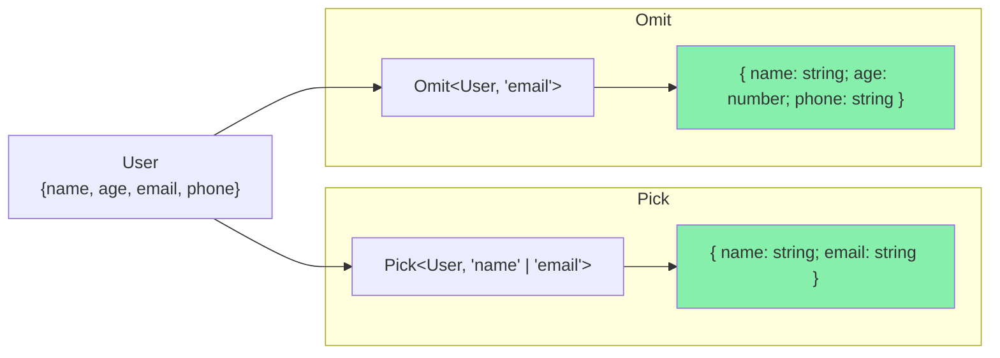

<DifficultyBadge level="intermediate" />

# TS 工具类型实现

## 一句话解释

TypeScript 内置的 Utility Types 都是通过**泛型 + 条件类型 + 映射类型 + infer** 组合实现的。理解它们的手写实现，就能深入理解 TS 类型系统的核心机制。

## 核心流程

```mermaid
flowchart TD
    subgraph 工具类型分类
        A[属性变换] --> Partial / Required / Readonly
        B[对象选择] --> Pick / Omit / Extract / Exclude
        C[函数提取] --> ReturnType / Parameters
        D[字符串变换] --> Uppercase / Capitalize
        E[类型构造] --> Record / NonNullable
    end
    
    A --> F[映射类型]
    B --> F
    C --> G[条件类型 + infer]
    D --> H[模板字面量类型]
    E --> I[映射类型 + 条件类型]
```

## 深入理解

### 1. 属性变换类

#### Partial — 所有属性可选

```typescript
// 手写实现
type MyPartial<T> = {
  [K in keyof T]?: T[K]
}

// 使用
interface User {
  name: string
  age: number
  email: string
}

type PartialUser = MyPartial<User>
// { name?: string; age?: number; email?: string }

// 源码位置：lib.es5.d.ts
// 考点：映射类型 + 可选修饰符 ?
```

#### Required — 所有属性必选

```typescript
// 手写实现
type MyRequired<T> = {
  [K in keyof T]-?: T[K]  // -? 移除可选
}

interface Config {
  url?: string
  timeout?: number
}

type RequiredConfig = MyRequired<Config>
// { url: string; timeout: number }

// 考点：-? 移除可选修饰符
```

#### Readonly — 所有属性只读

```typescript
// 手写实现
type MyReadonly<T> = {
  readonly [K in keyof T]: T[K]
}

// 使用
type ReadonlyUser = MyReadonly<User>
// { readonly name: string; readonly age: number; readonly email: string }

// 考点：readonly 修饰符
```

### 2. 对象选择类

#### Pick — 选取指定属性

```typescript
// 手写实现
type MyPick<T, K extends keyof T> = {
  [P in K]: T[P]
}

interface User {
  name: string
  age: number
  email: string
  phone: string
}

type UserBasic = MyPick<User, 'name' | 'email'>
// { name: string; email: string }

// 考点：keyof 约束 + 映射类型的子集选取
```

#### Omit — 排除指定属性

```typescript
// 手写实现（基于 Pick + Exclude）
type MyOmit<T, K extends keyof any> = {
  [P in Exclude<keyof T, K>]: T[P]
}

// 或者更清晰的方式：
type Omit2<T, K extends keyof T> = Pick<T, Exclude<keyof T, K>>

type UserWithoutEmail = MyOmit<User, 'email'>
// { name: string; age: number; phone: string }

// 考点：Exclude + Pick 的组合
```

**Pick 和 Omit 的关系图解：**



#### Extract — 提取联合类型中的子集

```typescript
// 手写实现（利用分布式条件类型）
type MyExtract<T, U> = T extends U ? T : never

type T1 = MyExtract<'a' | 'b' | 'c', 'a' | 'c'>
// 分发过程：
// 'a' extends 'a' | 'c' → 'a'
// 'b' extends 'a' | 'c' → never
// 'c' extends 'a' | 'c' → 'c'
// 结果：'a' | 'c'

// 实际应用
type Events = 'click' | 'focus' | 'scroll' | 'resize'
type UIEvents = MyExtract<Events, 'click' | 'focus'>
// 'click' | 'focus'
```

#### Exclude — 排除联合类型中的子集

```typescript
// 手写实现
type MyExclude<T, U> = T extends U ? never : T

type T2 = MyExclude<'a' | 'b' | 'c', 'a' | 'b'>
// 结果：'c'

// 实际应用
type AllKeys = 'id' | 'name' | 'password' | 'createdAt'
type PublicKeys = MyExclude<AllKeys, 'password'>
// 'id' | 'name' | 'createdAt'
```

### 3. 函数提取类

#### ReturnType — 提取函数返回值类型

```typescript
// 手写实现
type MyReturnType<T> = 
  T extends (...args: any[]) => infer R ? R : never

// 使用
type Fn = (x: number, y: string) => Promise<boolean>
type Result = MyReturnType<Fn>
// Promise<boolean>

// 考点：infer 提取返回值类型

// 带重载的处理
function add(a: number, b: number): number
function add(a: string, b: string): string
function add(a: any, b: any): any {
  return a + b
}

// ReturnType 只取最后一个签名（实现签名）的类型
type AddReturn = ReturnType<typeof add>  // any
```

#### Parameters — 提取函数参数类型

```typescript
// 手写实现
type MyParameters<T> = 
  T extends (...args: infer P) => any ? P : never

type Fn = (name: string, age: number) => void
type FnParams = MyParameters<Fn>
// [string, number]

// 实际应用
function createUser(name: string, age: number, email: string) {
  return { name, age, email }
}

type CreateUserParams = Parameters<typeof createUser>
// [string, number, string]

// 通用 API 函数
async function apiCall<T extends (...args: any[]) => any>(
  fn: T,
  ...args: Parameters<T>
): Promise<ReturnType<T>> {
  // ...
}

// 考点：infer 提取元组类型
```

#### ConstructorParameters — 构造函数参数类型

```typescript
// 手写实现
type MyConstructorParameters<T> = 
  T extends new (...args: infer P) => any ? P : never

class Person {
  constructor(public name: string, public age: number) {}
}

type PersonParams = MyConstructorParameters<typeof Person>
// [string, number]

// 对比 ReturnType vs InstanceType
type MyInstanceType<T> = 
  T extends new (...args: any[]) => infer R ? R : never

type PersonInstance = MyInstanceType<typeof Person>
// Person
```

### 4. 类型构造类

#### Record — 构造对象类型

```typescript
// 手写实现
type MyRecord<K extends keyof any, T> = {
  [P in K]: T
}

// K extends keyof any = string | number | symbol
type PageInfo = MyRecord<'home' | 'about' | 'contact', { title: string }>
// {
//   home: { title: string }
//   about: { title: string }
//   contact: { title: string }
// }

// 实际应用
type HttpHeaders = MyRecord<string, string>
// { [key: string]: string }

// 考点：keyof any = string | number | symbol
```

#### NonNullable — 排除 null/undefined

```typescript
// 手写实现
type MyNonNullable<T> = T extends null | undefined ? never : T

type T1 = MyNonNullable<string | null | undefined>
// string

type T2 = MyNonNullable<number | null>
// number
```

### 5. 综合实战

#### DeepPartial — 深度可选

```typescript
type DeepPartial<T> = T extends object
  ? { [K in keyof T]?: DeepPartial<T[K]> }
  : T

interface AppConfig {
  server: {
    host: string
    port: number
  }
  database: {
    url: string
    credentials: {
      user: string
      password: string
    }
  }
}

type PartialConfig = DeepPartial<AppConfig>
// 所有嵌套层都变成可选
```

#### FunctionPropertyNames — 提取函数类型的键

```typescript
type FunctionPropertyNames<T> = {
  [K in keyof T]: T[K] extends Function ? K : never
}[keyof T]

interface Service {
  name: string
  start(): void
  stop(): void
  version: number
}

type FnKeys = FunctionPropertyNames<Service>
// 'start' | 'stop'
```

#### NonFunctionPropertyNames — 提取非函数类型的键

```typescript
type NonFunctionPropertyNames<T> = {
  [K in keyof T]: T[K] extends Function ? never : K
}[keyof T]

type DataKeys = NonFunctionPropertyNames<Service>
// 'name' | 'version'

// 组合使用：Pick 出非函数属性
type DataOnly<T> = Pick<T, NonFunctionPropertyNames<T>>
type ServiceData = DataOnly<Service>
// { name: string; version: number }
```

#### Merge — 合并两个类型

```typescript
type Merge<A, B> = {
  [K in keyof A | keyof B]: K extends keyof B
    ? B[K]
    : K extends keyof A
      ? A[K]
      : never
}

interface Base { id: number; name: string }
interface Extra { age: number; name: string }

type Merged = Merge<Base, Extra>
// { id: number; name: string; age: number }
// B 的同名属性覆盖 A
```

### 6. 面试高频：工具类型实现速查表

| 工具类型 | 核心机制 | 手写行数 | 面试频率 |
|---------|---------|---------|---------|
| `Partial<T>` | 映射类型 + `?` | 2 | 🔥 |
| `Required<T>` | 映射类型 + `-?` | 2 | 🔥 |
| `Readonly<T>` | 映射类型 + `readonly` | 2 | 🔥 |
| `Pick<T, K>` | 映射类型 + `keyof` 约束 | 3 | 🔥 |
| `Omit<T, K>` | Pick + Exclude | 3 | 🔥 |
| `ReturnType<T>` | 条件类型 + `infer` | 2 | 🔥 |
| `Parameters<T>` | 条件类型 + `infer` | 2 | ⭐ |
| `Exclude<T, U>` | 分布式条件类型 | 2 | ⭐ |
| `Extract<T, U>` | 分布式条件类型 | 2 | ⭐ |
| `Record<K, T>` | 映射类型 + `keyof any` | 2 | ⭐ |
| `NonNullable<T>` | 条件类型 | 2 | 📌 |
| `ConstructorParameters<T>` | 条件类型 + `infer` | 2 | 📌 |
| `InstanceType<T>` | 条件类型 + `infer` | 2 | 📌 |

## 面试问法

- 🔥 **手写 Pick 和 Omit 的实现？**
  - Pick：`{ [P in K]: T[P] }` 且 `K extends keyof T`
  - Omit：`Pick<T, Exclude<keyof T, K>>`
  - Omit 的约束是 `K extends keyof any`，方便传入字符串联合

- 🔥 **ReturnType 的实现用到了什么？**
  - 条件类型 + infer R
  - `T extends (...args: any[]) => infer R ? R : never`
  - infer 推断返回值类型

- ⭐ **Partial 和 Required 的符号区别？**
  - Partial 加 `?` 让属性可选
  - Required 加 `-?` 移除可选
  - 类似的还有 `+readonly` 和 `-readonly`

- ⭐ **Exclude 和 Extract 的区别？**
  - Exclude：排除联合类型中的某些成员（T extends U ? never : T）
  - Extract：从联合类型中提取某些成员（T extends U ? T : never）
  - 两者互为"补集"关系

- ⭐ **Record 的约束为什么是 keyof any？**
  - keyof any = string | number | symbol
  - 确保 key 是合法的对象键类型
  - 允许 Record<string, T> 这种通用形式

- ⭐ **Omit 为什么不直接用 K extends keyof T？**
  - 为了支持传入不在 T 中的 key（方便组合使用）
  - 用 `K extends keyof any` 更灵活
  - Omit 内部用 Exclude 过滤，多传的 key 会被忽略

## 💡 AI 辅助学习

> 用这个 Prompt 练习工具类型实现：
> "我是准备面试的前端开发者。请给我出 5 道手写工具类型的题目，从易到难：
> 
> 1. 实现 MyRequired（提示：-? 修饰符）
> 2. 实现 MyOmit（基于 Pick + Exclude）
> 3. 实现 MyReturnType（提示：infer R）
> 4. 实现 DeepRequired — 所有嵌套属性必选
> 5. 实现 PickByValue — 根据值的类型选取属性，比如 PickByValue<T, string> 只选取值为 string 的属性
> 
> 每题请先给题目要求，等我说"好了"再给答案和解析，这样我能先自己尝试。"

## 关联知识

- [TypeScript 类型系统](./ts-basics) — 结构化类型、类型守卫
- [TypeScript 泛型进阶](./ts-generics) — 条件类型、infer、映射类型
- [TS 类型体操](./ts-advanced) — 高级类型挑战
