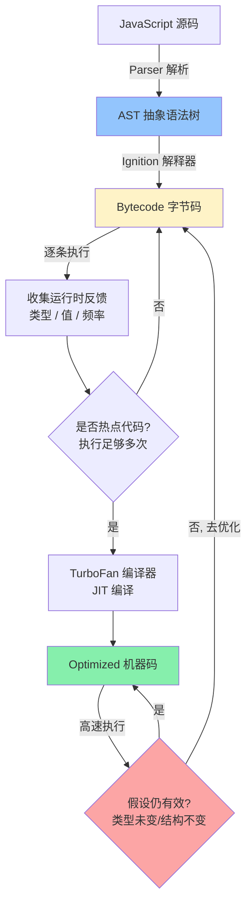
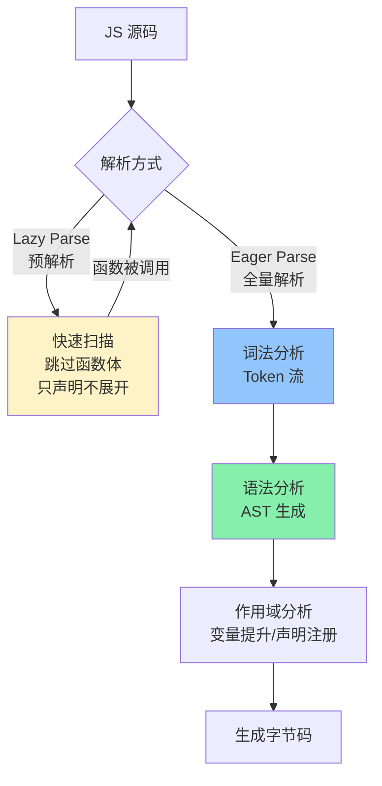
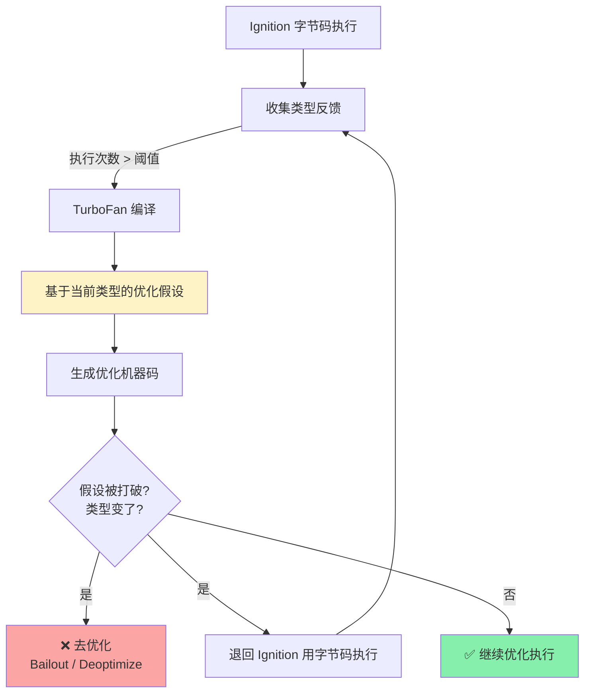
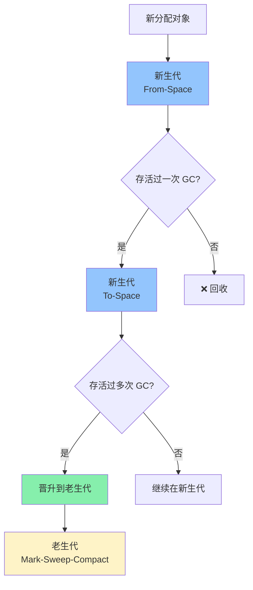

<DifficultyBadge level="advanced" />

# V8 引擎与 JIT

## 一句话解释

V8 是 Google 开源的 JavaScript 引擎（Chrome/Node.js/Deno 都在用），核心架构是**解释器 Ignition（快速执行）+ 编译器 TurboFan（优化热点代码）**——JS 代码先被解析为字节码由 Ignition 执行，运行足够多次的"热点代码"会被 TurboFan 编译为 optimized 机器码直接执行，大幅提升性能。

## 核心流程



## 深入理解

### 1. V8 架构演进

```mermaid
flowchart LR
    subgraph V8 5.0 之前 (2017前)
        A1[Full-Codegen<br/>基线编译器] --> A2[Crankshaft<br/>优化编译器]
    end
    
    subgraph V8 5.0~5.9 (2017)
        B1[Ignition<br/>解释器] --> B2[TurboFan<br/>优化编译器]
    end
    
    subgraph V8 6.0+ (现在)
        C1[Ignition<br/>解释器] --> C2[Sparkplug<br/>快速编译器<br/>≈ Full-Codegen]
        C2 --> C3[TurboFan<br/>优化编译器]
    end
    
    style A1 fill:#fca5a5
    style A2 fill:#fca5a5
    style B1 fill:#fef3c7
    style B2 fill:#86efac
    style C1 fill:#fef3c7
    style C2 fill:#93c5fd
    style C3 fill:#86efac
```

**现代 V8 的三层架构：**

| 层级 | 组件 | 速度 | 何时触发 |
|------|------|------|---------|
| 🥇 **第一层** | Ignition 解释器 | ⚡ 快速启动 | 代码首次执行 |
| 🥈 **第二层** | Sparkplug 编译器 | 🚀 中等 | 代码执行几次后 |
| 🥉 **第三层** | TurboFan 优化编译器 | ✈️ 极速 | 代码多次执行（热点） |

> **核心思想：** 大部分 JS 代码执行次数很少，不需要编译成机器码，解释执行就够用了。只有"热点"函数才值得花费编译时间去优化——这就是 **JIT（Just-In-Time）编译**的哲学。

---

### 2. Parser 解析 — 从源码到 AST

```javascript
// 解析开销对比
const code1 = 'const x = 1 + 2'
// 预解析（Lazy Parse）：快速扫描，不生成完整 AST
// 开销小，适合不会被立即执行的函数

const code2 = `function add(a, b) { return a + b }`
// 全量解析（Eager Parse）：生成完整 AST
// 开销大，但后续执行更快

// 控制解析方式：
const fn = function immediatelyUsed() { /* 全量解析 */ }

// 以下函数会延迟解析（Lazy Parse），直到被调用时才全量解析
function rarelyUsed() { /* 延迟解析 */ }
```



**优化技巧：** 如果一个函数马上要被用到，可以强制 Eager Parse：

```javascript
// ❌ 延迟解析 → 首次调用时额外解析开销
const add = (a, b) => a + b

// ✅ 立即执行函数强制 Eager Parse（仅对 IIFE 有效）
const add = (function(a, b) { return a + b })
```

---

### 3. 隐藏类（Hidden Class）— 对象形状优化

V8 给每个对象关联一个"隐藏类"（类似 C++ 的 vtable），记录对象的属性布局。**相同形状的对象共享隐藏类**，属性访问直接从固定偏移读取，而非哈希查找。

```javascript
// ✅ 优化：相同形状 → 共享隐藏类
function createUser(name, age) {
  // 每次调用都按相同顺序添加属性
  this.name = name
  this.age = age
}

const u1 = new createUser('Alice', 28)
const u2 = new createUser('Bob', 32)
// u1 和 u2 共享同一个隐藏类

// ❌ 反优化：不同构造方式 → 不同隐藏类
const u3 = { age: 25, name: 'Charlie' }
// 属性顺序与 u1/u2 不同 → 不同隐藏类
```

```mermaid
flowchart TD
    subgraph 共享隐藏类（高效）
        A1["p1 {name, age}"] --> H1["隐藏类 C0<br/>→ name: 偏移 0<br/>→ age: 偏移 8"]
        A2["p2 {name, age}"] --> H1
        A3["p3 {name, age}"] --> H1
    end
    
    subgraph 不同隐藏类（低效）
        B1["p4 {age, name}"] --> H2["隐藏类 C1<br/>→ age: 偏移 0<br/>→ name: 偏移 8"]
        B2["p5 {name}"] --> H3["隐藏类 C2<br/>→ name: 偏移 0"]
    end

    style H1 fill:#86efac
    style H2 fill:#fca5a5
    style H3 fill:#fca5a5
```

```javascript
// 实践建议
// ✅ 在构造函数中一次性初始化所有属性
class User {
  constructor(name, age) {
    this.name = name  // 创建隐藏类 C0
    this.age = age    // 过渡到 C1（name → offset 0, age → offset 8）
  }
}

// ❌ 避免动态添加属性（改变形状）
const user = new User('Alice', 28)
user.email = 'alice@example.com'  // ❌ 创建新的隐藏类
user.phone = '1234567890'         // ❌ 又一个新隐藏类

// ❌ 避免删除属性（也会改变形状）
// delete user.age  // ❌ 永远不要这样做！创建新隐藏类且不再共享
// 如果不需要：设值为 null/undefined 而不是 delete
```

---

### 4. 内联缓存（Inline Caching / IC）— 加速属性访问

V8 在运行时会**缓存特定位置的对象属性访问结果**——如果同一行代码每次访问的都是相同形状的对象，直接使用缓存的偏移量，跳过查找过程。

```javascript
// V8 如何优化这段代码：
function getTotal(user) {
  return user.name + ' (' + user.age + ')'
  // 第一次执行：查找 name → 记录隐藏类
  //             查找 age → 记录隐藏类
  // 第 N 次执行：name/age 都在相同偏移 → 直接读偏移（内联缓存命中）
  //             如果形状变了 → 缓存失效，重新查找（多态/巨态）
}

// 单态（Monomorphic）— 最优
getTotal({ name: 'Alice', age: 28 })       // 同一形状
getTotal({ name: 'Bob', age: 32 })         // 同一形状 ← 内联缓存高效

// 多态（Polymorphic）— 可接受（4 种以内）
getTotal({ name: 'Alice', age: 28 })       // 形状 A
getTotal({ fullname: 'Bob', age: 32 })     // 形状 B ← 缓存 2 个分支

// 巨态（Megamorphic）— 性能差（5+ 种形状）
// 超过 4 种不同形状 → 内联缓存退化 → 每次都要完整查找
```

**IC 状态与性能：**

```
单态 [1种形状]   →  最优 ✈️  直接读偏移
多态 [2-4种形状] →  可接受 🚗  查分支表
巨态 [5+种形状]  →  退化 🚲  完整属性查找
```

```javascript
// 优化建议
// ✅ 函数的参数尽量保持形状一致
function processShape(shape) {
  return shape.x + shape.y + shape.width + shape.height
}

// ✅ 好：同一形状
processShape({ x: 0, y: 0, width: 100, height: 200 })
processShape({ x: 10, y: 20, width: 50, height: 60 })

// ❌ 差：不同形状（多态/巨态）
processShape({ x: 0, y: 0, w: 100, h: 200 })    // 不同键名
processShape({ x: 0, y: 0, width: 100 })          // 缺少 height
```

---

### 5. TurboFan 优化与去优化



```javascript
// TurboFan 的假设过程
function add(a, b) {
  return a + b
  // 第 1-10 次：Ignition 字节码执行
  //      → 收集反馈：a 都是 number, b 都是 number
  // 第 11 次：TurboFan 编译优化版本
  //      → 假设：a 和 b 永远是 number
  //      → 编译为: mov rax, [a]; add rax, [b]; 直接机器码加法
  // 第 12 次：add('hello', 'world')
  //      → 假设被打破！去优化
  //      → 退回 Ignition 字节码（正确处理字符串拼接）
  //      → 下次再变 number → 不再优化（被标记为不稳定）
}
```

**哪些操作容易导致去优化：**

```javascript
// 1️⃣ 函数参数类型不稳定
function double(x) {
  return x * 2
}
double(1)         // number
double(2)         // number → 优化假设: 参数是 number
double('3')       // ❌ 类型变了 → 去优化

// 2️⃣ 数组元素类型不稳定
const arr = [1, 2, 3]          // PACKED_SMI_ELEMENTS（整数数组）
arr.push(4.5)                  // ❌ 变成 PACKED_DOUBLE_ELEMENTS → 去优化
arr.push('hello')              // ❌ 变成 PACKED_ELEMENTS → 再去优化

// 3️⃣ 添加/删除属性
function getX(obj) {
  return obj.x
}
getX({ x: 1, y: 2 })         // 形状 A
getX({ x: 1 })               // 形状 B → 多态
getX({ x: 1, z: 3 })         // 形状 C → 又多一个
getX({ x: 1, w: 4 })         // 形状 D
getX({ x: 1, v: 5 })         // 形状 E → 巨态，缓存退化
```

---

### 6. 数组元素类型优化

V8 内部根据数组内容选择不同的存储表示：

```javascript
// V8 的数组元素类型（从左到右，性能递减）

// 🥇 最快：PACKED_SMI_ELEMENTS
const arr1 = [1, 2, 3]
// 纯整数（31-bit signed），无空洞 → 紧凑的 C 风格数组

// 🥈 PACKED_DOUBLE_ELEMENTS
const arr2 = [1.0, 2.5, 3.14]
// 浮点数，无空洞

// 🥉 PACKED_ELEMENTS
const arr3 = [1, 'hello', true]
// 任意类型，无空洞

// 一旦数组出现"空洞"（hole），性能进一步下降：
const arr4 = [1, , 3]          // HOLEY_* 类型
const arr5 = new Array(100)    // HOLEY_SMI_ELEMENTS
arr5[0] = 1                    // 仍然是 holey
```

```mermaid
flowchart LR
    A["[] 空数组"] --> B["[1, 2, 3]<br/>PACKED_SMI"] -->|push 4.5| C["[1, 2, 3, 4.5]<br/>PACKED_DOUBLE"] -->|push 'a'| D["[1, 2, 3, 4.5, 'a']<br/>PACKED_ELEMENTS"]
    B -->|arr[10] = 5| E["[1, 2, 3, , ... , 5]<br/>HOLEY_SMI"] --> F["...更多 holey 类型"]
    
    style B fill:#86efac
    style C fill:#fef3c7
    style D fill:#fca5a5
    style E fill:#fef3c7
    style F fill:#fca5a5
```

```javascript
// 实践：保持数组元素类型一致
// ✅ 好：统一整数
const ids = [1, 2, 3, 4, 5]

// ✅ 好：预留空间用 fill 初始化
const data = new Array(100).fill(0)  // PACKED_SMI

// ❌ 差：预留空间不用 fill
const holes = new Array(100)         // HOLEY_SMI
holes[0] = 1                         // 仍然是 holey

// ❌ 差：混合类型
const mixed = [1, 'two', 3.0, true]  // PACKED_ELEMENTS（最慢的 packed）

// ❌ 差：从 delete 产生空洞
const arr = [1, 2, 3]
delete arr[1]  // 变成 HOLEY 类型
// 用 splice 代替 delete
arr.splice(1, 1)  // [1, 3] — 没有空洞
```

---

### 7. V8 的垃圾回收（GC）

V8 使用**分代回收（Generational GC）**——大多数对象生命周期短，少部分活得久：

| 代 | 空间 | 收集频率 | 算法 |
|----|------|---------|------|
| **新生代**（Young Gen） | 小空间（~16MB） | 🔥 频繁 | Scavenge（复制算法） |
| **老生代**（Old Gen） | 大空间（~1.4GB+） | 🐢 不频繁 | Mark-Sweep-Compact |
| **大对象空间** | 超大对象 | 按需 | 单独处理 |



**GC 对前端的影响：**

```javascript
// GC 会暂停 JS 执行（Stop-The-World）
// 新生代 GC 非常快（< 1ms），基本无感
// 老生代 GC 可能暂停 100ms+，导致掉帧

// 减少 GC 压力的技巧：
// 1. 对象复用（而不是频繁创建新对象）
function processFrame() {
  // ❌ 每次调用创建新对象
  const state = { x: 0, y: 0, dx: 1, dy: 1 }
  // ...
  
  // ✅ 复用已分配的对象
  const statePool = { x: 0, y: 0, dx: 0, dy: 0 }
  function processFrameOptimized() {
    statePool.dx = Math.random()
    statePool.dy = Math.random()
    // ... 复用 statePool
  }
}

// 2. 避免大的闭包引用
function createHeavyClosure() {
  const hugeData = new Array(1000000).fill('x')  // 大数组
  return function() {
    // 这个闭包只用了 console.log，但 hugeData 因为作用域链无法回收
    console.log('hello')
  }
}
// 修复：只引用需要的东西
function createLightClosure() {
  const hugeData = new Array(1000000).fill('x')
  // ... 用 hugeData 做些计算 ...
  const result = 'hello'
  return function() {
    console.log(result)  // 只引用 result，hugeData 可以被回收
  }
}
```

---

## 面试问法

- 🔥 **V8 是如何执行 JavaScript 的？**
  - Parser 解析为 AST → Ignition 生成字节码 → 解释执行 → 热点代码 TurboFan 编译为机器码 → 类型假设被打破时去优化

- 🔥 **什么是隐藏类？对性能有什么影响？**
  - 对象形状的元数据，记录属性偏移量
  - 相同形状的对象共享隐藏类，属性访问是固定偏移读取
  - 动态增减属性会创建新隐藏类，导致多态/巨态

- 🔥 **什么是内联缓存（IC）？单态/多态/巨态？**
  - 缓存同一位置属性访问的结果
  - 单态 1 种形状：最优
  - 多态 2-4 种：可接受
  - 巨态 5+ 种：退化，每次完整查找

- 🔥 **什么会导致 TurboFan 去优化？**
  - 函数参数类型变化
  - 数组元素类型变化
  - 对象形状变化
  - 抛出异常（会中断优化）

- ⭐ **V8 数组的元素类型有哪些？**
  - PACKED_SMI（纯整数, 最快）→ PACKED_DOUBLE（浮点数）→ PACKED（任意）
  - 带空洞的 HOLEY 版本性能更差
  - 类型转换是单向的（不能从 PACKED_ELEMENTS 变回 PACKED_SMI）

- ⭐ **V8 的垃圾回收是怎么工作的？**
  - 分代回收：新生代（复制算法）→ 老生代（标记清除压缩）
  - Stop-The-World：GC 时暂停 JS 执行
  - 优化：减少对象分配、对象复用、避免大的闭包引用

- 📌 **如何写出对 V8 友好的代码？**
  - 构造函数中一次初始化所有属性（固定形状）
  - 数组保持元素类型统一
  - 避免 delete 属性
  - 函数的参数类型保持稳定
  - 多用 const/let，避免 with/eval

## 💡 AI 辅助学习

> 用这个 Prompt 深入理解 V8：
>
> "我是一名前端开发者，正在准备高级面试。请帮我用 V8 引擎的视角分析以下代码的性能：
>
> ```javascript
> function processItems(items) {
>   let result = 0
>   for (let i = 0; i < items.length; i++) {
>     const item = items[i]
>     if (item.type === 'A') {
>       result += calculate(item, i)
>     }
>   }
>   return result
> }
>
> function calculate(obj, idx) {
>   obj.index = idx
>   return obj.value * 2
> }
> ```
>
> 请解释：
> 1. `processItems` 参数 items 的类型稳定性对 IC 的影响
> 2. `calculate` 函数中 `obj.index = idx` 对隐藏类的影响
> 3. 循环中的 `items.length` 访问是否会被优化
> 4. 如果 items 是一个巨大的数组（100万+），V8 的 GC 会有什么压力？
> 5. 给出优化版本并解释为什么更好"

## 关联知识

- [JS 执行机制](./js-execution) — 执行上下文、调用栈
- [内存管理与泄漏排查](./memory-management) — V8 GC 的详细机制
- [性能优化全景](../engineering/performance-overview) — V8 友好的代码实践
- [渲染优化](../engineering/rendering-optimization) — 避免 GC 导致掉帧
