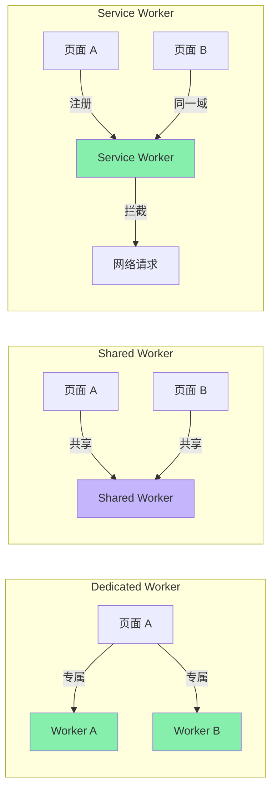
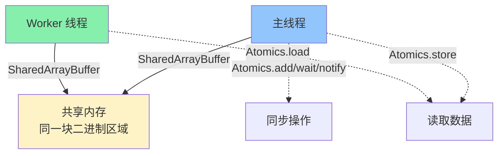
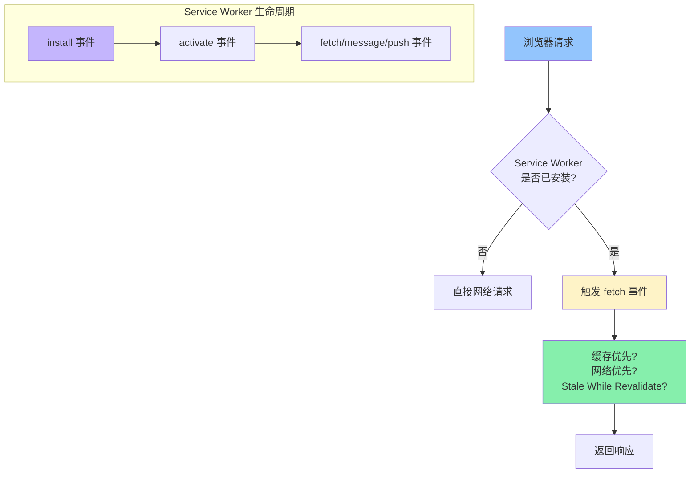
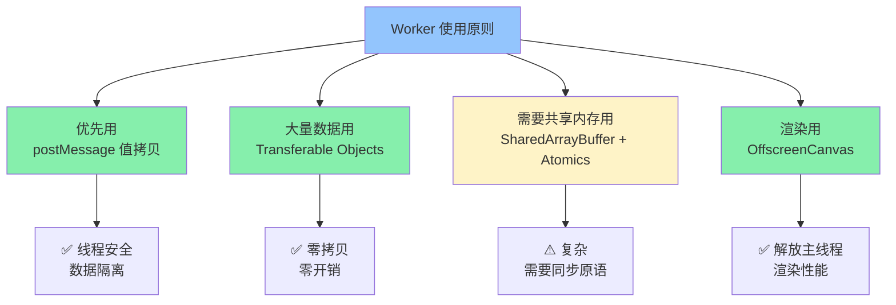

<DifficultyBadge level="advanced" />

# Web Worker 与多线程

## 一句话解释

Web Worker 是浏览器提供的**真实多线程能力**——让 JS 在独立线程中运行，不阻塞主线程 UI 渲染；三种 Worker 各司其职：**Dedicated Worker**（专用线程，一对一）、**Shared Worker**（共享线程，多页面）、**Service Worker**（网络代理，离线/PWA 核心）；线程间通过 **postMessage** 通信，**SharedArrayBuffer** 实现共享内存，**Atomics** 实现无锁同步。

## 核心流程

```mermaid
flowchart TD
    A[主线程 Main Thread] -->|new Worker('file.js')| B[Dedicated Worker]
    A -->|new SharedWorker('file.js')| C[Shared Worker]
    A -->|navigator.serviceWorker.register| D[Service Worker]
    
    B -->|postMessage<br/>传输数据副本| A
    C -->|postMessage| E[页面 1]
    C -->|postMessage| F[页面 2]
    D -->|fetch 事件| G[拦截网络请求]
    
    B -.->|SharedArrayBuffer<br/>共享内存| A
    D -.->|Cache API| H[离线缓存]
    D -.->|Push API| I[推送通知]

    style A fill:#93c5fd
    style B fill:#86efac
    style C fill:#c4b5fd
    style D fill:#86efac
```

## 深入理解

### 1. 三种 Worker 对比

| 特性 | Dedicated Worker | Shared Worker | Service Worker |
|------|-----------------|---------------|----------------|
| **实例数** | 1:1（每个页面可创建多个） | 1:N（同源页面共享） | 1:1（每个域一个） |
| **生命周期** | 随页面（无引用时终止） | 随页面（所有引用断开后终止） | 独立（浏览器管理） |
| **通信** | `postMessage` | `postMessage` + `connect` | `fetch` / `message` / `push` |
| **作用** | 计算密集型任务 | 多页面共享状态 | 离线/PWA/缓存/推送 |
| **DOM 访问** | ❌ 不能 | ❌ 不能 | ❌ 不能 |
| **可用 API** | ✅ fetch, IndexedDB, WebSocket, Cache API, timer | 同左 | 同左 + Cache API 特化 |
| **暂停** | 页面关闭时 | 最后连接关闭时 | 浏览器控制（可唤醒） |



---

### 2. Dedicated Worker — 计算密集型任务的救星

```javascript
// === main.js（主线程） ===
// 创建 Worker（同源 JS 文件）
const worker = new Worker('heavy-worker.js')

// 发送消息给 Worker
worker.postMessage({ type: 'process', data: new Array(1000000).fill(1) })

// 接收 Worker 的回传
worker.onmessage = (event) => {
  console.log('Worker 返回:', event.data.result)
}

// 错误处理
worker.onerror = (error) => {
  console.error('Worker 错误:', error.message)
  worker.terminate()  // 终止 Worker
}

// 超时处理
const timeout = setTimeout(() => {
  console.warn('Worker 执行超时，终止')
  worker.terminate()
}, 5000)

// 不再需要时终止
// worker.terminate()

// === heavy-worker.js（Worker 线程） ===
// 没有 DOM / window / document / parent
// 有: self / postMessage / onmessage / fetch / IndexedDB / setTimeout

self.onmessage = (event) => {
  const { type, data } = event.data
  
  if (type === 'process') {
    // 执行耗时计算（不阻塞主线程 UI）
    const result = data.reduce((sum, x) => sum + x, 0)
    
    // 返回结果
    self.postMessage({ result })
  }
}

// 也可以导入其他脚本
// importScripts('lib.js', 'utils.js')
```

**数据传输方式：**

```javascript
// 方式 1：值拷贝（默认）
// 对象被结构化克隆（Structured Clone），支持循环引用但不支持函数/原型
worker.postMessage({ a: 1, b: [2, 3], c: { nested: true } })
// 主线程的原始对象不受影响（拷贝副本）

// 方式 2：Transferable Objects — 零拷贝转移
// 对于大型二进制数据，使用 Transferable 可避免拷贝
// 转移后，主线程不再持有该数据！

function processLargeData() {
  const buffer = new ArrayBuffer(1024 * 1024 * 100)  // 100MB
  
  // 使用 transfer（零拷贝，主线程失去 buffer 所有权）
  worker.postMessage({ data: buffer }, [buffer])
  // 之后 buffer.byteLength === 0（已被转移）
  
  // 如果不 transfer：拷贝 100MB → 卡顿！
}

// 可转移的类型：
// - ArrayBuffer
// - MessagePort
// - ReadableStream / WritableStream / TransformStream
// - OffscreenCanvas
// - ImageBitmap
```

---

### 3. SharedArrayBuffer — 共享内存



```javascript
// === 主线程 ===
// 创建共享内存（以字节为单位）
const sab = new SharedArrayBuffer(1024)  // 1KB 共享内存
const view = new Int32Array(sab)         // Int32 视图

// 初始值
view[0] = 0
view[1] = 42

// 传给 Worker
const worker = new Worker('worker.js')
worker.postMessage({ sab })

// 用 Atomics 安全写入
Atomics.store(view, 0, 1)
// 唤醒等待的 Worker（如果它在等待位置 0）
Atomics.notify(view, 0, 1)

// === worker.js ===
self.onmessage = (event) => {
  const sab = event.data.sab
  const view = new Int32Array(sab)
  
  console.log('SAB[1] =', Atomics.load(view, 1))  // 42
  
  // 等待位置 0 的值变化
  const result = Atomics.wait(view, 0, 0)  // 阻塞直到 view[0] != 0
  console.log('被唤醒, view[0] =', Atomics.load(view, 0))
}
```

**Atomics 静态方法速查：**

| 方法 | 作用 | 类似 |
|------|------|------|
| `Atomics.load(typedArray, index)` | 原子读取 | `arr[i]` |
| `Atomics.store(typedArray, index, value)` | 原子写入 | `arr[i] = v` |
| `Atomics.add(typedArray, index, value)` | 原子加法并返回原值 | `arr[i] += v` |
| `Atomics.sub(typedArray, index, value)` | 原子减法 | `arr[i] -= v` |
| `Atomics.exchange(typedArray, index, value)` | 原子交换 | 赋值并返回旧值 |
| `Atomics.compareExchange(arr, idx, expected, replacement)` | CAS | 仅当相等时才替换 |
| `Atomics.wait(typedArray, index, value, timeout?)` | 阻塞等待 | 条件变量 wait |
| `Atomics.notify(typedArray, index, count)` | 唤醒等待 | 条件变量 signal |

```javascript
// 实战：Worker 与主线程的计数器同步
// main.js
const sab = new SharedArrayBuffer(4)  // 4 字节 = 1 个 Int32
const counter = new Int32Array(sab)
counter[0] = 0

const worker = new Worker('counter-worker.js')
worker.postMessage({ sab })

// 从 Worker 读取安全计数
function getCount() {
  return Atomics.load(counter, 0)
}

// counter-worker.js
self.onmessage = (event) => {
  const counter = new Int32Array(event.data.sab)
  
  // 原子自增
  for (let i = 0; i < 1000; i++) {
    Atomics.add(counter, 0, 1)
  }
  self.postMessage('done')
}
```

---

### 4. OffscreenCanvas — 在 Worker 中渲染图形

```javascript
// === main.js ===
const canvas = document.getElementById('myCanvas')

// 将 Canvas 的控制权移交给 Worker
const offscreen = canvas.transferControlToOffscreen()
const worker = new Worker('canvas-worker.js')
worker.postMessage({ canvas: offscreen }, [offscreen])
// 主线程不再直接操作 canvas

// === canvas-worker.js ===
self.onmessage = (event) => {
  const canvas = event.data.canvas
  const ctx = canvas.getContext('2d')
  
  // 在 Worker 中做复杂渲染
  function render() {
    ctx.clearRect(0, 0, canvas.width, canvas.height)
    
    // 复杂的粒子/物理/计算
    for (let i = 0; i < 10000; i++) {
      ctx.fillStyle = `hsl(${Date.now() / 10 % 360}, 50%, 50%)`
      ctx.fillRect(
        Math.random() * canvas.width,
        Math.random() * canvas.height,
        2, 2
      )
    }
    
    requestAnimationFrame(render)
  }
  
  render()
}
```

**适用场景：**

| 场景 | 为什么用 OffscreenCanvas |
|------|------------------------|
| **粒子系统** | 大量 draw calls 不阻塞主线程 |
| **数据可视化** | 大数据量图表渲染 |
| **图像处理** | filter / pixel manipulation |
| **游戏渲染** | 60fps 渲染不卡 UI |
| **实时视频处理** | 每帧处理不丢帧 |

---

### 5. Service Worker — 离线与 PWA 的核心



```javascript
// === service-worker.js ===
const CACHE_NAME = 'my-app-v1'
const PRECACHE_URLS = [
  '/',
  '/index.html',
  '/app.js',
  '/style.css',
  '/logo.png'
]

// 安装阶段：预缓存关键资源
self.addEventListener('install', (event) => {
  event.waitUntil(
    caches.open(CACHE_NAME).then((cache) => {
      return cache.addAll(PRECACHE_URLS)
    })
  )
  // 立即激活（不等待旧版本关闭）
  self.skipWaiting()
})

// 激活阶段：清理旧缓存
self.addEventListener('activate', (event) => {
  event.waitUntil(
    caches.keys().then((keys) => {
      return Promise.all(
        keys.filter((key) => key !== CACHE_NAME)
          .map((key) => caches.delete(key))
      )
    })
  )
  // 控制所有页面（不限于当前标签页）
  self.clients.claim()
})

// 请求拦截：缓存策略
self.addEventListener('fetch', (event) => {
  // 策略判定
  if (event.request.url.includes('/api/')) {
    // API 请求 → 网络优先 + 缓存后备
    event.respondWith(networkFirst(event.request))
  } else {
    // 静态资源 → 缓存优先 + 网络后备
    event.respondWith(cacheFirst(event.request))
  }
})

async function cacheFirst(request) {
  const cached = await caches.match(request)
  if (cached) return cached
  
  try {
    const response = await fetch(request)
    const cache = await caches.open(CACHE_NAME)
    cache.put(request, response.clone())
    return response
  } catch (e) {
    return new Response('Offline', { status: 503 })
  }
}

async function networkFirst(request) {
  try {
    const response = await fetch(request)
    const cache = await caches.open(CACHE_NAME)
    cache.put(request, response.clone())
    return response
  } catch (e) {
    const cached = await caches.match(request)
    return cached || new Response('Offline', { status: 503 })
  }
}

// 接收消息
self.addEventListener('message', (event) => {
  if (event.data.type === 'SKIP_WAITING') {
    self.skipWaiting()
  }
})
```

**Service Worker 调试要点：**

```javascript
// 在浏览器 DevTools → Application → Service Workers
// 勾选 "Update on reload" 确保每次刷新都更新 SW
// 勾选 "Bypass for network" 临时绕过 SW 调试

// 手动检查 Service Worker 状态
if ('serviceWorker' in navigator) {
  navigator.serviceWorker.ready.then((registration) => {
    console.log('SW 状态:', registration.active ? '已激活' : '未激活')
    
    // 检查更新
    registration.update()
    
    // 监听新的 SW
    navigator.serviceWorker.addEventListener('controllerchange', () => {
      console.log('新的 SW 已接管页面')
      // 通常在这里刷新页面以应用新缓存
      window.location.reload()
    })
  })
}
```

---

### 6. Worker 的线程安全与最佳实践



```javascript
// Worker 最佳实践清单：

// ✅ 1. 用 Blob URL 内联 Worker（避免单独文件）
function createInlineWorker(code) {
  const blob = new Blob([code], { type: 'application/javascript' })
  const url = URL.createObjectURL(blob)
  const worker = new Worker(url)
  URL.revokeObjectURL(url)
  return worker
}

const worker = createInlineWorker(`
  self.onmessage = ({ data }) => {
    self.postMessage(data * 2)
  }
`)

// ✅ 2. 合理使用 terminate 清理
function withTimeout(worker, ms = 5000) {
  let terminated = false
  const timer = setTimeout(() => {
    terminated = true
    worker.terminate()
  }, ms)
  
  return {
    postMessage: (msg) => worker.postMessage(msg),
    onmessage: (cb) => {
      worker.onmessage = (e) => {
        clearTimeout(timer)
        if (!terminated) cb(e)
      }
    }
  }
}

// ✅ 3. Worker 池（多 Worker 并行）
class WorkerPool {
  constructor(workerScript, size = navigator.hardwareConcurrency || 4) {
    this.workers = Array.from({ length: size }, () => {
      const w = new Worker(workerScript)
      w.busy = false
      return w
    })
    this.queue = []
  }
  
  run(data) {
    return new Promise((resolve, reject) => {
      const worker = this.workers.find(w => !w.busy)
      if (worker) {
        worker.busy = true
        worker.postMessage(data)
        worker.onmessage = (e) => {
          worker.busy = false
          resolve(e.data)
          this.processQueue()
        }
      } else {
        this.queue.push({ data, resolve, reject })
      }
    })
  }
  
  processQueue() {
    if (this.queue.length > 0) {
      const task = this.queue.shift()
      this.run(task.data).then(task.resolve).catch(task.reject)
    }
  }
  
  terminate() {
    this.workers.forEach(w => w.terminate())
  }
}

// ✅ 4. 错误隔离
// Worker 崩溃不会影响主线程！
// Worker 内的 try/catch 才能捕获异常
```

---

## 面试问法

- 🔥 **Web Worker 的作用？和主线程的关系？**
  - 真实多线程，不阻塞主线程 UI
  - 不能访问 DOM，通过 postMessage 通信
  - 适合：计算密集型、大数据处理、图像渲染、加密

- 🔥 **三种 Worker 的区别？**
  - Dedicated Worker：一对一，页面专用
  - Shared Worker：一对多，同源页面共享
  - Service Worker：网络代理，离线/PWA/缓存

- 🔥 **postMessage 的数据传递方式？**
  - 值拷贝：Structured Clone，适合小数据
  - Transferable Objects：零拷贝转移，适合大二进制数据
  - SharedArrayBuffer：共享内存，需 Atomics 同步

- ⭐ **SharedArrayBuffer 和 Atomics 的作用？**
  - SAB：主线和 Worker 共享同一块内存
  - Atomics：确保多线程安全读写（防止 CPU 指令重排）
  - `Atomics.wait/notify`：实现线程间同步

- ⭐ **OffscreenCanvas 解决了什么问题？**
  - 在 Worker 中执行 Canvas 渲染
  - 解放主线程，让复杂渲染不阻塞 UI
  - 适合粒子系统、数据可视化、游戏

- ⭐ **Service Worker 的生命周期？**
  - install（安装，预缓存）→ activate（激活，清理旧缓存）→ fetch/message（工作状态）
  - `skipWaiting()`：立即激活
  - `clients.claim()`：控制所有页面

- 📌 **Worker 不能做什么？**
  - 不能访问 DOM、window、document、parent
  - 不能直接操作 canvas（需 OffscreenCanvas）
  - 不能跨域加载脚本（需同源）

## 💡 AI 辅助学习

> 用这个 Prompt 深入理解多线程：
>
> "我是一名前端开发准备面试。请帮我设计并实现一个『在浏览器中处理 100 万条数据』的方案：
>
> 1. 生成 100 万条随机数据（每条含 id, name, age, score, 嵌套对象）
> 2. 按 score 排序（降序）
> 3. 计算每个年龄段的平均分（按 age 分组：0-18, 19-30, 31-50, 50+）
> 4. 将结果渲染到页面上（生成一个统计图表）
>
> 要求：
> - 不能阻塞主线程 UI（用户要能正常滚动/点击）
> - 使用 Web Worker + Transferable 优化
> - 对比纯主线程执行和 Worker 方案的时间差异
> - 考虑错误处理和 Worker 超时

## 关联知识

- [V8 引擎与 JIT](./v8-engine) — Worker 中 V8 独立实例
- [内存管理与泄漏排查](./memory-management) — Worker 内存隔离与 GC
- [浏览器渲染流水线](./browser-rendering) — 主线程与 UI 渲染的关系
- [性能优化全景](../engineering/performance-overview) — 多线程优化策略
- [加载优化策略](../engineering/loading-optimization) — Service Worker 离线缓存
