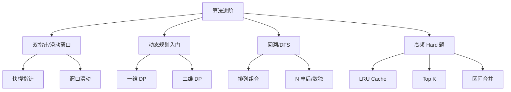

<DifficultyBadge level="advanced" />

# 算法进阶

## 一句话解释

P7+ 级别的算法面试，考察的不再是"这道题的解法"，而是**你能否在复杂度约束下找到最优解**——面试官关注的是你的**系统化思维**：空间换时间？预处理？分治？还是数学优化？

## 进阶算法分类



## 深入理解

### 1. 双指针技巧

**两数之和 II（有序数组）：**
```javascript
function twoSum(numbers, target) {
  let left = 0
  let right = numbers.length - 1
  
  while (left < right) {
    const sum = numbers[left] + numbers[right]
    if (sum === target) return [left + 1, right + 1]
    if (sum < target) left++
    else right--
  }
  return [-1, -1]
}
```

**三数之和：**
```javascript
function threeSum(nums) {
  nums.sort((a, b) => a - b)
  const result = []
  
  for (let i = 0; i < nums.length - 2; i++) {
    if (i > 0 && nums[i] === nums[i - 1]) continue
    
    let left = i + 1
    let right = nums.length - 1
    
    while (left < right) {
      const sum = nums[i] + nums[left] + nums[right]
      if (sum === 0) {
        result.push([nums[i], nums[left], nums[right]])
        while (left < right && nums[left] === nums[left + 1]) left++
        while (left < right && nums[right] === nums[right - 1]) right--
        left++
        right--
      } else if (sum < 0) {
        left++
      } else {
        right--
      }
    }
  }
  return result
}
```

### 2. 滑动窗口

**无重复字符的最长子串：**
```javascript
function lengthOfLongestSubstring(s) {
  const seen = new Map()
  let maxLen = 0
  let left = 0
  
  for (let right = 0; right < s.length; right++) {
    const char = s[right]
    if (seen.has(char) && seen.get(char) >= left) {
      left = seen.get(char) + 1
    }
    seen.set(char, right)
    maxLen = Math.max(maxLen, right - left + 1)
  }
  
  return maxLen
}
```

### 3. 动态规划（前端够用版）

**爬楼梯（一维 DP）：**
```javascript
function climbStairs(n) {
  if (n <= 2) return n
  let prev = 1
  let curr = 2
  
  for (let i = 3; i <= n; i++) {
    const next = prev + curr
    prev = curr
    curr = next
  }
  return curr
}
```

**最大子数组和：**
```javascript
function maxSubArray(nums) {
  let maxSoFar = nums[0]
  let maxEndingHere = nums[0]
  
  for (let i = 1; i < nums.length; i++) {
    maxEndingHere = Math.max(nums[i], maxEndingHere + nums[i])
    maxSoFar = Math.max(maxSoFar, maxEndingHere)
  }
  return maxSoFar
}
```

### 4. LRU Cache（前端高频）

```javascript
class LRUCache {
  constructor(capacity) {
    this.capacity = capacity
    this.cache = new Map()
  }
  
  get(key) {
    if (!this.cache.has(key)) return -1
    
    const value = this.cache.get(key)
    // 重新插入到末尾（表示最近使用）
    this.cache.delete(key)
    this.cache.set(key, value)
    return value
  }
  
  put(key, value) {
    if (this.cache.has(key)) {
      this.cache.delete(key)
    } else if (this.cache.size >= this.capacity) {
      // 删除最久未使用的（Map 的第一个 key）
      const oldestKey = this.cache.keys().next().value
      this.cache.delete(oldestKey)
    }
    this.cache.set(key, value)
  }
}
```

### 5. Top K 问题

```javascript
// 数组中的第 K 个最大元素
function findKthLargest(nums, k) {
  // 使用最小堆（简单实现：排序）
  return nums.sort((a, b) => b - a)[k - 1]
}

// 前 K 个高频元素
function topKFrequent(nums, k) {
  const freq = new Map()
  for (const num of nums) {
    freq.set(num, (freq.get(num) || 0) + 1)
  }
  
  return [...freq.entries()]
    .sort((a, b) => b[1] - a[1])
    .slice(0, k)
    .map(([num]) => num)
}
```

### 6. 区间合并

```javascript
function merge(intervals) {
  if (intervals.length <= 1) return intervals
  
  intervals.sort((a, b) => a[0] - b[0])
  const result = [intervals[0]]
  
  for (let i = 1; i < intervals.length; i++) {
    const last = result[result.length - 1]
    const current = intervals[i]
    
    if (current[0] <= last[1]) {
      // 有重叠，合并
      last[1] = Math.max(last[1], current[1])
    } else {
      result.push(current)
    }
  }
  return result
}
```

### 7. 前端场景的算法应用

| 场景 | 算法 | 实战案例 |
|------|------|---------|
| **虚拟列表** | 二分查找 | 从百万级数据中快速定位可见区域 |
| **拖拽排序** | 数组操作 + 交换 | 拖拽后重新计算位置 |
| **树形控件** | 递归/DFS | 组织树、菜单树、级联选择 |
| **自动补全** | Trie（前缀树）| 输入提示、关键词匹配 |
| **版本对比** | 字符串比较 | 语义化版本号比较 |
| **数据去重** | 哈希表/Set | 大量数据高速去重 |
| **时间线/日程** | 区间合并 | 合并空闲时间段 |

## 面试问法

- 🔥 **算法面试如何展现 P7+ 水平？**
  - 不只是写出来，而是分析**为什么这个解法是最优的**
  - 主动讨论**时间和空间复杂度**的 trade-off
  - 展示**工程化思维**：这个算法在真实项目中怎么用？有什么限制？

- ⭐ **DP 题在前端面试中出现频率？**
  - 大部分前端岗位不考复杂 DP
  - 少数大厂（字节、Google、Microsoft）会有 1-2 道 Medium DP
  - 掌握一维 DP 和简单二维 DP 足够

- ⭐ **如果面试时想不出最优解？**
  - 先给暴力解，再逐步优化
  - 说出你的思考过程："首先想到 XX，但复杂度是 O(n²)，优化方向是..."
  - 和面试官讨论比闷头写更重要

## 💡 AI 辅助学习

> 用这个 Prompt 让 AI 帮你练算法进阶：
> "你是一个大厂面试算法教练。以 LeetCode Top 100 中 Medium 和 Hard 题为范围，帮我做以下练习：
> 1. 出一道 Medium 算法题
> 2. 我给出实现
> 3. 你 review：时间/空间复杂度分析是否正确？有没有更优解？边界处理是否完整？
> 4. 给一个 follow-up 追问
> 5. 如果这道题有前端场景的结合，指出来
> 
> 重点练习：滑动窗口、双指针、LRU、Top K、区间合并、简单 DP。"

## 关联知识

- [算法入门](./algorithms-basics) — 前端向算法基础
- [手写代码题集](./handwrite-code) — 高频手写题
- [前端系统设计 ①](./system-design-1) — 算法在系统设计中的应用
