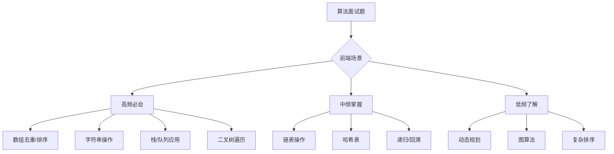

<DifficultyBadge level="intermediate" />

# 算法入门（前端向）

## 一句话解释

前端面试的算法不考"难题怪题"——核心是**常见数据结构的操作熟练度**和**问题拆解能力**。相比后端，前端更侧重数组/字符串/树的遍历操作，以及对**时间复杂度**的基本认知。

## 算法分类



## 深入理解

### 1. 数组操作（最高频）

**数组去重：**
```javascript
// Set 去重
const unique = arr => [...new Set(arr)]

// reduce 去重
const unique = arr => arr.reduce((acc, cur) => 
  acc.includes(cur) ? acc : [...acc, cur], [])

// 对象 key 去重（性能最优）
const unique = arr => {
  const map = {}
  return arr.filter(item => {
    if (map[item]) return false
    map[item] = true
    return true
  })
}
```

**数组扁平化：**
```javascript
// 递归
function flatten(arr) {
  return arr.reduce((acc, cur) => 
    acc.concat(Array.isArray(cur) ? flatten(cur) : cur), [])
}

// 迭代（指定深度）
function flatten(arr, depth = 1) {
  return arr.reduce((acc, cur) => {
    if (Array.isArray(cur) && depth > 0) {
      acc.push(...flatten(cur, depth - 1))
    } else {
      acc.push(cur)
    }
    return acc
  }, [])
}
```

### 2. 字符串操作

**反转字符串：**
```javascript
const reverse = str => str.split('').reverse().join('')
```

**回文判断：**
```javascript
const isPalindrome = str => {
  const cleaned = str.toLowerCase().replace(/[\W_]/g, '')
  return cleaned === cleaned.split('').reverse().join('')
}
```

**大数相加（前端特有场景）：**
```javascript
function bigNumberAdd(a, b) {
  let i = a.length - 1
  let j = b.length - 1
  let carry = 0
  let result = ''
  
  while (i >= 0 || j >= 0 || carry) {
    const sum = (+a[i] || 0) + (+b[j] || 0) + carry
    result = (sum % 10) + result
    carry = Math.floor(sum / 10)
    i--
    j--
  }
  return result
}
```

### 3. 栈和队列

**栈实现队列：**
```javascript
class Queue {
  constructor() {
    this.inStack = []
    this.outStack = []
  }
  
  enqueue(val) {
    this.inStack.push(val)
  }
  
  dequeue() {
    if (this.outStack.length === 0) {
      while (this.inStack.length) {
        this.outStack.push(this.inStack.pop())
      }
    }
    return this.outStack.pop()
  }
  
  peek() {
    if (this.outStack.length === 0) {
      while (this.inStack.length) {
        this.outStack.push(this.inStack.pop())
      }
    }
    return this.outStack[this.outStack.length - 1]
  }
  
  empty() {
    return this.inStack.length === 0 && this.outStack.length === 0
  }
}
```

**有效的括号（经典面试题）：**
```javascript
function isValidBrackets(s) {
  const map = { '(': ')', '{': '}', '[': ']' }
  const stack = []
  
  for (const char of s) {
    if (map[char]) {
      stack.push(char)
    } else {
      if (stack.length === 0) return false
      const top = stack.pop()
      if (map[top] !== char) return false
    }
  }
  
  return stack.length === 0
}
```

### 4. 二叉树遍历

```javascript
// 二叉树节点
class TreeNode {
  constructor(val, left, right) {
    this.val = val
    this.left = left || null
    this.right = right || null
  }
}

// 前序遍历（根左右）
function preorderTraversal(root) {
  const result = []
  function traverse(node) {
    if (!node) return
    result.push(node.val)
    traverse(node.left)
    traverse(node.right)
  }
  traverse(root)
  return result
}

// 中序遍历（左根右）
function inorderTraversal(root) {
  const result = []
  function traverse(node) {
    if (!node) return
    traverse(node.left)
    result.push(node.val)
    traverse(node.right)
  }
  traverse(root)
  return result
}

// 后序遍历（左右根）
function postorderTraversal(root) {
  const result = []
  function traverse(node) {
    if (!node) return
    traverse(node.left)
    traverse(node.right)
    result.push(node.val)
  }
  traverse(root)
  return result
}

// 层序遍历（BFS）
function levelOrder(root) {
  if (!root) return []
  const result = []
  const queue = [root]
  
  while (queue.length) {
    const level = []
    const size = queue.length
    for (let i = 0; i < size; i++) {
      const node = queue.shift()
      level.push(node.val)
      if (node.left) queue.push(node.left)
      if (node.right) queue.push(node.right)
    }
    result.push(level)
  }
  return result
}
```

### 5. 排序算法

**快速排序（掌握思路即可）：**
```javascript
function quickSort(arr) {
  if (arr.length <= 1) return arr
  
  const pivot = arr[Math.floor(arr.length / 2)]
  const left = arr.filter(x => x < pivot)
  const middle = arr.filter(x => x === pivot)
  const right = arr.filter(x => x > pivot)
  
  return [...quickSort(left), ...middle, ...quickSort(right)]
}
```

### 6. 前端常见算法场景

| 场景 | 数据结构 | 算法 | 应用 |
|------|---------|------|------|
| DOM 树遍历 | 树 | DFS/BFS | 组件树、虚拟 DOM Diff |
| URL 参数解析 | 字符串/哈希 | 正则/分割 | 路由参数提取 |
| CDN 版本比较 | 字符串 | 版本号对比 | 缓存更新策略 |
| 元素筛选 | 数组 | 遍历/过滤 | 表格搜索、列表过滤 |
| 历史记录 | 栈 | 入栈/出栈 | 路由栈、操作撤销 |
| 动画队列 | 队列 | 入队/出队 | 动画调度、任务队列 |
| 依赖管理 | 图 | 拓扑排序 | npm 包依赖、构建 DAG |

## 面试问法

- 🔥 **前端面试算法和一般算法面试有什么不同？**
  - 前端更侧重数组/字符串/树的操作
  - 复杂 DP/图算法极少考（除非是大厂算法轮）
  - 重点是代码整洁度 + 边界处理 + 时间/空间复杂度分析

- ⭐ **刷多少题够用？**
  - LeetCode Top 100 中 Easy + Medium 就足以覆盖 90% 的前端面试
  - 重点刷：数组、字符串、树、哈希表、栈/队列
  - 不用刷：Hard 题、复杂 DP、图算法

## 💡 AI 辅助学习

> 用这个 Prompt 让 AI 帮你练算法：
> "你是一个前端面试算法辅导。请按以下方式帮我练习：
> 1. 出一道 Easy 或 Medium 的前端向算法题
> 2. 我在 15 分钟内手写实现
> 3. 你 review 我的代码：时间复杂度、空间复杂度、边界处理、代码风格
> 4. 给出参考实现
> 5. 追问一个变体
> 
> 重点练习：数组操作、字符串处理、树遍历、栈/队列应用。"

## 关联知识

- [手写代码题集](./handwrite-code) — 更前端向的手写题
- [算法进阶](./algorithms-advanced) — 大厂高级算法面试题
- [面试流程解析](./interview-flow) — 算法题在几轮出现
