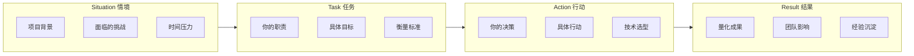

<DifficultyBadge level="beginner" />

# 高频行为面试

## 一句话解释

行为面试（Behavioral Interview）考察的不是"你会什么技术"，而是**"你怎么思考、怎么协作、怎么推动事情"**——面试官通过你过去的真实行为，预测你未来在团队中的表现。资深前端 vs 初中级的关键差异在于：**你展现的是"影响力"还是"执行力"**。

## STAR 框架



**核心原则：** 每个回答必须覆盖 S/T/A/R 四个要素，缺少任何一个都会让回答显得空洞。

## 深入理解

### 1. STAR 各要素详解

**Situation（情境）**
- 一句话说清背景：什么项目、什么团队、什么时间线
- 突出挑战性：技术难点、时间压力、资源限制
- ❌ "我之前在一个电商项目"
- ✅ "我们团队负责双十一主会场，DAU 3000 万，首屏必须在 1s 内完成渲染"

**Task（任务）**
- 明确你的角色：是负责人/核心贡献者/参与者
- 具体目标：可衡量的 KPI
- ✅ "我负责首页性能优化，目标是将 LCP 从 4s 降至 2s"

**Action（行动）**
- 展现你的**决策过程**：为什么选这个方案，放弃了什么
- 具体到你做了什么，而不是"我们团队做了什么"
- 突出技术深度 + 工程判断力
- ✅ "我对比了 SSR、SSG、ISR 三种方案，最后选择 Next.js ISR 因为..."

**Result（结果）**
- **必须量化**：用数据说话
- 包括业务指标和技术指标
- 最好有 Before/After 对比
- ✅ "LCP 从 4.2s→1.8s，用户跳出率降 15%，团队推广到 5 个业务线"

### 2. 10 大高频行为问题详解

#### Q1: "你做过最有挑战的项目是什么？"

面试官想看的：你如何定义"挑战" + 你如何应对困难

**资深前端回答框架：**
```
S：XX 项目需要在 3 个月内从 0 到 1 搭建一个面向 C 端的内容平台，
    团队只有 4 个前端，老技术栈是 Vue 2，但新产品需要复杂交互。
    
T：我负责技术选型和架构搭建，目标是 3 个月上线，支撑 100 万 UV。

A：我做了三个关键决策——
   1. 选型 Next.js 而非 CRA，利用 SSR 解决首屏和 SEO
   2. 搭建 Monorepo 结构，提前为多业务线扩展做准备
   3. 引入 Cursor Agent 做 CRUD 代码生成，将开发效率提升 3 倍
    
R：3 个月准时上线，首月 UV 突破 80 万，技术方案被公司列为
   Monorepo 最佳实践模板。
```

#### Q2: "你和产品/设计有冲突怎么处理？"

面试官想看的：沟通能力 + 以数据/用户为中心的决策方式

**回答要点：**
- 先理解对方诉求背后的真实需求
- 用数据/用户反馈替代主观判断
- 给出替代方案而非单纯拒绝

#### Q3: "你如何推动技术改进？"

面试官想看的：主动性和影响力

**回答框架：**
```
1. 发现痛点（有数据支撑）
2. 制定方案（有技术深度）
3. 说服团队（有沟通策略）
4. 推进落地（有执行计划）
5. 沉淀经验（有文档/规范）
```

#### Q4: "你带过新人吗？怎么带的？"

面试官想看的：技术领导力和知识传承能力

#### Q5: "你遇到过的最大技术债务是什么？"

面试官想看的：对技术债的判断力 + 重构的勇气和方法

#### Q6: "你如何学习新技术？"

面试官想看的：学习方法论，不只要广度还要深度

#### Q7: "你被分配了一个几乎不可能完成的 Deadline 怎么办？"

面试官想看的：优先级判断 + 沟通能力 + 抗压能力

#### Q8: "你为什么离开上一家公司？"

面试官想看的：职业规划是否清晰，态度是否职业

**关键：永远不抱怨前公司，聚焦在"成长"和"方向"上。**

#### Q9: "你的职业规划是什么？"

面试官想看的：你有没有思考过自己的职业发展

#### Q10: "你最大的缺点是什么？"

面试官想看的：自我认知 + 改进行动

**回答框架：**
```
缺点 + 具体表现 + 我正在做的改进 + 改进后的效果

例："我的缺点是容易过于关注细节。之前做 XX 项目时，
曾花过多时间调整 UI 像素级对齐。后来我建立了
`价值-时间` 评估习惯，先问'这个细节对用户有多大影响'，
再决定投入多少时间。
现在在效率和质量之间平衡得更好，项目交付速度提升了 30%。"
```

### 3. 资深前端 vs 初中级的回答差异

| 维度 | 初中级回答 | 资深级回答 |
|------|-----------|-----------|
| **角色定位** | "我负责XX模块" | "我主导了XX决策" |
| **冲突处理** | "我找 leader 协调" | "我主动和对方沟通，用数据说服" |
| **技术选型** | "用了 Vue 因为熟悉" | "对比了 React/Vue/Svelte，选 React 因为生态和团队" |
| **失败项目** | "项目最后黄了" | "虽然项目停了，但沉淀了XX技术能力" |
| **团队贡献** | "完成了分配的任务" | "建立了团队规范/引入了工具/提升了效率" |
| **职业规划** | "想学更多技术" | "想在XX领域成为专家，同时提升架构能力和技术影响力" |

## 面试问法

- 🔥 **行为面试的底层逻辑是什么？**
  - 面试官想验证你的简历真实性——你是不是真的做了你说的那些事
  - 考察思维方式：你的决策过程、优先级判断、问题拆解能力
  - 考察软技能：沟通、协作、领导力、抗压
  - 资深岗位的核心考察点：**你的存在是否让团队变得更好**

- ⭐ **回答行为面试的黄金法则？**
  - 全部用 STAR 框架：没有 S/T/A/R 的回答都是无效回答
  - 全部用"我"开头：不是"我们团队做了"，而是"我做了什么决策"
  - 全部有数据支撑：不要"大幅提升"，要说"提升 57%"

- 📌 **什么是一个好的 STAR 故事？**
  - 有冲突：技术难点、时间压力、团队分歧
  - 有选择：你做了关键决策，不是"照着文档做"
  - 有影响：结果可量化，后续被复用或推广
  - 有反思：如果重来你会怎么做

## 💡 AI 辅助学习

> 用这个 Prompt 让 AI 帮你模拟行为面试：
> "你是一个资深前端技术面试官，现在帮我做行为面试模拟。你会问我 10 个行为面试题，每题我回答后，请给我反馈：
> 1. 我的回答是否覆盖了 STAR 所有要素？
> 2. 是否有充分的数据支撑？
> 3. 是否体现了资深前端的思维层次？
> 4. 如果是你，你会怎么优化这个回答？
> 5. 给出一个参考范例。
> 
> 准备好后直接问第一个问题。"

## 关联知识

- [简历撰写](./resume-writing) — 简历上的经历就是行为面试的素材
- [面试流程解析](./interview-flow) — 行为面试在哪个环节出现
- [项目深挖](./project-deep-dive) — 怎么深入讲你的项目经历
- [面试心态与准备](./interview-mindset) — 面试全流程心理准备
