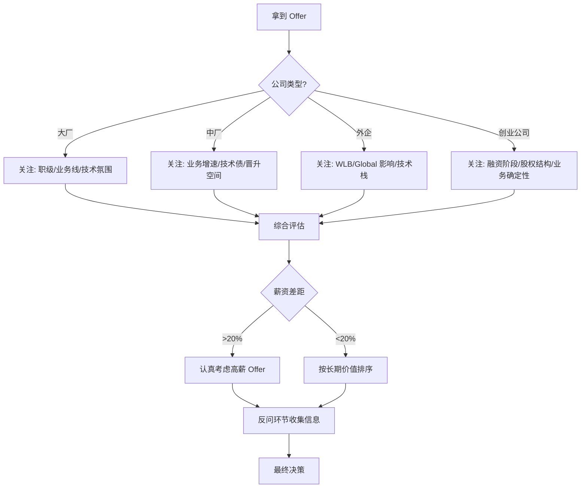

<DifficultyBadge level="beginner" />

# 公司选择

## 一句话解释

选公司不是选"名气最大的"或"薪资最高的"，而是**选一个能让你的职业生涯在 2-3 年后更有价值的平台**——判断标准不是现在给你多少钱，而是这段经历能不能让你"更值钱"。

## 决策框架

## 深入理解

### 1. 公司分类与特点

#### 大厂（BAT/TMD/字节/拼多多等）

| 优势 | 劣势 |
|------|------|
| 成熟的职级体系和晋升通道 | 业务线众多，边缘业务可能边缘人 |
| 规范的技术架构和工程文化 | 螺丝钉化风险 |
| 大平台背书，跳槽加分 | 内卷严重，部分厂 996 |
| 薪资有竞争力 | 层级多，决策流程长 |
| 学习资源丰富 | 技术栈可能老旧（如部分部门还在用内部框架） |

**适合人群：** 想在体系化环境中做深做精，看重品牌背书

#### 中型公司/独角兽（500-2000 人）

| 优势 | 劣势 |
|------|------|
| 技术栈更前沿（敢于尝新） | 工程规范可能不完善 |
| 个人影响力更明显 | 稳定性风险（B/C 轮最危险） |
| 晋升更快 | 可能需要身兼多职 |
| 技术债少，可从 0 搭建体系 | 品牌背书不如大厂 |

**适合人群：** 想要更多 ownership，愿意承担一定风险换成长速度

#### 外企（Microsoft/Google/Amazon/Snap）

| 优势 | 劣势 |
|------|------|
| WLB 好，远程灵活 | 中国团队边缘化风险 |
| 业务确定性高 | 技术栈不一定最新 |
| Global 协作机会 | 晋升比国内大厂慢 |
| 薪资竞争力强（特别是 RSU） | 文化差异，向上管理要求高 |

**适合人群：** 看重生活品质，希望有 Global 视野

#### 创业公司（A-C 轮）

| 优势 | 劣势 |
|------|------|
| 成长速度最快，话语权大 | 生存风险（死亡率 >90%） |
| 期权潜在回报 | 薪资通常低于市场 |
| 从 0 到 1 的经验稀缺 | 可能需要降级 title |
| 接触全栈/全流程 | 几乎没有培训体系 |

**适合人群：** 风险承受能力强，想体验从 0 到 1，有创业心态

### 2. 评估维度框架

| 维度 | 问自己 | 怎么获取信息 |
|------|--------|-------------|
| **业务前景** | 这个业务 3 年后还在不在？是核心还是边缘？ | 面经、财报、行业报告 |
| **技术栈** | 这里的技术债多吗？技术氛围好吗？ | 面试时问团队技术栈和迁移规划 |
| **团队氛围** | Code Review 怎么做的？有没有 Tech Debt 管理？ | 面试官和同事的沟通方式 |
| **晋升空间** | 这个职级的晋升周期和成功率？ | 问 HR 晋升数据，问面试官晋升经历 |
| **稳定性** | 最近有裁员吗？业务在增长还是收缩？ | 脉脉/一亩三分地/新闻 |
| **总包** | 总包构成是否合理？RSU 是否值得信任？ | Levels.fyi/OfferShow |

### 3. 面试时的反向问题（帮你了解公司）

这些问题是资深前端面试时**必须问**的，也是展示你思考深度的机会：

**🔴 必问（面试官环节）：**
- "目前团队前端的技术栈是什么？有计划升级吗？"
- "团队的 Code Review 流程是怎样的？"
- "技术债务是怎么管理的？有没有专门的时间还债？"
- "前端团队在组织里的位置是怎样的？和产品/后端怎么协作？"

**🟡 进阶（Tech Lead/HR 环节）：**
- "前端团队的成长路径是怎样的？P6→P7 的关键差异是什么？"
- "过去一年团队最大的技术挑战是什么？怎么解决的？"
- "公司对 AI 辅助开发的策略是什么？"
- "如果入职前三个月，你希望我优先解决什么问题？"

**🔵 必问（HR 环节）：**
- "这个岗位是新开的还是有人离职？"
- "团队有多少人？前端和后端的比例？"
- "绩效考核是怎么做的？360 环评还是 OKR？"
- "公司的晋升周期和成功率？"

### 4. 不同目标的最佳选择

| 你的目标 | 推荐选择 |
|---------|---------|
| 快速提升技术深度 | 大厂核心业务线 / 技术驱动型中厂 |
| 积累架构经验 | 中大型公司新建项目 / 技术转型期的大厂 |
| 追求 WLB | 外企 / 部分成熟期互联网公司 |
| 最大化短期收入 | 字节/拼多多/外企 |
| 赌一把期权回报 | C-D 轮独角兽 / 已盈利创业公司 |
| 技术广度 + 全栈能力 | 创业公司 / 前端团队小的中厂 |
| 品牌背书后跳槽 | 一线大厂核心部门 |

## 面试问法

- 🔥 **怎么判断一家公司值不值得去？**
  - 核心原则：**这段经历能不能让你 2 年后更值钱**
  - 三个关键信号：团队里有比你强的人、业务在增长、你有足够的决策空间
  - 警惕信号：团队全是新人、没有 Code Review、技术栈 3 年没变过、核心人员频繁离职

- ⭐ **Offer 比较时应该看什么？**
  - 总包差异 <20% 时，优先看长期价值（成长速度、团队质量、业务前景）
  - 总包差异 >30% 时，除非有特别大的成长差异，否则选钱多的
  - 不要为了"大厂光环"去一个边缘业务线——边缘业务 2 年 = 简历空白期

- ⭐ **被裁员后怎么选公司？**
  - 优先选择业务稳定的公司（不意味知名大厂）
  - 不要因为急于上岸而接受明显降级的 Offer
  - 可以考虑有政府/国企背景的科技公司作为过渡

## 💡 AI 辅助学习

> 用这个 Prompt 让 AI 帮你分析公司选择：
> "你是一个有 10 年经验的前端架构师，现在帮我分析以下两个 Offer 的选择：
> 
> Offer A: [描述公司、业务、职级、总包、团队情况]
> Offer B: [同上]
> 
> 我的背景：[当前工作经验、技术水平、职业目标]
> 
> 请从以下几个维度进行分析：
> 1. 短期（1 年内）的成长机会
> 2. 中期（2-3 年）的职业杠杆
> 3. 长期（5 年）的天花板
> 4. 如果选 A，3 年后是否容易跳去 B 类公司？反之呢？
> 5. 你的最终建议和理由"

## 关联知识

- [谈薪策略](./salary-negotiation) — 确定 Offer 后的谈判技巧
- [面试流程解析](./interview-flow) — 面试全流程
- [外企面试专题](./foreign-company) — 外企面试和选择
- [面试心态与准备](./interview-mindset) — 面试全流程心理准备
