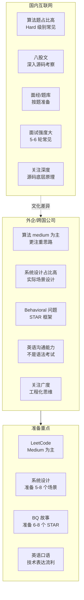
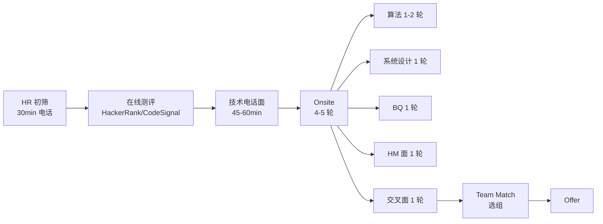

<DifficultyBadge level="intermediate" />

# 外企面试专题

## 一句话解释

外企面试和国内互联网大厂面试有**本质差异**——它更看重**解决问题的能力、沟通表达和软技能**，而不是刷题功力。英语是工具而不是目的，面试官更在意你能不能**清晰地表达技术思路**，而不是语法完美。

## 外企 vs 国内大厂面试差异



**核心差异总结：**

| 维度 | 国内大厂 | 外企 |
|------|---------|------|
| **算法难度** | 高（Hard 常见） | 中（Medium 为主） |
| **八股文** | 重源码、底层原理 | 轻概念、重应用 |
| **行为面试** | 占比小（1 轮） | 占比大（2-3 轮） |
| **系统设计** | 关注大流量高并发 | 关注可维护可扩展 |
| **英语** | 不要 | 核心要求 |
| **面试轮数** | 5-8 轮 | 4-6 轮 |
| **准备周期** | 3-6 个月集中刷题 | 2-3 个月系统准备 |

## 外企面试流程



**各轮次重点：**

| 轮次 | 时长 | 重点内容 | 通过率 |
|------|:----:|---------|:-----:|
| **HR 初筛** | 30min | 动机、经验匹配、英语水平、薪资预期 | ~80% |
| **在线测评** | 60-90min | 1-2 道算法题（Medium），限时完成 | ~50% |
| **技术电话** | 45-60min | 1 道算法题 + 简单技术问答 | ~40% |
| **Onsite 算法** | 45-60min | 2 道题，Medium 为主，重点在沟通 | ~30% |
| **Onsite SD** | 60min | 白板系统设计，开放式讨论 | ~30% |
| **BQ 面** | 45-60min | 4-6 个行为问题 | ~40% |
| **HM 面** | 45min | 综合素质、团队匹配 | ~60% |

## 英语面试准备

### 误区澄清

```
❌ "英语要 native 水平" → 不需要，能清晰表达技术思路即可
❌ "语法要完美" → 语法错误没关系，不影响理解就行
❌ "要说高级词汇" → 简单、清晰、准确比花哨重要
❌ "中文面试过了再练英语" → 来不及，提前 2-3 个月准备
```

### 技术英语高频表达

**写代码时的用语：**
```
"Let me think about this problem for a moment."
"First, let me clarify the requirements."
"My approach would be to use a hash map for O(1) lookup."
"This solution has O(n) time complexity and O(n) space complexity."
"Let me walk through an example to verify my approach."
"I'll handle the edge case where the input is empty."
"Let me test this with a few more cases."
```

**系统设计用语：**
```
"Let's start by defining the requirements."
"The system has three main components: ..."
"For the frontend, I would use React with TypeScript."
"We'll need a CDN for static assets and a load balancer for the API."
"To handle this at scale, we can use horizontal scaling."
"The database schema would look like this..."
"This design supports high availability because..."
"For caching, we can use Redis to reduce database load."
```

**行为面试用语：**
```
"Let me share a specific example from my previous project."
"In that situation, I took the initiative to..."
"The challenge was that we had conflicting priorities."
"I communicated with the stakeholders and proposed a compromise."
"As a result, we delivered the project on time with improved quality."
"Looking back, I would have involved the backend team earlier."
```

### 英语面试练习方法

| 方法 | 频率 | 说明 |
|------|:----:|------|
| 英文 mock interview | 1 次/周 | 找朋友或付费平台（pramp.com） |
| LeetCode 英文讲解 | 2 题/天 | 做一道题，用英文讲出思路 |
| 自言自语 | 每天 15min | 英文描述今天做了什么 |
| 技术博客阅读 | 每天 20min | 读英文技术文章，学习表达 |
| 面试录音复盘 | 每次 mock 后 | 回放找卡壳的地方 |

## BQ 行为面试准备

### 外企 BQ 常考题

外企的 BQ 面试有成熟题库，覆盖几个核心维度：

| 维度 | 典型问题 | 需要准备的 STAR |
|------|---------|---------------|
| **Conflict** | Tell me about a time you disagreed with a teammate | 意见分歧 |
| **Failure** | Tell me about a project that failed | 失败经历 |
| **Leadership** | Tell me about a time you led a project | 领导力案例 |
| **Initiative** | Tell me about a time you went above and beyond | 主动性案例 |
| **Collaboration** | Tell me about a cross-team project | 跨团队协作 |
| **Growth** | Tell me about a time you learned something new | 学习能力 |
| **Mistake** | Tell me about a mistake you made | 犯错经历 |
| **Feedback** | Tell me about a time you received feedback | 接受反馈 |
| **Mentorship** | Have you ever mentored someone? | 指导经历 |

**准备方法：准备 6-8 个 STAR 故事，每个故事可以适配 2-3 个问题。**

### BQ 回答模板（英文）

```
S - Situation: "In my previous role at [Company], we were working on [Project]..."
T - Task: "My responsibility was to [Your Role]. The challenge was that..."
A - Action: "I decided to [Your Action] because [Reason]. I then [Specific Steps]."
R - Result: "As a result, [Quantified Outcome]. The team adopted this approach for future projects."
```

## 国内外企清单

| 公司 | 级别体系 | 面试特点 | WLB |
|------|---------|---------|:---:|
| **Microsoft** | 59-80+ | 看重系统设计、BQ 占比高、面试流程较长 | ⭐⭐⭐⭐⭐ |
| **Google** | L3-L8 | 算法要求最高、hire committee 制、流程最久 | ⭐⭐⭐⭐ |
| **Amazon** | L4-L8 | 14 条领导力原则贯穿全程、BQ 最重要 | ⭐⭐⭐ |
| **Apple** | ICT2-ICT6 | 面试较为分散、团队自主招聘、保密文化 | ⭐⭐⭐ |
| **Meta** | E3-E8 | 算法 Medium+、看重产品 Sense、Bootcamp 选组 | ⭐⭐⭐ |
| **Shopee** | 1.1-3.3 | 算法 Medium、更注重业务理解、部分英文面试 | ⭐⭐ |
| **Lazada** | P1-P5+ | 英语口语要求、东南亚电商、阿里文化风格 | ⭐⭐⭐ |
| **Stripe** | L2-L6 | 注重 API 设计、系统设计考得很细 | ⭐⭐⭐⭐ |
| **Airbnb** | IC4-IC7 | 设计能力考察多、产品思维重要 | ⭐⭐⭐⭐⭐ |
| **LinkedIn** | Staff+ | 面试体验好、工程文化强、系统设计有深度 | ⭐⭐⭐⭐⭐ |
| **ByteDance SG** | 1-1~2-2 | 比国内卷度低、算法要求略低于北京 | ⭐⭐⭐ |
| **Cisco** | 工程师岗 | 技术面较简单、稳定、适合养老 | ⭐⭐⭐⭐⭐ |
| **Zoom** | 工程师岗 | 视频技术相关、面试难度适中 | ⭐⭐⭐⭐ |
| **PayPal** | 工程师岗 | 支付领域知识、英语沟通要求 | ⭐⭐⭐⭐ |

## 外企面试常见陷阱

| 陷阱 | 表现 | 改进 |
|------|------|------|
| **英语不够就背稿** | 听起来像在背，追问就卡壳 | 理解内容再自由表达 |
| **算法只顾写代码** | 不说话直接写 | 边说边写，展示思路 |
| **BQ 说太短** | 一句话回答，没有细节 | 用 STAR 展开，30-60s |
| **BQ 说太长** | 讲了 3 分钟还没到结果 | 控制在 2 分钟以内 |
| **系统设计太详细** | 一上来就说数据库表设计 | 先澄清范围，做 high-level 设计 |
| **没有反问** | "我没什么问题了" | 准备 3-5 个有深度的问题 |

## 常见的有效反问

> "What does a typical day look like for a frontend engineer on this team?"
> "How does the team approach technical decision-making?"
> "What's the most challenging technical problem the team is facing right now?"
> "How do you measure engineering success in this team?"
> "What opportunities for growth does this role offer?"
> "What's the engineering culture like — how do you balance speed and quality?"

## 💡 AI 辅助学习

**向 AI 提问：**
- "帮我准备一次外企前端面试的英文自我介绍，2 分钟版本，技术栈是 React/TypeScript"
- "外企面试的 BQ 问题 'Tell me about a time you had a conflict with a teammate' 帮我用 STAR 框架写一个英文回答"
- "我下周有一个 Google 的 onsite 面试，帮我做一次 mock interview，用英文问算法题"
- "外企系统设计面试和国内有什么不同？给我一个英文系统设计回答模板"
- "我英语口语一般，如何在技术面试中用简单的英语表达复杂的技术思路？"

## 关联知识

- [开放性问题回答框架](./open-questions) — 结构化回答技巧
- [项目深挖方法论](./project-deep-dive) — STAR 故事准备
- [领导力与影响力](./leadership) — 领导力故事准备
- [谈薪策略](./salary-negotiation) — 外企薪资谈判
- [公司选择](./company-selection) — 如何评估外企团队
