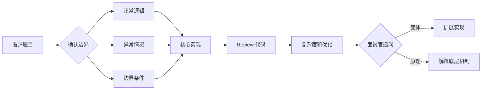

<DifficultyBadge level="intermediate" />

# 手写代码题集

## 一句话解释

手写代码是前端面试的"基本功检验"——面试官不是要你背代码，而是看你的**编码习惯、边界思维、异常处理**和**对语言机制的理解深度**。资深前端不仅要写得对，还要写出**工程级别的健壮代码**。

## 核心策略



## 深入理解

### 1. 防抖（Debounce）

**场景：** 搜索输入、窗口 resize、按钮频繁点击

```javascript
/**
 * 防抖：最后一次触发后 delay 毫秒后执行
 * @param {Function} fn - 要执行的函数
 * @param {number} delay - 延迟时间（ms）
 * @param {boolean} immediate - 是否立即执行第一次
 * @returns {Function}
 */
function debounce(fn, delay = 300, immediate = false) {
  let timer = null
  
  return function (...args) {
    const callNow = immediate && !timer
    
    clearTimeout(timer)
    timer = setTimeout(() => {
      timer = null
      if (!immediate) fn.apply(this, args)
    }, delay)
    
    if (callNow) fn.apply(this, args)
  }
}
```

**变体：**
- `leading` 版：立即执行第一次，然后防抖
- `trailing` 版：最后一次执行
- 带 `maxWait` 保证至少执行一次

```javascript
// 带 maxWait 的增强版（保证在指定时间内至少执行一次）
function debounce(fn, delay = 300, maxWait = 1000) {
  let timer = null
  let lastInvokeTime = 0
  
  return function (...args) {
    const now = Date.now()
    const context = this
    
    if (now - lastInvokeTime >= maxWait) {
      // 超过 maxWait，立即执行
      fn.apply(context, args)
      lastInvokeTime = now
      clearTimeout(timer)
      timer = null
      return
    }
    
    clearTimeout(timer)
    timer = setTimeout(() => {
      fn.apply(context, args)
      lastInvokeTime = Date.now()
      timer = null
    }, delay)
  }
}
```

### 2. 节流（Throttle）

**场景：** 滚动事件、拖拽、resize

```javascript
/**
 * 节流：单位时间内只执行一次
 * @param {Function} fn - 要执行的函数
 * @param {number} interval - 时间间隔（ms）
 * @param {object} options - { leading: true, trailing: true }
 */
function throttle(fn, interval = 300, options = { leading: true, trailing: true }) {
  let lastTime = 0
  let timer = null
  
  return function (...args) {
    const now = Date.now()
    const context = this
    
    if (!lastTime && !options.leading) lastTime = now
    
    const remaining = interval - (now - lastTime)
    
    if (remaining <= 0) {
      // 时间到了，可以执行
      if (timer) {
        clearTimeout(timer)
        timer = null
      }
      fn.apply(context, args)
      lastTime = now
    } else if (options.trailing && !timer) {
      // 最后一次触发后补执行
      timer = setTimeout(() => {
        fn.apply(context, args)
        lastTime = options.leading ? Date.now() : 0
        timer = null
      }, remaining)
    }
  }
}
```

### 3. 深拷贝（Deep Clone）

```javascript
/**
 * 深拷贝：支持对象、数组、Date、RegExp、Map、Set
 * @param {any} obj
 * @param {WeakMap} hash - 解决循环引用
 */
function deepClone(obj, hash = new WeakMap()) {
  if (obj === null || typeof obj !== 'object') return obj
  
  // 处理 Date
  if (obj instanceof Date) return new Date(obj)
  // 处理 RegExp
  if (obj instanceof RegExp) return new RegExp(obj)
  
  // 解决循环引用
  if (hash.has(obj)) return hash.get(obj)
  
  const clone = Array.isArray(obj) ? [] : {}
  hash.set(obj, clone)
  
  for (const key of Object.keys(obj)) {
    clone[key] = deepClone(obj[key], hash)
  }
  
  // 处理 Symbol 属性
  const symbols = Object.getOwnPropertySymbols(obj)
  for (const sym of symbols) {
    clone[sym] = deepClone(obj[sym], hash)
  }
  
  return clone
}
```

### 4. Promise 系列

**实现 Promise.all：**

```javascript
Promise.myAll = function (promises) {
  return new Promise((resolve, reject) => {
    if (!Array.isArray(promises)) {
      return reject(new TypeError('arguments must be an array'))
    }
    
    const results = []
    let completed = 0
    
    if (promises.length === 0) return resolve(results)
    
    promises.forEach((p, index) => {
      Promise.resolve(p).then(
        value => {
          results[index] = value
          completed++
          if (completed === promises.length) resolve(results)
        },
        reason => reject(reason)
      )
    })
  })
}
```

**实现 Promise.race：**

```javascript
Promise.myRace = function (promises) {
  return new Promise((resolve, reject) => {
    if (!Array.isArray(promises)) {
      return reject(new TypeError('arguments must be an array'))
    }
    promises.forEach(p => {
      Promise.resolve(p).then(resolve, reject)
    })
  })
}
```

### 5. 数组方法手写

**Array.map：**
```javascript
Array.prototype.myMap = function (callback, thisArg) {
  if (typeof callback !== 'function') {
    throw new TypeError(`${callback} is not a function`)
  }
  
  const result = new Array(this.length)
  for (let i = 0; i < this.length; i++) {
    if (i in this) {
      result[i] = callback.call(thisArg, this[i], i, this)
    }
  }
  return result
}
```

**Array.reduce：**
```javascript
Array.prototype.myReduce = function (callback, initialValue) {
  if (typeof callback !== 'function') {
    throw new TypeError(`${callback} is not a function`)
  }
  
  const hasInitial = arguments.length >= 2
  let acc = hasInitial ? initialValue : this[0]
  let startIndex = hasInitial ? 0 : 1
  
  for (let i = startIndex; i < this.length; i++) {
    if (i in this) {
      acc = callback(acc, this[i], i, this)
    }
  }
  return acc
}
```

**Array.flat：**
```javascript
function flat(arr, depth = 1) {
  if (depth === 0) return arr.slice()
  
  const result = []
  for (const item of arr) {
    if (Array.isArray(item) && depth > 0) {
      result.push(...flat(item, depth - 1))
    } else {
      result.push(item)
    }
  }
  return result
}
```

### 6. 函数柯里化（Currying）

```javascript
function curry(fn) {
  return function curried(...args) {
    if (args.length >= fn.length) {
      return fn.apply(this, args)
    }
    return function (...nextArgs) {
      return curried.apply(this, args.concat(nextArgs))
    }
  }
}

// 使用
const add = (a, b, c) => a + b + c
const curriedAdd = curry(add)
curriedAdd(1)(2)(3) // 6
curriedAdd(1, 2)(3) // 6
```

### 7. 继承

**ES6 class 继承：**
```javascript
class Parent {
  constructor(name) {
    this.name = name
  }
  sayHi() {
    return `Hi, I'm ${this.name}`
  }
}

class Child extends Parent {
  constructor(name, age) {
    super(name)
    this.age = age
  }
}
```

**组合寄生继承（ES5 方式）：**
```javascript
function inherit(Parent, Child) {
  const prototype = Object.create(Parent.prototype)
  prototype.constructor = Child
  Child.prototype = prototype
}

function Parent(name) {
  this.name = name
}
Parent.prototype.sayHi = function () {
  return `Hi, I'm ${this.name}`
}

function Child(name, age) {
  Parent.call(this, name)
  this.age = age
}
inherit(Parent, Child)
```

## 面试问法

- 🔥 **手写代码面试考察什么？**
  - 编码习惯：变量命名、代码结构、注释
  - 边界思维：空值、边界条件、类型判断
  - 异常处理：参数校验、错误处理
  - 语言机制：this 指向、闭包、原型链

- 🔥 **防抖和节流的区别？**
  - 防抖：高频触发时只执行最后一次（搜索输入）
  - 节流：高频触发时按固定频率执行（滚动事件）

- ⭐ **深拷贝要注意什么？**
  - 循环引用（用 WeakMap）
  - 特殊类型（Date/RegExp/Map/Set）
  - Symbol 属性
  - 不可枚举属性
  - 性能：大数据量时递归可能爆栈

## 💡 AI 辅助学习

> 用这个 Prompt 让 AI 帮你练习手写代码：
> "你是一个前端面试官，现在模拟手写代码面试环节。你会给我出一道手写代码题，我来写代码。请按以下流程：
> 1. 先给题目（难度：easy/medium/hard）
> 2. 我给出实现后，review 我的代码，指出改进点
> 3. 给出参考实现
> 4. 追问一个变体题目
> 5. 所有对话结束后给我一个综合评价（编码习惯、边界思维、异常处理、扩展性）
> 
> 每次只出一道题，我们说"下一题"再继续。"

## 关联知识

- [算法入门](./algorithms-basics) — 前端需要的算法基础
- [算法进阶](./algorithms-advanced) — 高级算法面试题
- [面试流程解析](./interview-flow) — 手写代码在环节中出现的位置
