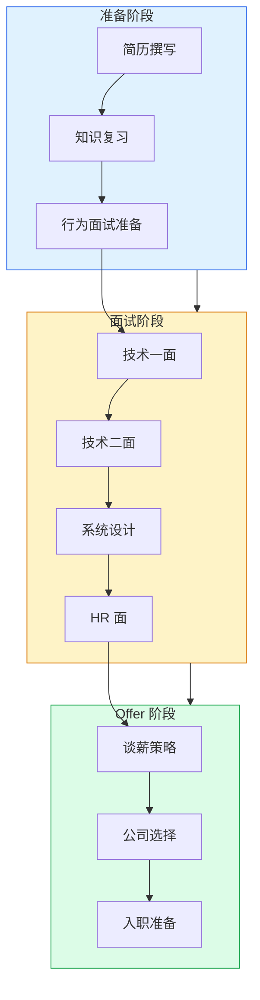

# 🎯 面试实战

简历撰写、面试流程、手写代码、系统设计、谈薪策略 — **从准备到拿 Offer 的全链路指南**。共 16 个知识点，覆盖面试各环节的核心策略。

<DifficultyBadge level="beginner" /> 面试准备初期 · <DifficultyBadge level="intermediate" /> 面试实战中 · <DifficultyBadge level="advanced" /> 高阶面试冲刺

::: tip 💡 建议
面试是"展示"而非"考试"。**每个问题的本质都是：你有多少深度？**与其刷 100 道题，不如把一个知识点用自己的话讲透。
:::

---

## 🟢 入门（6 个）

面试前的准备工作，打好信息差和策略基础。

  <a href="./resume-writing" class="card">
    <h3>简历撰写 <Badge type="info" text="🔥高频" /></h3>
    
STAR 法则、量化成果、技术栈呈现、简历通过率优化

  </a>
  <a href="./interview-flow" class="card">
    <h3>面试流程解析 <Badge type="info" text="🔥高频" /></h3>
    
大厂面试流程、各轮次考察重点、通过标准

  </a>
  <a href="./behavioral-questions" class="card">
    <h3>高频行为面试 <Badge type="info" text="🔥高频" /></h3>
    
自我介绍模板、项目亮点、冲突处理、失败经历 STAR 准备

  </a>
  <a href="./salary-negotiation" class="card">
    <h3>谈薪策略 <Badge type="info" text="🔥高频" /></h3>
    
薪资构成、议价技巧、期权评估、总包计算

  </a>
  <a href="./company-selection" class="card">
    <h3>公司选择 <Badge type="info" text="⭐中频" /></h3>
    
大厂 vs 中小厂 vs 外企 vs 创业公司、团队评估维度

  </a>
  <a href="./interview-mindset" class="card">
    <h3>面试心态与准备 <Badge type="info" text="⭐中频" /></h3>
    
面试节奏、状态管理、被拒复盘、offer 排序

  </a>

---

## 🟡 进阶（6 个）

面试过程中的核心能力考察，决定能否进入终面。

  <a href="./handwrite-code" class="card">
    <h3>手写代码题集 <Badge type="info" text="🔥高频" /></h3>
    
数组/对象操作、Promise 实现、防抖节流、深拷贝、函数组合

  </a>
  <a href="./algorithms-basics" class="card">
    <h3>算法入门（前端向） <Badge type="info" text="⭐中频" /></h3>
    
数组/树/图/动态规划、前端视角的算法面试准备

  </a>
  <a href="./system-design-1" class="card">
    <h3>前端系统设计 ① <Badge type="info" text="🔥高频" /></h3>
    
设计一个组件库、设计权限系统、设计通知中心

  </a>
  <a href="./system-design-2" class="card">
    <h3>前端系统设计 ② <Badge type="info" text="🔥高频" /></h3>
    
设计一个前端监控系统、设计低代码平台、设计编辑器

  </a>
  <a href="./open-questions" class="card">
    <h3>开放性问题 <Badge type="info" text="⭐中频" /></h3>
    
最有挑战的项目、技术选型决策、团队协作冲突

  </a>
  <a href="./project-deep-dive" class="card">
    <h3>项目深挖 <Badge type="info" text="🔥高频" /></h3>
    
简历项目准备、技术难点提炼、数据量化、复盘技巧

  </a>

---

## 🔴 高级（4 个）

高阶面试的"加分项"，P7+ 面试的决胜环节。

  <a href="./algorithms-advanced" class="card">
    <h3>算法进阶 <Badge type="info" text="⭐中频" /></h3>
    
高频 hard 题、系统设计中的算法、复杂度分析

  </a>
  <a href="./system-design-3" class="card">
    <h3>前端系统设计 ③ <Badge type="info" text="🔥高频" /></h3>
    
设计全链路性能优化方案、设计微前端架构、设计大型 SPA

  </a>
  <a href="./leadership" class="card">
    <h3>领导力与影响力 <Badge type="info" text="⭐中频" /></h3>
    
技术决策、跨团队协作、技术布道、工程文化推动

  </a>
  <a href="./foreign-company" class="card">
    <h3>外企面试专题 <Badge type="info" text="📌了解" /></h3>
    
英文面试、LeetCode 风格、System Design 英文表达、文化差异

  </a>

