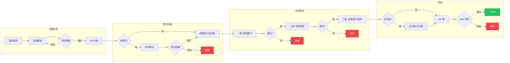
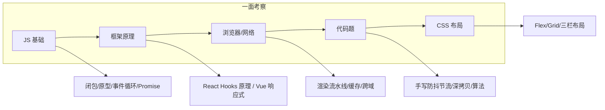
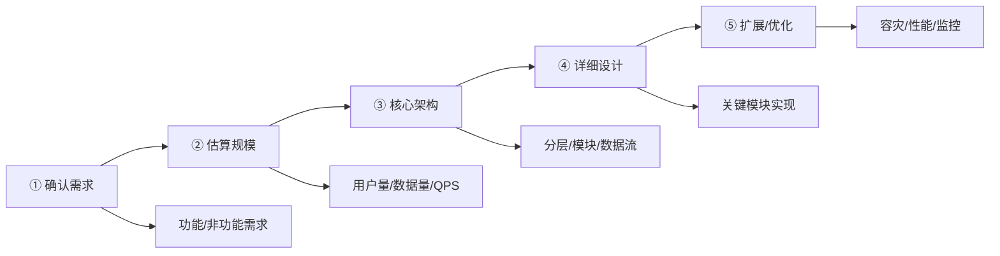
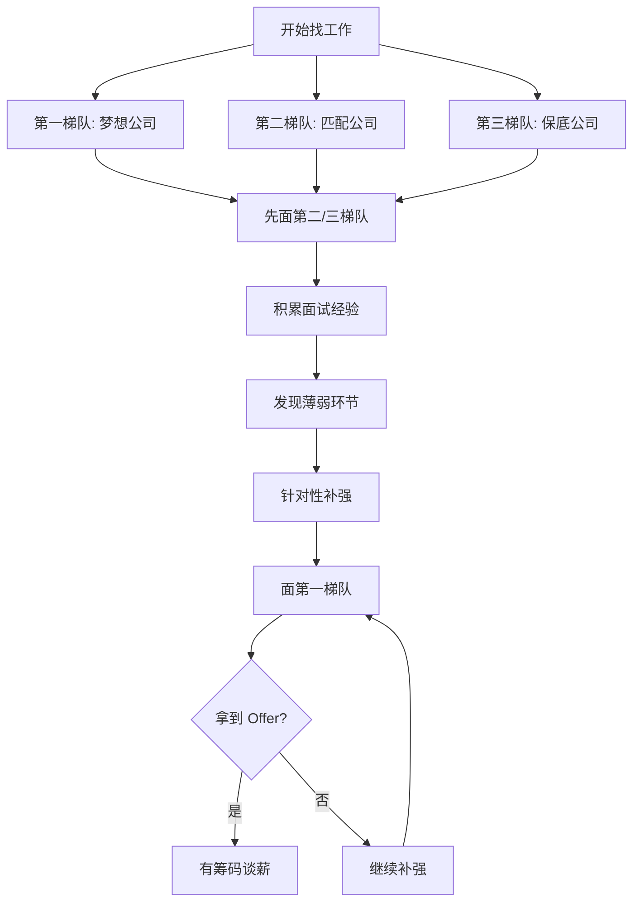

<DifficultyBadge level="beginner" />

# 面试流程解析

## 一句话解释

大厂面试是**层层筛选的漏斗**——从简历到 Offer 平均 4-6 轮，每一轮有不同的考察重点和淘汰率。

## 面试全流程泳道图

## 各轮次详细解析

### 第一关：简历筛选（淘汰率 ~60%）

| 关键点 | 说明 |
|--------|------|
| **核心原则** | 资深前端的简历要突出"深度"和"影响力"，而非罗列技术栈 |
| **STAR 法则** | 每个项目按 Situation-Task-Action-Result 组织 |
| **量化成果** | "优化性能" → "首屏加载从 4.2s 降到 1.8s，LCP 提升 57%" |
| **技术栈** | 只列熟练掌握的，面试官会深入追问 |
| **AI 能力** | 2026 年建议在简历中体现 AI 工具的深度使用经验 |

### 第二关：一面 — 基础能力（淘汰率 ~40%）

**考察重点：**

**时间分配：** ~45min 技术问答 + ~30min 手写代码

**准备策略：**
- 📖 核心基础的 🟢🟡 全部过一遍
- ⚛️ 框架核心概念 + Hooks 原理
- 刷 10-15 道高频手写题

### 第三关：二面 — 项目深度（淘汰率 ~50%）

> 这一轮是**资深前端和初中级的分水岭**

**面试官会深挖的点：**

| 问法 | 面试官实际在考察 |
|------|----------------|
| "讲一个你最挑战的项目" | 你解决问题的深度和思路 |
| "性能优化具体怎么做的？" | 是真的做过还是只是用了工具 |
| "技术方案是怎么决策的？" | 你的架构能力和权衡能力 |
| "有没有踩过什么坑？" | 复盘能力和学习能力 |
| "如果重来会怎么做？" | 反思能力和成长速度 |

**准备方法：**
- 选 2-3 个核心项目，每个按 STAR 法则写逐字稿
- 准备**数据量化**的成果
- 准备**失败/踩坑**的案例（展示成长）

### 第四关：三面 — 系统设计（淘汰率 ~50%）

**常见题目：**

| 题目 | 考察点 |
|------|--------|
| 设计一个前端监控系统 | 数据采集 → 上报 → 分析 → 告警全链路 |
| 设计一个组件库 | 分层架构、API 设计、按需加载、主题系统 |
| 设计一个实时协作编辑器 | OT/CRDT 算法、冲突解决、离线支持 |
| 设计一个大型 SSR 方案 | 降级策略、缓存、性能、部署 |
| 设计一个低代码平台 | 协议设计、渲染引擎、可扩展性 |

**答题框架（5 步法）：**

### 第五关：交叉面 + HR 面

**交叉面**（跨部门 leader）：
- 考察**技术视野 + 软技能**
- 关注你能否从更高的视角看问题
- 常见问题："你怎么看前端未来？" "AI 对前端有什么影响？"

**HR 面**：
- 考察**文化匹配 + 稳定性**
- 常见问题："为什么离开上家？" "你的职业规划？"
- 谈薪环节（见谈薪策略）

## 各公司面试风格对比

| 公司 | 风格 | 侧重点 | 难度 |
|------|------|--------|------|
| **字节** | 节奏快、算法多 | 算法(Medium)、项目深度 | 🔴🔴🔴 |
| **阿里** | 体系化、价值观 | 项目深挖、系统设计、价值观 | 🔴🔴🔴 |
| **腾讯** | 基础扎实、全面 | 基础(广)、网络、Linux | 🔴🔴 |
| **美团** | 实用导向 | 业务理解、技术落地 | 🔴🔴 |
| **微软/外企** | 流程规范、英文 | LeetCode Medium/Hard、英文沟通、系统设计 | 🔴🔴🔴 |
| **创业公司** | 实战导向 | 动手能力、全栈能力、产品思维 | 🔴🔴 |

## 投递策略

> 核心策略：**不要第一个面最想去的公司**

## 💡 AI 辅助学习

> 用这个 Prompt 让 AI 模拟面试：
> "你是一个大厂前端技术面试官，我正在面试 P6 岗位。请给我进行一场 45 分钟的模拟面试，涵盖：
> 1. JS 基础（事件循环、闭包）
> 2. React 原理（Hooks、Fiber）
> 3. 一道手写代码题
> 4. 一道系统设计题
> 每道题先问我，等我回答后再给出反馈和改进建议。"

## 关联知识

- [简历撰写](/interview/resume-writing) — 资深前端简历模板
- [前端系统设计 ①](/interview/system-design-1) — 系统设计 5 步法详解
- [谈薪策略](/interview/salary-negotiation) — 薪资谈判技巧
