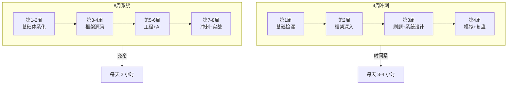

<DifficultyBadge level="beginner" />

# 面试心态与准备

## 一句话解释

面试不只是"回答问题"，而是**在有限时间内系统性地展示你的技术深度和工程判断力**——最好的状态不是"我背熟了所有八股文"，而是"我对自己做过的每一个技术决策都了然于胸，能从容地讲出背后的 trade-off"。

## 时间规划



## 深入理解

### 1. 4 周冲刺 vs 8 周系统复习

| 对比维度 | 4 周冲刺 | 8 周系统复习 |
|---------|---------|------------|
| **适用人群** | 已有 Offer 在等面试 / 突然被裁 | 还在职或 gap 初期 |
| **每日投入** | 3-4 小时 + 周末全天 | 1.5-2 小时 |
| **核心策略** | 捡漏式复习，抓大放小 | 体系化重建，逐个击破 |
| **风险** | 基础不牢固，碰到追问可能崩 | 战线太长容易疲劳 |
| **推荐度** | ⭐⭐⭐ 有基础可用 | ⭐⭐⭐⭐⭐ 推荐 |

**4 周冲刺计划：**

| 周 | 重点 | 具体内容 |
|----|------|---------|
| **第 1 周** | 基础捡漏 | HTML/CSS/JS 核心机制、事件循环、Promise、浏览器渲染流水线 |
| **第 2 周** | 框架深入 | React Fiber / Vue 响应式 / Hooks 原理 / Diff 算法 |
| **第 3 周** | 刷题 + 系统设计 | 手写代码 (防抖节流/深拷贝/Promise)、系统设计 (组件库/SSR/微前端) |
| **第 4 周** | 模拟 + 复盘 | 每天 1 场模拟面试、复盘薄弱环节、准备行为面试故事 |

**8 周系统计划：**

| 周 | 重点 | 具体内容 |
|----|------|---------|
| **第 1-2 周** | 基础体系化 | 核心基础模块 20 页全部过一遍（🟢 入门 → 🟡 进阶） |
| **第 3-4 周** | 框架源码 | React 核心源码 / Vue 3 源码 / 编译优化 / 状态管理 |
| **第 5-6 周** | 工程 + AI | 工程架构 / 性能优化 / AI 编程工具和工作流 |
| **第 7-8 周** | 冲刺 + 实战 | 面试实战模块（系统设计 / 手写代码 / 行为面试 / 模拟面试） |

### 2. 面试心理建设

**面试是"展示"不是"考试"**

- 你不是在被审判，而是在向未来的同事展示你的能力
- 面试官花时间面你，是因为他真的需要招人——他希望你是那个对的人
- 把每次面试当作一次"技术交流"，而不是"测试"

**如何应对面试紧张**

- **准备的底气**：紧张的本质是不自信。系统复习 + 充分准备 = 最好的缓解剂
- **10 秒深呼吸法**：回答前停顿 3 秒，深呼吸，组织语言再开口
- **承认不知道**："这个问题我了解不深，但根据我的理解..."——比强行回答更专业
- **不要追求完美**：面 5 家拿 1 个 Offer 就很好，不是非要每场都超常发挥

**被问到不会的问题怎么办**

1. **不要慌**："这个问题很有意思，让我想一想"
2. **建框架**："从我的理解，这个问题涉及 XX 和 XX 两个方面..."
3. **关联已知**："我不太确定这个具体实现，但在 XX 方面我有经验..."
4. **反问澄清**："你提到的 XX 是指 XX 吗？我想确认一下理解是否正确"

**注意：** 面试官通常不是要你"答对"，而是想看你"怎么思考"。

**如何从失败面试中复盘**

| 失败原因 | 对策 |
|---------|------|
| 基础题答不上来 | 回到对应知识点系统复习 |
| 手写代码卡住 | 增加每日 coding 练习 |
| 系统设计没思路 | 学习常用架构模式，练习结构化表达 |
| 行为面试故事不吸引人 | 用 STAR 框架重新组织项目经历 |
| 气氛紧张沟通不畅 | 多模拟面试，培养 conversation 的感觉 |

### 3. 面试前的 Checklist

**技术准备**
- [ ] 核心基础：JS 执行机制、事件循环、原型链、Promise（能手写）
- [ ] 框架原理：选了 React 就吃透 Fiber/Hooks/渲染优化；选 Vue 就吃透响应式/编译优化
- [ ] 系统设计：准备 3-5 个常见架构场景的解题框架
- [ ] 手写代码：防抖节流、深拷贝、Promise、数组方法、排序
- [ ] 项目技术难点：准备 3 个有深度的技术难点案例

**项目准备（STAR 故事）**
- [ ] 准备 3 个 STAR 故事（最有挑战的项目）
- [ ] 每个故事都能量化结果
- [ ] 每个故事都能讲清楚技术决策的 trade-off
- [ ] 准备好被追问的技术细节

**行为准备**
- [ ] 30 秒 / 60 秒 / 120 秒 三个版本的自我介绍
- [ ] 准备离职原因的标准回答
- [ ] 准备职业规划的回答
- [ ] 准备 "你最大的缺点" 的回答

**硬件准备**
- [ ] 网络稳定（备好热点）
- [ ] 摄像头和麦克风正常
- [ ] 安静的环境，不要有干扰
- [ ] IDE / 白板工具 / 代码分享工具准备好
- [ ] 充好电，备好水

### 4. 面试后的复盘方法

面试结束不是终点——**每次面试都是一次免费的能力诊断**。

**面试结束立即记录：**
```
1. 面试了哪家公司，什么岗位？
2. 问了哪些技术问题？每个我怎么回答的？
3. 哪些问题我没答上来或答得不好？
4. 面试官对我的回答有什么反应？
5. 我下轮面试需要补什么？
```

**分析自己的薄弱环节：**
- 如果频繁在某个领域被问倒 → 说明那是你的系统性弱点
- 如果某类问题每次都能答好 → 那是你的强项，面试时可以引导到这些方向
- 如果手写代码总是紧张 → 每天固定 30 分钟 coding 练习

**针对性补强：**
- 每个答不上的问题，去学透对应知识点，下次同类问题就能覆盖到
- 3 次以上被问倒的知识点 → 直接列为"必补"优先级

### 5. 被裁员后的心态调整

**不要自我怀疑**
- 裁员是大环境问题，不是你的能力问题
- 很多优秀的人也在被裁——你并不孤单
- 2025-2026 年的市场波动是行业周期，不是个人失败

**利用 Severance 合理规划**
- 一般有 N+1 甚至更多的补偿，不要急着签任何 Offer
- 前 2 周：休息 + 调整心态 + 整理项目经历
- 第 3-4 周：系统复习 + 开始投递
- 第 5-8 周：集中面试 + 拿到 Offer

**把面试当作学习机会**
- 每次面试都是一次和行业资深工程师的免费交流
- 从面试中了解不同公司的技术栈和工程文化
- 即使没拿到 Offer，你也积累了面试经验和行业信息

## 面试问法

- 🔥 **如何保持面试状态？**
  - 每天保持 coding 手感（LeetCode + 手写题至少 30 分钟）
  - 每周做 1-2 次模拟面试（找朋友或 AI）
  - 节奏很重要：不要一天面 3 场，最多隔天 1 场
  - 每场面试后花 30 分钟复盘，比盲目面下一场更有价值

- ⭐ **面试中最重要的是什么？**
  - 不是你"知道多少"，而是你能"表达清楚多少"
  - 展示思考过程 > 给出完美答案
  - 诚实 + 谦虚 + 好学 = 最好的面试形象

## 💡 AI 辅助学习

> 用这个 Prompt 让 AI 帮你制定复习计划：
> "你是一个资深前端面试辅导教练。我的情况：
> - 经验：8 年前端
> - 当前状态：[在职/被裁/gap]
> - 目标公司：[大厂/外企/中厂]
> - 可投入时间：每天 [X] 小时
> - 强势领域：[React/Vue/工程化]
> - 薄弱领域：[比如算法、系统设计]
> - 距离目标面试还有：[X] 周
> 
> 帮我制定一个分周复习计划，包含：
> 1. 每周的重点内容和学习资源
> 2. 每天的具体任务安排
> 3. 每隔一周的模拟面试安排
> 4. 重点突击的薄弱环节"

## 关联知识

- [面试流程解析](./interview-flow) — 面试全流程阶段详解
- [简历撰写](./resume-writing) — 简历是面试的第一关
- [项目深挖](./project-deep-dive) — 面试中怎么讲好项目经历
- [高频行为面试](./behavioral-questions) — 行为面试准备
