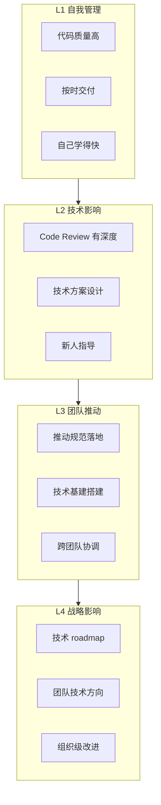
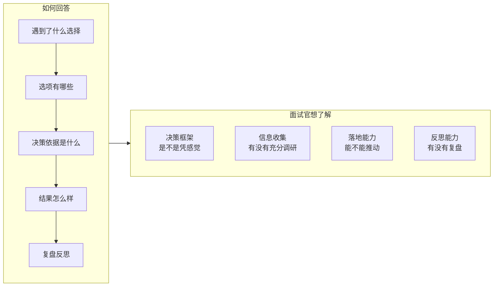
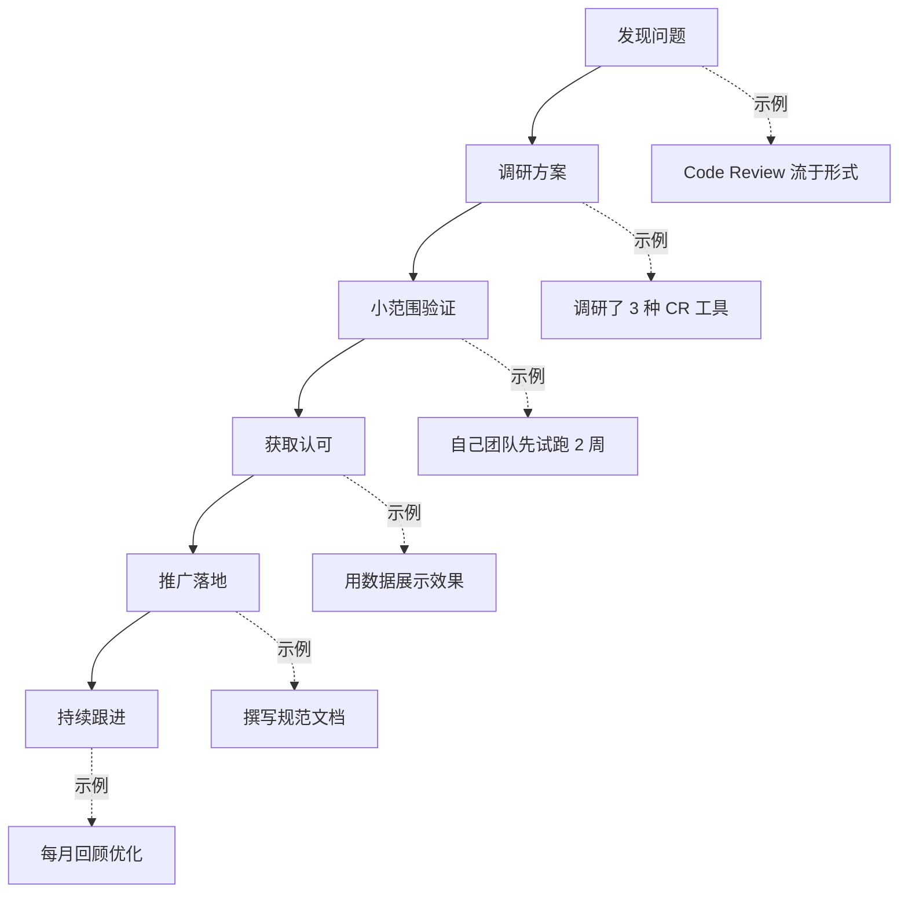
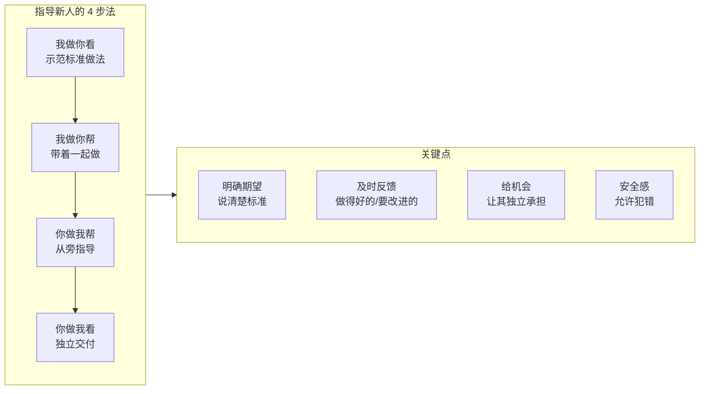
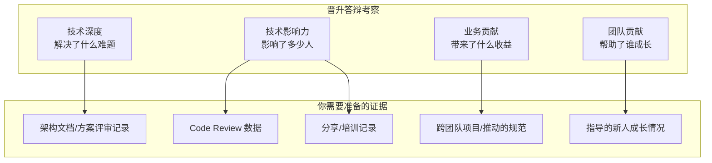

<DifficultyBadge level="advanced" />

# 领导力与影响力

## 一句话解释

到了资深及以上级别，**写好代码只是基本功**。面试官真正想判断的是：你能不能**带动团队变好**、能不能**做出正确的技术决策**、能不能**在组织层面推动事情**。这就是"领导力"——它不依赖职级，资深工程师也能做。

## 领导力的层级模型



> **面试期望匹配**：
> - P6/P6+：L2 水平，能指导新人、做技术方案
> - P7/P8：L3 水平，能推动跨团队的技术改进
> - P8+：L4 水平，能制定技术战略

## 面试中常见的领导力问题

### 类型 1：技术决策能力

**典型问题："你做过最重要的技术决策是什么？"**



**示例：**
> "在 [公司名]，我们面临一个选择：是否要把老旧的 jQuery 项目全部重构成 React。
>
> **我的决策是"渐进式迁移"而不是"全部重写"。**
>
> 原因有三：
> 1. **业务不能停**——全量重写周期太长，业务不允许
> 2. **降低风险**——增量迁移可随时回滚
> 3. **团队节奏**——团队可以分批学习 React，不一次性压垮
>
> 我的做法是：识别出最独立的模块（用户中心）先迁移，验证流程后再扩展。最终用了 6 个月完成了 15 个页面的平滑迁移，0 线上事故。
>
> **如果重来一次**：我会更早做技术选型对比，当时在 Vue 和 React 之间犹豫了太久。"

### 类型 2：技术影响力

**典型问题："你是如何在团队中推广新技术或规范的？"**

**回答框架：**



**示例：**
> "我发现团队代码质量参差不齐，决定推动 Code Review 文化。
>
> **我的做法：**
> 1. **先做榜样**——每次我的 PR 都写好 description，打上 label，主动 @ 人 review
> 2. **降低门槛**——写了《Code Review 指南》，列了 10 条 checklist，让大家有据可依
> 3. **建立反馈**——每两周回顾一次 review 数据（review 覆盖率、评论数、响应时间）
> 4. **正向激励**——在团队群里定期 highlight 优秀的 review 评论
>
> **结果：** 半年后 review 覆盖率从 20% 提升到 85%，线上 Bug 率下降了 40%。"

### 类型 3：指导与成长

**典型问题："你带过人吗？怎么带新人的？"**

**指导方法论：**



**示例：**
> "我带过 3 个新人和 2 个实习生。我的方法不是直接告诉答案，而是做三步：
>
> 1. **第一个月，带着熟悉**——前两周主要是带着看代码、讲业务逻辑，分配一些小 task，我在 CR 里详细讲解
> 2. **第二个月，逐渐放手**——让他们独立负责小模块，有问题先自己查再问我
> 3. **第三个月，独立交付**——给他们一个完整的前端模块，按正式标准 review
>
> 印象最深的一个新人：刚来时不太自信，我刻意安排了一个中等难度的任务让他完成后在全组分享，后来他成了组里最积极的技术分享者。"

### 类型 4：跨团队协作

**典型问题："当你需要另一个团队配合，但对方不配合怎么办？"**

**回答框架：**

```
1. 先理解对方为什么不配合（资源排期/优先级/不知道价值）
2. 用数据或原型展示价值（让对方看到"为什么值得做"）
3. 找一个共赢的方案（帮对方解决一个他们的痛点）
4. 建立信任关系（长期合作的基础）
```

**示例：**
> "我需要后端团队配合加一个 GraphQL 网关接口，但后端排期已经满了。
>
> 我的做法是：
> 1. 先了解后端团队的痛点——他们也在抱怨前端经常变需求
> 2. 提出共赢方案——我帮他们写了一个 GraphQL 中间层的原型，前端以后改需求不用频繁改后端接口
> 3. 小范围验证——先用一个模块跑通，证明对双方都有利
> 4. 推动制度化——把这个模式变成团队之间的标准协作方式
>
> 最终后端主动提出来要推广 GraphQL 网关。"

### 类型 5：推动技术改进

**典型问题："你们团队做过的最大技术改进是什么？"**

**框架：发现问题 → 衡量影响 → 提出方案 → 推动落地 → 量化效果**

| 改进类型 | 示例 |
|---------|------|
| **流程改进** | "引入了 trunk-based 开发，部署频率从每周 1 次提升到每天 5 次" |
| **基建改进** | "搭建了组件库和脚手架，新项目启动时间从 1 周缩短到 1 天" |
| **质量改进** | "建立了自动化测试体系，测试覆盖从 10% 提升到 85%" |
| **效率改进** | "用 AI 辅助编码工具，团队平均开发效率提升了 30%" |
| **文化改进** | "建立了技术分享机制，半年累计 20 场内部分享" |

## 晋升答辩中的领导力

如果你正在准备内部晋升，领导力的展示尤为重要。晋升答辩中领导力的考察维度：



**晋升陈述模板：**
> "过去一年，我主要做了三件事：
> 1. **技术攻坚**：[具体技术难题]...
> 2. **基建提升**：[搭建了什么/改进了什么]... 影响了 X 个团队、Y 个项目
> 3. **团队赋能**：指导了 X 个同事成长，组织了 Y 场分享，推动了的 Z 规范落地
>
> 这些工作的共同主线是：[一句话总结你的技术主张]"

## 领导力题的高频回答素材

| 素材场景 | 体现的能力 | 适用范围 |
|---------|-----------|---------|
| 推动 Code Review | 质量意识、影响力 | P6+ 通用 |
| 搭建组件库/脚手架 | 工程化、复用思维 | P6+ 通用 |
| 推动跨团队技术项目 | 沟通、推动力 | P7+ |
| 指导新人/实习生 | 指导能力、耐心 | P6+ |
| 技术分享/知识沉淀 | 影响力、表达能力 | 通用 |
| 推动前端规范 | 标准化、执行力 | P6+ |
| 引入新技术栈 | 技术视野、决策力 | P7+ |
| 架构重构/迁移 | 架构能力、风险控制 | P7+ |

## 💡 AI 辅助学习

**向 AI 提问：**
- "我是一名前端 P6 正准备晋升 P7+，帮我梳理过去一年的领导力成绩，我用 STAR 框架写出来"
- "面试被问到'你怎么推动团队技术改进'，给我 3 个不同场景的回答模板"
- "如何量化技术领导力？我在团队中做了 Code Review 和规范推广，该怎么数据化？"
- "我在上一个团队没有指导过新人，面试被问'带人经验'时该怎么回答？"
- "前端面试的领导力问题，给我 15 个常见问题 + 回答框架"

## 关联知识

- [项目深挖方法论](./project-deep-dive) — 如何准备项目经历
- [开放性问题回答框架](./open-questions) — 结构化回答技巧
- [公司选择](./company-selection) — 评估团队的技术氛围
- [面试心态与准备](./interview-mindset) — 面试整体规划
