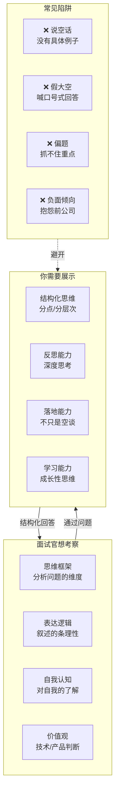
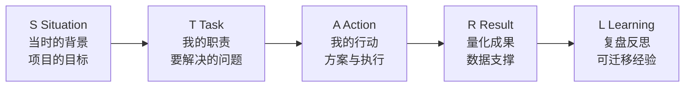
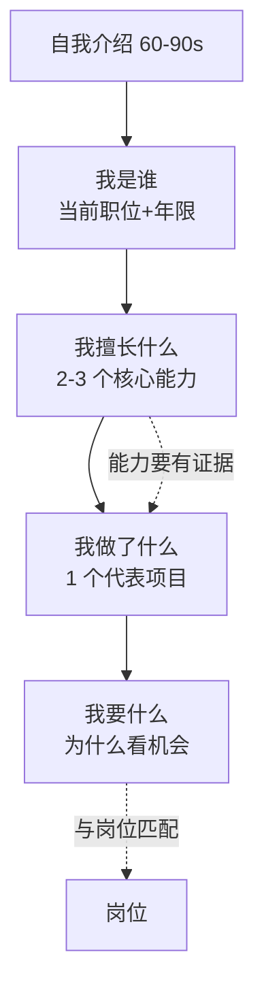
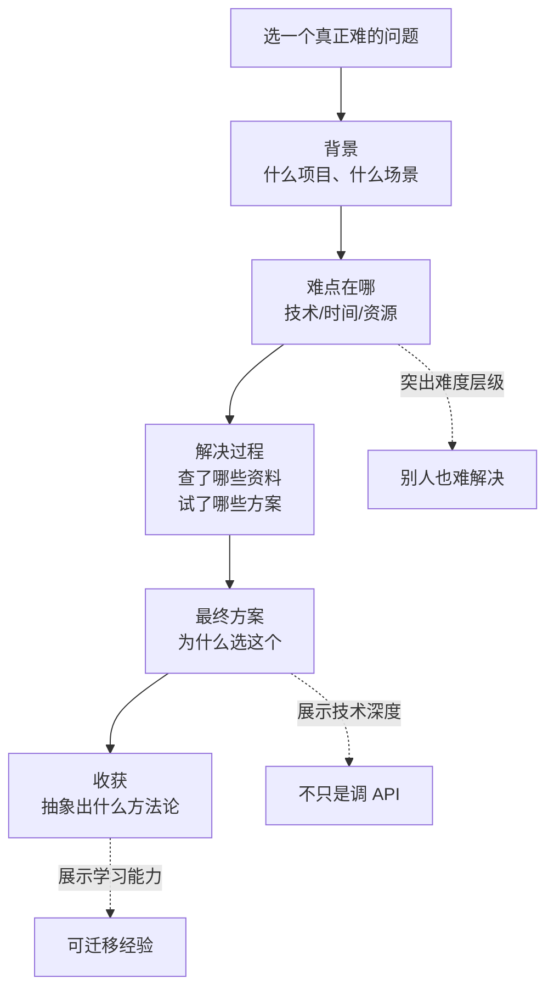

<DifficultyBadge level="beginner" />

# 开放性问题回答框架

## 一句话解释

所谓"开放性问题"，就是**没有标准答案**的问题。面试官不是要你"答对"，而是要看你**思考问题的框架、表达的逻辑性和价值观**。掌握回答框架，让每个回答都成为加分项。

## 开放性问题的底层逻辑



## 通用回答框架

### 核心框架：SAR（Situation-Action-Result）

```
S - Situation（背景）：在什么场景下？面临什么挑战？
A - Action（行动）：你具体做了什么？为什么这样做？
R - Result（结果）：产生了什么可量化的效果？

进阶版：SAR + L（Learn/Lesson 复盘反思）
```

### 扩展框架：CEG（Claim-Evidence-Go deeper）

```
C - Claim（观点）：一句话说清你的核心观点
E - Evidence（论据）：用具体经历/数据证明
G - Go deeper（深入）：抽象出可复用的方法论
```

### STAR 变体：用于回答更复杂的问题



> **关键**：你的回答要有"画面感"——让面试官能"看到"你在项目中是怎么工作的。

## 常见开放性问题类型

### 类型 1：自我介绍



**模板：**
> "我是一名有 X 年前端经验的前端工程师，目前在 [公司] 负责 [模块]。我比较擅长三个方面：一是 **复杂状态管理**（比如：...），二是 **性能优化**（比如：...），三是 **技术方案设计**。最让我有成就感的一个项目是 [项目名]，...[简述 SAR]。我当前看机会主要是因为 **想接触更复杂的业务场景** / **希望在工程化方向有更多深耕**。"

### 类型 2：为什么离开上一家公司？

**核心原则：积极、理性、向前看**

| ❌ 错误回答 | ✅ 正确回答 |
|-----------|-----------|
| "公司管理太乱" | "公司业务比较稳定，我希望接触更有挑战性的场景" |
| "工资太低" | "结合市场行情，我希望获得与能力匹配的回报" |
| "领导不行" | "团队技术栈比较老旧，我希望在新环境中接触到更前沿的技术" |
| "没有成长空间" | "在团队中已经能做到的事情比较有限，我想跳出舒适区" |

**模板：**
> "在上一家公司呆了 X 年，成长了很多，也很感谢团队。离开主要是因为 [积极原因，如业务天花板/技术方向/产品形态变化]。我希望在新的环境里 [你想要获得的]。"

### 类型 3：你最大的缺点是什么？

**套路：承认真实缺点 + 正在改进 + 不影响核心工作**

**模板结构：**
```
1. 真实的缺点（不是"太完美主义"这种假缺点）
2. 它带来了什么影响
3. 你用什么方法在改进
4. 目前改到了什么程度
```

**示例：**
> "我的一个缺点是 **在技术方案设计前，调研阶段容易想得太多**，有时候会花比较多时间比较方案差异。之前有个项目，我在数据库选型上考虑了两天，后来发现初期差异并不大。
>
> 我的改进方法是：**给自己设定 deadline**，在时间盒内做决策，先把方案做出来再迭代。同时也养成了写 RFC 文档的习惯，把多方案的优劣列出来，找同事一起 review。现在做决策的速度比之前快了很多。"

### 类型 4：你遇到过最难的技术问题？



**模板：**
> "在 [项目] 中遇到了 [具体问题]。这个问题之所以难，是因为 [难点分析]。我花了 [时间] 来调研，尝试了 [A 方案/不行的原因]、[B 方案/也不行的原因]，最终通过 [C 方案] 解决了。核心思路是 [一句话抽象方法论]。通过这个问题我 [学会了什么/建立了什么知识体系]."

### 类型 5：你对加班怎么看？

| ❌ 错误回答 | ✅ 正确回答 |
|-----------|-----------|
| "完全不能加班"（显得不敬业） | "项目需要时可以加班，但不认同无意义的加班文化" |
| "我愿意 996"（显得不真诚） | "我更关注工作效率，尽量避免低效加班" |
| "看加班费"（格局太小） | "短期攻坚可以，长期需要找平衡" |

**参考模板：**
> "我对加班的态度是：**业务需要时不排斥，但追求本质效率**。如果是因为项目冲刺、线上问题、版本发布等合理原因，我可以全力投入。但如果是由于工作安排不合理导致的长期低效加班，我更倾向于先优化流程，而不是靠堆时间。我认为前端工程师的价值是**用技术手段提效**，包括提升自己的工作效率。"

### 类型 6：你期望的薪资是多少？

> 这个话题和 [谈薪策略](./salary-negotiation) 有大量重叠，这里只聚焦回答框架。

**模板：**
> "我目前总包是 X，看新机会期望有 20-30% 的增长。当然我**更看重业务方向和团队的技术氛围**，如果各方面比较合适，薪酬可以在综合评估后再聊。想了解下这个岗位的薪酬结构是怎样的？"

### 类型 7：你还有什么想问我的？

**这是你的面试——不是被动回答，而是主动判断。**

**分层提问策略：**

| 层级 | 问题示例 | 目的 |
|------|---------|------|
| **业务 & 产品** | "这个团队目前重点推进的业务方向是什么？" | 判断业务前景 |
| **技术 & 工程** | "团队目前的技术栈是什么？有技术债务在还吗？" | 判断技术氛围 |
| **团队 & 文化** | "团队的技术氛围怎么样？有 Code Review 吗？" | 判断团队质量 |
| **成长 & 空间** | "团队对技术成长的投入是什么样的？有技术分享吗？" | 判断成长空间 |
| **面试官本人** | "你当时为什么选择加入这家公司？" | 侧面了解团队 |

## 行为问题高频题库

| 类别 | 常见问题 | 关键词 |
|------|---------|--------|
| **冲突处理** | 和产品/设计意见不合怎么办？ | 数据驱动、用户价值 |
| **失败经历** | 说一个项目失败的经历 | 止损、复盘、改进 |
| **团队协作** | 团队成员拖后腿怎么办？ | 同理心、帮助、反馈 |
| **技术选型** | 做过重要的技术决策吗？ | 调研、评估、落地 |
| **项目推动** | 做过跨团队协调的事情吗？ | 沟通、推进、双赢 |
| **成长速度** | 过去一年技术成长最快的是什么？ | 主动学习、深度思考 |
| **抗压能力** | 遇到延期压力怎么处理？ | 优先级、沟通、砍需求 |

## 避坑清单

```
❌ 说"我没什么缺点"
→ 显得没有自省能力，谁都有缺点

❌ 吐槽前公司/前领导
→ 面试官会想：你以后也会这样说我

❌ 背答案式回答
→ 太模板化，没有个人特色

❌ 只说结果不说过程
→ 无法判断你的真实贡献

❌ 假大空没有证据
→ "我很努力" → "我连续三个版本零 Bug"

❌ 负面肢体语言
→ 线上：语气不确定 线下：眼神游离
```

## 💡 AI 辅助学习

**向 AI 提问：**
- "我是一名前端工程师，有 3 年经验，帮我设计一个 1 分钟的自我介绍，岗位是某大厂 P6"
- "给我一个 STAR 法则回答'冲突处理'问题的具体模板，场景是前端和产品经理意见不合"
- "面试官问'你为什么离开上一家公司'，我不想说坏话但原因确实是被裁了，怎么措辞？"
- "给我 10 个可以在反问环节问面试官的高质量问题，按层级分类"

## 关联知识

- [谈薪策略](./salary-negotiation) — 薪资谈判技巧
- [项目深挖方法论](./project-deep-dive) — 如何准备项目经历
- [面试心态与准备](./interview-mindset) — 面试整体准备策略
- [公司选择](./company-selection) — 如何评估一家公司
