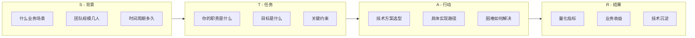
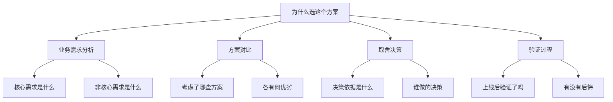

<DifficultyBadge level="intermediate" />

# 项目深挖方法论

## 一句话解释

"项目深挖"是面试中**最容易被低估的环节**——面试官拿到你的简历后，会挑 1-2 个项目反复追问，考察这到底是不是你做的、你的技术深度到哪里、遇到困难时的思考方式。**准备得好的项目深挖 = 面试成功的一半。**

## 深挖的逻辑链条

```mermaid
flowchart TD
    A[写在简历上的项目] --> B[面试官第一问<br/>"说说你这个项目"]
    B --> C[你讲项目的背景<br/>你的角色和贡献]
    C --> D[面试官深挖<br/>看你到底做了多少]
    
    D --> E1[技术深度<br/>"为什么用这个技术"]
    D --> E2[系统思维<br/>"这个方案有没有考虑 X"]
    D --> E3[落地能力<br/>"遇到什么困难"]
    D --> E4[量化产出<br/>"效果如何衡量"]
    
    E1 --> F[判断：是"做过"还是"深入理解"]
    E2 --> F
    E3 --> F
    E4 --> F
```

> **面试官内心 OS**："这个项目的难点在哪里？候选人是不是被动跟着走？他说的东西能不能经得起追问？"

## 项目准备的 4 步法

### Step 1：挑 3 个核心项目

不是所有项目都要深挖，挑 3 个最有代表性的：

| 项目类型 | 考察目的 | 选取标准 |
|---------|---------|---------|
| **最具技术深度的项目** | 技术能力 | 涉及复杂问题/技术方案 |
| **最能体现业务价值的项目** | 业务理解 | 有明确的业务指标提升 |
| **最有挑战/最大的项目** | 架构能力 | 涉及多团队协作/系统设计 |

### Step 2：用 STAR 框架写逐字稿



**每个项目准备一个 3 分钟版 + 一个 10 分钟版。**

### Step 3：准备深挖追问（最关键）

做一个"追问清单"，提前想好面试官可能问什么：

**技术选型类：**
- "为什么选 Vue 不选 React？"
- "为什么不用现成的库而是自己写？"
- "有没有考虑过另一种方案？为什么放弃了？"

**系统设计类：**
- "如果数据量翻 10 倍，你的方案还撑得住吗？"
- "这个设计有没有考虑异常情况？"
- "如果团队有 10 个人并行开发这个项目，架构需要做什么调整？"

**个人贡献类：**
- "这个项目你具体做了什么？"
- "你在里面最大的贡献是什么？"
- "有没有什么决策是你做的？"

**困难挑战类：**
- "遇到的最大困难是什么？怎么解决的？"
- "有没有延期？为什么？"
- "如果重新来一次，你会怎么改进？"

### Step 4：量化！量化！量化！

```diff
- "优化了页面性能"
+ "通过 SSR + 懒加载 + 图片优化，首屏加载时间从 4.2s 降至 1.1s，提升 73%"

- "重构了项目代码"
+ "将单体应用拆分为 6 个独立模块，构建时间从 8min 降至 2min，支持 3 个团队并行开发"

- "做了组件库"
+ "搭建了基于 Vue 3 的内部组件库，包含 30+ 组件，被 5 个业务线复用，减少重复代码量 60%"

- "改了 Bug"
+ "修复了线上 CRASH 率 TOP1 的崩溃问题（崩溃率从 0.8% → 0.05%）"
```

**量化方法论：**

| 维度 | 量化指标 | 数据来源 |
|------|---------|---------|
| **性能** | FCP/LCP/TTI 变化率 | Lighthouse、RUM |
| **质量** | Bug 率/崩溃率/线上问题数 | Sentry、监控平台 |
| **效率** | 构建时间/部署频率/开发周期 | CI/CD 数据 |
| **规模** | 接入项目数/用户数/页面数 | 业务数据 |
| **产出** | 模块数/组件数/代码行数（仅供参考） | 代码统计 |

### 项目陈述模板（3 分钟版）

```
1️⃣ 业务背景（30s）
"这个项目面向 [什么用户]，解决 [什么问题]。当时团队有 X 个人，周期是 X 个月。"

2️⃣ 我的角色（30s）
"作为前端负责人，我主要负责 [核心工作]，同时协调 [跨团队协作]。"

3️⃣ 技术方案（60s）
"核心挑战是 [具体难点]。我们的方案是 [一句话方案]，相比 [备选方案] 的优势是 [X]。"

4️⃣ 核心成果（30s）
"最终 [量化结果]。技术上的沉淀是 [可复用的经验/组件/工具]。"

5️⃣ 复盘反思（30s 可选）
"如果重新做一次，我会在 [X] 方面做得更好，因为 [反思]。"
```

## 常见追问深度解析

### 追问 1："为什么选这个技术方案？"



**示例回答：**
> "我们选用了 Module Federation 做微前端拆分。当时考虑了三个方案：iframe、qiankun 和 MF。iframe 隔离性好但体验差，不适合内部管理系统；qiankun 成熟但侵入性强；MF 是 Webpack 原生支持，与我们的打包体系最契合。最后选择 MF 的原因是我们后续计划做 SSR，MF 更容易配合。上线后验证：构建时间从 12min 降到 3min，团队可以独立发版。"

### 追问 2："如果数据量翻 10 倍，还撑得住吗？"

- ❌ "应该还行吧，没测过"
- ⚠️ "我们用缓存了，应该没问题"（太笼统）
- ✅ "我们做过压力测试，当前架构在 3 倍流量下没问题。如果到 10 倍，我预测瓶颈会在 [X]，需要做 [Y] 优化。这也是我计划的后续迭代方向。"

### 追问 3："如果让你重新设计这个项目，你会怎么改？"

**这是一个送分题——展示你的反思能力。**

**模板：**
> "如果能重来，我会在三个方面做得更好：
> 1. **架构层面**：当时 [什么决策不够好]，现在我会 [改进方案]
> 2. **工程层面**：当时忽略了 [什么问题]，现在会一开始就引入 [工具/规范]
> 3. **协作层面**：[跨团队/沟通上的不足]，更好的做法是 [改进]
>
> 但考虑到当时的业务节奏和团队情况，这些取舍是合理的。"

## 项目的"技术亮点"建议

| 技术方向 | 亮点示例 |
|---------|---------|
| **性能优化** | SSR 首屏 <1s、虚拟列表 10 万条无卡顿、图片加载优化 70% |
| **架构设计** | 微前端拆分、组件库设计、插件化架构、低代码方案 |
| **工程化** | CI/CD 流水线、Monorepo 搭建、自动化测试覆盖 90%+ |
| **稳定性** | 错误监控体系、降级方案、容灾演练 |
| **Node.js/BFF** | API 聚合、SSR 渲染、Serverless 适配 |
| **跨端** | 一套代码多端适配、小程序引擎、Flutter/RN 实践 |

## 真实案例：项目深挖实战

**候选人简历写**："负责公司中后台前端框架搭建，提升了开发效率"

**面试官追问链：**
```
Q: "这个框架解决了什么核心问题？"
→ A: "多项目重复造轮子，不同项目用不同 UI 库，效率低、维护难"

Q: "你怎么搭建的？"
→ A: "选了 Ant Design 做基础组件，设计了 Layout/权限/请求/路由四个模块"

Q: "为什么选 Ant Design 而不是自己封装？"
→ A: "团队 5 个人，自己封装周期太长，Ant Design 能满足 80% 需求"

Q: "20% 不能满足的部分怎么处理？"
→ A: "封装了业务组件层，在 Ant Design 上包装了 ConfigProvider 做主题定制"

Q: "怎么衡量这个框架的效果？"
→ A: "接入前：新项目搭建需要 2 周；接入后：3 天就能跑起来。最终覆盖了 12 个业务项目"
```

这个候选人通过了，因为**每个追问都能深入下去，有具体的数据和思考。**

## 💡 AI 辅助学习

**向 AI 提问：**
- "帮我做一下项目深挖准备：我是一个前端，做过一个低代码平台，帮我写 3 分钟的项目陈述，并准备 10 个可能的深挖追问"
- "以下是我的项目经历[粘贴简历]，帮我量化每个项目的成果，提出数据化建议"
- "给我 20 个面试官可能问的深挖问题清单，按难度分级"
- "我想把我的项目经验讲得更出彩，帮我用 STAR 框架重新组织"
- "前端面试项目深挖时，如何回答'如果重新做一次你会怎么改'这个问题？"

## 关联知识

- [开放性问题回答框架](./open-questions) — 开放性问题通用回答技巧
- [前端系统设计 ①](./system-design-1) — 系统设计方法论
- [面试心态与准备](./interview-mindset) — 面试整体规划
- [手写代码题集](./handwrite-code) — 手写题准备
