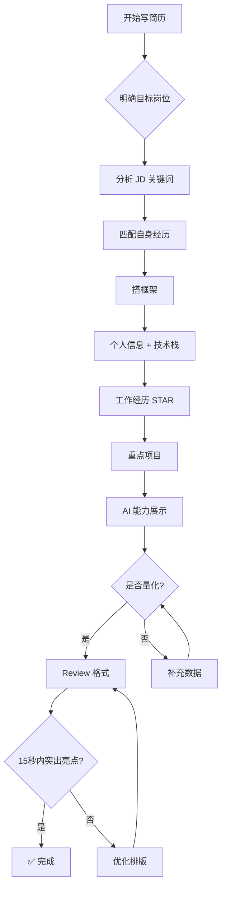

<DifficultyBadge level="beginner" />

# 简历撰写

## 一句话解释

面试官看一份简历平均只有 **15-30 秒**——你的简历需要在极短时间内传递出"技术深度、业务影响力、工程领导力"三个核心信号，同时用**量化结果**证明你不是在堆砌技术栈。

## 核心策略



## 深入理解

### 1. 资深前端的简历核心逻辑

面试官看资深前端简历，关注顺序是：**影响力 > 深度 > 广度 > 年限**。

**影响力**：你做的事情对业务/团队/工程效率产生了什么可衡量的影响？
- ❌ "负责 XX 系统的开发和维护"
- ✅ "主导前端性能优化，首屏加载从 4.2s 降至 1.8s，LCP 提升 57%，影响 200 万 DAU"

**深度**：你在某个领域有体系化的理解和实践吗？
- ❌ "熟悉 React"
- ✅ "基于 React 18 Concurrent Mode 重构了搜索 Suggest 模块，输入响应延迟从 120ms 降至 30ms"

**广度不是堆叠**："熟悉 React/Vue/Angular/Svelte/Solid/..." 反而暴露你没有深度。

### 2. STAR 法则详解

每个项目和经历都应该用 STAR 格式组织：

| 要素 | 说明 | 示例 |
|------|------|------|
| **S**ituation | 项目背景，面临的挑战 | 老首页加载 >5s，用户流失率月增 2% |
| **T**ask | 你负责的目标 | 将首页 LCP 降至 2s 以内 |
| **A**ction | 你采取的具体行动 | 实施 SSR + 关键 CSS 内联 + 图片 WebP + 路由级代码分割 |
| **R**esult | 可量化的结果 | LCP 从 5.2s → 1.8s，用户跳出率降 15%，月 UV 增长 8% |

### 3. AI 能力展示（2026 年加分项）

2026 年，"会用 AI" 已是资深前端的基础能力，真正的区分度在于：

- **AI 工具选型**：根据场景选择 Cursor/Copilot/OpenCode，说明理由
- **AI 工作流设计**：你如何设计 Prompt、Review AI 输出、保证代码质量
- **AI 落地效果**：用 AI 提效了多少（例："用 Cursor Agent 将 CRUD 页面开发效率提升 3 倍"）

## 简历模板示例

```markdown
张三 | 资深前端工程师 | 8 年经验
📧 zhangsan@email.com | 📱 138-xxxx-xxxx
🔗 github.com/zhangsan | blog.zhangsan.dev

---

**技术栈**

精熟：React 18 / TypeScript / Next.js / Node.js
掌握：Vue 3 / Webpack / Vite / Docker
了解：Rust / WebAssembly / Three.js

---

**工作经历**

字节跳动 — 资深前端工程师（2022.06 - 至今）

项目 A：电商主站性能优化
- S：主站首页 LCP 5.2s，用户跳出率月增 2%，双十一期间流量暴增 10 倍
- T：将 LCP 降至 2.5s 以内，支撑双十一零宕机
- A：实施 SSR + 关键 CSS 内联 + 图片 CDN WebP + 路由级 code splitting + 核心接口 Prefetch
- R：LCP 从 5.2s → 1.8s（↓65%），FCP 从 3.1s → 1.2s，双十一 GMV 同比增长 35%

项目 B：AI Code Review 工具链建设
- 引入 Cursor Agent 自动化 PR Review，覆盖 80% 的常见代码问题
- 设计团队 Prompt 模板库，新成员上手时间从 2 周缩短至 3 天
- 搭建 AI + CI 流水线，每次提交自动生成变更摘要和影响分析

---

**AI 能力**

- Cursor + Copilot 日常开发组合，熟悉 Agent 模式与 Cloud Agent 异步任务
- 设计并落地团队 AI Code Review 工作流
- 开源项目 OpenCode Contributor，擅长 Agent 编排
```

## 简历检查清单

| 检查项 | 说明 |
|-------|------|
| ✅ 15 秒内能看出技术栈和职级 | 个人信息区和技能区在最上方 |
| ✅ 每个项目都有量化数据 | 没有数据的项目不如不写 |
| ✅ STAR 格式清晰 | 每段经历 S/T/A/R 要素完整 |
| ✅ 没有错别字和格式混乱 | 简历的排版 = 代码规范 |
| ✅ AI 能力有具体案例 | 不空洞地说"会用 AI" |
| ✅ PDF 格式 | 不要发 Word/Pages |

## 面试问法

- 🔥 **面试官看简历最关注什么？**
  - 资深前端的简历要突出"深度"和"影响力"——不是你用过多少技术，而是你用技术解决了什么问题
  - 量化成果是所有面试官的第一关注点
  - AI 使用经验是 2026 年的重要加分项，但要有具体案例支撑

- 🔥 **项目经验怎么写才有亮点？**
  - 每个项目写清楚你在其中的**角色和决策**——是执行者还是推动者
  - 用 **Before/After 对比** 展示优化效果
  - 技术难点 + 解决方案 + 最终成果 = 完整叙事

- ⭐ **简历常见减分项？**
  - 技术栈堆砌（"熟悉 20 种技术" = 没有深度）
  - 所有描述都是"负责XX"没有量化结果
  - 夸大不熟悉的技术（面试一问就露馅）
  - 格式混乱、错别字
  - 没有 LinkedIn/博客/GitHub 链接

## 💡 AI 辅助学习

> 用这个 Prompt 让 AI 帮你优化简历：
> "你是一个资深前端技术面试官，正在筛选 P7 级别的候选人。帮我 review 以下简历片段，从以下几个维度给出改进建议：
> 1. 技术深度是否体现出来了？
> 2. 是否有足够的数据支撑？
> 3. 描述是否符合资深前端的定位（影响力 > 执行）？
> 4. AI 能力展示是否具体？
> 5. 如果只能看 15 秒，你会记住什么？
> 简历：[粘贴你的内容]"

## 关联知识

- [面试流程解析](./interview-flow) — 从投递到 Offer 全流程
- [高频行为面试](./behavioral-questions) — 行为面试准备
- [谈薪策略](./salary-negotiation) — 拿 Offer 后怎么谈
- [项目深挖](./project-deep-dive) — 面试中怎么深入讲项目
