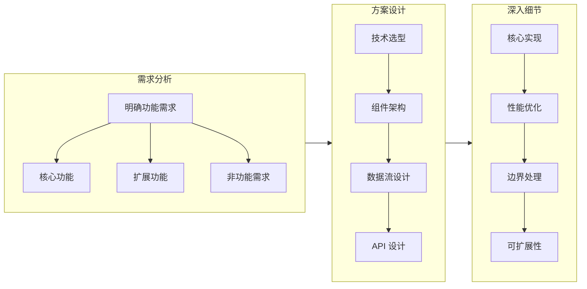
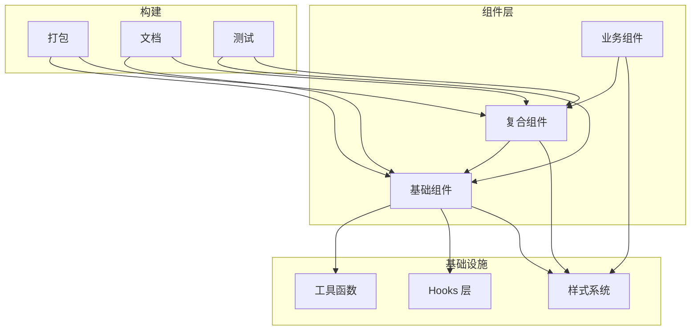

<DifficultyBadge level="intermediate" />

# 前端系统设计 ①

## 一句话解释

系统设计面试考察的不是你"能不能写代码"，而是**你能不能架构一个完整的前端解决方案**——从需求分析、技术选型、API 设计、组件拆分、性能优化到工程化落地。这是资深前端 vs 初中级最核心的区分点。

## 系统设计通用框架



**系统设计的通用步骤（面试时按这个框架讲）：**

1. **澄清需求**（2 分钟）：问清楚功能范围、用户场景、非功能需求
2. **整体设计**（3 分钟）：画架构图，讲清楚组件分层和职责
3. **深入细节**（5 分钟）：核心功能的技术实现
4. **扩展讨论**（3 分钟）：性能、健壮性、可扩展性

## 深入理解

### 题目 1：设计一个前端组件库

**1. 需求澄清**
- 功能：Button、Input、Modal、Table、Form、DatePicker 等常见组件
- 非功能：Tree Shaking 支持、主题定制、TypeScript 类型、无障碍
- 交付：npm 包 + 文档站点

**2. 整体架构**



**3. 核心设计决策**

| 决策 | 方案 | 理由 |
|------|------|------|
| **样式方案** | CSS-in-JS vs CSS Modules vs Tailwind | 选 CSS Modules + CSS Variables（主题定制） |
| **按需加载** | 支持 Tree Shaking + 提供 `lib/` 目录按路径引用 | 减少打包体积 |
| **类型** | TypeScript 编写，导出完整类型 | 开发者体验 |
| **主题** | CSS Variables 覆盖机制 | 运行时动态切换 |
| **测试** | Vitest + Playwright（组件测试 + 视觉回归） | 全面覆盖 |

**4. 代码结构示例**
```
components/
├── Button/
│   ├── index.ts          # 导出
│   ├── Button.tsx         # 组件实现
│   ├── Button.style.ts    # 样式
│   ├── Button.test.tsx    # 测试
│   └── Button.stories.tsx # 文档
├── Modal/
│   ├── index.ts
│   ├── Modal.tsx
│   ├── Modal.style.ts
│   ├── useModal.ts        # 逻辑 Hooks
│   └── ...
└── shared/
    ├── theme/
    ├── hooks/
    └── utils/
```

### 题目 2：设计一个图片懒加载组件

**1. 需求澄清**
- 核心：图片进入视口才加载
- 扩展：占位图、渐进式加载、失败重试、响应式图片
- 非功能：性能（不卡顿）、兼容性（fallback）

**2. 技术选型**

```javascript
// Intersection Observer API（现代方案）
function LazyImage({ src, placeholder, alt, width, height }) {
  const imgRef = useRef(null)
  const [loaded, setLoaded] = useState(false)
  const [error, setError] = useState(false)
  
  useEffect(() => {
    const observer = new IntersectionObserver(
      ([entry]) => {
        if (entry.isIntersecting) {
          const img = new Image()
          img.src = src
          img.onload = () => {
            setLoaded(true)
            observer.disconnect()
          }
          img.onerror = () => {
            setError(true)
            observer.disconnect()
          }
        }
      },
      { rootMargin: '200px' } // 提前 200px 加载
    )
    
    if (imgRef.current) observer.observe(imgRef.current)
    return () => observer.disconnect()
  }, [src])
  
  return (
    <div ref={imgRef} style={{ width, height, position: 'relative' }}>
      {!loaded && !error && <Placeholder src={placeholder} />}
      {error && <ErrorFallback />}
      {loaded && }
    </div>
  )
}
```

**3. 优化点**
- `loading="lazy"` 属性（原生支持，作为兜底）
- 预加载策略：提前 200px 触发
- 响应式图片：根据屏幕尺寸加载不同分辨率的图片
- 弱网适配：超时降级

### 题目 3：设计一个搜索组件

**需求：** 支持输入搜索、下拉建议、高亮匹配、历史记录

**核心实现：**
```javascript
function SearchBox({ onSearch, onSuggest }) {
  const [query, setQuery] = useState('')
  const [suggestions, setSuggestions] = useState([])
  const [history, setHistory] = useState([])
  const [isOpen, setIsOpen] = useState(false)
  
  // 防抖搜索建议
  const debouncedFetch = useMemo(() =>
    debounce(async (q) => {
      if (q.length < 2) return setSuggestions([])
      const results = await onSuggest(q)
      setSuggestions(results)
    }, 300)
  , [])
  
  // 键盘导航
  const handleKeyDown = (e) => {
    switch (e.key) {
      case 'ArrowDown': /* 选中下一项 */
      case 'ArrowUp': /* 选中上一项 */
      case 'Enter': /* 执行搜索并记录历史 */
      case 'Escape': /* 关闭下拉 */
    }
  }
  
  // ... 渲染逻辑
}
```

## 面试问法

- 🔥 **系统设计面试的核心逻辑是什么？**
  - 不是要一个"完美方案"，而是看你的思考框架和决策过程
  - 讲清楚每个选择的 trade-off，比选"正确"的方案更重要
  - 展现工程判断力：什么该做，什么不该做，什么可以简化

- 🔥 **前端系统设计和后端系统设计有什么不同？**
  - 前端更关注组件架构、状态管理、性能指标（LCP/FID/CLS）
  - 前端的设计更"具象"——不只是 API，还有交互、动画、渲染
  - 前端需要关心网络（API 策略、缓存、预加载）和运行时（包体积、渲染性能）

- ⭐ **系统设计的通用框架？**
  - 4 步法：需求澄清 → 整体设计 → 深入细节 → 扩展讨论
  - 每个设计都要考虑：功能 + 性能 + 可靠性 + 可维护性
  - 用白板/画图辅助表达（面试时用手画架构图）

## 💡 AI 辅助学习

> 用这个 Prompt 让 AI 帮你模拟系统设计面试：
> "你是一个前端系统设计面试官。请按以下流程模拟一场系统设计面试：
> 1. 给我一个系统设计题目（适合资深前端）
> 2. 我按框架回答
> 3. 你追问细节或指出我遗漏的点
> 4. 最后给出综合评价和参考方案
> 
> 题目方向：设计一个前端组件库 / 设计一个实时协作编辑器 / 设计一个监控面板 / 设计一个图片优化系统
> 
> 开始先出第一题。"

## 关联知识

- [前端系统设计 ②](./system-design-2) — 高级系统设计场景
- [前端系统设计 ③](./system-design-3) — 复杂系统架构设计
- [面试流程解析](./interview-flow) — 系统设计在面试环节中的位置
