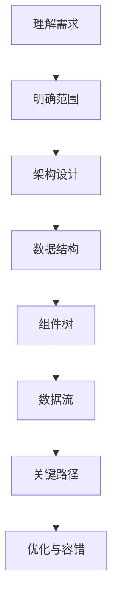
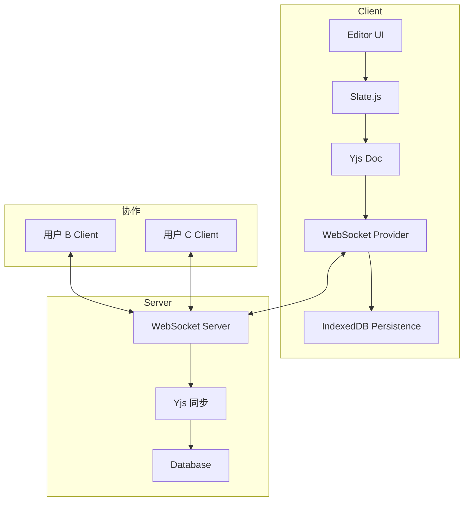

<DifficultyBadge level="intermediate" />

# 前端系统设计 ②

## 一句话解释

系统设计的第二个层次：你需要面对**更复杂的场景和约束**——实时协作、数据可视化、全链路监控——核心考察你在"高复杂度场景"下如何拆解问题、做架构决策。

## 设计框架回顾



## 深入理解

### 题目 1：设计一个实时协作编辑器（类似 Google Docs / Notion）

**1. 需求澄清**
- 核心：多用户同时编辑同一文档，实时同步
- 扩展：光标位置显示、历史版本、评论、离线支持
- 非功能：低延迟（<200ms）、冲突解决、可扩展的文档结构

**2. 技术选型**

| 层面 | 方案 | 理由 |
|------|------|------|
| **编辑器核心** | Slate.js / Prosemirror | 可扩展的富文本框架，支持自定义节点 |
| **实时同步** | WebSocket + OT/CRDT | CRDT（如 Yjs）更适合多人协作场景 |
| **数据结构** | 基于 CRDT 的文档模型 | 自动解决冲突，无需中央冲突处理 |
| **光标协作** | Awareness Protocol | 使用 Yjs Awareness 实现多人光标 |
| **存储** | IndexedDB + 服务器持久化 | 离线支持 + 数据持久 |

**3. 核心架构**



**4. 冲突解决方案（CRDT vs OT）：**

| 对比 | OT（Operational Transform） | CRDT（Conflict-free Replicated Data Type） |
|------|---------------------------|-------------------------------------------|
| 核心思路 | 变换操作使其适应并发 | 设计数据结构使并发操作自动收敛 |
| 复杂度 | 实现复杂，需要中心服务器 | 模型复杂，但去中心化 |
| 成熟方案 | Google Docs / ShareJS | Yjs / Automerge |
| 前端推荐 | ❸ 高复杂度 | ⭐ 推荐：Yjs |
| 离线支持 | 有限 | 天然支持 |

```javascript
// Yjs 文档模型示例
import * as Y from 'yjs'
import { WebsocketProvider } from 'y-websocket'

// 初始化文档
const doc = new Y.Doc()
const text = doc.getText('content')

// 监听变化
text.observe(event => {
  event.changes.delta.forEach(delta => {
    // 更新编辑器内容
  })
})

// 插入内容（自动广播给协作方）
text.insert(0, 'Hello, World!')

// WebSocket 连接
const wsProvider = new WebsocketProvider(
  'ws://localhost:1234', 
  'my-document-id', 
  doc
)
```

### 题目 2：设计一个前端监控系统

**1. 需求澄清**
- 核心：收集 Web Vitals、JS 错误、API 请求、用户行为
- 扩展：SourceMap 还原、性能分析面板、告警
- 非功能：对业务零侵入、不影响性能、采样率控制

**2. 整体架构**

```javascript
// SDK 核心设计
class Monitor {
  constructor(options) {
    this.config = {
      sampleRate: 0.1,     // 采样率
      reportUrl: '/api/report',
      maxBufferSize: 10,   // 批量上报大小
      ...options
    }
    this.buffer = []
    this.init()
  }
  
  init() {
    // 采集 Web Vitals
    this.initWebVitals()
    // 采集 JS 错误
    this.initErrorCapture()
    // 采集 API 请求
    this.initAPIMonitor()
    // 采集用户行为
    this.initUserBehavior()
    // 页面关闭前上报
    this.initFlushOnExit()
  }
  
  // 批量上报（防丢、防频）
  report(data) {
    this.buffer.push({ ...data, timestamp: Date.now() })
    if (this.buffer.length >= this.config.maxBufferSize) {
      this.flush()
    }
  }
  
  flush() {
    if (this.buffer.length === 0) return
    const payload = this.buffer.slice()
    this.buffer = []
    
    // 使用 sendBeacon 避免阻塞页面卸载
    if (navigator.sendBeacon) {
      navigator.sendBeacon(this.config.reportUrl, JSON.stringify(payload))
    } else {
      fetch(this.config.reportUrl, {
        method: 'POST',
        body: JSON.stringify(payload),
        keepalive: true
      })
    }
  }
  
  initFlushOnExit() {
    document.addEventListener('visibilitychange', () => {
      if (document.visibilityState === 'hidden') this.flush()
    })
  }
}
```

**3. 采集指标**

| 类别 | 指标 | 采集方式 |
|------|------|---------|
| **Web Vitals** | LCP、FID/INP、CLS | `web-vitals` 库 |
| **JS 错误** | Error 对象、Promise 未捕获 | `window.onerror` + `unhandledrejection` |
| **请求监控** | 请求耗时、状态码、体量 |  Patch `fetch` / `XMLHttpRequest` |
| **用户行为** | 路由切换、点击、滚动 | 事件监听 + 采样 |
| **性能** | FP、FCP、TTFB、Long Task | `PerformanceObserver` |

### 题目 3：设计一个性能优化平台

**核心能力：**
1. Lighthouse 自动化跑分 + CI 集成
2. Bundle 分析（基于 Webpack Bundle Analyzer）
3. 真实用户监控（RUM）数据展示
4. 优化建议自动生成（基于规则 + AI）

**数据流：**
```
CI/CD Pipeline → Lighthouse CI → 报告存储 → Dashboard 展示
                                                       ↓
RUM SDK → 用户端采集 → 数据管道 → 聚合分析 → 告警通知
```

## 面试问法

- 🔥 **实时协作编辑器的核心难点？**
  - 冲突解决：CRDT vs OT 的选择和 trade-off
  - 性能：大文档的编辑延迟必须 <100ms
  - 离线：支持离线编辑，上线后自动合并
  - 光标同步：多人光标的实时渲染和性能平衡（不渲染视口外光标）

- 🔥 **前端监控系统的设计要考虑什么？**
  - 零侵入：不要影响业务代码
  - 零性能影响：采样率控制、批量上报、Web Worker 处理数据
  - 高可靠性：不丢数据（用 sendBeacon）、页面崩溃也能上报（利用 Service Worker）
  - 弹性：采样率自适应，流量高峰期自动降低采样率

- ⭐ **如果让你设计一个前端错误恢复机制？**
  - 错误边界（Error Boundary）
  - 自动重试（API 请求、资源加载）
  - 降级 UI（显示降级组件而非白屏）
  - 渐进增强（核心功能先加载，非核心功能降级）

## 💡 AI 辅助学习

> 用这个 Prompt 让 AI 帮你深入系统设计：
> "你是一个资深前端架构师。帮我深度分析以下系统设计题：'设计一个实时协作编辑器'。
> 
> 请从以下角度给出分析：
> 1. 如果我选 CRDT（Yjs），核心的数据结构怎么设计？
> 2. Undo/Redo 在协作场景怎么实现？
> 3. 大文档（>10 万字符）的性能优化策略
> 4. 离线编辑的冲突合并策略
> 5. 如果要支持 Notion 式的 block 结构，架构怎么调整？
> 
> 每个分析点给出具体的技术方案和 trade-off。"

## 关联知识

- [前端系统设计 ①](./system-design-1) — 系统设计基础 + 组件设计
- [前端系统设计 ③](./system-design-3) — 复杂架构设计
- [开放性问题](./open-questions) — 开放式设计问题的回答框架
- [项目深挖](./project-deep-dive) — 把项目经历讲成系统设计
