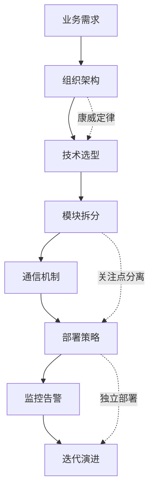
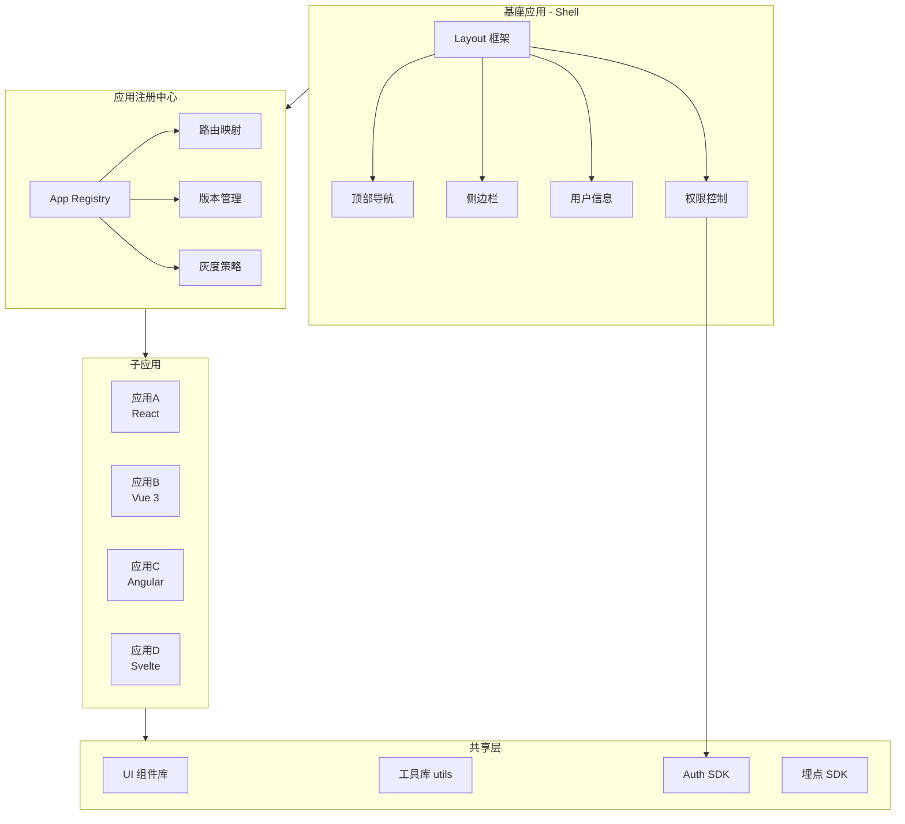
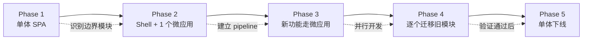
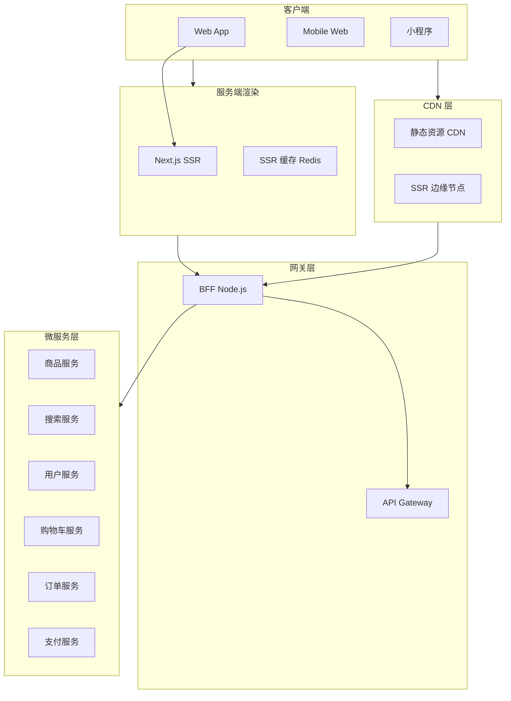
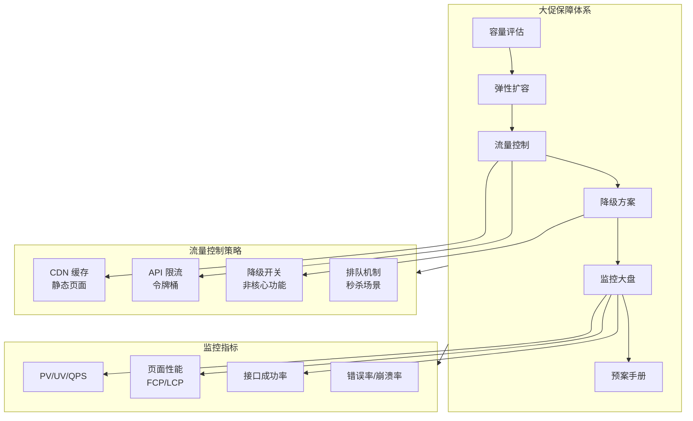
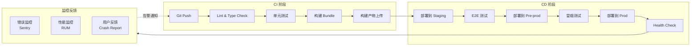
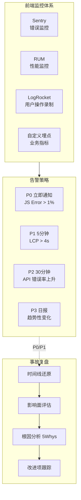

<DifficultyBadge level="advanced" />

# 前端系统设计 ③

## 一句话解释

系统设计的第三个层次：你需要面对**企业级规模和复杂度**的挑战——多团队协作的微前端架构、百万级流量的电商平台、端到端的 DevOps 流水线。核心考察你在**组织级技术决策**上的能力。

## 设计原则回顾



> **康威定律**：系统架构会复制组织的沟通结构。如果你有 3 个前端团队，就应该有 3 个可独立部署的前端应用。

## 深入理解

### 题目 1：设计一个前端微服务架构（Micro-Frontends）

**1. 需求澄清**
- 场景：大型企业级 SaaS 平台，5 个前端团队并行开发
- 核心：各团队独立开发、独立部署、独立技术栈
- 非功能：应用隔离（JS/CSS）、性能（首屏 <2s）、统一体验（UI 一致性）
- 约束：现有系统是单体 SPA（React），需要渐进迁移

**2. 方案选型对比**

| 维度 | iframe | Webpack Module Federation | qiankun | Module Federation + 微组件 |
|------|--------|-------------------------|---------|--------------------------|
| **隔离性** | ✅ 最强 | ⚠️ 需自行处理 | ✅ 沙箱隔离 | ✅ 沙箱隔离 |
| **通信** | ❌ postMessage 复杂 | ✅ 原生 shared | ✅ 全局状态 | ✅ 原生 shared |
| **性能** | ❌ 每个 app 独立加载 | ✅ 共享依赖 | ⚠️ 预加载策略 | ✅ 共享依赖 |
| **SEO** | ❌ 不友好 | ✅ SSR 可配合 | ⚠️ 需额外配置 | ✅ SSR 可配合 |
| **路由体验** | ❌ URL 不同步 | ✅ 统一路由 | ✅ 统一路由 | ✅ 统一路由 |
| **学习成本** | ✅ 低 | ⚠️ 中 | ⚠️ 中 | ⚠️ 中 |

**推荐方案：Module Federation + qiankun 混合**

- 基座应用（Shell）负责：导航、登录态、布局骨架
- 子应用独立仓库、独立部署，通过 Module Federation 加载
- qiankun 提供 JS 沙箱和样式隔离作为兜底

**3. 架构设计**



**4. 关键实现细节**

**应用加载策略：**
```typescript
// 注册中心配置示例
const apps = [
  {
    name: 'dashboard',
    entry: 'https://app-dashboard.example.com/remoteEntry.js',
    container: '#sub-app-container',
    activeRule: '/dashboard',
    props: {
      getGlobalToken: () => localStorage.getItem('token'),
      baseUrl: '/dashboard',
    },
  },
  // ...
]

// Module Federation 共享依赖（webpack.config.js）
new ModuleFederationPlugin({
  name: 'shell',
  remotes: {
    dashboard: 'dashboard@https://app-dashboard.example.com/remoteEntry.js',
    settings: 'settings@https://app-settings.example.com/remoteEntry.js',
  },
  shared: {
    react: { singleton: true, requiredVersion: '^18.0.0' },
    'react-dom': { singleton: true },
    'ui-lib': { singleton: true, version: '^3.0.0' },
  },
})
```

**5. 样式隔离方案**

| 方案 | 原理 | 适用场景 |
|------|------|---------|
| CSS-in-JS | 运行时生成唯一 class | 新项目，推荐 |
| CSS Modules | 编译时生成 hash | 打包工具支持 |
| Shadow DOM | 浏览器原生隔离 | 微组件场景 |
| PostCSS 插件 | 自动加前缀 | 存量 CSS 迁移 |
| qiankun 沙箱 |  Proxy 劫持样式表 | 快速集成 |

**6. 渐进迁移策略**



---

### 题目 2：设计一个大型电商平台前端架构

**1. 需求澄清**
- 场景：B2C 电商平台，日活 500 万，SKU 1000 万+
- 核心功能：商品浏览/搜索、购物车、下单支付、订单管理、个人中心
- 非功能：首屏 <1s、页面加载 <3s、可用性 99.99%、支持大促流量（10x 峰值）
- 终端：Web + Mobile Web + 小程序

**2. 整体架构**



**3. 核心场景设计：商品搜索结果页**

**性能策略：**

| 优化手段 | 实现方式 | 效果 |
|---------|---------|------|
| SSR 直出 | Next.js 服务端渲染首屏 | 首屏时间 <800ms |
| 流式渲染 | React Suspense + Streaming SSR | 部分内容先展示 |
| 图片优化 | 使用 WebP/AVIF + CDN 图片裁剪 | 图片体积减小 60% |
| 虚拟列表 | 无限滚动 + 虚拟列表（可视区域渲染） | 1000+ 商品卡顿 <10ms |
| 预加载 | 链接预取（`<link rel="prefetch">`） | 页面切换 <200ms |
| 数据预取 | 路由级 prefetch 数据 | 减少加载态等待 |

**搜索防抖与缓存：**
```typescript
// 搜索输入防抖 + 缓存
function useSearchWithCache() {
  const cache = useRef(new Map<string, SearchResult>())
  const [debounced] = useDebounce(keyword, 300)
  
  useEffect(() => {
    // 先查本地缓存
    if (cache.current.has(debounced)) {
      setResult(cache.current.get(debounced)!)
      return
    }
    // 再查 Redis 缓存（通过 BFF）
    fetch(`/api/search?q=${debounced}`).then(res => {
      cache.current.set(debounced, res.data)
      setResult(res.data)
    })
  }, [debounced])
}
```

**4. 大促保障方案**



---

### 题目 3：设计一个前端 DevOps 流水线

**1. 需求澄清**
- 场景：20+ 前端项目，4 个环境（dev/staging/pre-prod/prod），10 人前端团队
- 核心：代码检查→构建→测试→部署→监控，全自动化
- 非功能：构建 <5min、部署 <2min、回滚 <1min、零停机部署

**2. 流水线架构**



**3. 构建优化策略**

| 优化手段 | 配置 | 效果 |
|---------|------|------|
| **缓存依赖** | `node_modules` 缓存 + pnpm store | 安装时间从 3min → 30s |
| **增量构建** | Webpack 持久化缓存 / Turbopack | 构建从 5min → 1min |
| **并行任务** | CI matrix 并行 lint/test/build | 全流程从 8min → 3min |
| **产物去重** | 公共依赖 external + CDN | 产物体积减小 40% |
| **按需构建** | affected 项目检测（Nx/Turborepo） | 只构建变更项目 |

**4. 部署策略对比**

| 策略 | 零停机 | 回滚速度 | 复杂度 | 适用场景 |
|------|--------|---------|--------|---------|
| **滚动更新** | ✅ | 中 | 低 | 普通业务 |
| **蓝绿部署** | ✅ | 快（切流量） | 中 | 核心业务 |
| **灰度发布** | ✅ | 快 | 高 | 重大改版 |
| **静态资源 CDN** | ✅ | 快（版本号回滚） | 低 | SPA 应用 |

**5. 自动化质量门禁：**

```yaml
# .github/workflows/ci.yml（核心步骤）
jobs:
  quality:
    steps:
      - lint: eslint --max-warnings 0
      - type-check: tsc --noEmit
      - test: vitest run --coverage
        gate: coverage >= 80%
      - build: vite build
      - bundle-analyze: bundlesize < 300KB
      
  e2e:
    needs: quality
    steps:
      - deploy-to-staging
      - e2e: playwright test
        gate: pass rate >= 99%
        
  deploy:
    needs: e2e
    steps:
      - deploy-to-prod: --canary=10%
      - health-check: error rate < 0.1%
      - rollout: --full
```

**6. 监控与可观测性：**



## 面试问法

🔥 **高频：**
- "设计一个大型电商的前端架构，你会怎么考虑？" → 从分层架构到性能到大促保障
- "你们团队多个前端项目怎么管理的？CI/CD 怎么设计的？" → DevOps 流水线思路
- "微前端方案怎么选？Module Federation 和 qiankun 怎么选？" → 对比表格 + 推荐方案

⭐ **中频：**
- "前端项目怎么做好灰度发布和 A/B 测试？" → 流量分发 + 埋点分析
- "大促场景前端怎么保障稳定性？" → 降级/限流/预案
- "你们怎么做前端监控的？" → 错误 + 性能 + 业务埋点

📌 **准备建议：**
- 结合自己项目经验，不要背方案
- 准备 1-2 个实际遇到的架构决策案例（为什么选 A 不选 B）
- 大厂面试重点考察：工程化思维 + 组织级技术决策能力

## 💡 AI 辅助学习

**向 AI 提问：**
- "我想设计一个微前端架构，帮我分析 Module Federation 和 qiankun 的优劣"
- "电商平台大促保障的 checklist 是什么？给我一个详细的预案模板"
- "前端项目的 CI/CD pipeline 最佳实践是什么？帮我写一个 GitHub Actions 配置"
- "我们团队想从单体迁移到微前端，帮我设计一个渐进迁移路线图"
- "给我一个前端性能监控体系的完整方案，包括指标采集、上报、大盘展示"

## 关联知识

- [前端系统设计 ①](./system-design-1) — 基础系统设计（组件库/懒加载/搜索/拖拽）
- [前端系统设计 ②](./system-design-2) — 中级系统设计（实时协作/监控平台）
- [性能优化总览](../engineering/performance-overview) — Web 性能优化体系
- [构建工具演进](../engineering/build-tools) — 前端构建工程化
- [AI 辅助架构设计](../ai-dev/ai-architecture) — 用 AI 辅助系统设计
