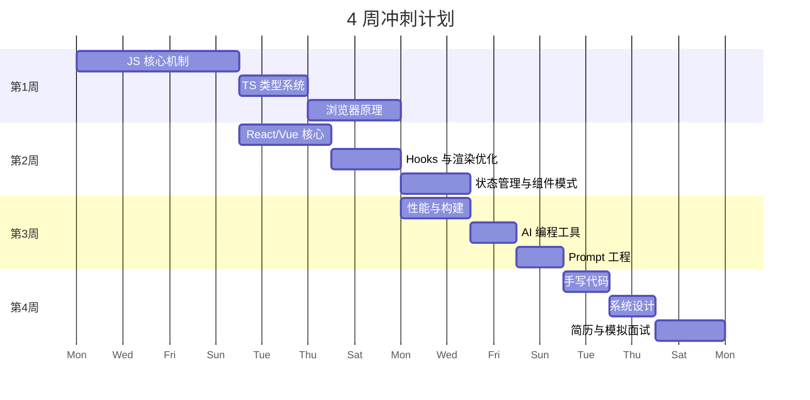

# 🧭 学习路线图

根据你的时间安排，提供两条可选路线：

---

## 🚀 4 周冲刺计划

> 适合 **急需面试** 的情况。每天投入 3-4 小时，重点覆盖面试最高频的知识点。

| 周次 | 重点 | 每日建议 |
|------|------|---------|
| **第 1 周** | 📖 核心基础（上） | JS 执行机制、事件循环、原型链、TS 类型系统 |
| **第 2 周** | ⚛️ 框架深入 | React/Vue 核心 + Hooks + 渲染优化 |
| **第 3 周** | 🏗️ 工程 + 🤖 AI | 性能优化、构建工具 + AI 编程工具使用 |
| **第 4 周** | 🎯 面试冲刺 | 手写代码、系统设计、简历、模拟面试 |

---

## 📚 8 周系统计划

> 适合 **有一定缓冲期** 的情况。每天 2 小时，覆盖更全面，理解更深入。

| 周次 | 重点 | 内容 |
|------|------|------|
| **第 1 周** | 📖 HTML/CSS 基础 | 语义化、布局、响应式 |
| **第 2 周** | 📖 JS 核心 | 执行机制、异步、原型链、事件循环 |
| **第 3 周** | 📖 TS + 浏览器 | 类型系统、渲染流水线、跨域、安全 |
| **第 4 周** | ⚛️ 框架深入（上） | React/Vue 核心 + Hooks |
| **第 5 周** | ⚛️ 框架深入（下） | Fiber、响应式、优化、源码 |
| **第 6 周** | 🏗️ 工程架构 | 性能、构建、测试、CI/CD |
| **第 7 周** | 🤖 AI 辅助开发 | 工具、Prompt、Agent、工作流 |
| **第 8 周** | 🎯 面试冲刺 | 手写代码、系统设计、模拟面试 |

---

## 📋 按职级推荐

| 目标职级 | 必看模块 | 可选深入 |
|---------|---------|---------|
| **P5-P6** | 🟢 入门全部 + 🟡 进阶（TS/框架/性能） | 🔴 选择性了解 |
| **P6-P7** | 🟢🟡 全部 + 🔴（TS 类型体操/V8/源码） | 架构设计、微前端 |
| **P7+** | 全部三级 | 领导力、技术规划、跨部门推动 |

---

## 💡 学习建议

1. **先过一遍目录**：浏览各模块总览页，找到自己的薄弱环节
2. **二八定律**：80% 的面试题集中在 20% 的知识点上，优先级排序
3. **动手写代码**：只看不写等于没看，每个知识点至少手动敲一遍示例
4. **用 AI 辅助**：遇到不懂的，用我们教的 Prompt 技巧让 AI 帮你深入理解
5. **模拟面试**：最后一周一定要找人模拟，或者用 AI 模拟面试官
