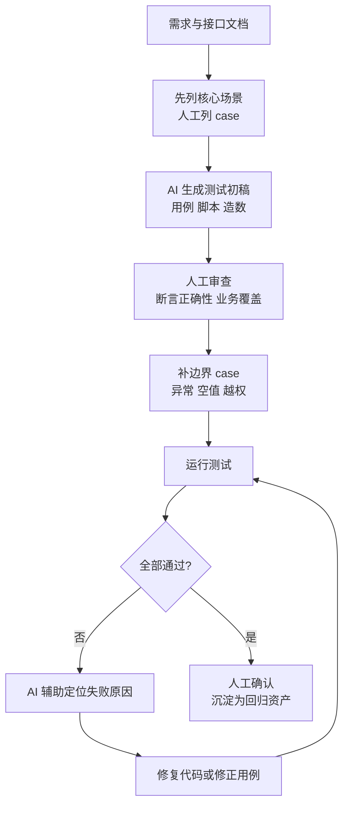
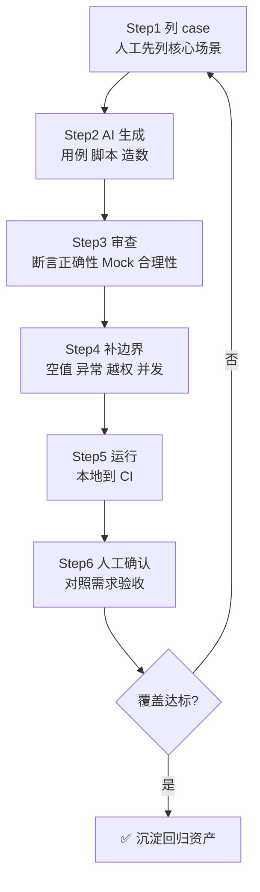

<DifficultyBadge level="advanced" />

# AI 辅助测试

## 一句话解释

AI 辅助测试不是"让 AI 替你做测试"，而是**让 AI 扛下测试工作中最机械、最耗时的部分**（用例初稿、脚本骨架、造数、日志定位），由你负责业务判断与质量把关——核心方法论是"**AI 生框架，人审质量**"。你作为懂前端、想转测试岗的候选人，最大的优势是**既看得懂代码、又理解测试流程**，AI 帮你把"从 0 到 1"的时间从半天压缩到十分钟。

## 核心流程：AI 辅助测试的完整闭环



## 深入理解

### 1. AI 在测试全流程中的应用

AI 不是只帮你"写脚本"这一个环节，而是**渗透到测试全流程的每一个环节**。下面按 QA 日常工作的顺序逐一展开。

#### 1.1 AI 生成测试用例

测试用例是测试岗的核心资产，但"设计用例"恰恰是 AI 最容易帮上忙的环节——因为你只需要告诉它被测对象，它就能按**正常 / 异常 / 边界 / 鉴权 / 安全**的维度批量列出来，你负责筛选和补充业务场景。

```
把接口文档丢给 AI，让它按维度列用例：
"这是一个用户注册接口：POST /api/register，参数 username、password、email。
请按 正常 / 参数异常 / 边界值 / 鉴权 / 安全 五个维度设计测试用例，
每条用例给出：编号、前置条件、入参、预期结果。用表格输出。"
```

> **测试岗视角**：AI 列出的用例**只能当"初稿清单"**，真正的业务边界（比如"注册时手机号已经绑定其他账号""同秒内重复提交"）往往藏在需求细节里，只有懂业务的人才知道——这就是"人审质量"的落点。

#### 1.2 AI 生成自动化脚本（pytest / Playwright）

这是 AI 辅助测试"回报最高"的场景。给 AI 接口文档 + 用例，它直接生成可运行的 pytest 或 Playwright 脚本骨架，你补充断言和业务逻辑。

**pytest 接口测试脚本示例（AI 生成 + 人工补充）：**

```python
import requests
import pytest

BASE_URL = "https://test-api.example.com"


@pytest.fixture(scope="session")
def token():
    resp = requests.post(f"{BASE_URL}/api/login",
                         json={"username": "admin", "password": "123456"})
    resp.raise_for_status()
    return resp.json()["data"]["token"]


def test_get_user_list_with_token(token):
    """正常场景：带 token 查用户列表"""
    resp = requests.get(f"{BASE_URL}/api/users",
                        headers={"Authorization": f"Bearer {token}"})
    assert resp.status_code == 200
    assert resp.json()["code"] == 0
    assert isinstance(resp.json()["data"]["list"], list)


def test_get_user_list_without_token():
    """鉴权场景：无 token 应返回 401"""
    resp = requests.get(f"{BASE_URL}/api/users")
    assert resp.status_code == 401


@pytest.mark.parametrize("page,page_size", [(0, 20), (-1, 20), (1, 100000)])
def test_pagination_boundary(token, page, page_size):
    """边界场景：分页参数越界"""
    resp = requests.get(f"{BASE_URL}/api/users",
                        params={"page": page, "pageSize": page_size},
                        headers={"Authorization": f"Bearer {token}"})
    assert resp.status_code == 200
    data = resp.json()["data"]
    assert len(data["list"]) <= 20  # 超限应被限制到最大值
```

**Playwright E2E 脚本示例（AI 生成）：**

```python
from playwright.sync_api import Page, expect


def test_login_flow(page: Page):
    page.goto("https://test-app.example.com/login")
    page.get_by_label("用户名").fill("admin")
    page.get_by_label("密码").fill("secret")
    page.get_by_role("button", name="登录").click()
    expect(page.get_by_role("heading", name="欢迎回来")).to_be_visible()
```

> **前端转岗优势**：你本来就懂 DOM 结构、会看页面元素，AI 生成 Playwright 定位器时，你能判断 `get_by_role` 是不是比 `xpath` 更稳，这就是"人审"价值。

#### 1.3 AI 辅助缺陷分析与定位

收到 bug 后，把**日志、堆栈、请求参数、响应**一起丢给 AI，让它快速缩小问题范围。

```
这是一条接口报错：POST /api/order 返回 500。
请求体：{"userId": 123, "productId": 456, "quantity": 0}
后端日志：
  [ERROR] OrderService.createOrder() - NullPointerException at line 88
  [ERROR] Failed to deduct stock: StockRecord not found
请帮我分析最可能的原因，并给出排查步骤和测试复现建议。
```

AI 通常能给出：可能是 `quantity=0` 触发库存校验分支、`StockRecord not found` 说明订单创建和库存扣减是不同服务、建议复现用例……这些定位结论帮你**把 bug 从"现象"推进到"根因"**，再决定提单给哪个开发。

#### 1.4 AI 生成 SQL 造数

测试需要造各种前置数据（新用户、有历史订单的用户、余额不足的用户），手写 SQL 又慢又容易错，AI 一句搞定。

```
请为 MySQL 生成造数 SQL：
1. 插入 10 个测试用户，username 从 test_user_01 到 test_user_10，密码统一 md5('123456')
2. 其中前 3 个用户各插入 5 条已完成订单，金额从 100 到 500 递增
3. 让第 5 个用户的余额为 0，用于测试"余额不足"场景
表结构：users(id, username, password, balance)、orders(id, user_id, amount, status)
```

```sql
-- 用户
INSERT INTO users (username, password, balance) VALUES
('test_user_01', MD5('123456'), 1000), ('test_user_02', MD5('123456'), 1000), ...;

-- 第 5 个用户余额为 0
INSERT INTO users (username, password, balance)
VALUES ('test_user_05', MD5('123456'), 0);

-- 为前 3 个用户造历史订单
INSERT INTO orders (user_id, amount, status)
SELECT id, 100 * (t.n % 5 + 1), 'paid'
FROM users CROSS JOIN (SELECT 1 AS n UNION SELECT 2 UNION SELECT 3 ... ) t
WHERE username IN ('test_user_01', 'test_user_02', 'test_user_03');
```

> 注意核对：AI 生成的 SQL 里的**外键、枚举值、日期格式**必须跟真实库一致，跑之前先在测试库 `SELECT` 验证一下。

#### 1.5 AI 辅助性能测试分析

压测工具（JMeter / Locust）产出大量指标，AI 能帮你解读瓶颈：

```
以下是压测结果，请分析瓶颈：
- TPS 峰值 850，之后跌到 120
- P95 响应时间从 300ms 飙到 3200ms
- CPU 平均 45%，但数据库连接池打满
- 出现大量 Connection reset 错误
请判断瓶颈在哪层，并给出优化建议和下一轮压测的验证点。
```

AI 会指出：连接池打满是核心瓶颈、CPU 不高说明不是计算瓶颈、`Connection reset` 说明是连接被服务端拒绝——帮你把报告"翻译"成可执行的优化项。

### 2. AI 辅助测试的常用工具

| 工具类型 | 代表 | 定位 |
|---------|------|------|
| AI 编程助手 | GitHub Copilot / Cursor / 通义灵码 | 在 IDE 里生成 pytest/Playwright 脚本、补断言 |
| 专用测试生成工具 | Qodo（原 CodiumAI）、Diffblue Cover、Keploy | 面向"生成测试"优化，自动产出高覆盖单测/集成测试 |
| AI 测试平台 | Katalon、mabl、Functionize、Testim | 录制操作 + AI 生成 E2E、自动修复 flaky |
| 通用大模型 | Claude / GPT / DeepSeek（网页或 API） | 设计用例、分析日志、生成造数 SQL，最灵活 |
| Agent 工作流 | 项目内接入 Agent 执行批量回归 | 把"改一个接口→跑全量回归"自动化 |

#### 2.1 Copilot / Cursor 的测试能力

- **补测试**：选中被测函数，让 AI 生成对应测试文件，自动识别入参和返回类型
- **测试驱动**：先写 `test_xxx()` 空壳，AI 根据函数签名补断言
- **解释失败**：测试报错时，把错误贴给 AI 让它定位是"用例问题"还是"代码问题"
- **Cursor 的 Agent 模式**：可以一次生成"用例 + 脚本 + 造数 SQL + 说明文档"整套，但**必须逐文件审查**才能提交

#### 2.2 专用测试生成工具

这类工具比通用大模型更"懂测试"：能读代码调用图、自动构造 Mock、生成带真实断言的用例。

```
用专用工具前的准备：
1. 明确被测模块和入口函数
2. 准备一份"关键业务场景"清单（工具看不到业务需求）
3. 工具生成后：逐个看断言是否有意义，删掉"空断言"
```

> **测试岗观点**：专用工具生成的用例更全，但**它是"按代码结构"生成的，不是"按业务需求"生成的**——代码没覆盖到的业务分支，它一样测不到，所以还是需要人工补充场景。

#### 2.3 AI 测试平台

面向"不想写代码的测试"：录制一次用户操作，平台用 AI 生成 E2E 用例，元素变化时 AI 自动修复定位器。适合**冒烟回归**，但复杂的业务断言仍需脚本层实现。

### 3. AI 辅助测试的边界与风险

面试官最爱问"AI 生成的测试你敢直接信吗"——答案是不敢。以下四个风险必须能脱口而出。

#### 3.1 幻觉断言（Hallucinated Assertion）

AI 会"编造"它认为合理的断言，但这些断言可能测的字段根本不存在，或期望值与真实业务不符。

```python
# ❌ AI 幻觉断言：响应里根本没有 code 字段，断言却写了
def test_login():
    resp = requests.post(f"{BASE_URL}/api/login", json={"u": "a", "p": "b"})
    assert resp.json()["code"] == 0  # 实际接口只返回 {"token": "..."}，KeyError
```

**防御**：先看一遍真实响应结构，再核对每个断言字段；对关键字段同时断言**类型和值**。

#### 3.2 假测试（永远通过的测试）

AI 生成"只调用、不断言"或"断言恒真"的用例，跑起来一片绿，实际什么也没测。

```python
# ❌ 假测试：只发请求不断言，任何结果都通过
def test_login_smoke():
    resp = requests.post(f"{BASE_URL}/api/login", json={"u": "a", "p": "b"})
    # 没有 assert —— 这个用例等于白跑
```

**防御**：审查时检查"每个用例是否至少有一个有意义的断言"；用"故意破坏功能，看测试会不会红"来验证测试有效性。

#### 3.3 Mock 过重

AI 为了生成"能跑过"的测试，会把依赖 mock 得太多，导致测试离真实行为太远。

```python
# ❌ Mock 过重：把整个订单服务 mock 掉，测的只是"空壳"
@patch("order.service.create_order")
def test_create_order(mock_create):
    mock_create.return_value = None  # 什么真实逻辑都没测到
```

**防御**：mock 只用在"边界（网络、外部服务）"，业务逻辑尽量用真实实现；优先用 fixture 造数据而非大范围 mock。

#### 3.4 覆盖盲区

AI 容易漏掉"非典型"路径：空值、超长输入、并发、权限异常、异常分支——它默认按"正常能跑通"的方向生成。

**防御**：生成后对照用例设计维度**逐项打勾补边界**（空/极值/重复/非法/并发/越权），把"补边界"当成独立的一步来做。

> **安全提醒**：不要把**生产环境真实数据、用户隐私**直接贴给 AI——很多 AI 工具会把输入用于模型训练。测试造数一律用脱敏数据或测试库数据。

### 4. "AI 生框架、人审质量"工作流

把上面所有内容收敛成一套**可执行、可面试输出**的六步工作流：



| 步骤 | 谁主导 | 做什么 | 交付物 |
|------|--------|--------|--------|
| ① 列 case | 人 | 按需求列核心业务场景，先不碰 AI | 场景清单 |
| ② 生成 | AI | 按场景生成用例初稿 + 脚本骨架 + 造数 SQL | 初稿 |
| ③ 审查 | 人 | 核对断言、删假测试、减 Mock | 修正稿 |
| ④ 补边界 | 人 | 对照维度补空值/异常/越权/并发 | 完整用例 |
| ⑤ 运行 | AI+CI | 本地跑通，进 CI 定时回归 | 测试报告 |
| ⑥ 人工确认 | 人 | 关键用例人工复核，验证"坏功能必红" | 验收结论 |

> **面试金句**："AI 的产出是『草稿』不是『结论』。我的流程是先人工列场景、再让 AI 生成、然后逐条审查断言、主动补边界 case，最后用『故意破坏功能看测试会不会红』来验证测试有效性。**AI 提效的是速度，质量红线永远在人手里。**"

### 5. AI 写测试的 Prompt 模板

直接可用的两个模板，面试时能现场讲出"我怎么用 AI 写测试"。

#### 5.1 模板一：生成 pytest 接口测试用例

```
你是一名资深测试工程师。请为下面的接口设计 pytest 自动化测试用例。

被测接口：
- POST /api/orders  创建订单
- 请求体：{"userId": int, "productId": int, "quantity": int, "addressId": int}
- 响应：{"code": 0, "message": "success", "data": {"orderId": 12345}}
- 鉴权：Header 需要 Authorization: Bearer <token>，token 由 POST /api/login 获取
- 业务规则：
  1. quantity 必须大于 0，且库存不足返回 code=1003
  2. 地址不存在返回 code=1004
  3. 未登录返回 HTTP 401

要求：
1. 用 pytest 编写，包含 token 的 fixture
2. 覆盖：正常下单、库存不足、地址不存在、未登录、quantity 为 0/负数/超长、重复提交
3. 每个用例必须有有意义的 assert
4. 输出完整可直接运行的代码
```

```python
# AI 输出骨架（示例）
import requests
import pytest

BASE_URL = "https://test-api.example.com"


@pytest.fixture(scope="session")
def token():
    resp = requests.post(f"{BASE_URL}/api/login",
                         json={"username": "admin", "password": "123456"})
    assert resp.status_code == 200
    return resp.json()["data"]["token"]


def _create_order(token, **overrides):
    payload = {"userId": 1, "productId": 2, "quantity": 1, "addressId": 3}
    payload.update(overrides)
    return requests.post(f"{BASE_URL}/api/orders",
                         json=payload,
                         headers={"Authorization": f"Bearer {token}"})


def test_create_order_success(token):
    resp = _create_order(token)
    assert resp.status_code == 200
    assert resp.json()["code"] == 0
    assert resp.json()["data"]["orderId"] > 0


@pytest.mark.parametrize("q", [0, -1, 100000])
def test_quantity_boundary(token, q):
    resp = _create_order(token, quantity=q)
    assert resp.json()["code"] in (1003, 1004)  # 业务规则：非法数量必须被拒绝
```

#### 5.2 模板二：生成用例设计表

不需要代码时，用这个模板让 AI 产出结构化用例表，再导成测试管理平台（TestLink/XMind）可用的格式。

```
你是测试用例设计专家。请为"订单退款流程"设计测试用例表。

业务描述：
- 用户对已支付订单发起退款，退款回到原支付渠道
- 退款审核：金额 < 100 元自动通过，>= 100 元需人工审核
- 退款后订单状态变为 refunded，库存回补

请按以下格式输出（用 Markdown 表格）：
| 用例编号 | 优先级 | 前置条件 | 操作步骤 | 预期结果 | 用例类型 |

用例类型按：功能 / 边界 / 异常 / 兼容 / 安全 分类。
至少覆盖：
1. 正常退款（小额自动通过、大额转人工）
2. 退款后库存回补正确
3. 订单已退款再退款的幂等处理
4. 退款金额超过实付金额
5. 重复点击退款按钮的并发场景
```

```text
| 用例编号 | 优先级 | 前置条件 | 操作步骤 | 预期结果 | 用例类型 |
|---------|--------|---------|---------|---------|---------|
| RF-001  | P0 | 用户已登录且有1笔99元已支付订单 | 发起退款→选择原路退回→确认 | 自动审核通过，金额原路退回，订单状态 refunded | 功能 |
| RF-002  | P0 | 用户已登录且有1笔500元已支付订单 | 发起退款→确认 | 转入人工审核，页面提示"等待审核" | 功能 |
| RF-003  | P1 | 订单退款成功 | 查询商品库存 | 库存数量已回补 | 功能 |
| RF-004  | P1 | 订单已处于 refunded 状态 | 再次点击退款 | 提示"该订单已退款"，不重复扣款 | 异常 |
| RF-005  | P2 | 订单实付 80 元 | 输入退款金额 100 元 | 校验不通过，提示"退款金额不能超过实付金额" | 边界 |
| RF-006  | P2 | 退款审核中 | 快速连续点击退款按钮 10 次 | 只生成 1 笔退款单，无重复请求 | 异常 |
```

> **用法**：让 AI 先出表，你逐行打勾"这条我信、这条业务上不对、这条缺了场景"，补完后这张表就是你的评审稿 + 需求澄清清单。

## 面试问法

- 🔥 **你怎么用 AI 做测试？你的流程是什么？**
  - AI 承担用例初稿、脚本骨架、造数 SQL、日志定位四类机械工作
  - 流程是"列 case → 生成 → 审查 → 补边界 → 运行 → 人工确认"
  - 核心金句：**AI 生框架，人审质量**；AI 提效速度，质量红线在人手里

- 🔥 **AI 生成的测试有哪些坑？你怎么避免？**
  - 幻觉断言（编造不存在的字段/期望）→ 逐个核对真实响应结构
  - 假测试（不断言、恒真断言）→ 检查每个用例至少有一个有效断言
  - Mock 过重（测空壳）→ 只 mock 边界，业务逻辑用真实实现
  - 覆盖盲区（漏边界/异常）→ 按维度表逐项补边界 case
  - 验证手段：故意破坏功能，看测试是否变红

- 🔥 **AI 辅助测试能替代测试工程师吗？**
  - 不能。AI 不理解业务需求、不会判断"该测什么优先级"
  - AI 做"已知路径的扩展"强，做"未知缺陷的发现"弱
  - 测试岗的价值在**需求理解、场景设计、质量判断**，AI 只是放大器

- ⭐ **AI 生成测试用例和人工设计用例的区别？**
  - AI 按"代码/文档结构"生成，覆盖面广但同质化
  - 人工按"业务需求 + 用户行为"设计，能挖出 AI 看不到的场景（并发、幂等、越权）
  - 正解是组合：AI 打底，人补业务

- ⭐ **你在测试中实际踩过 AI 的坑吗？举例说明**
  - 例：AI 生成的 pytest 断言了不存在的 `code` 字段，KeyError 一片红
  - 例：AI 把整个订单服务 mock 掉，删除真实逻辑后测试依然全绿（假测试）
  - 展示"发现问题 → 建立防御习惯"的完整闭环

- ⭐ **作为前端转测试，你比纯测试背景的人强在哪？**
  - 看得懂代码，能审 AI 生成脚本的定位器和断言质量
  - 懂 HTTP / JSON / 联调，接口测试上手就是"老手"
  - 会抓包、会看页面结构，能结合前端表现定位 bug 根因
  - 用 AI 提效的意识和实践，直接切中 2026 年测试岗加分项

## 💡 AI 辅助学习

> 用这个 Prompt 练 AI 测试思维：
> "你是一位资深 QA 导师。我是一个懂前端开发、准备转测试工程师的候选人。请给我一个真实的**订单系统接口**（含接口文档和 2 段相关代码），然后：
> 1. 你扮演一个『AI 测试助手』，先输出一份包含 4 处问题的 pytest 测试代码（问题类型：幻觉断言、假测试、mock 过重、漏边界）
> 2. 我来扮演测试工程师审查这份代码，逐条指出问题和修复方式
> 3. 你评价我的审查是否准确，并补充我遗漏的风险点
> 4. 最后我们一起整理出一份『AI 辅助测试审查清单』
> 全程用中文，逐轮进行，不要一次给完。"

### 🤖 复现练习

> 找一个你熟悉的开源 API（如 GitHub REST API），用模板一让 AI 生成 pytest 用例，然后**故意改坏一个断言字段名**运行一遍，观察测试是否变红——体验"人审质量"为什么是必须的。

## 关联知识

- [AI 产品测试（测大模型/AI 应用）](./ai-product-testing) — 从"用 AI 测软件"切换到"测 AI 软件本身"
- [接口测试](./interface-testing) — AI 生成 pytest 用例的落点，先懂接口测试再谈 AI 提效
- [E2E 与 Playwright 精讲](./e2e-playwright) — AI 生成 Playwright 脚本的审查依据
- [Mock 与测试替身](./mock-strategy) — 判断 AI 生成的 Mock 是否过重的标准
- [覆盖率与 TDD 与 BDD](./coverage-tdd) — 用覆盖率门禁校验 AI 生成用例的覆盖盲区
- [AI 写测试（开发视角）](/ai-dev/ai-testing) — 本页是测试岗视角，那页是开发写单测视角，方向互补
- [LLM 核心原理](/ai-dev/llm-basics) — 理解幻觉的来源，才能懂"幻觉断言"
