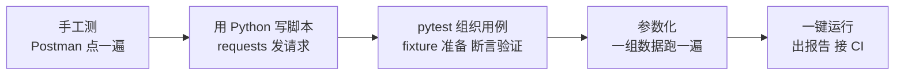
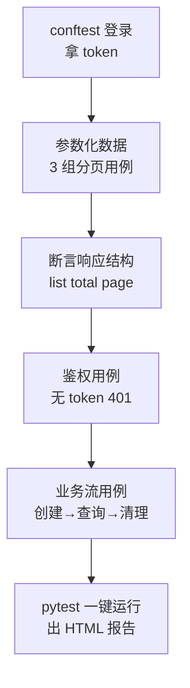

<DifficultyBadge level="intermediate" />

# Python 自动化基础

## 一句话解释

Python 是测试自动化的事实标准语言，**语法简洁、生态强大**（requests 发请求、pytest 组织用例、pymysql 查库），能把你在 Postman 里手工点的接口测试变成**一键运行、自动断言、可出报告**的回归资产。你懂 JS/TS，Python 语法对你来说大概 2-3 天就能上手——核心是"从会写，变成会写**测试脚本**"。

## 核心流程：从手工到自动化



## 深入理解

### 1. 为什么测试用 Python

| 理由 | 说明 |
|------|------|
| 语法简单 | 缩进即块结构，代码量比 Java/C# 少一半，测试脚本重读不重炫技 |
| 生态完善 | requests / pytest / pymysql / selenium / appium 全是测试标配 |
| 调试灵活 | 交互式 shell 里写一行看一行，适合快速验证接口 |
| 和前端思维相通 | Python 动态类型、dict 操作和 JS 对象很像，上手快 |

> **前端视角**：Python 的 `dict` ≈ JS 的 `Object`，Python 的 `list` ≈ JS 的 `Array`，Python 的 `if/for/def/class` 和 JS 大同小异——你已经是"半只会写测试脚本的人"了。

### 2. Python 核心语法速过

> 你已会编程，这里只列"和 JS 不一样、测试里高频"的点，不用从零学。

```python
# ===== 变量与类型（动态类型，和 JS 类似）=====
name = "Alice"
price = 99.9
count = 3
is_ok = True
tags = ["登录", "订单"]        # list ≈ JS Array
user = {"name": "张三", "id": 1}  # dict ≈ JS Object

# 格式化字符串（f-string，测试断言里超好用）
print(f"用户 {user['name']} 的 id 是 {user['id']}")

# ===== 条件 =====
if price > 100:
    print("贵")
elif price > 50:
    print("适中")
else:
    print("便宜")

# ===== 循环 =====
for i in range(3):            # range(3) → 0,1,2
    print(i)

for key, value in user.items():
    print(key, value)

# ===== 函数 =====
def login(username, password="123456"):
    """登录函数，返回登录结果 dict"""
    return {"code": 0, "data": {"token": "token_abc"}}

result = login("admin")
print(result["data"]["token"])

# ===== 列表推导（filter/map 的简写，测断言数据时常用）=====
nums = [1, 2, 3, 4, 5]
squares = [x * x for x in nums]            # [1, 4, 9, 16, 25]
even = [x for x in nums if x % 2 == 0]     # [2, 4]
ids = [u["id"] for u in users_list]        # 提取 id 列表做断言

# ===== 异常处理（测异常接口必用）=====
try:
    resp = requests.get(url, timeout=5)
    resp.raise_for_status()
except requests.exceptions.Timeout:
    print("接口超时")
except requests.exceptions.RequestException as e:
    print(f"请求异常: {e}")
```

```python
# ===== 类（封装接口对象，大项目用）=====
import requests

class ApiClient:
    def __init__(self, base_url):
        self.base_url = base_url
        self.headers = {}

    def set_token(self, token):
        self.headers["Authorization"] = f"Bearer {token}"

    def get(self, path, **kwargs):
        return requests.get(f"{self.base_url}{path}", headers=self.headers, **kwargs)

    def post(self, path, json=None, **kwargs):
        return requests.post(f"{self.base_url}{path}", headers=self.headers, json=json, **kwargs)

client = ApiClient("https://test-api.example.com")
client.set_token("token_abc")
resp = client.get("/api/users?page=1")
```

### 3. 文件与 JSON 处理

测试里文件处理就两类：**读配置/读测试数据、写报告/写断言结果**。

```python
import json

# ===== 读 JSON 文件（环境配置、测试数据）=====
with open("config.json", "r", encoding="utf-8") as f:
    config = json.load(f)          # 返回 dict

base_url = config["base_url"]
# 注意：中文要写 encoding="utf-8"，否则 Windows 上乱码

# ===== 写 JSON 文件（导出测试结果）=====
results = [{"name": "test_login", "passed": True}]
with open("result.json", "w", encoding="utf-8") as f:
    json.dump(results, f, ensure_ascii=False, indent=2)
    # ensure_ascii=False 保留中文，indent=2 格式化好看

# ===== 读文本/CSV（参数化数据文件）=====
with open("cases.csv", "r", encoding="utf-8") as f:
    for line in f.readlines():
        print(line.strip())
```

**与 JS 的对照记忆：**

| JS | Python | 测试用途 |
|----|--------|---------|
| `JSON.parse(str)` | `json.loads(str)` | 字符串 → dict |
| `JSON.stringify(obj)` | `json.dumps(obj)` | dict → 字符串 |
| `fs.readFileSync` | `open(...).read()` | 读文件 |
| `fs.writeFileSync` | `open(..., 'w').write()` | 写文件 |

> **注意**：Python 区分 `json.loads`（字符串→对象）和 `json.load`（读文件→对象）；`dumps`（对象→字符串）和 `dump`（对象→写文件）。**有 s 的对应字符串**，这是最常见的混淆点。

### 4. requests 库做接口自动化

requests 是 Python 发 HTTP 请求的标准库级工具，对应你在 Postman/浏览器里做的一切操作。

```python
import requests

# ===== GET：查询接口 =====
resp = requests.get(
    "https://test-api.example.com/api/users",
    params={"page": 1, "pageSize": 20, "keyword": "张"},   # 查询参数
    headers={"Authorization": "Bearer token_abc"},
    timeout=5,
)
print(resp.status_code)          # 200
print(resp.json())               # 解析 JSON 响应为 dict
print(resp.json()["data"]["total"])  # 取嵌套字段

# ===== POST：JSON body（对应 Postman 的 raw + application/json）=====
login_resp = requests.post(
    "https://test-api.example.com/api/login",
    json={"username": "admin", "password": "123456"},   # json= 自动转 JSON 并设 Content-Type
    timeout=5,
)
token = login_resp.json()["data"]["token"]

# ===== 带 token 的后续请求 =====
resp = requests.get(
    "https://test-api.example.com/api/users",
    headers={"Authorization": f"Bearer {token}"},
)

# ===== 表单提交（Content-Type: form-urlencoded）=====
resp = requests.post(url, data={"username": "admin", "pwd": "123"})

# ===== 文件上传（multipart/form-data）=====
resp = requests.post(
    "https://test-api.example.com/api/upload",
    files={"file": open("demo.png", "rb")},
    data={"type": "avatar"},
)

# ===== 常见断言条件 =====
assert resp.status_code == 200
assert resp.json()["code"] == 0
assert resp.elapsed.total_seconds() < 2     # 响应耗时 < 2s
```

**requests 常用属性/方法速查：**

| 用法 | 作用 |
|------|------|
| `resp.status_code` | 状态码 |
| `resp.text` | 响应原文（字符串） |
| `resp.json()` | 解析 JSON 为 dict |
| `resp.headers` | 响应头 |
| `resp.elapsed` | 响应耗时（测性能用） |
| `params=` | 拼 URL 查询参数 |
| `json=` | 发 JSON body |
| `data=` | 发表单 body |
| `files=` | 发文件 |
| `headers=` | 自定义请求头 |
| `timeout=5` | 超时设置（**必写**，防止挂死） |

### 5. pytest 框架基础

pytest 是 Python 测试框架的事实标准。核心四件事：**断言、fixture（夹具）、参数化、运行与报告**。

#### 5.1 断言（assert）

```python
# 文件 test_assert_demo.py
def test_basic():
    assert 1 + 1 == 2
    assert "abc" in "xxabcxx"
    assert [1, 2, 3].count(2) == 1

def test_with_message():
    # 断言失败时显示自定义信息，排错更方便
    assert 1 + 1 == 2, "1+1 应该等于 2"
```

> **pytest 的断言就是原生 `assert`**，不像 Java 的 JUnit 要写一堆 assertTrue/assertEquals。失败时 pytest 会自动展示两边的值。

#### 5.2 fixture（夹具：造数据、登录、清理）

fixture 是"用例的前置准备 + 后置清理"，对应你在手工测试里的"造数据/清数据"。

```python
# test_login_fixture.py
import pytest
import requests

BASE_URL = "https://test-api.example.com"

@pytest.fixture
def token():
    """登录一次，给所有用例提供 token（类似 Postman 里的关联）"""
    resp = requests.post(
        f"{BASE_URL}/api/login",
        json={"username": "admin", "password": "123456"},
    )
    return resp.json()["data"]["token"]

@pytest.fixture
def clean_data():
    """yield 前面是造数据，yield 后面是清数据"""
    resp = requests.post(f"{BASE_URL}/api/orders", json={"amount": 100})
    order_id = resp.json()["data"]["id"]
    yield order_id                      # 把 order_id 交给用例用
    requests.delete(f"{BASE_URL}/api/orders/{order_id}")   # 用例跑完清理

# 用例直接声明参数名，pytest 自动注入 fixture
def test_get_users(token):
    resp = requests.get(f"{BASE_URL}/api/users", headers={"Authorization": f"Bearer {token}"})
    assert resp.status_code == 200

def test_order_flow(token, clean_data):
    order_id = clean_data
    resp = requests.get(f"{BASE_URL}/api/orders/{order_id}", headers={"Authorization": f"Bearer {token}"})
    assert resp.json()["data"]["amount"] == 100
```

> **记住口诀**：fixture 返回值给用例用（`return`/`yield`），yield 后面的代码在用例结束后执行（清理）。比 Postman 的"环境变量"更强——它会自动造、自动清。

#### 5.3 参数化（一组数据跑一遍用例）

参数化就是把"用例数据"和"用例逻辑"分离，一组数据执行一次用例——这正是接口测试大量数据驱动的核心能力。

```python
# test_param.py
import pytest
import requests

# 等价于循环执行 3 次 test_login
@pytest.mark.parametrize("username,password,expect_code", [
    ("admin", "123456", 0),       # 正常
    ("admin", "wrong", 1001),     # 密码错误
    ("", "", 1002),               # 参数缺失
])
def test_login(username, password, expect_code):
    resp = requests.post(
        "https://test-api.example.com/api/login",
        json={"username": username, "password": password},
    )
    body = resp.json()
    assert body["code"] == expect_code, f"期望 code={expect_code}，实际 {body['code']}"

# 参数化 + fixture 组合：从 JSON 文件读测试数据
import json

with open("login_cases.json", "r", encoding="utf-8") as f:
    login_cases = json.load(f)   # [{"username": "...", "password": "...", "expect_code": 0}, ...]

@pytest.mark.parametrize("case", login_cases)
def test_login_from_file(case):
    resp = requests.post(
        "https://test-api.example.com/api/login",
        json={"username": case["username"], "password": case["password"]},
    )
    assert resp.json()["code"] == case["expect_code"]
```

#### 5.4 运行与报告

```bash
# 运行当前目录所有 test_*.py / *_test.py
pytest

# 显示每条用例详细结果（. 通过 / F 失败 / E 报错）
pytest -v

# 只跑名字包含 login 的用例
pytest -k login

# 跳过指定用例
# @pytest.mark.skip(reason="依赖的接口还没开发")
# pytest -v -m "not slow"  # 跳过带 slow 标记的用例

# 生成 HTML 报告（需安装 pytest-html）
pytest --html=report.html --self-contained-html

# 失败即停，方便快速定位
pytest -x
```

```bash
# 安装依赖
pip install requests pytest pytest-html pymysql
# 或
pip install -r requirements.txt
```

### 6. 完整接口自动化脚本示例

一个真实场景：**登录 → 拿 token → 查订单列表 → 断言**，覆盖 fixture、requests、参数化、报告。

```python
# ===== conftest.py —— 公共 fixture，所有测试文件共享 =====
import pytest
import requests

BASE_URL = "https://test-api.example.com"

@pytest.fixture(scope="session")        # scope=session 只登录一次，全用例共享
def token():
    """整个测试会话只登录一次，返回可用 token"""
    resp = requests.post(
        f"{BASE_URL}/api/login",
        json={"username": "admin", "password": "123456"},
        timeout=5,
    )
    assert resp.status_code == 200
    data = resp.json()
    assert data["code"] == 0, f"登录失败: {data['message']}"
    return data["data"]["token"]

@pytest.fixture
def headers(token):
    """统一的认证请求头"""
    return {"Authorization": f"Bearer {token}", "Content-Type": "application/json"}
```

```python
# ===== test_orders.py —— 订单接口测试 =====
import pytest
import requests
from conftest import BASE_URL  # 或直接复用 fixture

# 分页参数化的测试数据
PAGES = [
    {"page": 1, "page_size": 10},
    {"page": 2, "page_size": 10},
    {"page": 99, "page_size": 10},   # 越界页
]

@pytest.mark.parametrize("case", PAGES)
def test_get_orders_list(headers, case):
    """登录后查询订单列表：断言结构 + 分页边界"""
    resp = requests.get(
        f"{BASE_URL}/api/orders",
        params={"page": case["page"], "pageSize": case["page_size"]},
        headers=headers,
        timeout=5,
    )
    assert resp.status_code == 200
    data = resp.json()["data"]

    # 断言返回结构完整
    assert "list" in data and "total" in data and "page" in data
    # 断言每页条数不超过 pageSize
    assert len(data["list"]) <= case["page_size"]
    # 断言分页字段正确
    assert data["page"] == case["page"]
    # 越界页应返回空列表而不是报错
    if case["page"] >= 99:
        assert data["list"] == []

def test_get_orders_without_token():
    """鉴权用例：不登录直接访问应 401"""
    resp = requests.get(f"{BASE_URL}/api/orders", timeout=5)
    assert resp.status_code == 401

def test_create_and_query_order(headers, token):
    """业务流：创建订单 → 查库 → 断言，测试后清理"""
    # 1. 创建订单
    create_resp = requests.post(
        f"{BASE_URL}/api/orders",
        json={"productId": 88, "quantity": 2},
        headers=headers,
        timeout=5,
    )
    assert create_resp.json()["code"] == 0
    order_id = create_resp.json()["data"]["id"]

    try:
        # 2. 查询订单详情并断言
        detail_resp = requests.get(
            f"{BASE_URL}/api/orders/{order_id}",
            headers=headers,
            timeout=5,
        )
        detail = detail_resp.json()["data"]
        assert detail["id"] == order_id
        assert detail["productId"] == 88
        assert detail["quantity"] == 2
        assert detail["status"] == "CREATED"
    finally:
        # 3. 清理测试数据（finally 保证即使断言失败也会清理）
        requests.delete(f"{BASE_URL}/api/orders/{order_id}", headers=headers, timeout=5)
```

**运行方式：**

```bash
# 结构
# project/
# ├── conftest.py      # 公共 fixture
# ├── test_orders.py   # 订单用例
# └── login_cases.json # 参数化数据

pytest test_orders.py -v --html=report.html --self-contained-html
```

**这个脚本对应的工作流：**



## 面试问法

- 🔥 **为什么测试自动化用 Python？**
  - 语法简洁、上手快，测试脚本核心是"可读 + 可维护"而非性能
  - 生态完整：requests（接口）、pytest（框架）、pymysql（数据库）、selenium（UI）
  - 社区资料多，出问题好搜

- 🔥 **pytest 的 fixture 是什么？怎么用？**
  - 用例的前置准备 + 后置清理机制
  - 用 `@pytest.fixture` 定义，用例通过参数名自动注入
  - 用 `yield` 分成两段：yield 前是造数据，yield 后是清理
  - `scope` 控制生命周期：function（默认每个用例）/ class / module / session

- 🔥 **pytest 参数化怎么写？有什么好处？**
  - `@pytest.mark.parametrize("a,b", [(1,2), (3,4)])`，一组数据跑一次用例
  - 好处：数据驱动，一组用例数据覆盖多个场景，加测试数据不用改代码

- ⭐ **requests 发 POST 和 Postman 有什么区别？**
  - 本质一样，都是 HTTP 请求
  - requests 用 `json=` 自动转 JSON 并设 `Content-Type: application/json`，用 `data=` 发表单
  - 代码里的超时（`timeout`）、异常处理要自己写，Postman 是图形化点选

- ⭐ **断言失败怎么办？测试数据残留怎么办？**
  - fixture 用 `yield` 后置清理；或用 `try/finally` 保证清理一定执行
  - 清理逻辑写在 `finally` 里，断言失败也会执行
  - 用 `pytest --html=report.html` 出报告，失败用例保留请求/响应日志便于定位

- ⭐ **你从 Postman 手工测试转向 pytest 自动化的步骤？**
  - 先把核心链路在 Postman 跑通、写好断言
  - 用 requests 翻译成脚本，fixture 处理登录 token 和造数/清数
  - 参数化铺开异常/边界用例
  - 接 CI 定时回归，出报告

## 💡 AI 辅助学习

> 用这个 Prompt 实战练 pytest：
> "我是一个懂前端、准备转测试工程师的人，正在学 Python 接口自动化。请帮我：
> 1. 设计一个简单的 mock 接口（Flask 或 FastAPI），包含：登录接口（返回 token）、订单列表接口（支持分页）、创建订单接口、删除订单接口
> 2. 用 pytest 写一套完整的接口自动化测试，要求：
>    - conftest.py 里用 fixture 实现登录拿 token
>    - 用 parametrize 覆盖分页边界（第 1 页、最后一页、越界页、超大 pageSize）
>    - 断言响应状态码、业务 code、字段类型
>    - 测试后自动清理创建的订单
> 3. 解释每一段代码的作用，并指出 3 个容易踩的坑"

### 🤖 学习建议

> 不用背 Python 语法，直接**照着 pytest 模板改写自己的接口**是上手最快的路径。写完一个"登录→查列表→断言"的用例，你就具备了 80% 的测试自动化能力。遇到语法问题就丢给 AI：`这段 pytest 代码为什么报错：<报错信息>`。

## 关联知识

- [接口测试](./interface-testing) — 自动化脚本测的就是接口用例
- [数据库与测试](./database-testing) — 用 pymysql 在自动化里查库断言
- [Mock 与测试替身](./mock-strategy) — 环境不稳定时 Mock 掉依赖
- [覆盖率与 TDD 与 BDD](./coverage-tdd) — 测试的组织方式与质量度量
