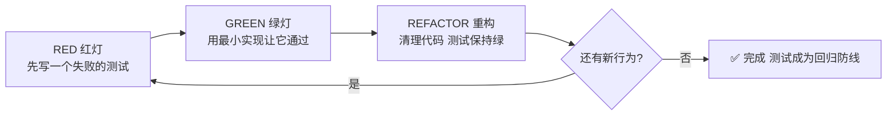
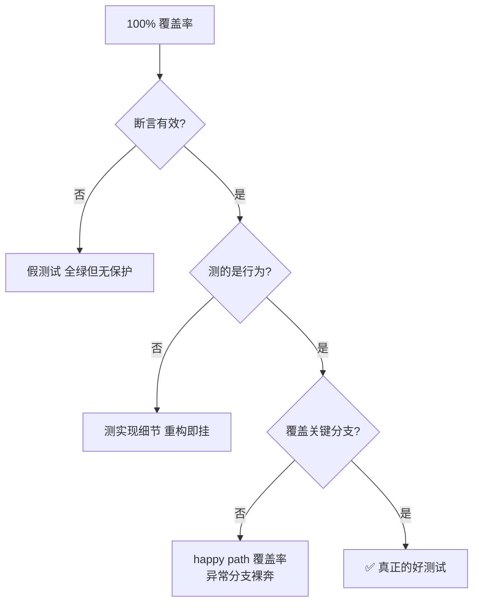

<DifficultyBadge level="intermediate" />

# 覆盖率与 TDD 与 BDD

## 一句话解释

覆盖率回答"**哪些代码被执行了**"，TDD 回答"**先写测试还是先写代码**"，BDD 回答"**测试应该用什么语言描述**"——三者共同的目标是让测试**为行为负责、为回归设防**，而不是堆一个漂亮的绿色百分比。

## 核心流程：TDD 红-绿-重构循环



## 深入理解

### 1. 覆盖率四指标：别再只说"覆盖率 80%"

| 指标 | 含义 | 测量的"漏洞" | 建议阈值（CI 门禁） |
|------|------|------------|------------------|
| 语句覆盖率（statements） | 每条语句执行比例 | 死代码 / 未走到的行 | 80%+ |
| 行覆盖率（lines） | 被执行的代码行比例 | 与语句近似，更直观 | 80%+ |
| 分支覆盖率（branches） | if / 三元 / 逻辑分支两个方向都被走到 | **未测的 else、false 分支** | 70-75%+ |
| 函数覆盖率（functions） | 函数是否被调用 | 整块没被调用的函数 | 高（接近 90%） |

```typescript
// vite.config.ts —— @vitest/coverage-v8 全指标 + 阈值
export default defineConfig({
  test: {
    coverage: {
      provider: 'v8',
      reporter: ['text', 'json-summary', 'html'],  // html 给人看，json 给 CI 比
      include: ['src/**/*.{ts,vue}'],
      exclude: ['src/**/*.d.ts', 'src/main.ts', 'src/vite-env.d.ts'],
      thresholds: {
        lines: 80,
        functions: 85,
        branches: 75,
        statements: 80,
      },
    },
  },
})
```

> **考点**：分支覆盖率 < 行覆盖率几乎必然。经典案例——一个 `if (user && user.isAdmin)`，行覆盖率 100%（if 那行执行了）但**分支覆盖率只有 50%**（`user` 为 null 的假分支没测）。只看行覆盖率会给你"都测了"的错觉。**分支覆盖率才是衡量"决策是否被验证"的指标。**

### 2. 差分覆盖（Diff Coverage）：把门禁装在"新增代码"上

全量覆盖率在存量代码上毫无区分度：老代码没测，新代码写两行测试就能把整体拉回阈值，等于没设防。差分覆盖只考核**本次 PR 新增/修改的代码行**。

```yaml
# GitHub Actions：先算基线，再算 PR 后，diff 对比
- name: 收集基线覆盖率
  run: pnpm vitest run --coverage --coverage.include=src
  env:
    CI: true
- name: 对比差分覆盖率
  run: pnpm exec vitest coverage-diff --baseline coverage/baseline.json
```

| 全量覆盖率 | 差分覆盖率 |
|-----------|-----------|
| 看整体水位 | 看本次改动是否达标 |
| 存量代码稀释风险 | 新增代码必须达标 |
| 合入大 PR 时波动巨大 | 与 PR 大小无关，只与"你改的部分"有关 |
| 容易"补几行测试蒙混" | 强制"你改的必须测" |

> **考点**：差分覆盖是团队工程化水平的分水岭。面试官问"覆盖率门禁怎么做才有效"，标准答案是：**阈值 + 差分**。阈值定全量水位，差分卡新增代码，两者配合才让覆盖率成为"活门禁"而非"数字游戏"。

### 3. 为什么 100% 覆盖率 ≠ 好测试

覆盖率的本质是"代码被执行"，不是"行为被验证"。三个反例说明 100% 也可能全是废测试：

```javascript
// 反例一：断言为空 —— 覆盖率 100%，保护力 0
test('add 两数相加', () => {
  add(1, 2)              // 调用了但没断言，行覆盖率 100%
})

// 反例二：断言是"恒真" —— 永远绿
test('discount 计算', () => {
  expect(typeof calc(100, 'VIP')).toBe('number')  // 永远通过，测不出 bug

// 反例三：测实现细节 —— 重构必挂
test('counter 状态', () => {
  expect(component.state.count).toBe(1)  // 覆盖率 100%，但改内部实现就炸
})
```

**覆盖率告诉你的三件事：**
1. 哪个模块**完全没人测**（函数覆盖率 0）→ 这是最大风险，优先补
2. 哪个分支**只测了一边**（分支覆盖率低）→ 错误处理、else 分支没人管
3. 新增代码**有没有测**（差分覆盖）→ 回归防线是否覆盖新逻辑

**覆盖率不告诉你的：**
- 断言是否验证了正确的东西（假测试照样 100%）
- 测试是否与用户行为相关（测实现细节也 100%）
- 集成处是否真的协作正常（单测各自 100%，对接却炸）



> **考点**：一句话收尾——"覆盖率是**下限指标**不是**质量指标**"。它只告诉你"哪些地方可能没被保护"，真正的好坏要看断言质量。团队实战里：**阈值 70-80% + 差分门禁 + 关键路径人工评审**，远比追 100% 有价值。

### 4. TDD 红-绿-重构：把"测试"变成"设计工具"

TDD 不只是顺序问题，它是**用测试约束设计**——先写测试逼你思考"这个函数该接收什么、返回什么"，接口天然清晰。

```javascript
// 第 1 步 RED：先写期望的行为
test('满 100 减 20', () => {
  expect(calcFinal(100, { coupon: 'FULL100', price: 200 })).toBe(160)
})

// 第 2 步 GREEN：最小实现
function calcFinal(base, coupon) {
  return base >= 100 ? base - 20 : base   // 先硬编码规则，让测试过
}

// 第 3 步 REFACTOR：用 coupon 规则表替换硬编码，测试仍然绿
const RULES = { FULL100: (p) => p >= 100 ? p - 20 : p }
function calcFinal(base, coupon) {
  return RULES[coupon.type]?.(base) ?? base
}
```

| 阶段 | 状态 | 你在做什么 | 常见失败 |
|------|------|-----------|---------|
| RED | 测试失败 | 写一个表达"期望行为"的测试 | 测试写太细（测实现）或太大（难通过） |
| GREEN | 测试通过 | 用最丑但最小的实现让它过 | 一次写一堆代码，跳步 |
| REFACTOR | 测试仍绿 | 清理实现，改善设计 | 重构后测试悄悄改掉（作弊） |

**TDD 的三个纪律：**
1. **红灯时只写生产代码，绿灯时只改测试** —— 别在 RED 阶段同时改实现
2. **GREEN 阶段禁止过度设计** —— 最小实现，功能刚好通过就停
3. **重构期间测试必须保持绿** —— 一次只做一件事，否则无法定位破坏来源

> **考点**：TDD 的价值不在"覆盖率"，在**反馈速度和设计约束**——你每写一个行为都有即时验证，且接口在写测试时就已定型。对前端组件，TDD 常退化为"行为驱动"：先写"用户能怎样"的测试，再实现组件。

### 5. BDD：用"业务语言"写测试

BDD 回答的是测试的**表达问题**——用人类读得懂的"Given-When-Then"描述行为，让产品、QA、开发用同一套语言讨论。

```javascript
// Given-When-Then：行为驱动的用例组织
describe('购物车结算', () => {
  it('满足满减条件时应用优惠', () => {
    // Given：购物车有商品且满 100
    const cart = { total: 120, coupon: 'FULL100' }
    // When：结算
    const result = checkout(cart)
    // Then：实付 100
    expect(result.payable).toBe(100)
  })
})
```

```gherkin
# Cucumber 风格：用自然语言定义业务规则（团队可讨论）
Feature: 满减优惠
  Scenario: 订单满 100 减 20
    Given 购物车总额为 120
    And 使用优惠券 FULL100
    When 用户提交结算
    Then 实付金额为 100
```

| 维度 | TDD | BDD |
|------|-----|-----|
| 关注 | 实现是否正确 | 行为是否符合业务规则 |
| 语言 | 代码/断言 | Given-When-Then 业务语言 |
| 驱动者 | 开发者 | 业务 + 测试 + 开发协作 |
| 粒度 | 单测粒度 | 常对应集成/E2E 场景 |
| 两者关系 | **BDD 是 TDD 的"表达层"** —— 用业务语言组织测试，再按 TDD 节奏实现 | |

> **考点**：BDD 与 TDD 不是二选一。成熟的团队常是**"BDD 写故事、TDD 实现细节"**：上层用 Given-When-Then 描述用户场景（组件/E2E），下层用 TDD 保证每个行为实现正确。BDD 的最大价值是把"测试"从开发者私有物变成**团队沟通契约**。

### 6. 测试先行 vs 先写代码：现实怎么选

| 场景 | 推荐 | 理由 |
|------|------|------|
| 核心业务逻辑（计算、状态机、纯函数） | **TDD 测试先行** | 规则明确，接口易界定，回报高 |
| 探索性 UI（视觉、动效、交互原型） | 先写代码后补测试 | 需求未定，测试会随设计反复重写 |
| 复杂集成（多模块数据流） | 先写代码 + 事后补集成测试 | 依赖太多，先跑通再固化 |
| 修复 bug | **先写"复现 bug"的失败测试**再修 | 防止同一 bug 回归 |
| 重构存量代码 | 先补"行为快照"测试（characterization test）再重构 | 用现有行为做安全网，重构后对比 |

```javascript
// 存量代码重构：先固化行为（characterization test）
// 不猜"应该怎样"，而是记录"现在怎样"，重构后保持不变
test('现有 formatPrice 行为快照', () => {
  expect(formatPrice(1234.5)).toBe('1,234.50')  // 记录当前行为
  expect(formatPrice(0)).toBe('0.00')
})
```

> **考点**：面试里"先写测试还是先写代码"的标准答案不是非黑即白，而是**按风险与稳定性分配**——确定性高的逻辑测试先行（TDD），探索性强的 UI 后补（测试后行），修 bug 和重构必须先有测试兜底。

## 面试问法

- 🔥 **覆盖率有哪几种指标？为什么分支覆盖率比行覆盖率重要？**
  - 语句、行、分支、函数四种；行覆盖率只看"执行没执行"，分支覆盖率看"每个判断的每个方向都测到没"
  - 典型：`if (user && user.isAdmin)` 行覆盖 100% 但分支只有 50%——null 分支没测
  - 所以分支覆盖率更能暴露"决策未被验证"，CI 阈值里分支要单独设

- 🔥 **100% 覆盖率就代表测试好吗？为什么？**
  - 不代表。覆盖率是"下限指标"：只说明代码被执行，不说明断言有效、行为正确
  - 假测试（无断言/恒真断言）和测实现细节的测试都能到 100%
  - 好测试 = 有效断言 + 测行为 + 覆盖关键分支 + 差分门禁

- 🔥 **TDD 是什么？红-绿-重构各自做什么？**
  - 先写失败测试（RED）→ 最小实现让它过（GREEN）→ 重构保持绿
  - 价值：即时反馈 + 接口设计约束 + 回归防线
  - 纪律：RED 阶段不写实现、GREEN 阶段不过度设计、重构期测试必须绿

- ⭐ **BDD 和 TDD 什么关系？Given-When-Then 怎么用？**
  - BDD 是 TDD 的"表达层"：用 Given-When-Then 业务语言组织行为，仍按 TDD 节奏实现
  - 上层组件/E2E 用 BDD 描述用户场景，下层逻辑用 TDD 保实现正确
  - 价值：测试从开发者私有物变成团队沟通契约

- ⭐ **覆盖率门禁怎么设才有效？什么是差分覆盖？**
  - 全量阈值（行 80/分支 75）+ 差分覆盖（只考核本次 PR 改动）
  - 差分覆盖防止"老代码稀释、新代码逃逸"，新增代码必须达标
  - 配合 html/json 报告：json 给 CI 比较，html 给人看盲区

- ⭐ **先写测试还是先写代码？**
  - 按风险分配：核心纯逻辑测试先行（TDD）；探索性 UI 后补；修 bug 先写复现测试再修
  - 重构存量代码：先写行为快照测试做安全网
  - 关键是"让测试成为回归防线"，顺序服务于这个目标

## 💡 AI 辅助学习

> 用这个 Prompt 练覆盖率与测试设计思维：
> "你是一个资深测试架构师。下面是我的一段购物车结算代码（含折扣、满减、叠加优惠券、库存校验），我的行覆盖率是 92% 但分支覆盖率只有 58%，而且线上出过满减和折扣叠加算错的 bug。
> 请：1）分析为什么行覆盖高、分支覆盖低，指出最可能漏测的分支；2）用分表列出所有需要补的边界 case（含 null、负库存、优惠券互斥等）；3）对其中最难的两个 case 示范 TDD 的红-绿-重构写法；4）给出一个 80% 覆盖率却漏 bug 的反例，说明覆盖率失效的机制。"
> 
> 也可以换一个练法：把你自己写的测试给 AI，让它以"最挑剔的 Reviewer"身份逐条找假测试、恒真断言、分支盲区。

## 关联知识

- [前端测试体系](/engineering/frontend-testing) — 覆盖率与测试分层总览
- [Mock 策略精讲](./mock-strategy) — 覆盖率与 mock 的联动
- [测试架构设计](./test-architecture) — 覆盖率门禁在 CI 中的落地
- [CI/CD 与工程化](/engineering/ci-cd) — 覆盖率门禁与质量卡口
