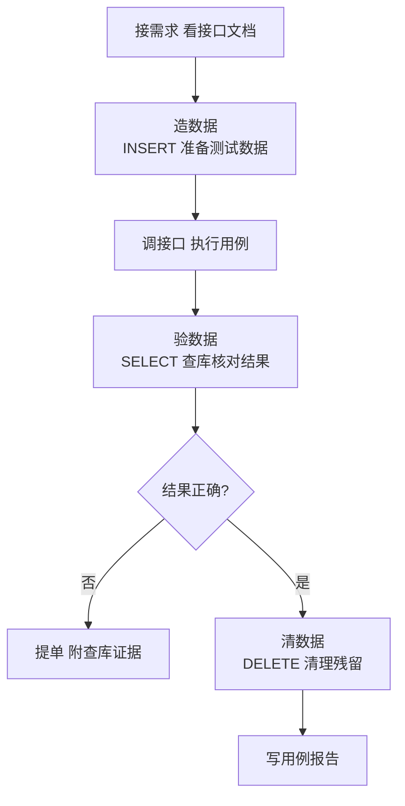
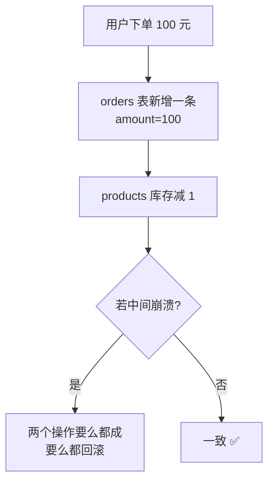

<DifficultyBadge level="intermediate" />

# 数据库与测试

## 一句话解释

测试要靠 SQL 做三件事：**造数据（准备测试条件）、验数据（确认接口写进库的数据对不对）、清数据（清理测试残留）**。你懂前端、会看 JSON，但接口返回的是"服务端加工后的视图"，真正的事实存在数据库里——SQL 就是测试判断"接口说对到底对不对"的标尺。

## 核心流程：测试怎么和数据库打交道



## 深入理解

### 1. 为什么测试要懂 SQL

| 使用场景 | 具体动作 | 没有 SQL 会怎样 |
|---------|---------|----------------|
| 造数据 | 接口需要"已存在 100 条订单"的前置条件，直接 INSERT | 只能反复调接口生成，慢且污染数据 |
| 验数据 | 下单接口成功后，查订单表确认金额、状态、用户 id 都正确 | 只信接口返回，数据库不一致的 bug 发现不了 |
| 清数据 | 测试完把造的数据删掉，避免污染下轮测试 | 测试数据越堆越多，环境越来越脏 |
| 定位 bug | 接口报错，查库看数据到底写成什么样 | 只能猜，无法给出证据 |
| 数据比对 | 核对报表/统计接口的数字 | 无法验证接口计算是否正确 |

> **前端视角**：你以前在 DevTools 里看响应 JSON，那是"API 说的"。测试岗要比对"**库里实际存的**"——比如下单接口返回"成功"，但要查订单表确认库存是否真的扣了、金额是否一致。

### 2. SQL 必会（先建一张演示表）

下面所有例子基于这张表，你可以直接复制到 MySQL/本地 SQLite 里跑：

```sql
-- 员工表
CREATE TABLE employees (
  id         INT PRIMARY KEY,          -- 主键
  name       VARCHAR(50) NOT NULL,     -- 姓名（非空）
  department VARCHAR(30),              -- 部门
  salary     DECIMAL(10, 2),           -- 薪资
  status     TINYINT DEFAULT 1         -- 1 在职 0 离职
);

INSERT INTO employees (id, name, department, salary, status) VALUES
(1, '张三', '研发部', 25000, 1),
(2, '李四', '研发部', 20000, 1),
(3, '王五', '测试部', 18000, 1),
(4, '赵六', '测试部', 15000, 0),
(5, '钱七', '产品部', 22000, 1);
```

#### 2.1 查询：SELECT / WHERE / ORDER BY / LIMIT

```sql
-- 查所有
SELECT * FROM employees;

-- 只查某些列
SELECT name, salary FROM employees;

-- WHERE 过滤
SELECT * FROM employees WHERE department = '研发部';
SELECT * FROM employees WHERE salary >= 20000;
SELECT * FROM employees WHERE status = 1 AND department = '测试部';
SELECT * FROM employees WHERE name LIKE '张%';      -- 模糊匹配

-- 排序
SELECT * FROM employees ORDER BY salary DESC;       -- 降序
SELECT * FROM employees ORDER BY salary DESC, id ASC;

-- 分页（接口测试必备！接口返回第 2 页，SQL 就按同样规则查）
SELECT * FROM employees ORDER BY id LIMIT 5 OFFSET 0;   -- 第 1 页，每页 5 条
SELECT * FROM employees ORDER BY id LIMIT 5 OFFSET 5;   -- 第 2 页
```

> **测试用法**：接口 `/api/users?page=2&pageSize=5` 返回了列表，你就用 `LIMIT 5 OFFSET 5` 查库核对接口返回的第 1 条记录是否与库中第 6 条一致。

#### 2.2 联表：JOIN

先加一张部门表：

```sql
CREATE TABLE departments (
  id       INT PRIMARY KEY,
  dept_name VARCHAR(30)
);
INSERT INTO departments (id, dept_name) VALUES
(1, '研发部'), (2, '测试部'), (3, '产品部');
```

```sql
-- INNER JOIN 只返回两表都匹配的行
SELECT e.name, d.dept_name
FROM employees e
INNER JOIN departments d ON e.department = d.dept_name;

-- LEFT JOIN 左表全保留，右表无匹配则 NULL（重点考察点）
SELECT e.name, d.dept_name
FROM employees e
LEFT JOIN departments d ON e.department = d.dept_name;
```

| JOIN 类型 | 语义 | 特点 |
|----------|------|------|
| INNER JOIN | 交集 | 只返回两表都匹配的行 |
| LEFT JOIN | 左表全量 | 右表没匹配的补 NULL，**左表行数不丢** |
| RIGHT JOIN | 右表全量 | 与 LEFT 对称 |
| FULL JOIN | 并集 | MySQL 不支持，用 LEFT + UNION 模拟 |

> **考点**：LEFT JOIN 会不会让左表行数变多？——**不会多出左表行，但可能多出重复行**（右表匹配到多条时）。这是面试高频陷阱。

#### 2.3 聚合：GROUP BY + 聚合函数

```sql
-- 每个部门的人数、平均薪资、最高薪资
SELECT department,
       COUNT(*) AS cnt,
       AVG(salary) AS avg_salary,
       MAX(salary) AS max_salary
FROM employees
WHERE status = 1              -- 先过滤再分组
GROUP BY department
HAVING COUNT(*) >= 2;         -- 分组后再过滤（HAVING 过滤分组）
```

| 聚合函数 | 作用 |
|---------|------|
| COUNT(*) | 统计行数 |
| SUM(col) | 求和 |
| AVG(col) | 平均值 |
| MAX / MIN | 最大 / 最小 |

> **考点**：WHERE 和 HAVING 的区别——**WHERE 在分组前过滤行，HAVING 在分组后过滤分组**。WHERE 里不能写聚合函数。

#### 2.4 子查询

```sql
-- 找出薪资高于平均薪资的员工
SELECT * FROM employees
WHERE salary > (SELECT AVG(salary) FROM employees);

-- IN 子查询：找出没有部门的员工（接口数据不一致排查利器）
SELECT * FROM employees
WHERE department NOT IN (SELECT dept_name FROM departments);

-- EXISTS 子查询：存在性判断
SELECT * FROM employees e
WHERE EXISTS (SELECT 1 FROM departments d WHERE d.dept_name = e.department);
```

#### 2.5 增删改（造数据 / 清数据用）

```sql
-- INSERT 造数据
INSERT INTO employees (id, name, department, salary, status)
VALUES (6, '孙八', '测试部', 16000, 1);

-- 批量造数据（循环生成 100 条订单用于分页测试）
INSERT INTO orders (user_id, amount, status) 
SELECT id, 100, 1 FROM (SELECT 1 AS id UNION SELECT 2 UNION SELECT 3) t;

-- UPDATE 改数据（把订单状态改成"已支付"用于测支付回调）
UPDATE employees SET salary = 26000 WHERE name = '张三';

-- DELETE 清数据
DELETE FROM employees WHERE id = 6;

-- TRUNCATE 清空整表（保留表结构）
-- TRUNCATE TABLE orders;
```

> **测试安全红线**：**UPDATE/DELETE 必须带 WHERE**，否则全表遭殃。生产库只读、测试库才可写，这是测试岗的第一纪律。

### 3. 测试中查库验证数据的场景

#### 3.1 造数据（准备前置条件）

很多接口需要"先有数据才能测"。比如测"订单退款"需要先有一笔已支付的订单：

```sql
-- 直接造一笔已支付订单
INSERT INTO orders (id, user_id, amount, status, created_at)
VALUES (90001, 1, 199.00, 'PAID', NOW());
```

造数据规则：**id 用大数字段或特定前缀**（如 9xxxx），方便测试后识别清理。

#### 3.2 验数据（确认接口真实写入）

接口说"下单成功"不算数，查库确认：

```sql
-- 下单接口调用后，验证订单真的落库
SELECT id, user_id, amount, status, created_at
FROM orders WHERE id = 90001;
-- 期望：status='PAID'，amount 与接口入参一致，created_at 为当前时间

-- 验证库存扣减（事务一致性）
SELECT stock FROM products WHERE id = 88;
```

**验数据三个维度：**
1. **记录在不在**（INSERT 有没有执行）
2. **字段对不对**（金额、状态、时间等值是否与预期一致）
3. **关联对不对**（外键、用户 id 是否指对）

#### 3.3 清数据（测试后清理）

```sql
-- 清理本次测试造的订单
DELETE FROM orders WHERE id BETWEEN 90001 AND 90010;
```

> **经验**：测试数据统一加前缀/区间，写个清理脚本 `DELETE ... WHERE 前缀规则`，一次性清干净。

### 4. 数据库测试要点

#### 4.1 数据一致性

**造数据/验数据时要检查的一致性场景：**



| 检查点 | SQL 验证方法 | 发现的问题 |
|--------|-------------|-----------|
| 库存扣减正确 | 下单前后查 `products.stock` 差值 | 超卖、未扣、扣错 |
| 金额汇总正确 | 订单明细 `SUM(amount)` 对比订单总额 | 明细和汇总对不上 |
| 冗余字段同步 | 订单表和汇总表同字段对比 | 缓存/冗余不一致 |
| 删除级联 | 删父表记录后查子表 | 孤儿数据、级联失效 |

#### 4.2 约束（Constraint）

约束是数据库自带的"防线"，测试要验证接口的行为符合约束：

| 约束 | 作用 | 测试场景 |
|------|------|---------|
| PRIMARY KEY | 主键唯一 | 重复插入同 id 应报错 |
| NOT NULL | 不能为空 | 接口漏传必填字段应被拦 |
| UNIQUE | 唯一值 | 重复用户名注册应报错 |
| FOREIGN KEY | 外键 | 引用不存在的父 id 应报错 |
| CHECK | 范围检查 | 金额为负应被拦（如 `CHECK(amount > 0)`） |

```sql
-- 测试"唯一约束"：重复注册用户名
INSERT INTO users (username, phone) VALUES ('admin', '13800000001');
-- 第二次执行相同 username 会报 Duplicate entry
```

#### 4.3 事务（Transaction）与 ACID

事务是一组"要么全成功、要么全回滚"的操作。转账是经典例子：

```sql
-- 模拟转账：扣 100 给 A，加 100 给 B（应在一个事务里）
START TRANSACTION;
UPDATE account SET balance = balance - 100 WHERE user_id = 'A';
UPDATE account SET balance = balance + 100 WHERE user_id = 'B';
-- 测试中途断电/出错时，两步都回滚，A 的钱不会被扣丢
COMMIT;   -- 或 ROLLBACK;
```

| ACID | 含义 | 测试关注 |
|------|------|---------|
| Atomicity 原子性 | 要么全成要么全败 | 中间失败是否回滚干净 |
| Consistency 一致性 | 数据永远满足约束 | 转账前后总额不变 |
| Isolation 隔离性 | 并发互不干扰 | 并发下单是否超卖 |
| Durability 持久性 | 提交后不丢 | 断电后数据是否还在 |

**测试常见事务问题：** 并发扣库存超卖（隔离性问题）、主从延迟导致刚写入查不到（一致性延迟）、事务没提交却以为成功了。

### 5. 常见面试 SQL 题

下面 5 题是测试岗 SQL 面试的"标准题库"，全部基于 employees 表：

**① 查找薪资最高的员工：**

```sql
SELECT * FROM employees
ORDER BY salary DESC
LIMIT 1;

-- 或使用子查询
SELECT * FROM employees
WHERE salary = (SELECT MAX(salary) FROM employees);
```

**② 查询每个部门的员工数量和平均薪资：**

```sql
SELECT department, COUNT(*) AS cnt, AVG(salary) AS avg_salary
FROM employees
GROUP BY department;
```

**③ 找出重复的数据（如重复的邮箱）：**

```sql
SELECT email, COUNT(*) AS cnt
FROM users
GROUP BY email
HAVING COUNT(*) > 1;
```

**④ 查询第二高的薪资（常见变体）：**

```sql
-- 方案一：LIMIT OFFSET（有并列第二时不准，但够用）
SELECT DISTINCT salary FROM employees ORDER BY salary DESC LIMIT 1 OFFSET 1;

-- 方案二：排除最大值后再取最大
SELECT MAX(salary) FROM employees
WHERE salary < (SELECT MAX(salary) FROM employees);
```

**⑤ 分页查询第 N 页：**

```sql
-- 第 page 页，每页 size 条
SELECT * FROM employees
ORDER BY id
LIMIT #{size} OFFSET #{size} * (#{page} - 1);
-- 例：第 2 页每页 2 条 → LIMIT 2 OFFSET 2
```

## 面试问法

- 🔥 **测试为什么要懂 SQL？**
  - 造数据（准备前置条件）、验数据（核对接口真实写入）、清数据（清理残留）
  - 接口返回的是加工后的数据，库里的原始数据才是事实，查库能发现接口层发现不了的 bug

- 🔥 **WHERE 和 HAVING 的区别？**
  - WHERE 在分组**前**过滤行，不能使用聚合函数
  - HAVING 在分组**后**过滤分组结果，可以使用 COUNT/SUM 等聚合函数

- 🔥 **LEFT JOIN 会不会导致左表行数变多？**
  - 左表每行至少保留一次，但右表有多条匹配时**会产生重复行**
  - 想让左表唯一，可对右表去重（子查询取一条）或用 DISTINCT

- ⭐ **如何验证接口返回的数据是否真实正确？**
  - 用 SQL 查库，对比接口返回的 JSON 与库中记录
  - 重点核对：记录是否存在、字段值是否一致、关联（外键）是否正确
  - 涉及统计的接口，用 `SUM/COUNT/GROUP BY` 自己算一遍核对

- ⭐ **什么是数据库事务？ACID 是什么？**
  - 事务是一组要么全部成功要么全部回滚的操作
  - ACID：原子性、一致性、隔离性、持久性
  - 测试关注点：并发下单会不会超卖（隔离性）、崩溃后数据会不会丢（持久性）

- ⭐ **UPDATE/DELETE 不小心执行了怎么办？**（安全意识题）
  - 先看是否有事务，可 ROLLBACK；无事务则恢复备份
  - 所以生产库只读、测试才可写，危险语句一定带 WHERE，先 SELECT 确认影响行数再执行

## 💡 AI 辅助学习

> 用这个 Prompt 实战练 SQL：
> "我是一个懂前端、准备转测试工程师的人。请帮我设计一套**电商订单系统**的 SQL 练习题，包含以下表：
> - users（用户表：id, username, phone, created_at）
> - orders（订单表：id, user_id, amount, status, created_at）
> - order_items（订单明细：id, order_id, product_name, price, quantity）
>
> 请给出：
> 1. 造数据用的 INSERT 脚本（3 个用户、各 2-3 笔订单，含不同状态）
> 2. 验数据用的查询，分别验证：某用户订单总额、本月成交金额、每个商品销量 Top3
> 3. 清数据脚本
> 4. 5 道面试 SQL 题并给出答案（含第二高薪资、重复数据、分组聚合）
> 5. 指出 2 个最容易写错 SQL 的坑"

### 🤖 AI 辅助调试技巧

> 写 SQL 报错或结果不对时，把表结构 + 期望结果 + 你的 SQL 一起丢给 AI，让它：① 指出语法/逻辑错误；② 解释每一步的执行顺序；③ 给出优化后的版本。**SQL 执行顺序要记住：FROM → WHERE → GROUP BY → HAVING → SELECT → ORDER BY → LIMIT**，绝大多数"结果不对"都是忘了这条顺序。

## 关联知识

- [接口测试](./interface-testing) — 接口返回的数据要用 SQL 查库验证
- [Python 自动化基础](./automation-basics) — 用 pymysql 在自动化里查库断言
- [Mock 与测试替身](./mock-strategy) — 数据库不可用时 Mock 挡数据
- [覆盖率与 TDD 与 BDD](./coverage-tdd) — 数据驱动测试与用例组织
