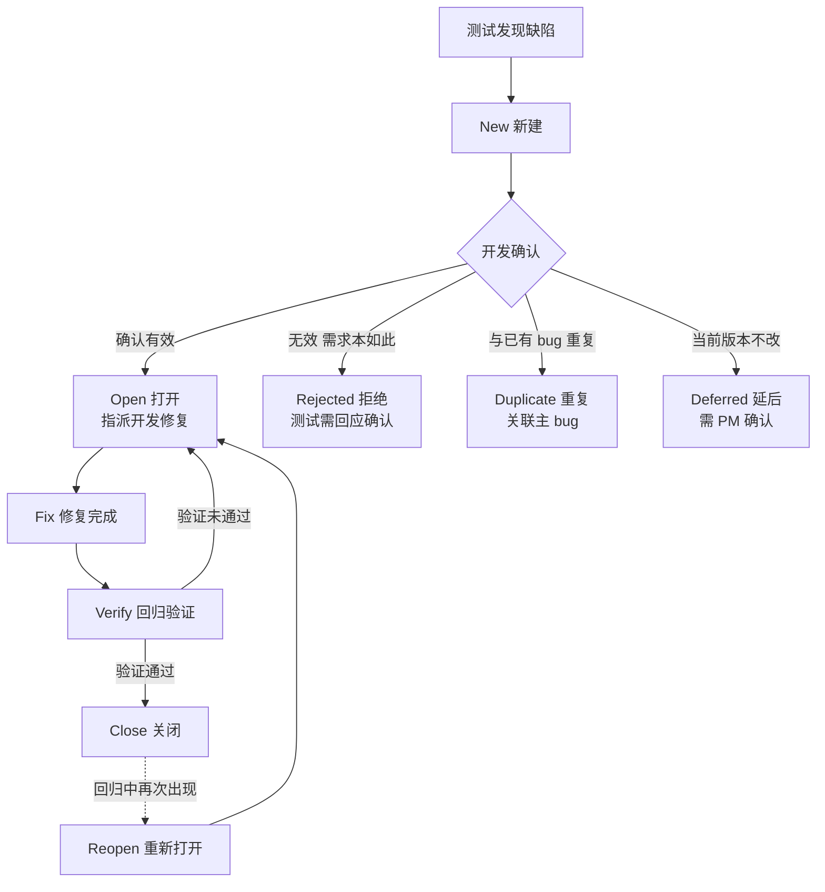

<DifficultyBadge level="intermediate" />

# 缺陷管理

## 一句话解释

缺陷管理是对 bug 从"被发现"到"被关闭"**全生命周期的记录、跟踪、分析和闭环管理**。测试人员的核心产出物之一就是**高质量的缺陷报告**——同一个 bug，写得好，开发 5 分钟就修；写得烂，开发拖三天还来质问你。**"会找 bug"和"会写 bug"是两种能力，后者决定你被不被尊重。**

## 核心流程：Bug 生命周期



> **记忆锚点**：一条主线 `new → open → fix → verify → close`，两个旁路 `reopen`（关闭后复发）和 `rejected/duplicate/deferred`（开发侧的各种"不修"）。面试画这张图，比背定义有用得多。

## 深入理解

### 1. 什么是 Bug

**定义**：软件在运行中出现的不符合需求文档、设计文档、用户预期或行业标准的行为。注意"不符合用户预期"也算——需求没写但不合理，同样要提。

**相关术语别混：**

| 术语 | 含义 | 例子 |
|------|------|------|
| Error（错误） | 人为产生的代码错误 | 程序员把 `>` 写成了 `<` |
| Defect / Bug（缺陷） | Error 导致产品中的问题 | 年龄 17 岁被放行注册 |
| Fault（故障点） | 导致失败的具体缺陷位置 | 某一行年龄判断逻辑 |
| Failure（故障） | 缺陷被执行时暴露的现象 | 用户提交报错、页面白屏 |

**缺陷从哪来（按来源排序）：**

| 来源 | 占比（经验值） | 说明 |
|------|--------------|------|
| 需求问题 | 高 | 需求模糊、歧义、需求变更 |
| 设计缺陷 | 中 | 架构/交互设计考虑不周 |
| 编码错误 | 中 | 逻辑写错、边界没判断 |
| 环境/配置 | 中 | 依赖版本、服务器配置、数据问题 |
| 兼容性 | 低 | 不同浏览器/机型表现不同 |

> **转岗优势**：你能看代码，发现 bug 时可以先"定位到模块甚至文件"，直接把"前端 bug 还是后端 bug"分清楚——这对测试岗是稀缺能力。

### 2. Bug 生命周期各状态

| 状态 | 含义 | 负责人 | 触发动作 |
|------|------|--------|---------|
| New | 新建，等待确认 | 测试 | 提交缺陷报告 |
| Open | 确认有效，指派开发 | 测试/开发组长 | 开发确认、指派人 |
| Rejected | 拒绝（不是 bug） | 开发 | 给出理由，测试需确认是否接受 |
| Duplicate | 与已有缺陷重复 | 开发 | 关联到主 bug 后关闭 |
| Deferred | 延后到后续版本 | PM | 评估后定版本 |
| Fix | 开发已修复 | 开发 | 提交修复代码 |
| Verify | 回归验证中 | 测试 | 执行回归用例 |
| Close | 验证通过，关闭 | 测试 | 验证通过 |
| Reopen | 关闭后复发，重新打开 | 测试 | 回归中发现同问题 |

**容易踩的坑：**
- **Rejected 不是终结**：开发拒绝后，测试要重新确认是"需求如此"还是"开发没理解需求"。被拒也要回应、要有结论，不能放着不管。
- **Reopen 要理直气壮**：开发说"我修好了"，你验证没通过就是没通过，**回退到 Open 是正常流程**，不是给开发难堪。
- **Close 的标准**：不只复现步骤通过，还要做**回归**——确认修复没有引入新问题。

### 3. 严重程度 vs 优先级

**严重程度（对产品的伤害有多大）——客观属性：**

| 级别 | 名称 | 说明 | 例子 |
|------|------|------|------|
| S0 | 致命 / Critical | 崩溃、数据丢失、资损、安全漏洞 | 转账金额多打一个零 |
| S1 | 严重 / Major | 主功能不可用，无绕过方案 | 登录接口 500 |
| S2 | 一般 / Minor | 功能可用但不符合预期，有绕过方案 | 筛选条件漏掉一项 |
| S3 | 轻微 / Trivial | 不影响功能的细节问题 | 文案错字、颜色不统一 |

**优先级（什么时候修）——主观决策：**

| 级别 | 说明 | 例子 |
|------|------|------|
| P0 | 立即修，阻塞发布 | 用户无法登录 |
| P1 | 高，本次版本必须修 | 核心流程报错 |
| P2 | 中，尽量修，可排期 | 非核心功能异常 |
| P3 | 低，有空再修 | 界面小瑕疵 |

**两者不是一回事：**

| 场景 | 严重程度 | 优先级 | 为什么 |
|------|---------|--------|--------|
| 银行转账金额显示少一位 | S0 致命 | P0 | 资损，最严重 |
| 登录功能偶发 500 | S1 严重 | P1 | 主流程，必须本次版本修 |
| 结算页优惠券按钮文字"0领取" | S3 轻微 | P1 | 促销页面，影响转化率，虽不严重但优先级高 |
| 极端低频场景下的数据错乱 | S1 严重 | P3 | 严重但几乎触发不到，可延后 |

> **面试必答**：严重程度是"bug 对产品的客观伤害"，开发定；优先级是"什么时候修的主观决策"，测试/PM 定。**高严重 ≠ 高优先级**（低频但致命）**，低严重 ≠ 低优先级**（影响营收的文案错）。

### 4. 缺陷报告 10 要素

| # | 要素 | 写好要点 |
|---|------|---------|
| 1 | 标题 | 一句话：**模块 + 操作 + 结果**，如"结算页：提交订单偶发 500" |
| 2 | 缺陷编号 | 系统自动生成，聊天里引用它即可 |
| 3 | 严重程度 / 优先级 | S0-S3 / P0-P3 |
| 4 | 环境信息 | 浏览器、版本、操作系统、设备、网络 |
| 5 | 前置条件 | 测试前必须满足的状态 |
| 6 | 复现步骤 | 精确到每一步，能被人**照做复现** |
| 7 | 预期结果 | 软件应该怎样 |
| 8 | 实际结果 | 软件实际怎样 |
| 9 | 证据 | 截图、录屏、Console 报错、Network 请求、日志 |
| 10 | 附加信息 | 出现频率（必现/偶发）、涉及版本号、责任人 |

**一份合格的缺陷报告长这样：**

```
【标题】结算页：点击"提交订单"偶发 500，订单无法生成
【模块】购物车-结算
【严重程度】S1 严重　　【优先级】P1
【环境】Chrome 126 / macOS 14 / 正式环境
【前置条件】购物车已有 3 件商品，总价 ¥299.00
【复现步骤】
  1. 登录后进入购物车
  2. 点击"去结算"进入结算页
  3. 选择默认收货地址，点击"提交订单"
  4. 页面白屏并弹出 500 错误
【预期结果】提交成功，跳转支付页
【实际结果】白屏 500，刷新后购物车商品仍在（未生成订单）
【出现频率】5 次复现 3 次（偶发）
【证据】见附件 console-500.png、network 返回 500 的 request 日志
```

> **前端转测加分项**：附上 Console 报错栈、Network 里请求和响应的 status、是 `4xx` 还是 `5xx`。这一条就能让开发把你的 bug 优先级手动拉高——因为"你替他做了一半定位"。

**书写三原则：** ① 标题能看懂即可，别写"有问题"三个字；② 复现步骤**照做一定能复现**；③ 证据永远比描述更有说服力，截图录屏管够。

### 5. 缺陷密度与质量指标

| 指标 | 公式 / 含义 | 用途 |
|------|------------|------|
| 缺陷密度 | 缺陷总数 ÷ 千行代码（KLOC）或功能点 | 衡量模块质量，密度越高越该重构 |
| 用例通过率 | 通过用例数 ÷ 总执行用例数 | 版本发布就绪信号 |
| 缺陷漏测率（逃逸率） | 线上缺陷 ÷（测试发现 + 线上发现） | **衡量测试有效性**，越低越好 |
| 缺陷修复率 | 已修复缺陷 ÷ 应修复缺陷 | 发布前必修指标，一般要求 100% |
| 平均修复时长 | 总修复时长 ÷ 缺陷数 | 团队响应效率 |
| 缺陷解决率 | 已解决 ÷ 总数 | 衡量遗留风险 |

**两个最重要的指标：**
- **缺陷密度**：面试问"如何评估模块质量"就答它——缺陷密集的模块，后续还会出问题，需要重点回归甚至重构。
- **缺陷漏测率（逃逸率）**：线上被用户发现的 bug ÷ 全部 bug。转岗面试问"测试的价值怎么衡量"，答这个最有说服力——**它直接反映你上线的产品质量**。

### 6. 缺陷管理工具：禅道 vs JIRA

| 维度 | 禅道 | JIRA |
|------|------|------|
| 定位 | 项目管理 + 需求 + 用例 + 缺陷一体化 | 项目协作 + 缺陷跟踪，插件生态强 |
| 开源/费用 | 国产开源，低成本，中小公司常用 | 国际商业，按用户数收费，大厂/外企常用 |
| 工作流 | 内置固定流程，可配置 | 自定义工作流极强，可拖拽搭建 |
| 用例管理 | 内置测试用例库 | 需插件（Xray / Zephyr） |
| 缺陷字段 | 内置，够用 | 字段高度自定义 |
| 学习成本 | 低，上手快 | 中高，术语体系不同 |

**实操要点（通用能力，工具换了也一样）：**
- 禅道：`测试 → 提Bug` 页面，必填项先填全；关联"需求"和"用例"，评审、指派、抄送一条龙。
- JIRA：用 `Bug` 问题类型，记得设 `Sprint` 和 `Fix Version`，让 bug 落在迭代节奏里。
- 通用：**改状态必须带评论**（"已修复，请验证 2.0"），不然团队不知道发生了什么；每天下班前过一遍自己名下未关闭的 bug。

## 面试问法

- 🔥 **Bug 的生命周期有哪些状态？**
  - 主线 `new → open → fix → verify → close`，加 `reopen`（复发）
  - 旁路：`rejected`（拒绝）/ `duplicate`（重复）/ `deferred`（延后）

- 🔥 **严重程度和优先级的区别？举例说明**
  - 严重程度看客观伤害（S0-S3），优先级看什么时候修（P0-P3）
  - 例子：支付按钮文案"0领取"严重程度 S3，但因为是活动页影响转化，优先级可以定 P1

- 🔥 **一个合格的缺陷报告要包含哪些要素？**
  - 标题、环境、前置条件、复现步骤、预期结果、实际结果、证据、频率、严重程度/优先级

- ⭐ **如何评估测试质量？有哪些指标？**
  - 缺陷密度（模块质量）、用例通过率（就绪信号）、**缺陷漏测率/逃逸率**（测试有效性）

- ⭐ **禅道和 JIRA 的区别？**
  - 禅道：国产开源、用例缺陷一体化、中小公司；JIRA：商业、自定义工作流强、大厂外企

- ⭐ **开发拒绝了你提的 bug，你怎么办？**
  - 先确认"不是 bug"还是"开发没理解需求"；需求歧义找 PM 仲裁，是自己的问题就撤，开发有误就带着需求文档说服

## 💡 AI 辅助学习

> 用这个 Prompt 练测试思维：
> "你扮演一位开发工程师，我扮演测试。我依次给你发 5 份缺陷报告（我先自己写），你从**开发视角**严格点评：哪些信息让你心塞不想修、哪些信息让你愿意立刻处理，指出每份报告缺了 10 要素里的哪几项。第 5 轮之后，你出题：让我写一份关于'支付成功后订单列表未刷新'的缺陷报告，写完你按 10 要素逐条打分，满分 100 分并给出改进意见。全程中文。"

### 🤖 AI 输出成果（基于上面这个 Prompt 生成）

> 下面三件套就是 AI 基于上面这个 Prompt 实际生成的测试学习资源，点击后在新窗口打开、可离线使用：

- 📄 <a href="../qa-cheatsheet.pdf" target="_blank" rel="noopener">测试岗位 A4 速查 PDF</a> — 缺陷报告 10 要素一页速记
- 🎬 <a href="../qa-demo.html" target="_blank" rel="noopener">测试交互式演示</a> — 跟着演示走一遍 Bug 生命周期
- 📝 <a href="../qa-quiz.html" target="_blank" rel="noopener">测试 Mini Quiz</a> — 严重程度 vs 优先级自测题

## 关联知识

- [测试用例设计](./test-case-design) — 用例是发现 bug 的起点，缺陷是用例的产出
- [软件测试基础](./test-basics) — 测试流程中"缺陷跟踪"环节的深化
- [接口测试](./interface-testing) — 接口层 bug 的定位与证据收集
- [测试策略与 CI/CD](./test-ci-strategy) — 缺陷漏测率如何靠流程和自动化压下来
